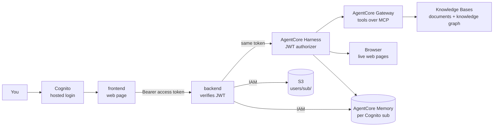

# Docs Copilot

Upload documents, ask questions, and get streamed answers with citations
from one AI agent that can also read web pages and connect facts across
documents. Built step by step as a learning project.

New here? Start with `docs/course.md`: the crash course, 29 lessons from
zero, in order, with plain words and pictures. The same course as a page
with a sidebar: link at the top of that file.

---

## 1. What I'm building

A signed-in app where you upload documents, ask questions, and get
answers that point to the exact passages they came from. Cognito's hosted
page is the login. One agent (an AgentCore Harness) answers every question
and picks a tool for each one: the document search, a knowledge-graph
search for "how does X relate to Y", or a real web browser for a URL. It
remembers past chats and your stated preferences, per person.

The goal is to learn how production AI systems are really built: RAG,
agents, AWS managed services, one working piece at a time.

### What a user can do

1. Sign in on Cognito's hosted page (the app never sees a password).
2. Upload documents (PDF, markdown, text, Word, CSV, HTML).
3. Ask a question, watch the answer stream in, open the numbered source cards.
4. Give a URL: the agent reads the live page.
5. Ask how two things relate: the agent searches the knowledge graph.
6. Come back later: past chats are in the sidebar, and the agent remembers stated preferences.

A line above each answer shows which tool the agent used.

### The agent and its tools

| Agent | Job | Arrives |
|---|---|---|
| Assistant | the AgentCore Harness: one managed agent that picks the right tool per question | D2 |
| Documents tool | the managed Knowledge Base, exposed through Gateway as `Retrieve` | D2 |
| Browser tool | AgentCore Browser: the agent reads live web pages | D3 |
| Graph tool | the GraphRAG Knowledge Base on Neptune, behind the Gateway | D4 |
| Research agent | a Strands agent on AgentCore Runtime (`agent/`, not wired to chat yet) | later |

### How agents use tools

Two open protocols, each learned by building with it:

- **MCP (Model Context Protocol):** a standard way for an agent to find and
  call tools, like a USB plug for tools. **AgentCore Gateway** is our MCP
  server: it turns the Knowledge Base and a Lambda function into MCP
  tools, and every call to it is signed with IAM (D2 onward).
- **Agent frameworks:** the assistant needs no framework, it is a Harness
  (configuration). If we ever write agent code (the research agent,
  later/maybe), it will use **Strands Agents**, the framework the Harness
  itself is built on. LangGraph is the common alternative.

```
harness --MCP--> gateway --> Knowledge Base                   "search the docs for X"
harness --MCP--> gateway --> Lambda --> graph Knowledge Base  "how does X relate to Y"
harness ---------------------------> browser                  "what does this page say"
```

### How it finds answers

A Bedrock Knowledge Base does retrieval: it parses and chunks each
document, turns chunks into vectors, and answers a question with hybrid
search (meaning plus exact words) followed by a reranker (D2). A
second knowledge base holds a knowledge graph of entities and
relationships for "how does X relate to Y" questions (D4). The agent
picks which one a question needs, by choosing a tool. An eval set scored
by Bedrock's built-in RAG evaluation may measure changes later. The learning docs explain what happens inside each of these,
not just how to switch them on.

### Production-shaped, on purpose

- **Signed in:** Cognito hosted login (PKCE). Files and Memory are per user (`sub`). Document Retrieve is not yet forced to that user (Harness still searches the whole index).
- **Streaming:** answers appear word by word, end to end.
- **Checked:** typed, linted, tested in CI; an eval set may score answer quality later.
- **Costed:** tokens and cost tracked per answer.

### Ground rules

- Buy the plumbing, build the glue: AWS managed services for retrieval, the graph, the agent loop and memory; our own code for the API, the UI and one small Lambda.
- About $200 in AWS credits, alarm at $30 a month. Anything billed by the hour (Neptune, $0.48 an hour) is stopped when idle and deleted after the demo.
- Models are config, not code: switching one is a single line.
- Using a managed service never skips understanding it: every AWS piece gets a "what happens inside" lesson in `docs/course.md`.

### The big picture



---

## 2. Run it

Python lives in `backend/`. Web code lives in `frontend/`.

```
# backend
cd backend
uv sync                     1. install everything
uv run ruff check .         2. lint (style and bug check)
uv run mypy .               3. typecheck
uv run pytest               4. tests
uv run uvicorn app.main:app --reload --port 8001    start the API on http://localhost:8001

# frontend (first time: cp .env.example .env.local)
# set API_URL, NEXT_PUBLIC_COGNITO_DOMAIN, NEXT_PUBLIC_COGNITO_CLIENT_ID
cd frontend
npm install                 install packages (first time, or after package.json changes)
npm run dev                 start the web page on http://localhost:3000
npm run lint                lint
npm run typecheck           check types
npm test                    stream parser, citations, PKCE hash

```

---

## 3. Folder map

```
frontend/            web page (Next.js, TypeScript, Tailwind)
  app/               the page, /callback (Cognito), and proxy /api/[...path]
  components/        Chat (sign-in, answers, sources) and Sidebar
  lib/               stream parser, citations, apiFetch + PKCE sign-in
backend/             one Python project: pyproject.toml, uv.lock, .env
  app/               the API server (FastAPI): JWT check, upload, chat relay, sessions
  prompts/           the harness system prompt (pasted into the console)
  tests/             pytest tests
agent/               Strands agent for AgentCore Runtime (not on the chat path yet)
infra/
  iam/               IAM policies, kept as documentation
  lambda/graph_search/  the graph search Lambda + its tool schema
docs/                course.md (the crash course) and demo.md (the demo script)
```

New backend code starts inside `backend/app`. Code that AWS runs for us (the
Lambda) lives in `infra/`. A part moves into its own package only when it
needs different dependencies or its own container. No Terraform or
Kubernetes files yet (later/maybe).

---

## 4. Deliverables

```
[x] D1  skeleton + streaming chat with Bedrock
[x] D2  upload -> S3 -> managed Knowledge Base; Gateway exposes it as a tool; Harness answers with citations; sidebar from Memory
[x] D3  Browser tool on the Harness; long-term memory (facts, preferences)
[x] D4  GraphRAG Knowledge Base on Neptune Analytics behind the Gateway (graph stopped when idle, deleted after the demo)

now    Cognito login; files and Memory per user; KB Retrieve still searches the whole index
then   reverse-learning pass; optional Cedar filter / wire `agent/`
later  maybe: research agent as the chat path; Observability, Evaluations, Guardrails; Terraform, CI eval gate, k6, kind
```

---

## 5. Locked decisions

Decided once, with numbers checked. Not reopened without a reason.

| Decision | Instead of | Why, in one line |
|---|---|---|
| AWS region us-west-2 | us-east-1 | Bedrock rerank and AgentCore both live there |
| Bedrock managed Knowledge Base for retrieval | OpenSearch + our own chunk/embed pipeline | hybrid search, reranker, parser and web crawler built in; no servers; pennies at our size |
| Bedrock GraphRAG on Neptune Analytics, stopped when idle, deleted after the demo | Neo4j + our own extraction | AWS-native and quick to set up; $0.48 an hour running (16 m-NCU), about $0.05 stopped |
| No NAT Gateway | private subnets + NAT | $32 a month for nothing we need |
| No Redis | Redis for rate limits | one server process; a counter in memory would be enough |
| Cognito hosted login + PKCE | no login / `dev` stub | reopen after D4: each person gets their own files and Memory actor; KB Retrieve filter still open |
| Knowledge Base's managed embedding model | Titan or Cohere chosen by us | the built-in reranker only works with the managed embeddings |
| Models reached through Bedrock (Converse) | Anthropic SDK | one request shape for every model; since D2 the Harness makes the model calls and our code calls InvokeHarness |
| Nothing deployed: runs locally | always-on hosting | the app runs on the laptop; only managed AWS services bill, per use (Neptune by the hour) |
| AgentCore Harness is the assistant | LangGraph supervisor + specialist agents | the loop, tool calls, memory and tracing are configuration; a supervisor was over-engineering at this scale |
| Mistral Large 3 drives the agent | Llama 4 Maverick, gpt-oss-120b | Llama 4 cannot use tools while streaming; gpt-oss cannot drive the browser; Mistral was the only one decent at both (ai.md 2.7, 2.8) |
| Strands if we ever write agent code (later/maybe) | LangGraph | the Harness is built on Strands and exports to it; every AgentCore integration is native |
| AgentCore Gateway is the MCP server | FastMCP servers | the Knowledge Base and a Lambda become MCP tools, with IAM auth in one place |
| AgentCore Memory for chat history | Postgres in Docker | sessions and messages per user, long-term facts for free; no database to run |
| No queue or worker for now | SQS + worker | the Knowledge Base's ingestion job already runs in the background |
| Bedrock RAG evaluation for a scorecard (later/maybe) | RAGAS | a judge model built in, no library; RAGAS is the fallback |
| Terraform, CI eval gate, k6, kind after the reverse-learning pass | during the build | product first; AWS resources are made in the console for now |
| kind manifests later/maybe, learning only | none | nothing deploys to Kubernetes, EKS is banned by budget |
| One flat backend project (`backend/app`) | uv workspace + `src` layout | one package today; split only when a part needs its own dependencies or container |

Budget: about $200 in credits, alarm at $30 a month. This account gets credits
only, not the old 12-month free services. No EKS. No OpenSearch Serverless.

---

## 6. Rules we follow

1. Hyphens only, never em dashes, in any file.
2. Every non-obvious library call gets a one-line `# <docs url>` comment.
3. A deliberate shortcut gets a `# ponytail:` comment naming its limit and the upgrade path.
4. Login: the page sends `Authorization: Bearer <access token>`. FastAPI verifies it (JWKS, expiry, issuer, access token, app client). Cognito `sub` is the Memory actor id and the S3 prefix `users/<sub>/`.
5. No secrets in git. `.env` is ignored, `.env.example` is committed.

Also: tests cover the happy path and the failure path. AWS is faked in
tests: small fake clients (FakeAgentCore, FakeKb) passed in through FastAPI
dependency overrides, and moto for S3 (botocore Stubber cannot fake a
streaming response). Commits use
Conventional Commits (`feat:`, `fix:`, `chore:`). No self-merge.

---

## 7. Learning docs

One file: `docs/course.md`, the crash course. Twenty-nine lessons in seven
parts, written for someone new to coding: the terminal and git, the web
part, AWS from zero, AI from zero, the agent, putting it together, and running it like production, then
a glossary. Every lesson has the same shape: the idea, a picture, where it
lives in this project, one thing to try on your own data, and questions to
check yourself. What was tried and dropped is lesson 25.

The same course is published as a page with a sidebar (link at the top of
the file), next to the interactive map of the whole system.
