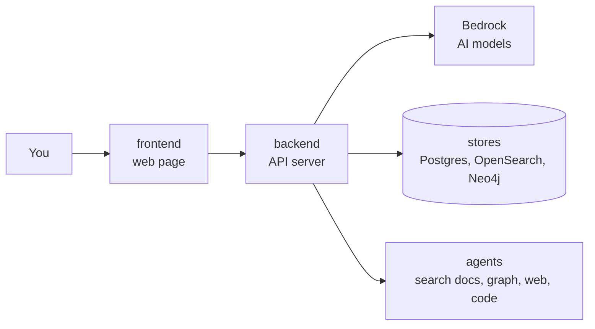

# Docs Copilot

Upload documents, ask questions, get answers with citations, and hand tasks to
a team of AI agents. Built step by step as a learning project.

New here? Start with `docs/learning/README.md`. Plain words, pictures, and
a reading order.

---

## 1. What I'm building

A workspace where you upload documents (PDFs, markdown, web pages), ask
questions, and get answers that point to the exact passage they came
from. For bigger jobs, a team of AI agents takes over: searching,
connecting facts, looking things up on the web, running code, and saving
results to your GitHub.

The goal is to learn how production AI systems are really built: RAG,
agents, AWS, containers, and scaling, one working piece at a time.

### What a user can do

1. Create a workspace and upload documents.
2. Ask a question, watch the answer stream in, click a citation to see the source.
3. Hand off a task, e.g. "compare these two specs and open an issue for the gaps".
4. Watch each agent's steps in a trace view.

### The agent team

| Agent | Job | Arrives |
|---|---|---|
| Supervisor | reads the request, decides who handles it | D5 |
| Retrieval | searches the uploaded documents | D2 to D3 |
| Graph | answers "how does X relate to Y" from a knowledge graph | D4 |
| Research | searches the web and runs code, as its own server (over A2A) | D6 |
| Action | saves notes, opens GitHub issues with the user's own login | D7 |

### How agents use tools

Two open protocols, each learned by building with it:

- **MCP (Model Context Protocol):** a standard way for an agent to find and
  call tools, like a USB plug for tools. Three tool servers built with
  FastMCP: `docs_search`, `graph_query`, `save_note` (D5, local). In D6
  they move behind **AgentCore Gateway**, one front door with login
  checks, plus one tool that runs as an AWS Lambda function.
- **A2A (Agent-to-Agent):** a standard way for one agent to talk to
  another. The research agent runs as its own A2A server (D6).

```
agent --MCP--> tool       "search the docs for X"
agent --A2A--> agent      "research this and report back"
```

### How it finds answers

Five methods, each fixing the weakness of the one before: plain vector
search (D2), vector plus keyword search with reranking (D3), a router that
picks the method per question (D3), a knowledge graph (D4), and agents
that search in loops (D5). An eval set of 30+ questions scores every
change, and Amazon's ready-made Bedrock Knowledge Base is the yardstick.

### Production-shaped, on purpose

- **Multi-tenant:** each customer's data is walled off at every layer.
- **Streaming:** answers appear word by word, end to end.
- **Checked:** typed, linted, tested, and CI blocks a merge if answer quality drops.
- **Costed:** tokens and cost tracked per request per tenant.

### Ground rules

- Local first: everything runs in docker compose before it touches AWS.
- About $200 in AWS credits, alarm at $30 a month. AWS resources are deploy, demo, destroy.
- Models are config, not code: switching one is a single line.

### The big picture



---

## 2. Run it

Python lives in `backend/`. Web code lives in `frontend/`.

```
# backend
cd backend
uv sync                     1. install everything
uv run ruff check .         2. lint (style and bug check)
uv run mypy .               3. typecheck
uv run pytest               4. tests
uv run uvicorn app.main:app --reload    start the API on http://localhost:8000

# frontend (first time: cp .env.example .env.local, set API_URL to the backend's port)
cd frontend
npm install                 install packages (first time, or after package.json changes)
npm run dev                 start the web page on http://localhost:3000
npm run lint                lint
npm run typecheck           check types
npm test                    stream parser tests

# everything at once, from the repo root
docker compose up --build
```

---

## 3. Folder map

```
frontend/            web page (Next.js, TypeScript, Tailwind)
  app/               pages and the /api/chat proxy route                D1
  components/        UI pieces: the chat window                         D1
  lib/               plain helpers: the stream parser + its tests       D1
backend/             one Python project: pyproject.toml, uv.lock, .env
  app/               the API server (FastAPI); later the worker too    D1+
  tests/             pytest tests                                       D1+
infra/               terraform (D2+), kind manifests (D8)
docs/learning/       topic tracks + one build log per deliverable
```

New backend parts (worker, agents, tool servers) start inside `backend/app`.
One moves into its own package only when it needs different dependencies
or its own container.

---

## 4. The 8 deliverables

```
[ ] D1  skeleton + streaming chat with Bedrock
[ ] D2  upload -> queue -> worker -> OpenSearch -> cited answers, eval set v1, Cognito login, Terraform
[ ] D3  hybrid search + rerank + adaptive router, Bedrock Knowledge Base A/B
[ ] D4  knowledge graph (Neo4j) + graph agent, eval set v2, Ollama for extraction
[ ] D5  supervisor + specialist agents + FastMCP tool servers, all local
[ ] D6  AgentCore Runtime / Gateway / Memory / Code Interpreter, research agent over A2A
[ ] D7  GitHub login for agents (Identity 3LO), Guardrails, OpenTelemetry, cost per tenant
[ ] D8  ECS Fargate via Terraform, CI eval gate, k6 load test, chaos test, kind manifests
```

---

## 5. Locked decisions

Decided once, with numbers checked. Not reopened without a reason.

| Decision | Instead of | Why, in one line |
|---|---|---|
| AWS region us-west-2 | us-east-1 | Bedrock rerank and AgentCore both live there |
| Neo4j locally, Neo4j AuraDB Free in the cloud | Neptune Analytics | Neptune's minimum size costs about $84 a day |
| No NAT Gateway | private subnets + NAT | $32 a month for nothing we need |
| No Redis | Redis for rate limits | one server process until D8, a counter in memory is enough |
| One OpenSearch index, filter by `tenant_id` | one index per tenant | per-tenant indexes only matter at thousands of tenants |
| Titan Text Embeddings V2 | Cohere | cheapest, and the same corpus feeds Bedrock Knowledge Base |
| Bedrock Converse API | Anthropic SDK | one request shape for every model on Bedrock |
| AWS is deploy, demo, destroy | always-on | one small Fargate task is about $9 a month, four is $36 |
| Cognito login arrives in D2 | in D1 | D1 stores nothing, so there is nothing to protect yet |
| Terraform from D2 | from D8 | AWS resources appear from D2, no point clicking them by hand first |
| kind manifests last, learning only | none | nothing deploys to Kubernetes, EKS is banned by budget |
| One flat backend project (`backend/app`) | uv workspace + `src` layout | one package today; split only when a part needs its own dependencies or container |

Budget: about $200 in credits, alarm at $30 a month. No EKS. No OpenSearch
Serverless.

---

## 6. Rules we follow

1. Hyphens only, never em dashes, in any file.
2. Every non-obvious library call gets a one-line `# <docs url>` comment.
3. A deliberate shortcut gets a `# ponytail:` comment naming its limit and the upgrade path.
4. `tenant_id` is checked at the API, the store, and the query. After D2, never trust the client for it.
5. No secrets in git. `.env` is ignored, `.env.example` is committed.

Also: tests cover the happy path and the failure path. Bedrock is faked in
tests with a small fake client passed in through FastAPI dependency
overrides (botocore Stubber cannot fake a streaming response). Commits use
Conventional Commits (`feat:`, `fix:`, `chore:`). No self-merge.

---

## 7. Learning docs

`docs/learning/`: four topic tracks (`ai.md`, `aws.md`, `tooling.md`,
`web.md`) that grow one section per topic, a `glossary.md`, and one build
log per deliverable (`D1.md` to `D8.md`) that links into the tracks. Written
for a beginner, pictures over paragraphs, self-check at the end of each.
