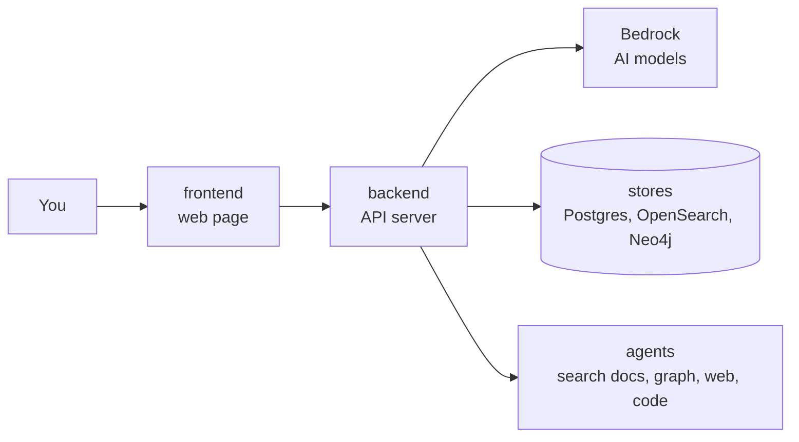

# Docs Copilot

Upload documents, ask questions, get answers with citations, and hand tasks to
a team of AI agents. Built step by step as a learning project.

New here? Start with `docs/learning/README.md`. Plain words, pictures, and
a reading order.

---

## 1. The big picture



Everything runs on your laptop with docker compose. AWS is used for the AI
models (Bedrock) and login (Cognito) during development, and for short
deploy-demo-destroy runs later.

---

## 2. Run it

Python lives in `backend/`. Web code lives in `frontend/`.

```
# backend
cd backend
uv sync --all-packages      1. install everything
uv run ruff check .         2. lint (style and bug check)
uv run mypy .               3. typecheck
uv run pytest               4. tests

# frontend
cd frontend
npm run dev                 start the web page
npm run typecheck           check types

# everything at once, from the repo root
docker compose up --build
```

---

## 3. Folder map

```
frontend/            web page (Next.js, TypeScript)
backend/             Python workspace root: pyproject.toml, uv.lock, .python-version
  api/               the API server (FastAPI)                  D1
  worker/            reads the upload queue, chunks, embeds     D2
  core/              code shared by api and worker              D2
  evals/             question set + scoring                     D2
  agents/            LangGraph agent graphs                     D5
  mcp_servers/       tools the agents can call (FastMCP)        D5
  research_agent/    web + code agent, runs as its own server   D6
infra/               terraform (D2+), kind manifests (D8)
docs/learning/       topic tracks + one build log per deliverable
```

---

## 4. The 8 deliverables

```
[ ] D1  skeleton + streaming chat with Bedrock
[ ] D2  upload -> queue -> worker -> OpenSearch -> cited answers, eval set v1, Cognito login, Terraform
[ ] D3  hybrid search + rerank + adaptive router, Bedrock Knowledge Base A/B
[ ] D4  knowledge graph (Neo4j) + graph agent, eval set v2, Ollama for extraction
[ ] D5  supervisor + specialist agents + FastMCP tool servers, all local
[ ] D6  AgentCore Runtime / Gateway / Memory / Code Interpreter, research agent over A2A
[ ] D7  GitHub login for agents (Identity 3LO), Guardrails, OpenTelemetry, cost per tenant
[ ] D8  ECS Fargate via Terraform, CI eval gate, k6 load test, chaos test, kind manifests
```

---

## 5. Locked decisions

Decided once, with numbers checked. Not reopened without a reason.

| Decision | Instead of | Why, in one line |
|---|---|---|
| AWS region us-west-2 | us-east-1 | Bedrock rerank and AgentCore both live there |
| Neo4j locally, Neo4j AuraDB Free in the cloud | Neptune Analytics | Neptune's minimum size costs about $84 a day |
| No NAT Gateway | private subnets + NAT | $32 a month for nothing we need |
| No Redis | Redis for rate limits | one server process until D8, a counter in memory is enough |
| One OpenSearch index, filter by `tenant_id` | one index per tenant | per-tenant indexes only matter at thousands of tenants |
| Titan Text Embeddings V2 | Cohere | cheapest, and the same corpus feeds Bedrock Knowledge Base |
| Bedrock Converse API | Anthropic SDK | one request shape for every model on Bedrock |
| AWS is deploy, demo, destroy | always-on | one small Fargate task is about $9 a month, four is $36 |
| Cognito login arrives in D2 | in D1 | D1 stores nothing, so there is nothing to protect yet |
| Terraform from D2 | from D8 | AWS resources appear from D2, no point clicking them by hand first |
| kind manifests last, learning only | none | nothing deploys to Kubernetes, EKS is banned by budget |

Budget: about $200 in credits, alarm at $30 a month. No EKS. No OpenSearch
Serverless.

---

## 6. Rules we follow

1. Hyphens only, never em dashes, in any file.
2. Every non-obvious library call gets a one-line `# <docs url>` comment.
3. A deliberate shortcut gets a `# ponytail:` comment naming its limit and the upgrade path.
4. `tenant_id` is checked at the API, the store, and the query. After D2, never trust the client for it.
5. No secrets in git. `.env` is ignored, `.env.example` is committed.

Also: tests cover the happy path and the failure path. Bedrock is faked in
tests with botocore Stubber. Commits use Conventional Commits (`feat:`,
`fix:`, `chore:`). No self-merge.

---

## 7. Learning docs

`docs/learning/`: four topic tracks (`ai.md`, `aws.md`, `tooling.md`,
`web.md`) that grow one section per topic, a `glossary.md`, and one build
log per deliverable (`D1.md` to `D8.md`) that links into the tracks. Written
for a beginner, pictures over paragraphs, self-check at the end of each.
