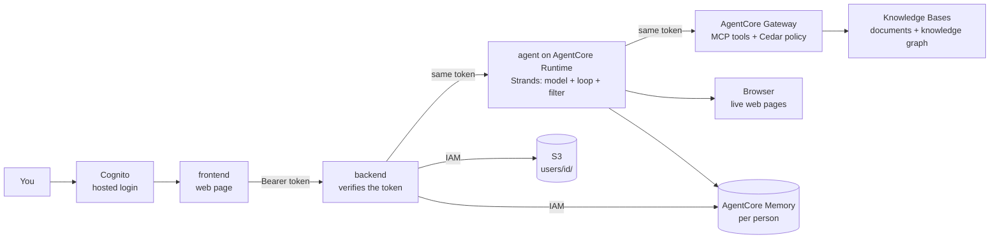

# Docs Copilot

Sign in, upload documents, ask questions, and get streamed answers with
citations from one AI agent that can also read web pages and connect facts
across documents. Every person's document search, chats and memory are private to them. Built step by step as a learning project.

New here? Start with `docs/course/README.md`: the course, one story in
eight parts and 35 lessons, from zero, in plain words and pictures. This
branch is Part H, told as the next chapter after the main version.

### Branches

- `main`: the earlier working version. Single user, no login, the AgentCore Harness answers.
- `feat/login-runtime-agent` (this branch): Cognito login, documents private per person, and our own Strands agent on AgentCore Runtime instead of the Harness. This README and `docs/course/` describe this version.

---

## 1. What I'm building

A signed-in app where you upload documents, ask questions, and get
answers that point to the exact passages they came from. Cognito's hosted
page is the login. One agent, written with Strands and running on AgentCore
Runtime, answers every question and picks a tool for each one: the
document search, a knowledge-graph search for "how does X relate to Y",
or a real web browser for a URL. It remembers past chats and your stated
preferences, per person. A document search can only ever return the
documents of the person asking: the agent adds that filter in code, and
the Gateway's policy refuses any other filter.

The goal is to learn how production AI systems are really built: RAG,
agents, AWS managed services, identity, one working piece at a time.

### What a user can do

1. Sign in on Cognito's hosted page (the app never sees a password).
2. Upload documents (PDF, markdown, text, Word, CSV, HTML).
3. Ask a question, watch the answer stream in, open the numbered source cards.
4. Give a URL: the agent reads the live page.
5. Ask how two things relate: the agent searches the knowledge graph.
6. Come back later: past chats are in the sidebar, and the agent remembers stated preferences.
7. Sign in as someone else: none of the above is visible.

A line above each answer shows which tool the agent used.

### The agent and its tools

| Piece | Job | Arrives |
|---|---|---|
| The agent | `agent/src/main.py`: a Strands agent on AgentCore Runtime. The loop, the tools, memory and the per-user filter | D5 |
| Documents tool | the managed Knowledge Base, exposed through the Gateway as `Retrieve` | D2 |
| Browser tool | AgentCore Browser: the agent reads live web pages | D3 |
| Graph tool | the GraphRAG Knowledge Base on Neptune, behind the Gateway | D4 |
| Login | Cognito user pool with managed login; every hop checks the same token | D5 |
| Policy | AgentCore Policy (Cedar) on the Gateway: a search must carry the caller's own filter | D5 |

### How agents use tools

Two open protocols, each learned by building with it:

- **MCP (Model Context Protocol):** a standard way for an agent to find and
  call tools, like a USB plug for tools. **AgentCore Gateway** is our MCP
  server: it turns the Knowledge Base and a Lambda function into MCP
  tools. The agent calls it with the signed-in person's own Cognito token,
  so the Gateway knows who is asking and its Cedar policy can say no.
- **Agent framework:** **Strands Agents**. The model call, the tool loop,
  the Memory session and the Browser tool are a few lines each; a hook adds
  the per-user filter before every document search. LangGraph is the common
  alternative.

```
page --token--> backend --token--> agent (Runtime) --token--> gateway --> Knowledge Base   "search the docs for X"
                                   agent            --token--> gateway --> Lambda --> graph  "how does X relate to Y"
                                   agent --IAM--> browser                                  "what does this page say"
                                   agent --IAM--> memory                                   per person, per conversation
```

### How it finds answers

A Bedrock Knowledge Base does retrieval: it parses and chunks each
document, turns chunks into vectors, and answers a question with hybrid
search (meaning plus exact words) followed by a reranker (D2). A
second knowledge base holds a knowledge graph of entities and
relationships for "how does X relate to Y" questions (D4). The agent
picks which one a question needs, by choosing a tool. Each document
carries a label whose key is the uploader's id; every search filters on
that key. An eval set scored by Bedrock's built-in RAG evaluation may
measure changes later. The course explains what happens inside each of
these, not just how to switch them on.

### Production-shaped, on purpose

- **Signed in:** Cognito hosted login (PKCE). Files, Memory and search are per person (`sub`).
- **Enforced, not trusted:** the agent adds the filter in code, and the Gateway's Cedar policy rejects a search without the caller's own key. Proven with two users.
- **Streaming:** answers appear word by word, end to end.
- **Checked:** typed, linted, tested in CI; an eval set may score answer quality later.
- **Costed:** tokens and cost tracked per answer.

### Ground rules

- Buy the plumbing, build the glue: AWS managed services for retrieval, the graph, hosting the agent, memory, the browser and login; our own code for the API, the UI, the agent file and one small Lambda.
- About $200 in AWS credits, alarm at $30 a month. Anything billed by the hour (Neptune, $0.48 an hour) is stopped when idle and deleted after the demo.
- Models are config, not code: switching one is a single line.
- Using a managed service never skips understanding it: every AWS piece gets a "what happens inside" lesson in `docs/course/`.

### The big picture



---

## 2. Run it

Python lives in `backend/` and `agent/`. Web code lives in `frontend/`.

```
# backend (first time: cp .env.example .env and fill it in)
cd backend
uv sync                     1. install everything
uv run ruff check .         2. lint (style and bug check)
uv run mypy .               3. typecheck
uv run pytest               4. tests
uv run uvicorn app.main:app --reload --port 8001    start the API on http://localhost:8001

# frontend (first time: cp .env.example .env.local and fill it in)
cd frontend
npm install                 install packages (first time, or after package.json changes)
npm run dev                 start the web page on http://localhost:3000
npm run lint                lint
npm run typecheck           check types
npm test                    stream parser, citations, PKCE hash

# agent (the code that runs on AgentCore Runtime)
cd agent
uv sync                     install everything
uv run ruff check .         lint
uv run pytest               tests: the filter hook, the token, the event translation
PORT=8081 AWS_PROFILE=docs-copilot-dev uv run python src/main.py    run it on the laptop (lesson 26)
npx @aws/agentcore deploy --yes                                     deploy it to Runtime (first time: npm install in agent/agentcore/cdk)
```

---

## 3. Folder map

```
frontend/            web page (Next.js, TypeScript, Tailwind)
  app/               the page, /callback (Cognito), and proxy /api/[...path]
  components/        Chat (sign-in, answers, sources) and Sidebar
  lib/               stream parser, citations, apiFetch + PKCE sign-in
backend/             one Python project: pyproject.toml, uv.lock, .env
  app/               the API server (FastAPI): token check, upload, chat relay, sessions
  tests/             pytest tests
agent/               the agent, its own Python project (its own dependencies, its own deploy)
  src/main.py        the Strands agent: prompt, tools, memory, the per-user filter hook
  tests/             pytest tests for the hook and the event translation
  agentcore/         AgentCore CLI project: agentcore.json (the Runtime's settings) and the CDK it deploys with
infra/
  iam/               IAM policies, kept as documentation
  lambda/graph_search/  the graph search Lambda + its tool schema
docs/                course/ (the course, one file per part) and demo.md (the demo script)
```

New backend code starts inside `backend/app`. The agent is its own package
because it needs different dependencies and its own deployment. Code that
AWS runs for us (the Lambda) lives in `infra/`. No Terraform or Kubernetes
files yet (later/maybe).

---

## 4. Deliverables

```
[x] D1  skeleton + streaming chat with Bedrock
[x] D2  upload -> S3 -> managed Knowledge Base; Gateway exposes it as a tool; Harness answers with citations; sidebar from Memory
[x] D3  Browser tool on the Harness; long-term memory (facts, preferences)
[x] D4  GraphRAG Knowledge Base on Neptune Analytics behind the Gateway (graph stopped when idle, deleted after the demo)
[x] D5  Cognito login; files, Memory and search per person; Strands agent on Runtime replaces the Harness; Cedar policy on the Gateway enforces the filter

now    the demo; retire the Harness and the old IAM Gateway after it
later  maybe: Observability traces, Evaluations, Guardrails; Terraform, CI eval gate, k6, kind
```

---

## 5. Locked decisions

Decided once, with numbers checked. Not reopened without a reason.

| Decision | Instead of | Why, in one line |
|---|---|---|
| AWS region us-west-2 | us-east-1 | Bedrock rerank and AgentCore both live there |
| Bedrock managed Knowledge Base for retrieval | OpenSearch + our own chunk/embed pipeline | hybrid search, reranker, parser and web crawler built in; no servers; pennies at our size |
| Bedrock GraphRAG on Neptune Analytics, stopped when idle, deleted after the demo | Neo4j + our own extraction | AWS-native and quick to set up; $0.48 an hour running (16 m-NCU), about $0.05 stopped |
| No NAT Gateway | private subnets + NAT | $32 a month for nothing we need |
| No Redis | Redis for rate limits | one server process; a counter in memory would be enough |
| Cognito hosted login + PKCE, the same token at every hop | no login / `dev` stub | reopened after D4: each person gets their own files, Memory and search; the page never sees a password |
| Our own Strands agent on AgentCore Runtime | the AgentCore Harness | the Harness cannot carry a person's identity to the Gateway with Cognito (tested four ways, 2026-09-14); our own code can, and Cedar on the Gateway then enforces per-person search |
| Document label key = the uploader's id, value "owner" | key `user_id`, value = the id | Cedar can compare a filter's key with the caller's id, but sees filter values as untyped |
| Knowledge Base's managed embedding model | Titan or Cohere chosen by us | the built-in reranker only works with the managed embeddings |
| Models reached through Bedrock (Converse) | Anthropic SDK | one request shape for every model; the agent's Strands model class makes the calls |
| Nothing deployed but the agent: the app runs locally | always-on hosting | the page and the API run on the laptop; the agent runs on Runtime because that is where the token chain and the observability live |
| Mistral Large 3 drives the agent | Llama 4 Maverick, gpt-oss-120b | Llama 4 cannot use tools while streaming; gpt-oss cannot drive the browser; Mistral was the only one decent at both (lesson 11) |
| Strands Agents | LangGraph | native AgentCore integrations: Runtime entrypoint, Memory session manager, Browser tool, MCP client |
| AgentCore Gateway is the MCP server, Cognito JWT inbound | FastMCP servers, IAM inbound | the Knowledge Base and a Lambda become MCP tools; with a person's token inbound, Cedar rules can be per person |
| AgentCore Memory for chat history | Postgres in Docker | sessions and messages per user, long-term facts for free; no database to run |
| No queue or worker for now | SQS + worker | the Knowledge Base's ingestion job already runs in the background |
| Bedrock RAG evaluation for a scorecard (later/maybe) | RAGAS | a judge model built in, no library; RAGAS is the fallback |
| Terraform, CI eval gate, k6, kind after the demo | during the build | product first; AWS resources are made in the console and with the CLI for now |
| kind manifests later/maybe, learning only | none | nothing deploys to Kubernetes, EKS is banned by budget |
| Two flat Python projects (`backend/app`, `agent/src`) | uv workspace + `src` layout | the agent needs its own dependencies and container; everything else stays in one package |

Budget: about $200 in credits, alarm at $30 a month. This account gets credits
only, not the old 12-month free services. No EKS. No OpenSearch Serverless.

---

## 6. Rules we follow

1. Hyphens only, never em dashes, in any file.
2. Every non-obvious library call gets a one-line `# <docs url>` comment.
3. A deliberate shortcut gets a `# ponytail:` comment naming its limit and the upgrade path.
4. Login: the page sends `Authorization: Bearer <access token>`. FastAPI verifies it (public keys, expiry, issuer, token kind, app client) and forwards it to the agent; the agent forwards it to the Gateway. Cognito `sub` is the Memory actor id, the S3 prefix `users/<sub>/`, and the document label key.
5. No secrets in git. `.env` and `.env.local` are ignored, the `.env.example` files are committed. The Cognito ids in them are public identifiers, not secrets.

Also: tests cover the happy path and the failure path. AWS is faked in
tests: small fake clients (FakeRuntime, FakeAgentCore, FakeKb) passed in
through FastAPI dependency overrides, and moto for S3. Commits use
Conventional Commits (`feat:`, `fix:`, `chore:`). No self-merge.

---

## 7. Learning docs

`docs/course/`: the course, one story told in order. One file per part
(A to H) plus a story map (`README.md`) and a glossary. Every lesson first
teaches the whole topic, every common way people solve it, then shows where
this project sits. Parts A to G tell the main version. Part H (lessons 30 to
35) tells this branch: login, your own agent on Runtime, identity at every
hop, and the Cedar policy.

The same course is published as a page with a sidebar (link in
`docs/course/README.md`).
