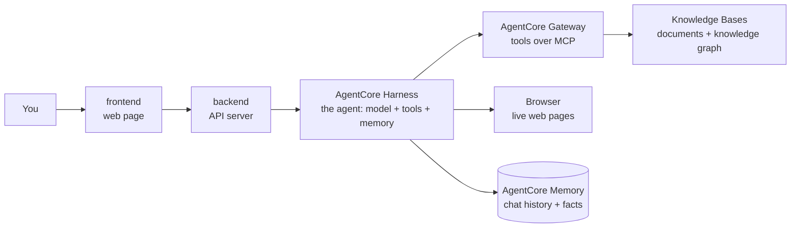

# Docs Copilot

Upload documents, ask questions, get answers with citations, and hand tasks to
a team of AI agents. Built step by step as a learning project.

New here? Start with `docs/learning/README.md`. Plain words, pictures, and
a reading order.

---

## 1. What I'm building

A workspace where you upload documents (PDFs, markdown, web pages), ask
questions, and get answers that point to the exact passage they came
from. For bigger jobs, a team of AI agents takes over: searching,
connecting facts, looking things up on the web, running code, and saving
results to your GitHub.

The goal is to learn how production AI systems are really built: RAG,
agents, AWS, containers, and scaling, one working piece at a time.

### What a user can do

1. Create a workspace and upload documents.
2. Ask a question, watch the answer stream in, click a citation to see the source.
3. Hand off a task, e.g. "compare these two specs and open an issue for the gaps".
4. Watch each agent's steps in a trace view.

### The agent team

| Agent | Job | Arrives |
|---|---|---|
| Assistant | the AgentCore Harness: one managed agent that picks the right tool per question | D2 |
| Documents tool | the managed Knowledge Base, exposed through Gateway as `Retrieve` | D2 |
| Browser tool | AgentCore Browser: the agent reads live web pages | D3 |
| Graph tool | the GraphRAG Knowledge Base on Neptune, behind the Gateway | D4 |
| Research agent | a Strands agent on AgentCore Runtime, called through the Gateway | later |

### How agents use tools

Two open protocols, each learned by building with it:

- **MCP (Model Context Protocol):** a standard way for an agent to find and
  call tools, like a USB plug for tools. **AgentCore Gateway** is our MCP
  server: it turns the Knowledge Base, a Lambda function, and other agents
  into MCP tools, with login checks and policy in one place (D2 onward).
- **Agent frameworks:** the assistant needs no framework, it is a Harness
  (configuration). Code we do write uses **Strands Agents**, the framework
  the Harness itself is built on. LangGraph is the common alternative;
  we chose Strands because every AgentCore integration is native to it.

```
harness --MCP--> gateway --> Knowledge Base   "search the docs for X"
harness --MCP--> gateway --> research agent   "research this and report back"
```

### How it finds answers

A Bedrock Knowledge Base does retrieval: it parses and chunks each
document, turns chunks into vectors, and answers a question with hybrid
search (meaning plus exact words) followed by a reranker (D2). A
second knowledge base holds a knowledge graph of entities and
relationships for "how does X relate to Y" questions (D4). The agent
picks which one a question needs, by choosing a tool. An eval set of 30+
questions, scored by Bedrock's built-in RAG evaluation, measures every
change (later). The learning docs explain what happens inside each of these,
not just how to switch them on.

### Production-shaped, on purpose

- **Single user, on purpose:** no login. Multi-tenancy was dropped to finish the product end to end; a fixed tenant stub (`dev`) remains.
- **Streaming:** answers appear word by word, end to end.
- **Checked:** typed, linted, tested in CI; an eval set may score answer quality later.
- **Costed:** tokens and cost tracked per answer.

### Ground rules

- Buy the plumbing, build the brain: AWS managed services for retrieval, graph, evals, sandbox; our own code for orchestration, agents, tools, UI.
- About $200 in AWS credits, alarm at $30 a month. Anything billed by the hour (Neptune) is created for the demo and deleted after.
- Models are config, not code: switching one is a single line.
- Using a managed service never skips understanding it: every AWS piece gets a "what happens inside" section in `docs/learning/`.

### The big picture



---

## 2. Run it

Python lives in `backend/`. Web code lives in `frontend/`.

```
# backend
cd backend
uv sync                     1. install everything
uv run ruff check .         2. lint (style and bug check)
uv run mypy .               3. typecheck
uv run pytest               4. tests
uv run uvicorn app.main:app --reload --port 8001    start the API on http://localhost:8001

# frontend (first time: cp .env.example .env.local, set API_URL to the backend's port)
cd frontend
npm install                 install packages (first time, or after package.json changes)
npm run dev                 start the web page on http://localhost:3000
npm run lint                lint
npm run typecheck           check types
npm test                    stream parser tests

```

---

## 3. Folder map

```
frontend/            web page (Next.js, TypeScript, Tailwind)
  app/               the page, and one proxy route /api/[...path]       D1, D2
  components/        Chat (answers, sources) and Sidebar (chats, docs)  D1, D2
  lib/               stream parser, citation splitter + their tests    D1, D2
backend/             one Python project: pyproject.toml, uv.lock, .env
  app/               the API server (FastAPI): upload, chat relay, sessions   D1+
  prompts/           the harness system prompt (pasted into the console)     D2
  tests/             pytest tests                                       D1+
infra/               terraform (D2+), kind manifests (D8)
docs/learning/       topic tracks + one build log per deliverable
```

New backend parts (worker, agents, tool servers) start inside `backend/app`.
One moves into its own package only when it needs different dependencies
or its own container.

---

## 4. Deliverables

```
[x] D1  skeleton + streaming chat with Bedrock
[x] D2  upload -> S3 -> managed Knowledge Base; Gateway exposes it as a tool; Harness answers with citations; sidebar from Memory
[x] D3  Browser tool on the Harness; long-term memory (facts, preferences)
[x] D4  GraphRAG Knowledge Base on Neptune Analytics behind the Gateway (graph stopped when idle, deleted after the demo)

then   stop and review; reverse-learning pass: trace one question end to end, break things on purpose
later  maybe: research agent (Strands on Runtime); Observability, Evaluations, Guardrails; Terraform, CI eval gate, k6, kind
```

---

## 5. Locked decisions

Decided once, with numbers checked. Not reopened without a reason.

| Decision | Instead of | Why, in one line |
|---|---|---|
| AWS region us-west-2 | us-east-1 | Bedrock rerank and AgentCore both live there |
| Bedrock managed Knowledge Base for retrieval | OpenSearch + our own chunk/embed pipeline | hybrid search, reranker, parser and web crawler built in; no servers; pennies at our size |
| Bedrock GraphRAG on Neptune Analytics, created for the demo and deleted after | Neo4j + our own extraction | AWS-native and 30 minutes to set up; but $3.51 an hour while running, so never left on |
| No NAT Gateway | private subnets + NAT | $32 a month for nothing we need |
| No Redis | Redis for rate limits | one server process until D8, a counter in memory is enough |
| No login, single user | Cognito + per-tenant search filter | finish the product end to end first; the tenant label code stays as a stub |
| Knowledge Base's managed embedding model | Titan or Cohere chosen by us | the built-in reranker only works with the managed embeddings |
| Bedrock Converse API | Anthropic SDK | one request shape for every model on Bedrock |
| AWS is deploy, demo, destroy | always-on | one small Fargate task is about $9 a month, four is $36 |
| AgentCore Harness is the assistant | LangGraph supervisor + specialist agents | the loop, tool calls, memory and tracing are configuration; a supervisor was over-engineering at this scale |
| Mistral Large 3 drives the agent | Llama 4 Maverick, gpt-oss-120b | Llama 4 cannot use tools while streaming; gpt-oss cannot drive the browser; Mistral was the only one decent at both (ai.md 2.7, 2.8) |
| Strands for any agent code | LangGraph | the Harness is built on Strands and exports to it; every AgentCore integration is native |
| AgentCore Gateway is the MCP server | FastMCP servers | Knowledge Base, Lambda and other agents become MCP tools with auth and policy in one place |
| AgentCore Memory for chat history | Postgres in Docker | sessions and messages per user, long-term facts for free; no database to run |
| No queue or worker for now | SQS + worker | the Knowledge Base's ingestion job already runs in the background |
| Bedrock RAG evaluation for the scorecard | RAGAS | a judge model built in, no library; RAGAS is the fallback |
| Terraform, CI eval gate, k6, kind after the reverse-learning pass | during the build | product first; AWS resources are made in the console for now |
| kind manifests last, learning only | none | nothing deploys to Kubernetes, EKS is banned by budget |
| One flat backend project (`backend/app`) | uv workspace + `src` layout | one package today; split only when a part needs its own dependencies or container |

Budget: about $200 in credits, alarm at $30 a month. This account gets credits
only, not the old 12-month free services. No EKS. No OpenSearch Serverless.

---

## 6. Rules we follow

1. Hyphens only, never em dashes, in any file.
2. Every non-obvious library call gets a one-line `# <docs url>` comment.
3. A deliberate shortcut gets a `# ponytail:` comment naming its limit and the upgrade path.
4. No login: `tenant_id` is a fixed stub (`dev`) set by the Next.js proxy. It is still validated at the API because it becomes the Memory actor id.
5. No secrets in git. `.env` is ignored, `.env.example` is committed.

Also: tests cover the happy path and the failure path. Bedrock is faked in
tests with a small fake client passed in through FastAPI dependency
overrides (botocore Stubber cannot fake a streaming response). Commits use
Conventional Commits (`feat:`, `fix:`, `chore:`). No self-merge.

---

## 7. Learning docs

`docs/learning/`: four topic tracks (`ai.md`, `aws.md`, `tooling.md`,
`web.md`) that grow one section per topic, a `glossary.md`, and one build
log per deliverable (`D1.md`, `D2.md`, ...) that links into the tracks. Written
for a beginner, pictures over paragraphs, self-check at the end of each.
