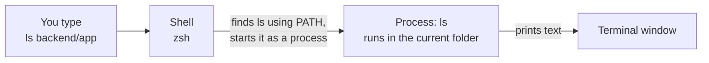
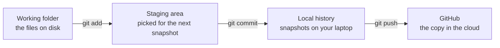
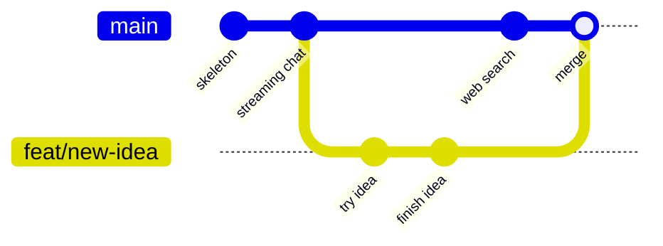
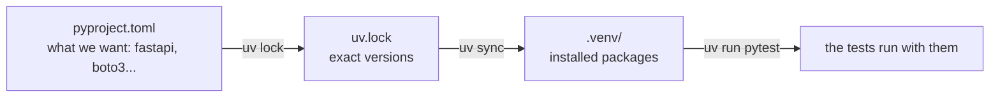
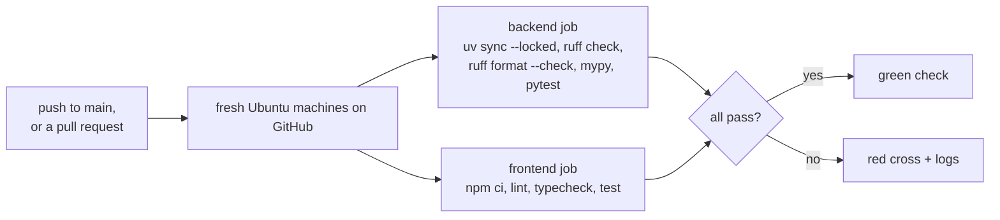

# Part A: Before the code

**The story so far.** Nothing yet, and that is the point. Before a single line of Docs Copilot makes sense, you need three everyday tools of the trade: a way to talk to your computer by typing, a way to save and share versions of your work, and a picture of what a program, a server and a check actually are. Every later part leans on these.

**In this part:**

- **1. The terminal:** typing commands instead of clicking, and what a shell, a path, a process and an environment variable are.
- **2. Git:** saving every version of the project, working on branches, and sharing it on GitHub.
- **3. Programs, servers, and checks:** languages, ports, packages and lock files, and the robots that check our code on every push.

---

## 1. The terminal: talking to your computer by typing

**Where we are.** The very start. Every command in this course is typed into a terminal, so this is the first tool to learn.

### The problem

You want to tell your computer to do something exactly, write it down, and do it again tomorrow the same way. Clicking through windows is hard to describe, hard to repeat, and impossible to automate.

Think of ordering food. Pointing at pictures on a menu works once. Writing the order on a slip of paper means anyone can hand in the same order again, word for word.

### The idea from zero

A **terminal** is a window where you type a command, press Enter, and the computer does it and prints the result. Everything you can do by clicking, you can do here, and a lot more. It is like texting your computer: each message is one command, and the reply comes back as text underneath.

Inside the terminal runs a **shell**: the program that reads what you type, finds the program you named, and starts it.



Five ideas make it all work:

- **You are always "in" a folder.** Commands act on that folder unless you say otherwise. `pwd` prints where you are; `cd somewhere` moves you; `ls` lists what is there.
- **A command is a program name, then its options.** `ls -l` runs the program `ls` with the option `-l` (long listing). Options are the program's dials.
- **A path is an address for a file or folder.** `~/Projects/personal/Docs_Copilot` means: from your home folder (`~`), into `Projects`, into `personal`, into `Docs_Copilot`. A path starting with `/` or `~` is **absolute**: it works from anywhere. A path like `backend/app` is **relative**: it starts from the folder you are in. `..` means "one folder up", `.` means "this folder".
- **A running program is a process.** Each command you start becomes a process with a number (its PID). Most processes, like `ls`, finish in a blink. A server is a process that keeps running until you stop it. `Ctrl+C` in the terminal stops the process running there.
- **An environment variable is a named setting handed to every process.** It is a `NAME=value` pair the shell passes to each program it starts, like a note taped to every order slip. `HOME` holds your home folder. `PATH` holds the list of folders the shell searches to find a program when you type its name. `echo $HOME` prints one.

### The whole field

There are two ways to drive a computer, and several shells for the typing way:

| Approach | How it works | Good for | Limits | Typical tools |
|---|---|---|---|---|
| **Graphical interface (GUI)** | windows, icons, a mouse | discovering what is possible; visual work | hard to repeat exactly, hard to automate, hard to write in a guide | Finder, File Explorer, the AWS web console |
| **Command line (CLI), POSIX shells** | type commands into a shell; save them in a script to repeat | Linux and macOS, servers, automation | you must learn the command names | bash, zsh, fish |
| **Command line, Windows shells** | same idea, Windows commands | Windows machines and Windows servers | different commands from Linux and macOS | PowerShell, the older cmd |

**GUI.** Great for exploring. You will still use the AWS console in this course to look at things, because seeing a resource on screen helps you learn it.

**bash.** The long-time default shell on Linux. Most scripts and most tutorials online are written for it. Servers and CI machines almost always have it.

**zsh.** Nearly identical to bash for daily use, with nicer completion and customizing. It has been the default on macOS since 2019. Commands in this course work the same in bash and zsh.

**fish.** Friendlier out of the box, but its script syntax differs from bash, so copied commands sometimes need changes.

**PowerShell.** Microsoft's shell. It passes structured objects between commands instead of plain text. It also runs on Linux and macOS, but Linux-style commands in this course will not all work there. On Windows, most developers use WSL (a Linux inside Windows) to get bash.

In industry, developers use the CLI for almost everything repeatable: running code, git, deploying, and CI robots, which have no screen at all. The GUI is for looking around.

### Our choice, and why

This project is built on a Fedora Linux laptop in **zsh**. The commands in this course are plain POSIX commands (`cd`, `ls`, `cat`, `git`, `uv`, `npm`), so they also work in bash on Linux or macOS.

The CLI matters here for one big reason: a typed command can be copied into this course, into the README, and into the CI robot (lesson 3), and it does the same thing everywhere.

### In our project

The project is one folder with four parts:

```
Docs_Copilot/
  README.md      the front page: what this is, how to run it, the decisions
  backend/       the Python server (the "API")
  frontend/      the web page (Next.js)
  infra/         things that run on AWS, not on your laptop: one Lambda function, IAM policies
  docs/          this course, and the demo script
```

**Environment variables in our project.** The backend needs IDs such as the S3 bucket name and the Knowledge Base id. `backend/app/settings.py` reads them from real environment variables first, then from the file `backend/.env`. A real environment variable always wins over the file. The file `backend/.env.example` lists every name (`AWS_PROFILE`, `AWS_REGION`, `S3_BUCKET`, `KB_ID`, `HARNESS_ARN`, `MEMORY_ID`, and more) with no values.

The frontend reads one: `API_URL`, the address of the backend, from `frontend/.env.local`.

```
path looks like              kind        starts from
~/Projects/personal/...      absolute    your home folder
/usr/bin                     absolute    the very top of the disk
backend/app                  relative    the folder you are in
../frontend                  relative    one folder up, then into frontend
```

### Try it

```
cd ~/Projects/personal/Docs_Copilot
pwd
ls
ls backend/app
cat backend/app/main.py
wc -l backend/app/main.py
echo $SHELL
```

What it prints (captured on 2026-09-15):

```
you type:   ls
it prints:  README.md  backend  docs  frontend  infra
you type:   ls backend/app
it prints:  __init__.py  aws.py  chat.py  documents.py  main.py  sessions.py  settings.py  tenancy.py
you type:   wc -l backend/app/main.py
it prints:  29 backend/app/main.py
```

Your `ls` may also show a `__pycache__` folder or local files git ignores. `cat` prints a file: you just read the file that starts the whole server. It is 29 lines. You will understand every one of them by lesson 7 (Part B). `wc -l` counts lines. `echo $SHELL` prints the path of your shell; on this laptop it ends in `zsh`.

### Check yourself

1. What does `cd` do, and what does `ls` do?
<details><summary>Answer</summary>

`cd` moves you into another folder. `ls` lists what is in a folder.

</details>

2. What does `..` mean in a path, and is `backend/app` absolute or relative?
<details><summary>Answer</summary>

`..` means one folder up. `backend/app` is relative: it starts from the folder you are in.

</details>

3. What is the difference between the terminal and the shell?
<details><summary>Answer</summary>

The terminal is the window. The shell (zsh, bash, PowerShell) is the program inside it that reads your command and starts the program you named.

</details>

4. What is a process, and how do you stop one running in your terminal?
<details><summary>Answer</summary>

A process is a running program, with its own number (PID). `Ctrl+C` stops the one running in the terminal, for example a server.

</details>

5. The backend finds `S3_BUCKET` both in `backend/.env` and as a real environment variable. Which one wins?
<details><summary>Answer</summary>

The real environment variable. `backend/app/settings.py` reads environment variables first and uses `.env` only for what is missing.

</details>

---

## 2. Git: saving versions and sharing them

**Where we are.** You can now move around the project folder and read files by typing. Next: how that folder remembers every change ever made to it, and how it reaches GitHub.

### The problem

You change a file, it breaks, and you want yesterday's version back. Or two people edit the same project and need to combine their work without overwriting each other. Or your laptop dies.

Think of a video game. Without save slots, one wrong move and you start over. With save slots, you can go back. Version control is save slots for a folder of code, where you keep every slot forever and each one has a label saying what changed.

### The idea from zero

**A commit** is one save slot: a snapshot of the whole project at one moment, with a short message and an id like `7f3e8c8`. You can go back to any commit.

**Git** is the program that makes commits. A file passes through three places on its way to GitHub:



- **`git add -A`** = "include everything I changed in the next snapshot"
- **`git commit -m "feat: upload files"`** = "take the snapshot, label it"
- **`git push`** = "send my snapshots to GitHub"

Nothing reaches GitHub without a commit and a push.

**A remote** is another copy of the history that yours talks to, usually on a website. Its default name is `origin`. `git push` sends your new commits to it; `git pull` fetches its new commits and adds them to yours.

**A branch** is a named line of commits. `main` is the line everyone trusts. To try something risky, you start a new branch from `main`, commit on it freely, and `main` stays untouched:



**A merge** joins one branch's commits into another. Git combines the changes line by line. If both branches changed the same lines, git stops and asks a human to choose: that is a **merge conflict**.

**What git must not track.** Some files must never be saved: real passwords and keys (`backend/.env`), and huge folders that can be rebuilt (`node_modules/`, `.venv/`). A file named `.gitignore` lists them, and git pretends they do not exist.

### The whole field

People have solved "keep versions of files" in three broad ways:

| Approach | How it works | Good for | Limits | Typical tools |
|---|---|---|---|---|
| **No version control** | copy the folder by hand: `project_final_v2_REAL` | a one-page school essay | no labels, no merging, easy to lose work | shared drives, zip files |
| **Centralized** | one server holds the only full history; you check files out and commit straight to the server | huge binary files (game art, video), strict file locking | most actions need the server; if the server is down, nobody commits | Subversion (SVN), Perforce |
| **Distributed** | every copy (every clone) holds the full history; you commit locally, then push and pull between copies | almost all software today | large binary files need add-ons; more ideas to learn | git, Mercurial |

**No version control.** Everyone starts here. It fails the first time two people edit the same file, or you need to know what changed last Tuesday.

**Centralized.** Subversion was the standard before git. Perforce is still common in game studios, because it handles gigabytes of art files and lets one person lock a file so nobody else edits it at the same time.

**Distributed.** Git was written in 2005 for the Linux kernel. Because every clone is a full backup and commits are local, you can work offline and branch cheaply. It won: it is what almost every team and every hosting site uses now.

**Where the shared copy lives.** With git, teams still keep one agreed copy on a hosting site:

| Host | Known for |
|---|---|
| **GitHub** | the largest; pull requests; GitHub Actions for CI |
| **GitLab** | can be installed on your own servers; CI built in from the start |
| **Bitbucket** | made by Atlassian; ties in with Jira |

**How teams use branches.** Git allows any branching style. Three are common:

| Workflow | How it works | Good for | Limits |
|---|---|---|---|
| **Feature branches with pull requests** | one branch per change; a **pull request** (PR) asks to merge it into `main`, teammates review it and CI checks it first | most teams, open source | a long-lived branch drifts from `main` and gets painful to merge |
| **Trunk-based** | everyone commits small changes to `main` (the trunk) at least daily; unfinished features hide behind on/off switches called feature flags | teams that deploy many times a day | needs strong tests and discipline |
| **GitFlow** | a `develop` branch for ongoing work, plus `release/` and `hotfix/` branches, with `main` holding only released versions | software shipped as numbered versions (apps, libraries) | many branches to juggle; slow for web apps that deploy constantly |

A pull request is a GitHub and Bitbucket name; GitLab calls the same thing a **merge request**.

### Our choice, and why

Git, hosted on GitHub, with `main` plus feature branches. It is the industry default, it is free, and GitHub Actions runs our checks (lesson 3).

- **`main`** is the working version: single user, no login.
- **`feat/login-runtime-agent`** is a long-lived feature branch that adds login and replaces the agent (Part H).

Commit messages follow a pattern called **Conventional Commits**: `feat:` for a new feature, `fix:` for a bug fix, `docs:` for documentation, `chore:` for housekeeping. Reading the history then tells you what happened without opening any file.

No pull requests have been opened on GitHub yet: work so far went straight to `main` or to the feature branch. At a larger scale, or with a teammate, the next step is to protect `main` on GitHub so every change must arrive as a pull request, with a review and a green CI run.

### In our project

**The history.** A selection of lines from `git log --oneline --reverse`, oldest first, so you can read the project's story:

```
54b991a chore: repo skeleton with uv workspace, ruff, mypy strict
d531e2c feat(api): stream Bedrock chat over SSE; flat backend layout; project brief
c6d7c52 feat(web): Next.js chat page streaming through a proxy route; CI
b6a2f14 fix(web): generate Next.js types before typecheck so CI passes
bcb0f59 feat: D2 upload, harness chat relay with sources, memory sidebar; D3 browser trace
9c3463a feat: D4 GraphRAG search tool (Lambda gateway target) and prompt routing
c64ea84 feat: uploads sync the graph Knowledge Base too; chat titles; keep sources from every search
02f375b feat: the agent searches the web on DuckDuckGo when no URL is given (prompt rule 1)
```

Each line is one commit: a short id, then the message.

**The ignore file.** `.gitignore` at the top of the repo. The three lines that protect secrets:

```
.env            real values: never tracked
.env.*          any other variant, like .env.local: never tracked
!.env.example   the template with the same keys and no values: tracked
```

The `!` un-ignores one file. So `backend/.env` (your real IDs) stays on your laptop and `backend/.env.example` (the same keys, explained) goes to GitHub for the next person.

**The remote.** Our `origin` is the GitHub repository `yashzord/Docs_Copilot`.

### Try it

```
git status            what changed since the last commit
git log --oneline     every commit, one line each
git show --stat HEAD  what the latest commit touched
git branch -a         every branch, local and on GitHub
git remote -v         where origin points
```

Captured on 2026-09-15:

```
$ git branch -a
* docs/story-course
  feat/login-runtime-agent
  main
  remotes/origin/HEAD -> origin/main
  remotes/origin/feat/login-runtime-agent
  remotes/origin/main

$ git remote -v
origin  git@github.com:yashzord/Docs_Copilot.git (fetch)
origin  git@github.com:yashzord/Docs_Copilot.git (push)
```

The `*` marks the branch you are on. `docs/story-course` exists only on this laptop (it has no `remotes/origin/` twin), so your list may differ. The `remotes/origin/...` lines are your laptop's memory of what GitHub had at the last fetch.

### Check yourself

1. What are the three places a file passes through on the way to GitHub?
<details><summary>Answer</summary>

The working folder (files on disk), the staging area (`git add`), and local history (`git commit`). Then `git push` sends the commits to GitHub.

</details>

2. Why is `backend/.env` ignored but `backend/.env.example` is not?
<details><summary>Answer</summary>

`.env` holds real values that must never be shared. `.env.example` has the same keys with no values, so the next person knows what to fill in. The `!.env.example` line un-ignores it.

</details>

3. What is the main difference between centralized and distributed version control?
<details><summary>Answer</summary>

Centralized (SVN): one server holds the full history and you commit straight to it. Distributed (git): every clone holds the full history, you commit locally and push and pull between copies.

</details>

4. How does trunk-based development differ from feature branches with pull requests?
<details><summary>Answer</summary>

Trunk-based: everyone commits small changes to `main` often, hiding unfinished work behind feature flags. Feature branches: each change lives on its own branch and joins `main` through a reviewed pull request.

</details>

5. What does `feat:` at the start of a commit message mean?
<details><summary>Answer</summary>

It is Conventional Commits for "a new feature". `fix:` is a bug fix, `docs:` documentation, `chore:` housekeeping.

</details>

---

## 3. Programs, servers, and the tools that check our code

**Where we are.** You can type commands (lesson 1) and save versions with git (lesson 2). Now: what the files in `backend/` and `frontend/` actually are, how they run, and how robots check them on every push.

### The problem

A recipe written in French is no use to a cook who reads only Japanese. A computer's processor understands only its own tiny numeric instructions, so the code we write must be translated. Then that code needs ingredients other people made (packages), the same versions on every kitchen counter (lock files), and a food inspector who checks every dish before it leaves (checks and CI).

### The idea from zero

**A program** is a text file of instructions that a computer runs. The instructions are written in a **language**. This project uses two:

| Language | Where | Why |
|---|---|---|
| **Python** | `backend/` | the server that talks to AWS. Python is the language AI and AWS libraries are best in |
| **TypeScript** | `frontend/` | the web page. Browsers only run JavaScript; TypeScript is JavaScript with types added, and it is turned into JavaScript before the browser sees it |

**A server** is a program that starts, then waits for requests and answers them, until you stop it. A normal program (like `ls`) does its job and exits.

**A port** is a numbered door on a machine, so several servers can share one address. Our backend waits on port 8001 of your laptop; the page waits on port 3000. `localhost` is the name a machine uses for itself.

```
your laptop (localhost)
  door 3000   the page (Next.js)      you open http://localhost:3000
  door 8001   the backend (FastAPI)   the page's proxy calls http://localhost:8001
```

**Packages** are code other people wrote and published, so you do not write everything yourself. FastAPI (the server library) and boto3 (the AWS library) are packages. A **package manager** downloads and installs them.

**A lock file** records the exact version of every installed package, including the packages your packages need, so your laptop, a teammate's laptop and the CI robot all install the same thing. Always commit it, never edit it by hand.



**Checks that run before the code runs.** Mistakes are cheapest to find early. Each check is a program:

| Check | Catches |
|---|---|
| **lint** | style mistakes and common bugs, like an unused variable |
| **format** | layout: line breaks, quotes. Makes every file look the same |
| **typecheck** | a number where text was expected, a missing field |
| **test** | small programs that run our code with made-up input and assert the output |

**CI** (continuous integration) is a robot that runs all the checks on a fresh machine every time code is pushed. If any fails, the commit gets a red cross.

### The whole field

This lesson covers five related choices. Each has its own table.

**1. How a language runs.**

| Approach | How it works | Good for | Limits | Typical languages |
|---|---|---|---|---|
| **Interpreted** | an interpreter program reads your source and runs it directly | quick to write and try; scripts, AI, web backends | slower; many mistakes only appear when that line runs | Python, JavaScript, Ruby |
| **Bytecode on a virtual machine** | compiled to an in-between form, run by a virtual machine that speeds up hot code while running | big long-running business systems | a runtime must be installed; slower start | Java, C#, Kotlin |
| **Compiled** | a compiler turns source into the processor's own instructions before it runs | speed, small single-file programs, systems code | a build step on every change | C, C++, Go, Rust |
| **Transpiled** | source is translated into another language's source | adding types or new syntax to a language that lacks them | one more build step | TypeScript to JavaScript |

The line is blurry: Python quietly turns code into bytecode (the `__pycache__` folders), and JavaScript engines compile hot code while it runs. The useful question is: is there a separate build step before running, or not?

**2. Programs and servers.** A program runs once and exits. A server listens on a port and answers requests forever. Well-known ports have fixed jobs: 80 for plain web traffic, 443 for encrypted web traffic (HTTPS), 22 for SSH. Development servers pick high numbers like 3000, 8000 or 8001, so they do not clash with those.

**3. Package managers and lock files.**

| Tool | Language | How it works | Lock file | Notes |
|---|---|---|---|---|
| **pip** | Python | installs packages; the standard, shipped with Python | none built in; teams pin versions in `requirements.txt` | needs a separate tool (`venv`) to keep projects apart |
| **poetry** | Python | one tool for dependencies, virtual environments and publishing | `poetry.lock` | was the popular all-in-one before uv |
| **uv** | Python | one tool for Python versions, virtual environments, dependencies and running tools; written in Rust | `uv.lock` | much faster than pip |
| **npm** | JavaScript | ships with Node.js; the default | `package-lock.json` | copies every package into each project's `node_modules/` |
| **pnpm** | JavaScript | stores each package version once on disk and links it into projects | `pnpm-lock.yaml` | saves disk space; strict about undeclared packages |

Yarn is a third common JavaScript option. Every modern manager has a lock file, and every serious team commits it.

**4. Linters, formatters and type checkers.**

| Kind | Python tools | JavaScript / TypeScript tools |
|---|---|---|
| **linter** | ruff, flake8, pylint | eslint, biome |
| **formatter** | ruff format, black | prettier, biome |
| **type checker** | mypy, pyright | tsc (the TypeScript compiler) |

Ruff and biome are the newer, faster tools that do both linting and formatting in one program.

**5. Test types.** Tests come in layers, often drawn as a pyramid: many small fast tests at the bottom, few slow big ones on top.

```
            /\        end to end: a real browser clicks through the real app
           /  \       (few, slow, catch "it is all wired wrong")
          /----\
         /      \     integration: several parts together, e.g. an API route plus its storage
        /--------\    (some, medium speed)
       /          \   unit: one function with made-up input
      /------------\  (many, milliseconds each)
```

| Type | How it works | Good for | Limits | Typical tools |
|---|---|---|---|---|
| **Unit** | calls one function with made-up input, checks the output | logic, edge cases; runs in milliseconds | cannot see wiring mistakes between parts | pytest, node test, Jest, Vitest |
| **Integration** | runs several real parts together, often with fakes for outside services | "does the route call storage correctly?" | slower; fakes can differ from the real service | pytest with a test client, moto, Testcontainers |
| **End to end** | drives the whole running app like a user would | "can a user actually upload and ask?" | slow, flaky, costly to keep working | Playwright, Cypress, Selenium |

**CI services.** GitHub Actions (built into GitHub), GitLab CI (built into GitLab), Jenkins (you run it yourself; common in older companies), CircleCI and Buildkite (hosted services). All do the same thing: on a push or a pull request, start a clean machine, run a list of commands, report pass or fail. Many teams also block merging into `main` until CI is green.

### Our choice, and why

| Choice | Ours | Why |
|---|---|---|
| **backend language** | Python 3.12 (interpreted) | the AWS library boto3 and AI tooling are strongest in Python |
| **frontend language** | TypeScript (transpiled to JavaScript) | browsers run JavaScript; types catch mistakes before the browser does |
| **Python packages** | uv | one fast tool for the Python version, the virtual environment and the lock file |
| **JavaScript packages** | npm | ships with Node.js; nothing extra to install |
| **Python checks** | ruff (lint and format), mypy in strict mode | one fast tool for style; strict types catch the most |
| **frontend checks** | eslint, tsc | the Next.js defaults |
| **tests** | pytest, Node's built-in test runner | standard; nothing extra for the frontend |
| **CI** | GitHub Actions | the code already lives on GitHub (lesson 2) |

Our tests are unit tests plus integration tests of our own API with AWS faked. The backend tests call the real FastAPI routes through a test client, but every AWS service is replaced by a small fake (FakeAgentCore, FakeKb) or by moto for S3, so tests are free, fast and need no AWS account. There are no automated end to end tests: the whole app is checked by hand against real AWS (lesson 26, Part F). At larger scale the next step would be a small Playwright suite in CI, and pnpm if the frontend grew into several packages.

### In our project

```
backend/pyproject.toml     the Python shopping list, plus ruff, mypy, pytest settings
backend/uv.lock            the receipt: exact versions
backend/.python-version    3.12 (the Python version uv uses)
frontend/package.json      the JavaScript shopping list, plus the scripts (npm run dev, npm test)
frontend/package-lock.json its receipt
.github/workflows/ci.yml   the CI recipe: two jobs, backend and frontend
```

**The shopping lists.** `backend/pyproject.toml` asks for five packages to run: `fastapi`, `uvicorn[standard]` (the program that serves FastAPI on a port), `boto3`, `pydantic-settings` and `python-multipart` (for file uploads). A separate `dev` group holds tools only needed while developing: `ruff`, `mypy`, `pytest`, `httpx2` (for the test client), `boto3-stubs` (type descriptions for mypy) and `moto` (fake S3). `frontend/package.json` pins `next` at exactly `16.3.4` and `react` at `19.2.8`; tools like `eslint` use `^9`, which means "any 9.x version", and the lock file records which one was installed.

Same idea, two names:

| Idea | Python | JavaScript |
|---|---|---|
| package manager | uv | npm |
| shopping list | pyproject.toml | package.json |
| exact versions | uv.lock | package-lock.json |
| installed packages (never commit) | .venv/ | node_modules/ |
| install everything | uv sync | npm install |
| install exactly the lock (CI) | uv sync --locked | npm ci |
| run a tool | uv run pytest | npm test |

**The CI recipe.** `.github/workflows/ci.yml` runs on every push to `main` and on every pull request. It starts two fresh Ubuntu machines at the same time:



`uv sync --locked` fails if `uv.lock` no longer matches `pyproject.toml`, so a forgotten lock update is caught. The frontend job has no format step: the frontend uses no formatter, only eslint.

> **On the login branch:** CI also runs on pushes to `feat/**` branches and gains a third job, `agent`, that checks the agent's own Python project (lesson 35, Part H).

"It works on my laptop" stops being an excuse: CI starts from an empty machine, so it catches anything that only worked because of a file your laptop happened to have. That happened once here: the first frontend CI run failed because Next.js generates some type files on your laptop that CI did not have. The fix was one extra command in the typecheck script: `next typegen && tsc --noEmit` (commit `b6a2f14`).

**No `[build-system]` table.** `pyproject.toml` has none on purpose. That table is for code you package and publish for others to install. Ours is an app we run, so uv installs its dependencies and never tries to package the app itself. The one cost is a single line, `pythonpath = ["."]`, so the tests can find the `app` folder.

### Try it

```
cd ~/Projects/personal/Docs_Copilot/backend
uv run ruff check .
uv run ruff format --check .
uv run mypy .
uv run pytest -q

cd ../frontend
npm run lint
npm run typecheck
npm test
```

What it printed (captured on 2026-09-15):

```
uv run ruff check .           All checks passed!
uv run ruff format --check .  15 files already formatted
uv run mypy .                 Success: no issues found in 14 source files
uv run pytest -q              38 passed, 1 warning
npm test                      tests 13, pass 13, fail 0
```

Then open `backend/tests/test_chat.py` and read the first test. Its name says what it proves: `test_streams_session_tool_sources_answer_usage_done`. Every test in this project is named like a sentence.

### Check yourself

1. What is the difference between `pyproject.toml` and `uv.lock`?
<details><summary>Answer</summary>

`pyproject.toml` says what we want, often as a range (`fastapi>=0.141.1`). `uv.lock` records the exact version of every package actually installed, including the packages they need.

</details>

2. What is the difference between a program and a server, and what is a port for?
<details><summary>Answer</summary>

A program runs and exits. A server keeps running and answers requests. A port is a numbered door, so several servers share one machine: our backend on 8001, the page on 3000.

</details>

3. Is TypeScript compiled or interpreted?
<details><summary>Answer</summary>

Neither, strictly: it is transpiled into JavaScript, and the JavaScript is then run by the browser or Node.js.

</details>

4. What is the difference between a unit test and an end to end test, and which kind does this project automate?
<details><summary>Answer</summary>

A unit test checks one function with made-up input. An end to end test drives the whole running app like a user. This project automates unit tests and integration tests of its API with AWS faked; end to end checks are done by hand.

</details>

5. What does CI catch that running the tests on your laptop does not?
<details><summary>Answer</summary>

Anything that only works because of something on your laptop: a generated file, an installed package missing from the lock file, a lock file out of date. CI starts from an empty machine every time.

</details>

**Next:** Part B, The web part, because now that you know what a server and a port are, you can watch a request travel from the page to our server and back.
