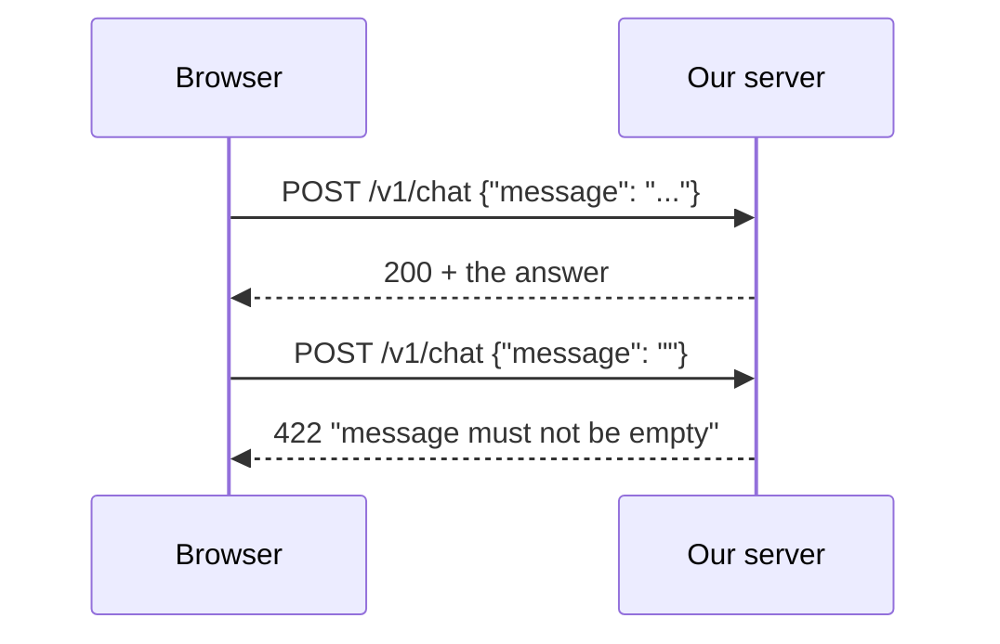
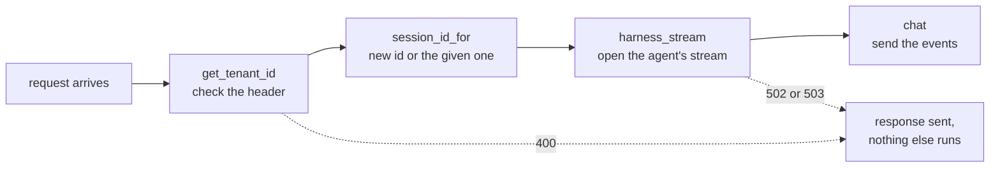
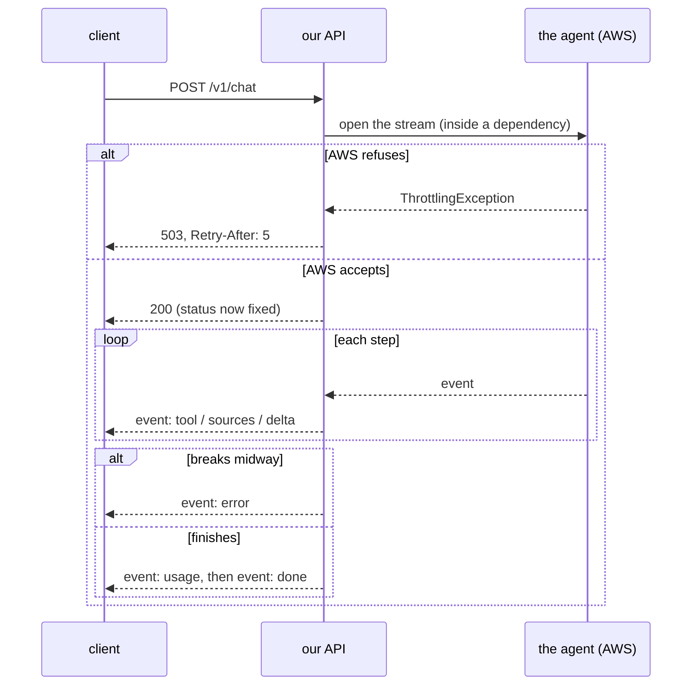
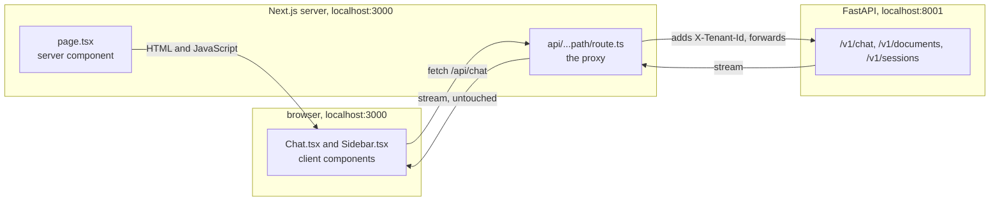
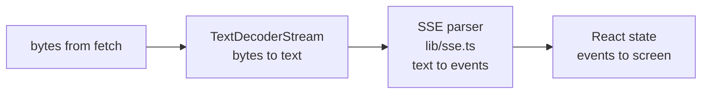

# Part B: The web part

**The story so far.** In Part A you learned to type commands, save work with git, and start two programs: a server (the API on port 8001) and a page (on port 3000). You know a server is a program that waits for requests. Now we open the box: what a request actually is, how our Python server answers it, how an answer can arrive word by word, and how the page in the browser shows it.

**In this part:**

- **Lesson 4, Request and response:** the letter and its reply that every web conversation is made of.
- **Lesson 5, FastAPI:** one Python function per URL, with checks that run before your code.
- **Lesson 6, Streaming:** how the answer arrives in pieces instead of all at the end.
- **Lesson 7, The page:** Next.js, the proxy in front of the API, and reading the stream in the browser.

## 4. Request and response

**Where we are.** In lesson 3 (Part A) you started two servers and saw that a server is a program that waits for requests. This lesson opens up the request itself: what goes into it, and what comes back.

### The problem

The page and the API are two separate programs. Later they may run on different machines, written in different languages. They need one strict, shared format for "here is what I want" and "here is what happened". Without it, neither can understand the other.

Think of the postal system. Every envelope has an address, a delivery class, labels like "fragile", and a letter inside. Any post office in the world can handle it, because the format is agreed in advance. The web's agreed format is called **HTTP**.

### The idea from zero

Every conversation between a client (a browser, or a command like `curl`) and a server is one **request** and one **response**. Like a letter and its reply. The client always speaks first, and the server answers each request exactly once.

```
client (browser, curl)                                server (our API)

  POST /v1/chat                    ---- request ---->
  headers: X-Tenant-Id: dev
           Content-Type: application/json
  body:    {"message": "How do I enable MFA?", "session_id": null}

                                   <--- response ----   status:  200
                                                        headers: content-type: text/event-stream
                                                        body:    the answer, piece by piece
```

Five parts of a request and its response:

- **Method:** the kind of action. `GET` reads something, `POST` sends something.
- **Path:** which thing. `/v1/chat`. The `v1` leaves room for a `v2` later without breaking old callers.
- **Headers:** labels on the envelope, as `Name: value` lines. `Content-Type` says what format the body is in.
- **Body:** the letter inside. For us, JSON or a file.
- **Status code:** on the response only. The server's one-number verdict.

**JSON** is text shaped like `{"key": "value", "list": [1, 2]}`. Almost every language can read and write it, which is why it became the common body format for web APIs.

Rule of thumb for status codes: **4xx means the caller did something wrong, 5xx means our side failed.**

One more property matters later: HTTP is **stateless**. Each request stands alone. The server does not remember your last request unless the request itself carries something that points back, like our `session_id` (lesson 7).



### The whole field

HTTP gives you building blocks. First the blocks, then the styles people build APIs in.

**Methods.** There are a handful, each with a meaning every tool understands.

| Method | Means | Safe to repeat? | Example |
|---|---|---|---|
| GET | read, change nothing | yes | list my documents |
| POST | create something, or run an action | no, two POSTs can create two things | upload a file, ask a question |
| PUT | replace a thing with this full version | yes, same result each time | overwrite a settings record |
| PATCH | change part of a thing | depends | rename one document |
| DELETE | remove a thing | yes | delete a document |
| OPTIONS | "what am I allowed to send here?" | yes | the browser's CORS check (lesson 7) |

"Safe to repeat" has a formal name, **idempotent**: sending it twice leaves the same end state as sending it once. It matters because networks fail, and clients and proxies retry idempotent requests without asking.

**Status code families.**

| Family | Means | Common codes |
|---|---|---|
| 1xx | informational, keep going | rarely seen directly |
| 2xx | success | 200 OK, 201 Created, 204 No Content |
| 3xx | go somewhere else | 301 moved for good, 302 moved for now, 304 not modified (use your cached copy) |
| 4xx | the caller's mistake | 400 bad request, 401 not signed in, 403 signed in but not allowed, 404 not found, 422 broke a rule, 429 too many requests |
| 5xx | the server's failure | 500 crashed, 502 an upstream service failed, 503 busy, 504 an upstream service was too slow |

**Headers you meet everywhere.**

| Header | Says |
|---|---|
| `Content-Type` | the body's format: `application/json`, `multipart/form-data`, `text/event-stream` |
| `Accept` | the format the client would like back |
| `Authorization` | who is asking, usually `Bearer <token>` (lesson 31, Part H) |
| `Cookie` / `Set-Cookie` | small values the browser stores and sends back automatically |
| `Cache-Control` | whether a copy may be kept, and for how long |
| `Retry-After` | how many seconds to wait before trying again |

**Body formats.** JSON for most APIs. `application/x-www-form-urlencoded` for classic HTML forms. `multipart/form-data` for file uploads (lesson 10, Part C). Binary formats like Protocol Buffers when size and speed matter. XML in older systems.

**API styles.** Those blocks can be arranged in very different ways.

| Approach | How it works | Good for | Limits | Typical tools |
|---|---|---|---|---|
| REST (JSON over HTTP) | a URL per thing (`/documents`), methods say what to do with it | public APIs, most web backends | a page may need many calls, or get more fields than it wants | FastAPI, Express, Spring, Django REST framework |
| GraphQL | one URL; the client sends a query naming exactly the fields it wants | many different clients (web, mobile) needing different shapes of the same data | caching and rate limits are harder; one heavy query can be expensive | Apollo, GraphQL Yoga, Strawberry, Hasura |
| gRPC | you define functions in a `.proto` file; tools generate client and server code; binary messages over HTTP/2 | fast calls between internal services, strict contracts | browsers cannot call it directly (needs a gRPC-Web proxy); not human-readable | grpc libraries for Go, Java, Python, and others |
| WebSockets | one HTTP request is "upgraded" into a long-lived two-way channel | chat rooms, multiplayer games, live collaboration | not request/response anymore: you design your own messages, reconnects and scaling | Socket.IO, ws, FastAPI WebSocket routes |

**REST.** The most common style by far. Paths name things (`/v1/documents`), methods name actions (`GET` lists, `POST` adds), status codes report the outcome. Most real APIs are "REST-ish": mostly resource paths, plus a few action paths like `/v1/chat` where a noun would be forced.

**GraphQL.** Facebook built it for mobile apps that each needed slightly different data. Instead of the server deciding the response shape, the client writes a query like `{ document(id: 1) { name size } }`. Popular when many frontends share one backend.

**gRPC.** Google's style for services calling services. You write a contract once, and code is generated for both sides, so a typo is a compile error instead of a 400 at runtime. Common inside large companies' backends, rare as a browser-facing API.

**WebSockets.** Not really an API style, but people compare it with the others. After a handshake, both sides can send messages at any time. Lesson 6 compares it with the other ways of pushing data to the browser.

### Our choice, and why

Our API is **REST-style JSON over HTTP**, using only `GET` and `POST`, with a `/v1` prefix. The chat answer comes back as a stream (lesson 6).

- **REST:** one client (our page), a handful of routes, fixed data shapes. GraphQL would add a query language to solve a problem we do not have.
- **Not gRPC:** the browser is a caller, and browsers cannot speak gRPC directly.
- **Not WebSockets:** a chat turn is one question up, then an answer flowing one way down. A normal request with a streamed response fits that exactly.

At larger scale, the public API would most likely stay REST, with a generated client from its OpenAPI description (lesson 5). If the backend split into many internal services, those services might talk to each other over gRPC.

### In our project

The server answers six paths (seven routes, since `/v1/documents` takes both GET and POST). Each lives in one file under `backend/app/`:

| Method and path | Does | File |
|---|---|---|
| POST /v1/chat | ask a question, get the streamed answer | chat.py |
| POST /v1/documents | upload one file | documents.py |
| GET /v1/documents | list your files | documents.py |
| GET /v1/documents/sync/{job} | how the indexing of an upload is going | documents.py |
| GET /v1/sessions | your past conversations | sessions.py |
| GET /v1/sessions/{id}/messages | one conversation's messages | sessions.py |
| GET /healthz | "I am alive" | main.py |

The `{job}` and `{id}` parts are **path parameters**: a slot in the path that the code reads as a value.

Status codes this project uses:

| Code | Name | Means here |
|---|---|---|
| 200 | OK | worked, the answer follows |
| 201 | Created | a file was uploaded |
| 400 | Bad Request | the tenant header is missing or malformed |
| 404 | Not Found | the proxy refused a path it does not know (lesson 7) |
| 413 | Content Too Large | an upload over 50 MB |
| 415 | Unsupported Media Type | an upload that is not pdf, md, txt, html, docx or csv |
| 422 | Unprocessable Content | the JSON parsed, but broke a rule (empty message, bad session id, an upload whose file name is empty) |
| 500 | Internal Server Error | only from the page's proxy, when `API_URL` is not set (lesson 7) |
| 502 | Bad Gateway | our server is fine, but an AWS service failed; the proxy also sends it when the API is not running |
| 503 | Service Unavailable | AWS is busy. Try again; the `Retry-After` header says when |

> **On the login branch:** the `X-Tenant-Id` header is gone; every request carries `Authorization: Bearer <token>`, and a missing or bad token gets 401 instead of 400 (lesson 31, Part H).

**Try it (app running)**

```
curl -s localhost:8001/healthz
```

prints `{"status":"ok"}`. That is the smallest request and response there is. Then:

```
curl -s -o /dev/null -w "%{http_code}\n" -X POST localhost:8001/v1/chat \
  -H 'Content-Type: application/json' -d '{"message":"hi"}'
```

prints `400`: the tenant header was missing, so the server refused before doing anything. The `-w "%{http_code}"` part asks curl to print only the status code, and `-o /dev/null` throws the body away.

### Check yourself

1. Name the five parts of a request and response.
   <details><summary>Answer</summary> Method, path, headers, body, and (on the response) the status code.</details>
2. What is the difference between a 4xx and a 5xx?
   <details><summary>Answer</summary> 4xx: the caller sent something wrong, so sending the same request again will fail again. 5xx: the server or something behind it failed; the same request may work later.</details>
3. A request with no `X-Tenant-Id` header: which code comes back?
   <details><summary>Answer</summary> 400 Bad Request, before any AWS call is made.</details>
4. Why is `POST` not safe to retry blindly, while `GET` is?
   <details><summary>Answer</summary> `GET` only reads, so repeating it changes nothing. `POST` creates or acts, so a retry can create a second upload or ask the question twice.</details>
5. Why did this project not use gRPC for the browser-facing API?
   <details><summary>Answer</summary> Browsers cannot call gRPC directly; it would need an extra gRPC-Web proxy, for no benefit with one client and a few routes.</details>

## 5. FastAPI: one function per URL, checks before your code runs

**Where we are.** Lesson 4 showed what a request looks like on the wire. Something on the server has to read those bytes, find the right code to run, and turn its result back into a response. That something is a web framework.

### The problem

Raw HTTP is tedious. Reading bytes from a network socket, splitting headers, parsing JSON, checking that every field makes sense, picking the right code for each path, writing status codes back: every server needs all of that, and none of it is what makes your app special.

Think of a restaurant. The kitchen should cook, not answer the door, read handwriting and check whether the order is even on the menu. A good front desk takes the order, rejects anything impossible, and hands the kitchen a clean ticket. A web framework is that front desk.

### The idea from zero

A **web framework** is a library that does the HTTP plumbing so you only write the part that is yours. The core idea is **routing**: you write a function and label it with the method and path it answers, and the framework calls it when a matching request arrives.

**FastAPI** is the Python framework our server is built with:

```python
@router.post("/v1/chat")      # "when a POST arrives at /v1/chat..."
def chat(...):                # "...run this function"
```

FastAPI does two things for you before your function runs.

**1. It checks the body.** You describe the expected body as a class with typed fields (a **Pydantic model**). FastAPI parses the JSON, checks every field against the rules, and if anything is wrong, answers 422 with a list of what failed. Your function never runs.

```python
class ChatRequest(BaseModel):
    message: str = Field(min_length=1, max_length=20_000)
    session_id: str | None = Field(default=None, pattern=SESSION_ID_PATTERN)
```

Read it as: `message` is text, 1 to 20,000 characters. `session_id` is text or nothing, and if given it must match a pattern (33 to 100 letters, digits, dashes or underscores, starting with a letter or digit, which is AWS's own rule for session ids).

Why check here instead of letting AWS complain: it costs nothing, the error is clearer, and AWS never sees junk.

**2. It runs dependencies.** A **dependency** is a function FastAPI runs before your endpoint, handing the result to it. You ask for one with `Depends(...)`. Dependencies run in order, and any of them can stop the request with an error status. The tenant check comes first, so a bad header is rejected before a paid AWS call.



Dependencies have a second gift: in tests, you can **swap** any of them for a fake. `app.dependency_overrides[get_agentcore] = lambda: fake` makes every route use a fake AWS client that costs nothing. That is how all 38 backend tests run without an AWS account.

### The whole field

Every popular language has web frameworks, and they differ mainly in how much they include and how they handle waiting.

| Approach | How it works | Good for | Limits | Typical tools |
|---|---|---|---|---|
| Micro-framework, sync | routing plus request and response; you add the rest; one thread per request | small services, learning, simple APIs | you choose and wire validation, database, auth yourself | Flask (Python) |
| Batteries-included | routing plus database layer, admin pages, login, forms, templates | full websites with a database and staff admin screens | heavier; its way of doing things is expected | Django (Python), Ruby on Rails |
| Minimal, event loop | a small core and a chain of **middleware** functions; one thread, never blocks | JavaScript teams, lots of waiting on network calls | validation, docs and structure are all add-ons | Express (Node.js) |
| Typed, async-capable | types on function parameters drive validation, docs and dependency injection | APIs where clear contracts matter; Python AI and data services | the async model has sharp edges (see Under the hood) | FastAPI (Python), NestJS (Node.js) |
| Enterprise, container-based | a dependency injection container builds and wires every object; annotations declare routes | large Java codebases, many teams, long-lived systems | a lot of framework to learn; slower to start | Spring Boot (Java) |

**Flask.** A thin layer: route decorators, a request object, a response. Everything else is an extension you pick. Very common for small Python services.

**Django.** Built for database-backed websites. It comes with an ORM (Python classes that become database tables), an admin site, user accounts and templates. API work usually adds Django REST framework on top.

**Express.** The classic Node.js framework. A request passes through a list of middleware functions (logging, parsing JSON, checking a login) and finally a route handler. Node runs your code on one thread with an **event loop**, so everything that waits must be non-blocking.

**FastAPI.** Built on two libraries: Starlette (the HTTP part) and Pydantic (the checking part). Your function's type hints are the single source of truth: they drive validation, dependency injection and the generated docs.

**Spring Boot.** The most common choice in Java shops. Classes are marked with annotations like `@RestController`, and Spring's container creates and connects every object, so a controller never builds its own database client.

Four ideas cut across all of them.

**Sync versus async servers.** A request spends most of its life waiting: on a database, on AWS, on a model. Servers handle that waiting in one of two ways.

| Model | How waiting is handled | Examples |
|---|---|---|
| Thread per request (sync) | each request gets a thread; a waiting thread just sits there | Flask and Django under Gunicorn (the WSGI standard), classic Spring |
| Event loop (async) | one thread juggles many requests; code must say "I am waiting" (`await`) so the loop can serve others | Node.js and Express, FastAPI's `async def` routes under uvicorn (the ASGI standard) |

Threads are simpler to write but each costs memory. An event loop handles thousands of idle connections cheaply, but one blocking call inside it freezes everyone. FastAPI can do both, which is exactly why our endpoints need care (Under the hood).

**Request validation.** Ways to check input, simplest to strongest:

- **Hand-written ifs:** `if not message: return 400`. Easy to forget one.
- **Schema libraries:** declare the shape once. Pydantic (Python), Zod or Joi (JavaScript), Bean Validation annotations (Java).
- **Contract-first:** write the API description first (OpenAPI or JSON Schema), and validate every request against it automatically.

**Dependency injection.** Instead of a function creating what it needs (an AWS client, the settings), it receives them from outside. Then tests can hand in fakes, and one shared client serves every request. Styles range from passing arguments by hand, to FastAPI's per-parameter `Depends`, to Spring's container that wires a whole application.

**OpenAPI docs.** **OpenAPI** is a standard, machine-readable description of an API: every path, parameter, body shape and response. Tools turn it into an interactive docs page (Swagger UI), generate client code, or run contract tests. Two ways to get one: **code-first** (the framework generates it from your code, as FastAPI does at `/openapi.json`) or **spec-first** (write the file, then build code to match).

### Our choice, and why

We sit in the "typed, async-capable" row: **FastAPI with Pydantic, plain `def` endpoints, and `Depends` for every shared thing.**

- **Python:** AWS's own libraries and most AI tooling are Python-first.
- **FastAPI over Flask:** validation, dependency injection and OpenAPI docs come built in instead of as three extensions to choose and wire.
- **FastAPI over Django:** we have no database of our own and no admin screens, so Django's batteries would sit unused.
- **Plain `def`:** boto3 blocks, so thread-per-request is the correct model for our code (Under the hood).

At larger scale this choice holds up. Teams would add a production process manager with several uvicorn workers, structured logs, and possibly an async AWS client if thread counts became the limit.

> **On the login branch:** a new dependency, `get_user` in `backend/app/auth.py`, replaces the tenant header check: it reads `Authorization: Bearer <token>`, verifies the token's signature, expiry, issuer, kind and app client, and answers 401 if any check fails (lesson 31, Part H).

### In our project

```
backend/app/main.py        creates the app, plugs in the three route files, /healthz
backend/app/chat.py        POST /v1/chat
backend/app/documents.py   the three /v1/documents routes
backend/app/sessions.py    the two /v1/sessions routes
backend/app/tenancy.py     the dependency that reads and checks X-Tenant-Id
backend/app/settings.py    reads backend/.env into a typed Settings object
backend/app/aws.py         one AWS client per service (shared), and one error mapper
```

Open `chat.py`. Find `class ChatRequest` (the body rules), then `def chat` at the bottom (the endpoint), and see how its parameters each say `Depends(...)`.

**Validation in other routes.** Paths are checked too. `GET /v1/documents/sync/{job_id}` only accepts 10 capital letters and digits, and `GET /v1/sessions/{session_id}/messages` reuses the chat's session id pattern, both through `Path(pattern=...)`. Uploads are checked by hand in `documents.py`: file type (415), size (413), and a file name that is empty once unsafe characters are removed (422).

**Settings.** `settings.py` reads `backend/.env`: the AWS profile, the region, and seven IDs from the AWS console. Real environment variables win over the file, so a server on AWS could set them without any file. A typo key in the file is a startup error, on purpose: a mistake fails loudly at start, not quietly at 2 am.

**Shared clients.** `aws.py` builds each AWS client once (`@lru_cache`) and hands it out through a dependency, so every request reuses it and every test can replace it.

**Try it (app running)**

Open http://localhost:8001/docs in the browser. FastAPI generated that page from the code: every route, every field, every rule. Click `POST /v1/chat`, then "Try it out". Type `dev` into the `x-tenant-id` field, and send the body `{"message": ""}`. You get 422 and the exact rule that failed (`String should have at least 1 character`). Leave `x-tenant-id` empty and the same body gets 400 instead: the tenant dependency runs first and stops the request before the body rules are ever reported.

### Under the hood

**Two kinds of function.** A FastAPI endpoint can be `def` or `async def`. `async def` says "I will tell you when I am waiting, serve others meanwhile", and only works if every library it calls is async too. The AWS library (boto3) is not: it **blocks**, meaning it holds the thread while waiting for AWS. Inside an `async def`, that would freeze the event loop and every other request with it.

So our endpoints are plain `def`, and FastAPI runs each one in a separate worker thread (up to 40 at once by default). One user's slow answer never freezes another user's request. Writing them as `async def` would be a real bug.

```
one process: uvicorn (the program that runs the FastAPI app)
├── main thread           takes requests, sends responses, never waits on AWS
└── worker threads (40)   each runs one blocking `def chat()` until its answer ends
```

Measured in the first week: five requests one after another took 3.09 s; the same five at once took 0.77 s, about the time of one. The waits overlap.

### Check yourself

1. What happens to a request whose body breaks a rule, and does your function run?
   <details><summary>Answer</summary> FastAPI answers 422 with a list of the failed rules. The endpoint function never runs.</details>
2. Why is the tenant check a dependency instead of a line inside `chat()`?
   <details><summary>Answer</summary> Dependencies run before the endpoint and before the paid AWS call, the same check is reused by every route, and tests can swap it.</details>
3. Why is `chat` a `def` and not an `async def`?
   <details><summary>Answer</summary> boto3 blocks while waiting for AWS. A plain `def` runs in a worker thread, so the wait blocks only that thread. In an `async def` it would freeze the event loop and every other request.</details>
4. What is OpenAPI, and where does our server publish it?
   <details><summary>Answer</summary> A machine-readable description of every route, field and response. FastAPI generates it from the code at `/openapi.json`, and the `/docs` page is built from it.</details>
5. A team writes a Java service with many classes that need a shared database client. Which framework row fits, and why?
   <details><summary>Answer</summary> Spring Boot: its dependency injection container creates the shared client once and wires it into every class that asks for it.</details>

## 6. Streaming: the answer arrives in pieces

**Where we are.** Lesson 4 said the server answers each request exactly once, and lesson 5 showed the function that builds that answer. But a model writes its answer word by word, over many seconds. This lesson is about sending a response while it is still being written.

### The problem

A model writes its answer one piece at a time. Without streaming, the user stares at nothing until the last word. With streaming, words appear as they are written.

```
not streaming   [.............. wait ..............] "Mars, Jupiter, Saturn."
streaming       "Mars" ", Jupiter" ", Saturn."   <- first word almost at once
```

Think of ordering at a counter. One kind of kitchen makes you wait until the whole tray is ready. Another hands you each dish as it comes out. The total time is the same, but the second one feels far faster, and you can see it is working.

There is a second, related need: news the browser did not ask for at that moment. "Your upload has finished indexing" happens on the server, minutes later. HTTP's rule is that the client speaks first, so how does the server tell the page?

### The idea from zero

A normal HTTP response does not have to arrive in one go. The server can send the status and headers, then send the body in pieces, and close the connection only when it is done. The browser can read those pieces as they land.

On top of that raw ability, you need a way to tell where one piece ends and the next begins, because the network cuts data wherever it likes. The format we use is **Server-Sent Events** (SSE): plain text over one long HTTP response. Each event is a few `name: value` lines, and a **blank line** ends the event.

```
event: session
data: {"session_id": "af0e0ec4-0bc1-43db-b609-1ce280f994e3"}

event: tool
data: {"name": "docs___Retrieve", "input": {"retrievalQuery": {"text": "enable MFA"}}}

event: sources
data: [{"n": 1, "title": "Secure_Transfers_User_Guide.pdf", "score": 0.794, "excerpt": "Steps to Configure MFA..."}]

event: delta
data: "To enable MFA"

event: delta
data: " for a user"

event: usage
data: {"input_tokens": 13655, "output_tokens": 287, "model_calls": 2}

event: done
data: [DONE]
```

The response's `Content-Type` is `text/event-stream`, which tells every tool in between "this is a stream of events, not one document".

### The whole field

There are five common ways to get fresh data from a server to a page, from simplest to most capable.

| Approach | How it works | Good for | Limits | Typical tools |
|---|---|---|---|---|
| Polling | the client asks again on a timer, every few seconds | status checks, dashboards that can be a little stale | wasted requests when nothing changed; news waits for the next tick | `setInterval` or a loop with `fetch`, React Query's refetch interval |
| Long polling | the client asks; the server holds the request open until there is news (or a timeout), answers, and the client asks again | near-instant notifications where nothing else is available | one open request per waiting client; fiddly timeouts | older chat systems, fallbacks inside Socket.IO |
| Streaming HTTP response | one request; the server writes the body in pieces as they are ready | a single long answer: model output, big exports, logs | one direction only (server to client); you define how pieces are separated | `fetch` with a readable stream, newline-delimited JSON |
| Server-Sent Events | a streaming response in a standard text format of named events | live feeds and token-by-token model answers | one direction only; the built-in browser reader only does GET | `EventSource` in browsers, FastAPI `EventSourceResponse`, sse-starlette |
| WebSockets | one HTTP request upgrades into a two-way channel that stays open | chat rooms, multiplayer games, collaborative editing, anything where both sides talk at any time | a separate protocol: your own message format, reconnects, and load balancers that must hold long connections | Socket.IO, the `ws` library, FastAPI WebSocket routes, managed services like AWS API Gateway WebSocket APIs |

**Polling.** The simplest. No special server support, just a normal GET on a timer. The cost is requests that return "nothing new", and a delay of up to one interval.

**Long polling.** A trick from before better options existed. The server does not answer until it has something, so news arrives almost at once. Still request and response underneath, so it works through any proxy, but every waiting client ties up an open request.

**Streaming HTTP response.** Plain HTTP, used fully. The server keeps writing and the client keeps reading. You choose a way to separate pieces, for example one JSON object per line.

**Server-Sent Events.** A streaming response with an agreed format, so both sides and every library understand where events start and end. Browsers ship a reader, `EventSource`, which also reconnects by itself after a dropped connection. This is the format most model APIs use to stream answers token by token.

**WebSockets.** The only option here where the client can also keep sending on the same connection. Powerful, but you leave HTTP's request and response behind, so status codes, caching and simple retries no longer apply.

A quick way to choose: **does the client need to talk back mid-stream?** If yes, WebSockets. If not, and the answer is one long response, streaming or SSE. If the news is rare and a few seconds late is fine, polling.

### Our choice, and why

This project uses two rows of the table, each where it fits.

- **SSE for the chat answer.** One question goes up, one answer flows down. Nothing needs to go the other way mid-answer, so WebSockets would add a protocol for no gain. SSE gives named events (`tool`, `sources`, `delta`) instead of raw text.
- **Polling for the upload's sync status.** After an upload, `Sidebar.tsx` asks `GET /api/documents/sync/<job>` every 5 seconds until the job is `COMPLETE`, `FAILED` or `STOPPED`. One user, a job measured in minutes: a few extra requests cost nothing.

At larger scale, the chat would stay on SSE (it is what large model products commonly use). The sync polling is marked in the code as the thing to replace: with many users watching many jobs, a push channel (SSE or WebSockets) wastes fewer requests.

### In our project

Our server sends seven kinds of event:

| event | data | when |
|---|---|---|
| `session` | the conversation id | always first |
| `tool` | which tool the agent called, with its input | each time the agent uses a tool |
| `sources` | the numbered passages a search found | after a document or graph search |
| `delta` | one piece of answer text | many times |
| `usage` | token counts, summed over every model call | once, near the end |
| `done` | `[DONE]` | the last event, on success |
| `error` | a message | instead of `done`, if the agent fails midway |

**Why the text is in quotes.** `"Mars"` goes out as JSON. If a piece contained a newline and was sent raw, the blank-line rule would cut the event in half. JSON writes a newline as `\n`, so the framing is safe.

`backend/app/chat.py`, three functions:

- **`harness_stream`:** the dependency that opens the agent's stream (and turns a refusal into 502 or 503).
- **`relay`:** turns the agent's raw events into our seven (lesson 17, Part E shows the raw ones).
- **`chat`:** the endpoint. Sends `session` first, then everything `relay` yields, then `done`.

`backend/app/aws.py`, `upstream_error`: the one place every AWS failure is turned into a status. Busy (throttling) becomes 503 with `Retry-After: 5`; anything else becomes 502.

> **On the login branch:** the browser still receives the same seven events, but the stream is opened by `agent_events`, a plain HTTPS request to our own agent on AgentCore Runtime that carries the user's token, instead of boto3's `invoke_harness`; a refused token becomes 401 (lesson 32, Part H).

**Try it (app running)**

Watch the raw stream the page normally hides:

```
curl -N -X POST localhost:8001/v1/chat -H 'X-Tenant-Id: dev' \
  -H 'Content-Type: application/json' -d '{"message":"steps to enable MFA for a user?"}'
```

`-N` tells curl not to buffer, so pieces show as they arrive. You see `event: session`, then `event: tool`, `event: sources`, many `event: delta` lines, `event: usage`, `event: done`.

### Under the hood

**Errors before and during a stream.** The status code is the first thing sent. Once the first event is out, the 200 is on the wire and cannot change. So there are two kinds of failure:



That is why the agent's stream is opened inside a **dependency** (lesson 5): dependencies finish before the response starts, so a refusal can still become a real 503 or 502. A failure after the 200 can only be reported inside the stream, as an `error` event.

One more rule: the caller never sees AWS's own error text, which can hold internal details. The server log gets the error code and AWS's request id; the caller gets a plain sentence.

### Check yourself

1. What separates one SSE event from the next?
   <details><summary>Answer</summary> A blank line. Inside an event, each line is `name: value`.</details>
2. Why can a failure halfway through an answer not become a 502?
   <details><summary>Answer</summary> The status code goes out first. Once the 200 and the first event are sent, the status cannot change, so the failure is reported as an `event: error` inside the stream.</details>
3. Why is the agent's stream opened in a dependency?
   <details><summary>Answer</summary> Dependencies finish before the response starts, so if AWS refuses, the server can still answer with a real 503 or 502 status.</details>
4. Why does the sync status use polling while the chat uses SSE?
   <details><summary>Answer</summary> The chat is one long answer that should appear word by word. The sync is a rare "done yet?" check on a job that takes minutes, where a few seconds' delay is fine and a plain GET on a timer is simplest.</details>
5. You are building a shared whiteboard where every user's strokes must reach everyone else instantly. Which approach, and why not SSE?
   <details><summary>Answer</summary> WebSockets. Every client both sends and receives all the time; SSE only carries data from server to client.</details>

## 7. The page: Next.js, the proxy, and reading the stream

**Where we are.** Lessons 4 to 6 built the server side: routes, checks, and a streamed answer. Now the other end: the page in the browser that sends the question, reads that stream, and draws the words as they arrive.

### The problem

A browser only understands three things: HTML (what is on the page), CSS (how it looks) and JavaScript (what it does). Our page must hold a conversation that changes every fraction of a second, upload files, list past chats, and talk to an API on a different port. Writing all of that by hand, poking at the page element by element, gets messy fast.

Think of a theater. The audience sees the stage (the browser). Backstage crew (a server) prepare scenery before the curtain rises. Some changes happen live on stage in front of everyone. Where each piece of work happens, before the show or during it, backstage or on stage, is the main design decision of a web page.

### The idea from zero

**Components.** Modern pages are built from **components**: small functions that take some data and return a piece of the page. When the data changes, the component draws itself again. **React** is the most used library for this.

**State.** Data that changes while the page is open (what is typed, the messages so far) is **state**. In React, `useState` holds a value and redraws the component whenever it changes.

**Where the HTML is made.** A page's HTML can be produced at three moments: when the site is built, when a request arrives (on a server), or in the browser after JavaScript loads. Frameworks let you pick per page.

**Next.js** is a framework for building web pages with React. Its rule is simple: **folders are URLs**. A folder with a `page.tsx` file is a page you can visit; a folder with a `route.ts` file is an API endpoint.

```
frontend/app/
  layout.tsx                wraps every page: the <html>, fonts, the tab title
  page.tsx                  the page at /
  api/[...path]/route.ts    not a page: the proxy, answers every /api/... URL
frontend/components/
  Chat.tsx                  the conversation: sending, reading the stream, sources
  Sidebar.tsx               past conversations, upload, sync status
frontend/lib/
  sse.ts                    turns streamed text into events
  citations.ts              finds [1] markers in an answer
  markdown.ts               bold, lists and code in an answer
```

**Server and client components.** Every component runs on the server unless its file starts with `"use client"`. Server components can read secrets; client components run in the browser and can hold state and react to clicks. `Chat.tsx` needs state, clicks and the browser's streaming `fetch`, so it is a client component. `page.tsx` just renders `<Chat />`, so it stays a server component.



### The whole field

**Four ways to build a page.**

| Approach | How it works | Good for | Limits | Typical tools |
|---|---|---|---|---|
| Static site | hand-written or generated HTML files served as they are | brochures, docs, blogs | no per-user content without adding JavaScript | plain HTML, Hugo, Jekyll, any file host or CDN |
| Single-page app (SPA) | one nearly empty HTML shell; JavaScript downloads, then draws every screen and fetches data from APIs | app-like tools behind a login: dashboards, editors, chat | blank until JavaScript loads; search engines see little; the whole app ships to the browser | React with Vite, Vue, Svelte, Angular |
| Server-side rendering (SSR) | a server builds the HTML for each request, then JavaScript in the browser takes over (hydration) | pages that must show fresh, per-user data fast and be searchable | needs a running server; more moving parts | Next.js, Nuxt (Vue), SvelteKit; classic Django and Rails templates |
| Static generation | HTML built once at build time from data, served as files; can be rebuilt later | content that changes rarely but has many pages | stale until the next build | Next.js, Astro, Gatsby, Hugo |

**Static site.** The oldest way: files on a server. Fast, cheap, nearly impossible to break. Anything interactive needs JavaScript added on top.

**Single-page app.** The browser gets a shell and a JavaScript bundle, and from then on the app redraws screens itself without full page loads. Most internal tools are built this way.

**Server-side rendering.** The first view arrives as ready HTML, so it shows at once. React then **hydrates** it: attaches the click handlers so it becomes interactive. Frameworks like Next.js mix this with static generation page by page.

**Static generation.** Like SSR, but done ahead of time. A docs site with thousands of pages is built once and served from a CDN.

**The main UI libraries and frameworks.**

| Tool | What it is | Style |
|---|---|---|
| React | a library of components and state; the most widely used | JavaScript functions returning JSX (HTML-like syntax inside code) |
| Next.js | a full framework on top of React: file-based routing, server components, SSR, static generation, API routes | picks rendering per page |
| Vue | a component framework with HTML-like templates and automatic reactivity | templates plus a script block per component; Nuxt is its Next.js |
| Svelte | a compiler: components are turned into small plain JavaScript at build time | less code shipped to the browser; SvelteKit is its full framework |

**CORS, and why a proxy avoids it.** Browsers group addresses by **origin**: scheme, host and port together. `http://localhost:3000` and `http://localhost:8001` are different origins, because the port differs. By default, JavaScript on one origin may send a request to another origin, but may not read the response. The other server can allow it by sending `Access-Control-Allow-Origin` headers. This rule is **CORS** (cross-origin resource sharing). For requests with JSON bodies or custom headers, the browser even sends a separate `OPTIONS` "preflight" request first, and only sends the real one if the server approves.

Teams handle it in one of three ways:

| Way | How | Trade-off |
|---|---|---|
| Configure CORS on the API | the API lists which origins may read its responses | works, but every environment's origin must be listed, and a wrong `*` can expose an API |
| Same origin through a proxy (BFF) | the page calls its own server at `/api/...`, which forwards to the API | no CORS at all; one more hop; the proxy must be locked down |
| Same origin at the edge | a load balancer or CDN routes `/api/*` to the API and everything else to the page | no CORS, no app code; needs infrastructure |

**Where state lives.** Every piece of data in an app lives somewhere, and the choice decides what survives a reload.

| Place | Survives | Example |
|---|---|---|
| Component state (`useState`) | nothing: gone on reload | what is typed right now |
| Shared client state (React context, Zustand, Redux) | nothing: gone on reload | data many components need at once |
| Server-data cache (React Query, SWR) | nothing, but refetches automatically | lists loaded from an API |
| The URL (path and query string) | reload, bookmarks, sharing a link | `/chats/abc123` |
| Browser storage (localStorage, sessionStorage, cookies) | reload (sessionStorage only until the tab closes) | a login token, a theme choice |
| The server (database, managed service) | everything, on every device | the conversation history |

### Our choice, and why

- **Next.js with React:** one framework gives us the page, a server for the proxy, and room for server rendering later. `page.tsx` reads no request data, so the page is simple to serve; the chat itself then runs in the browser like a single-page app.
- **Client components only where needed:** `Chat.tsx` and `Sidebar.tsx` need state and clicks; everything else stays on the server.
- **A BFF proxy instead of CORS:** same origin, the backend address hidden, and one place to add headers (below).
- **State:** the screen's state lives in components (`messages`, `sessionId`, `busy` in `Chat.tsx`; `sessions`, `docs` in `Sidebar.tsx`). The history itself lives on AWS, in the agent's memory (lesson 20, Part E). The session id is not in the URL, so a reload starts a new chat, and past chats are reopened from the sidebar.

At larger scale, a team would likely put the conversation id in the URL (so links and reloads work), use a server-data cache for lists, and route `/api/*` at a load balancer instead of in app code.

> **On the login branch:** a `/callback` page and `frontend/lib/auth.ts` add the Cognito sign-in flow, the tokens are kept in the tab's sessionStorage, and every API call carries `Authorization: Bearer <token>`; the proxy forwards that header and the content type instead of adding `X-Tenant-Id` (lesson 31, Part H).

### In our project

**The proxy.** The browser never talks to FastAPI directly. It calls `/api/chat` on the Next.js server, which forwards to `http://localhost:8001/v1/chat` and passes the answer back untouched. This pattern is called a **BFF** (backend for frontend). Why bother:

1. **Same origin.** The page and `/api/...` share one address, so the browser's cross-site rules (CORS) never come up.
2. **The backend address stays on the server.** `API_URL` lives in `frontend/.env.local` without a `NEXT_PUBLIC_` prefix, so it is never sent to browsers.
3. **One place to add headers.** The tenant header `X-Tenant-Id: dev` is added here.

The folder is named `[...path]`, a **catch-all**: it matches any number of URL parts and hands them to the code as a list. `/api/documents/sync/ABC` arrives as `["documents", "sync", "ABC"]`. The first part must be `chat`, `documents` or `sessions`; anything else gets 404 before any call. A proxy that forwarded anything would let a browser reach every URL on the backend.

Open `frontend/app/api/[...path]/route.ts`. It is one function, `forward`, about 50 lines:

- **Read `API_URL`:** if it is missing, answer 500 instead of guessing.
- **Check the allowlist:** 404 for anything but `chat`, `documents`, `sessions`.
- **Build the target URL** and add the tenant header.
- **Keep the incoming `Content-Type`:** an upload's multipart boundary must survive.
- **Forward**, passing `request.signal`, so if the browser disconnects, the backend call is cancelled too. If the API is not reachable, answer 502.
- **Hand the body back as a stream**, copying only `content-type` and `retry-after`, and setting `Cache-Control: no-cache, no-transform` so nothing in between holds pieces back.

**Reading the stream.** The browser has a built-in SSE reader (`EventSource`), but it can only send GET requests with no body. A chat needs POST with JSON, so the page reads the stream by hand in three stages:



- **TextDecoderStream:** text travels as bytes, and a character like `é` is several bytes. A chunk can end in the middle of one. The streaming decoder holds the half character until the rest arrives.
- **The SSE parser:** chunks are cut wherever the network felt like it, not at event boundaries. The parser keeps the unfinished part in a buffer and returns only complete events. `lib/sse.ts` is 47 lines, with 5 tests in `lib/sse.test.ts` (whole events, a half event, keep-alive comment lines, `\r\n` line endings split across chunks, an event with no name).
- **React state:** each event updates the last message (the answer being written). Pieces can arrive faster than React redraws, so the update is written as `setMessages(prev => ...)`: build on the latest state, so no piece is lost.

Then open `frontend/components/Chat.tsx`, the function `send()`: the `fetch`, the decoder, the parser, and one `if` per event type.

**Only one message goes up.** The browser sends the new message and a `session_id`, never the whole conversation. The history lives in the agent's memory on AWS (lesson 20, Part E). On a new chat, `session_id` is `null`; the server makes one and sends it back in the first event.

**Try it (app running)**

Open http://localhost:3000, ask a question, and open the browser's developer tools (F12), **Network** tab. Click the `chat` request. Its response grows line by line while the answer streams. Then visit http://localhost:3000/api/healthz in the address bar: 404, because `healthz` is not on the proxy's allowlist.

### Check yourself

1. Why does the browser call `/api/chat` instead of `localhost:8001/v1/chat`?
   <details><summary>Answer</summary> `/api/chat` is on the page's own origin, so CORS never applies; the backend address stays on the server; and the proxy adds the tenant header in one place.</details>
2. What stops the proxy from forwarding `/api/healthz`?
   <details><summary>Answer</summary> The allowlist in `route.ts`: the first path part must be `chat`, `documents` or `sessions`, otherwise it answers 404 without calling the backend.</details>
3. Why does the SSE parser keep a buffer between chunks?
   <details><summary>Answer</summary> The network cuts data at arbitrary points, so a chunk can end in the middle of an event. The buffer holds the unfinished part until the blank line that ends the event arrives.</details>
4. The browser sends one message. Where does the rest of the conversation come from?
   <details><summary>Answer</summary> The agent's memory on AWS (AgentCore Memory), found by the `session_id` the browser sends along.</details>
5. Why can the page not use the browser's `EventSource` to read the chat stream?
   <details><summary>Answer</summary> `EventSource` only sends GET requests with no body, and the chat needs a POST with a JSON body. So the page uses `fetch` and parses the SSE format itself.</details>

**Next:** Part C, AWS from zero. Every route you just met calls an AWS service (S3, a Knowledge Base, the AgentCore agent), so the next part explains what AWS is and how our code is allowed to call it.
