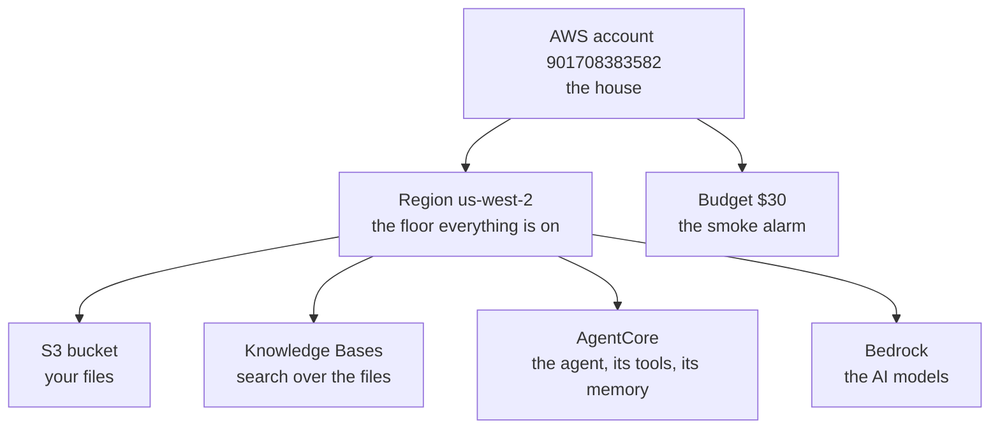
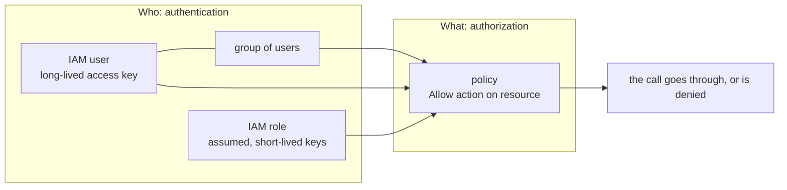
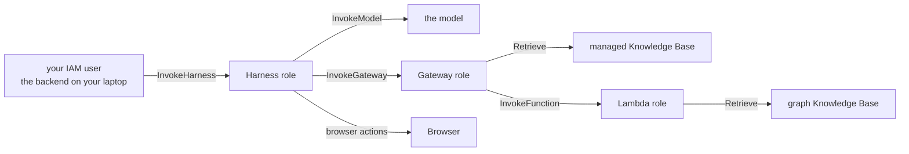
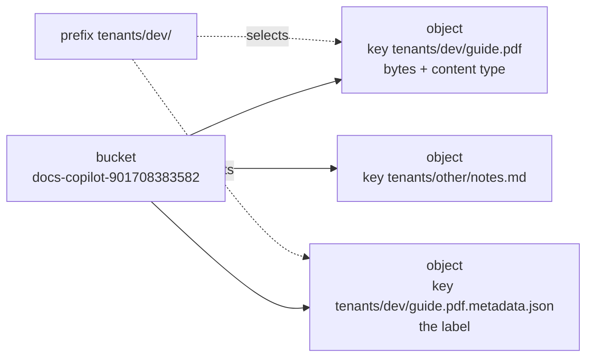
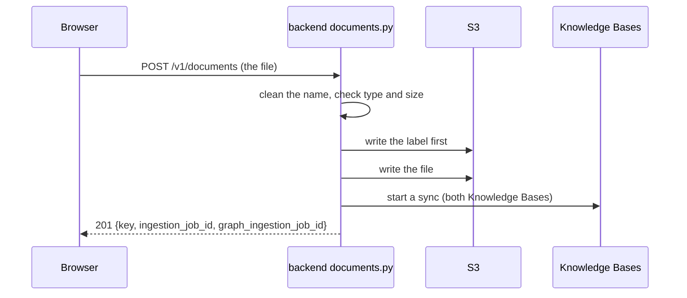

# Part C: AWS from zero

**The story so far.** You can run programs from a terminal, save your work with git, and you know how the page talks to our Python server with requests, responses and streams. Everything so far runs on your laptop. The smart parts of this app (the AI models, the document search, the agent) run somewhere else: on AWS. This part explains what that "somewhere else" is before any AI shows up.

**In this part:**

- **Lesson 8, what AWS is:** renting computers and services, and the account, region and budget that wrap them.
- **Lesson 9, identities and permissions:** who is allowed to do what, and how to read the errors when they are not.
- **Lesson 10, S3:** where an uploaded file lives, and the label that travels with it.

## 8. What AWS is: account, region, budget

**Where we are.** Part B ended with a page and a Python server talking to each other on your laptop. That server does little thinking on its own. It passes the real work to computers Amazon runs. This lesson is about those computers.

### The problem

This app needs AI models, a search engine over your documents, somewhere to keep files, and an agent that remembers past chats. You could buy servers for all of that, put them in a closet, install everything, keep them cooled and patched, and replace a disk when one dies. That is a lot of work before you write a single useful line.

Think of electricity. You do not build a power plant to switch on a lamp. You plug into the grid and pay for what you use. Cloud computing is the same deal for computers: plug in, use, get a bill.

### The idea from zero

Amazon Web Services (AWS) rents out computers, storage, and ready-made services, billed by the hour or by the request. Instead of owning a server, you borrow what you need, when you need it.

```
your laptop                        AWS (Amazon's data centers)
  code you write   ---calls--->      AI models, an agent runner, file storage,
                                     a search engine over your documents...
                                     a bill at the end of the month
```

Everything this project uses on AWS is a **managed service**: AWS runs it, you configure it. You never see a server. That is why the whole app is about 1,600 lines of our own code, tests aside: the heavy parts are configuration.

Three words you need before anything else:

- **Account:** your space in AWS. Everything we made lives in one account, number `901708383582`. Bills, users and resources all belong to an account.
- **Region:** a group of data centers in one part of the world. Most things live in one region and are invisible from the others. Ours is **us-west-2, Oregon**, because the AI services we need are all there. The console only shows the region selected at the top right, so check it before creating anything. (It happened once: the console opened in Ohio and a resource "went missing".)
- **Budget:** an email alarm when the month's bill crosses a line. It does not stop anything. Ours is $30 a month, with emails at 50% and 80%.



### The whole field

"Using the cloud" is not one thing. There are five levels, depending on how much of the stack you hand over. Then there are several clouds, several ways to pay, and several ways to create things.

**How much you hand over**

| Approach | How it works | Good for | Limits | Typical tools |
|---|---|---|---|---|
| On-premises | you own the machines, in your own building | strict data rules, steady heavy load, existing hardware | buy ahead, run everything yourself, slow to grow | your own racks, VMware |
| IaaS (infrastructure as a service) | rent virtual machines, disks, networks; you run the operating system and up | full control without owning hardware | you still patch, scale and monitor servers | AWS EC2, Azure Virtual Machines, Google Compute Engine |
| PaaS (platform as a service) | hand over your code or container; the platform runs servers for you | web apps and APIs without server chores | less control, the platform's rules | AWS Elastic Beanstalk, Azure App Service, Google App Engine, Heroku, Render |
| Serverless | no server at all from your side; code or a service runs per request, bills per request | spiky or small traffic, glue code, managed AI services | cold starts, time limits, harder local testing | AWS Lambda, Azure Functions, Google Cloud Run, Bedrock |
| SaaS (software as a service) | a finished product you log into | email, docs, CRM: things that are not your product | you configure, you do not build | Gmail, Slack, Salesforce |

**On-premises.** The oldest way. You buy the hardware, so you pay up front and guess future load. Banks, hospitals and governments still keep some systems here for legal or cost reasons.

**IaaS.** A virtual machine is a slice of a big physical server that behaves like a whole computer. You get it in minutes instead of weeks, but everything above the hardware is still your job.

**PaaS.** You stop thinking about machines. You give the platform your app, and it keeps it running and restarts it when it crashes. Most small companies start here.

**Serverless.** You stop thinking about running anything. Either you upload a function (AWS runs it per call and bills per call), or you call a fully managed service over the network. "Serverless" does not mean no servers exist. It means none are yours to manage.

**SaaS.** Not for building your product, but every team uses it around the product.

Most companies mix these: a SaaS email tool, PaaS or containers for the main app, serverless functions for glue, and a few virtual machines for odd jobs.

**Which cloud**

| Cloud | Known for | Same idea, their name |
|---|---|---|
| AWS | the largest catalog of services, the oldest big cloud | account, region, Availability Zone |
| Microsoft Azure | fits companies already on Microsoft (Windows, Office, Active Directory) | subscription, region, availability zone |
| Google Cloud | data and AI tooling, Kubernetes (Google created it) | project, region, zone |

The core ideas carry over almost one to one. Learn them once on AWS and the other two feel familiar. Many companies pick one cloud as their home and use a second for one specific service.

**Regions and availability zones.** A region is a geographic area (Oregon, Frankfurt, Tokyo). Inside a region, an **Availability Zone** (AZ) is one or more data centers with their own power and network, a few kilometers from the others. Most AWS regions have three or more. A production app runs copies in two or three zones, so a fire or power cut in one building does not take it down. A disaster plan copies data to a second region. Pick a region by: which services exist there (our reason), distance to users (speed), and where the law says data may live.

**Ways to pay**

| Billing style | How it works | Good for | Watch out for |
|---|---|---|---|
| Per request | pay per call, per token, per GB stored | managed services, spiky traffic | cost grows with use; a loop can run up a bill |
| Per hour (on-demand) | pay for every hour a resource exists and runs | servers, databases, anything always on | bills while idle |
| Reserved / savings plans | promise one or three years of use for a big discount | steady load you know you will have | you pay even if you stop using it |
| Spot | spare capacity at a deep discount, taken back at short notice | batch jobs that can restart | can vanish mid-job |
| Free tier and credits | free usage limits, or a dollar amount of credits | learning, trying things | runs out; credits expire |

A **budget** is an alarm, not a cap. AWS does not stop services when a budget is crossed, unless you set up an automatic action yourself. Teams also tag resources (for example `project=docs-copilot`) so the bill can be split by project.

**Ways to create resources**

| Approach | How it works | Good for | Limits | Typical tools |
|---|---|---|---|---|
| Console clicks | the web page, forms and buttons | learning, exploring, one-off setup | nothing records what you clicked; hard to repeat | AWS console, Azure portal, Google Cloud console |
| CLI and scripts | type commands, or put them in a script | quick checks, small automation | scripts do not know what already exists | `aws`, `az`, `gcloud` |
| Cloud-native infrastructure as code | describe resources in a file; the cloud creates, updates and deletes to match | teams on one cloud | tied to that cloud | AWS CloudFormation, AWS CDK, Azure Bicep |
| Cross-cloud infrastructure as code | the same idea, one tool and language for many clouds and SaaS products | most industry teams | another tool to learn; state file to guard | Terraform, OpenTofu, Pulumi |

**Console clicks.** Where everyone starts, and what this project did. Easy to learn, impossible to review.

**CLI.** The same actions as the console, typed. Good for checks like the `aws sts get-caller-identity` below.

**CloudFormation and CDK.** CloudFormation reads a YAML or JSON template and builds a **stack** of resources. CDK lets you write that template in a programming language (Python, TypeScript) and turns it into CloudFormation.

**Terraform.** You write what should exist. `terraform plan` shows what will change, `terraform apply` makes it so. It remembers what it made in a state file.

**Why teams move to infrastructure as code (IaC).** The file is reviewed in a pull request like any code. It lives in git, so you see who changed what and when. You can build a second identical copy (staging, another region) in one command. You can delete everything cleanly. And nobody has to remember "which checkbox did we tick in March".

### Our choice, and why

| Question | Our answer | Why | At larger scale |
|---|---|---|---|
| How much to hand over | serverless and managed services only; our server runs on the laptop | no servers to run, pay per use, the heavy parts become configuration | the backend would move to containers (PaaS style) |
| Which cloud | AWS | the AI services we want (Bedrock, Knowledge Bases, AgentCore) are AWS services | same |
| Which region | us-west-2 | Bedrock's reranker and AgentCore are both there (README, locked decisions) | a second region for disaster recovery |
| How to pay | credits, mostly per request | about $200 of credits; one per-hour item (Neptune) is stopped when idle | reserved capacity for steady load |
| How resources are made | console clicks | learning first; the README plans Terraform after the reverse-learning pass | Terraform or CDK, reviewed in pull requests |

**Money.** This account has about $200 of credits and no free service hours (accounts made after mid-2025 get credits instead). Everything bills per request except one thing, the Neptune graph, which bills per hour whether used or not ($0.48 an hour running, lesson 15, Part D). As of 2026-09-13, $8.95 has been used, all from credits.

### In our project

`backend/.env` names the region and every AWS resource the server talks to, by id. `backend/.env.example` is the same list with a comment per line saying where each id comes from in the console. `backend/app/settings.py` reads them: `aws_region` defaults to `us-west-2`, and the bucket, both Knowledge Bases, the Harness and the Memory ids are required, so the server refuses to start without them.

| Setting | Value on main | What it points at |
|---|---|---|
| `AWS_PROFILE` | `docs-copilot-dev` | which saved credentials on the laptop to use (lesson 9) |
| `AWS_REGION` | `us-west-2` | Oregon |
| `S3_BUCKET` | `docs-copilot-901708383582` | where uploads go (lesson 10) |
| `KB_ID`, `KB_DATA_SOURCE_ID` | `0JTWTJABTV`, `PRRFGHTJBS` | the managed Knowledge Base (lesson 14, Part D) |
| `GRAPH_KB_ID`, `GRAPH_DATA_SOURCE_ID` | `3AD25HSRSD`, `6B3TDMPBRL` | the graph Knowledge Base (lesson 15, Part D) |
| `HARNESS_ARN`, `MEMORY_ID` | `...harness/docs_copilot_assistant-bwVinula0L`, `docs_copilot_assistant-6aIbceHbw1` | the agent and its memory (lessons 17 and 20, Part E) |

> **On the login branch:** the same account and region also hold a Cognito user pool for sign-in and an AgentCore Runtime hosting our own agent in place of the Harness (lessons 31 and 32, Part H).

**Try it**

```
aws sts get-caller-identity --profile docs-copilot-dev
```

```
{
    "UserId": "AIDA5D4QCAVPHCESEVLVM",
    "Account": "901708383582",
    "Arn": "arn:aws:iam::901708383582:user/yashubitra"
}
```

That is your account number and `user/yashubitra`: the identity behind every command you run (next lesson). Then in the console: **Billing and Cost Management**, **Budgets**: the $30 budget and what has been used.

### Check yourself

1. What is a region, and which one do we use?
   <details><summary>Answer</summary> A group of AWS data centers in one area; most resources exist in only one region. We use us-west-2 (Oregon) because Bedrock's reranker and AgentCore are both there. </details>
2. Does the budget stop spending at $30?
   <details><summary>Answer</summary> No. It sends emails at 50% and 80% of $30. It is a smoke alarm, not a fuse. </details>
3. Which part of this project bills by the hour?
   <details><summary>Answer</summary> The Neptune Analytics graph behind the graph Knowledge Base. It bills while it runs even if nobody asks a question, so it is stopped when idle. Everything else bills per request. </details>
4. Your team clicked a database together in the console last year. Nobody remembers the settings. What would have prevented this?
   <details><summary>Answer</summary> Infrastructure as code (Terraform, CloudFormation or CDK): the settings would live in a reviewed file in git, and the database could be rebuilt from it. </details>
5. What is the difference between serverless and PaaS?
   <details><summary>Answer</summary> With PaaS you hand over an app that runs continuously and the platform keeps it up. With serverless, code or a managed service runs per request and you pay per request, with nothing running in between. </details>

## 9. Identities and permissions

**Where we are.** Lesson 8 showed that AWS is a big rented building of services, and that every command you run shows up as `user/yashubitra`. This lesson is about that name: who you are to AWS, and what you are allowed to do.

### The problem

Many hands touch one AWS account. You type commands from your laptop. The backend calls S3. The agent calls a model. The Gateway calls a Lambda. Each of those calls could delete files or run up a bill. AWS needs to know, for every single call, who is asking and whether they are allowed.

Think of an office building. At the door, the guard checks your badge: are you really Yash? Upstairs, each door checks whether your badge opens it: may Yash enter the server room? Two different questions, asked every time.

### The idea from zero

This is the single most useful thing to understand about AWS:

> **Every call is made by some identity, and that identity needs permission for exactly that call.**

Almost every AWS error you will ever see is an identity missing one permission.

**Authentication vs authorization.** Authentication answers *who are you?* (a password, a key, a token proves it). Authorization answers *what may you do?* (a policy decides). They are separate steps: you can be perfectly authenticated and still denied. People shorten them to "authn" and "authz". This lesson is about how AWS does both for people and services inside one account. How a website logs in its own users (passwords, tokens, Cognito) is its own story, told in lesson 31 (Part H).

The words, in order:

- **Root user:** the email and password the account was created with. The owner's master key. It can do everything, and no policy can limit it. Used only for owner tasks (turning on MFA, setting the budget, making the first user), then left alone. If root leaks, someone owns the account.
- **IAM user:** an identity for a person or a program, with its own long-lived credentials. Ours is `yashubitra`. Your laptop uses it through an **access key** (a key id and a secret key: a username and password for programs) stored under the profile name `docs-copilot-dev`. IAM means Identity and Access Management: the part of AWS that decides who may do what.
- **IAM group:** a named set of users that share policies, like "developers". Attach a policy to the group once instead of to each user. This project has one user, so no groups.
- **IAM role:** an identity with no password and no permanent key. Someone or something "puts it on" (assumes it) and gets short-lived credentials automatically. Every AWS service in our app acts as its own role: the Harness has one, the Gateway has one, each Knowledge Base has one, the Lambda has one.
- **Policy:** a JSON document listing allowed (or denied) actions on resources, attached to a user, group or role. AWS **denies everything that no policy allows.**
- **ARN:** Amazon Resource Name, the full address of one thing, like `arn:aws:iam::901708383582:user/yashubitra`. Policies name resources by ARN.

Think of the account as a building. Root is the owner. Your IAM user is your key card. A group is a department whose cards open the same doors. A role is a uniform a service wears to get through certain doors, handed out at the door and taken back at the end of the shift. A policy is the list of doors a card or uniform opens.



### The whole field

**Kinds of credentials**

| Approach | How it works | Good for | Limits | Typical tools |
|---|---|---|---|---|
| Root login | the account owner's email and password | a handful of owner-only tasks | unlimited power; never for daily work | MFA on root, then lock it away |
| Long-lived access keys | a key id and secret saved in a file on a laptop or server, valid until deleted | quick local development, old scripts | if copied, it works for anyone, forever, until someone notices | `aws configure`, `~/.aws/credentials` |
| Temporary credentials from a role | ask AWS STS (Security Token Service) to assume a role; get keys that expire (often after an hour) | services, CI pipelines, cross-account access | needs a trust policy set up | IAM roles, `sts:AssumeRole`, Lambda and container roles |
| Single sign-on (SSO) | people log in once through a company login page and receive temporary credentials per account | companies with many people and many accounts | more setup up front | AWS IAM Identity Center, `aws configure sso`, Okta, Microsoft Entra ID, Google Workspace |
| Federation for machines | a CI system or another cloud proves who it is with its own signed token and trades it for temporary AWS credentials | GitHub Actions deploying to AWS without stored keys | per-provider setup | IAM OIDC identity providers |

**Root login.** Every account has one. Industry practice: turn on MFA, remove any root access keys, use it almost never.

**Long-lived access keys.** The simplest way to give a program AWS access, and the most common way accounts get breached: a key pasted into code, pushed to GitHub, found by a scanner within minutes. Still fine for one person learning on a sandbox, if the key never leaves the laptop.

**Temporary credentials.** The industry default for anything that is not a human at a keyboard. A Lambda, a container or a CI job wears a role, and AWS hands it keys that expire. A leak is worth little because the keys die soon.

**IAM Identity Center (SSO).** Instead of an IAM user per person per account, a company keeps people in one directory. You log in in the browser, pick an account and a permission set, and your terminal gets temporary keys. This is what most teams with more than a few people use today.

**Federation for machines.** The same trick for robots: GitHub Actions can prove "I am this repository's workflow" and receive a role's temporary keys, so no secret is stored in GitHub.

**Least privilege.** Whatever the credential, the rule is the same: give each identity only the actions and resources it needs, nothing more. Start narrow, add one permission when an error names it. The opposite, broad admin rights everywhere, is faster to set up and much worse when something leaks. Teams check it with tools like IAM Access Analyzer, which suggests policies from what an identity actually used.

**The same ideas in other clouds**

| Idea | AWS | Microsoft Azure | Google Cloud |
|---|---|---|---|
| directory of people | IAM users, or IAM Identity Center | Microsoft Entra ID users | Google accounts, Cloud Identity |
| group of people | IAM group | Entra ID group | Google group |
| identity for a service | IAM role | managed identity, service principal | service account |
| bundle of permissions | policy | role definition (built-in or custom) | role (predefined or custom) |
| giving permissions to someone | attach a policy to a user, group or role | role assignment at a scope (subscription, resource group, resource) | allow policy binding a principal to a role on a resource |
| single sign-on | IAM Identity Center | Entra ID | Cloud Identity, Workforce Identity Federation |

A trap when switching clouds: the word **role** means different things. In AWS a role is an *identity* you assume. In Azure and Google Cloud a role is a *bundle of permissions* you grant to an identity.

### Our choice, and why

| Question | Our answer | Why | At larger scale |
|---|---|---|---|
| How you log in from the laptop | an IAM user with a long-lived access key, profile `docs-copilot-dev` | one person, one sandbox account, simplest setup | IAM Identity Center with `aws configure sso`, so laptops hold only temporary keys |
| How the services log in | each service wears its own role, temporary credentials | AWS sets this up when a service is created in the console | same |
| How much the dev user may do | `AdministratorAccess`: everything | three permission walls in a row cost more than least privilege was buying | least-privilege policies per person, kept in `infra/iam/` |
| How much the services may do | only what each needs, one line added by hand where needed | each role is the real security boundary | same, written in infrastructure as code |
| Where the running backend gets credentials | the laptop profile | nothing is deployed | a container on AWS gets its role's credentials; `aws_profile` left empty (see `settings.py`) |

**A shortcut we took, honestly.** Three permission walls in a row while setting up the Knowledge Base cost more than least privilege was buying on a one-person sandbox account. So the dev user has `AdministratorAccess`: everything. What that trades away: a leaked laptop key is now the whole account, not just a model bill. If the key ever leaks, delete it in IAM at once and make a new one. The budget alarm remains the safety net. The least-privilege policies this project would use on a shared account are kept in `infra/iam/` as documentation. Each was attached and verified before the switch.

The shortcut removes walls for **you**. It does not remove them for the **services**: each role still has exactly the doors it needs. When adding the graph tool, the Gateway failed with "execution role lacks permission to invoke Lambda function". Same diagnosis, different identity: fix the Gateway's role, not yours.

### In our project

**Reading a permission error.** Every denial names the identity, the missing action and the resource:

```
User: ...user/yashubitra is not authorized to perform: iam:CreatePolicy
on resource: policy AmazonBedrockCloudWatchPolicyForKnowledgeBase_mq0oz
```

That line is the whole diagnosis: add `iam:CreatePolicy` on policies named like that. Nothing more.

**Every identity in this project**

| Identity | Kind | Made by | May do |
|---|---|---|---|
| `yashubitra` (profile `docs-copilot-dev`) | IAM user | you | everything (`AdministratorAccess`). The backend calls S3, the Knowledge Base, the Harness and Memory as this user |
| Harness role `AmazonBedrockAgentCoreHarnessDefaultServiceRole-yhy2p` | role | the console when the harness was created | call Bedrock models; call our Gateway; read and write its memory; use the browser |
| Gateway role `AmazonBedrockAgentCoreGatewayDefaultServiceRole1789098437928` | role | the console when the gateway was created | search the managed Knowledge Base; plus one line we added: invoke the graph search Lambda |
| Knowledge Base role `..._x6ipa` | role | the console | read the bucket, run its models, write its index |
| Graph Knowledge Base role `..._vbrt3` | role | the console | read the bucket, call the embedding and graph models, write the Neptune graph |
| Lambda role `docs-copilot-graph-search-role-xucr5hec` | role | the Lambda console | write its own logs; plus one line we added: search the graph Knowledge Base |

Every role has two policies that answer two different questions: the **trust policy** says *who may wear this uniform* (for example "the Lambda service may"); the **permission policy** says *what the wearer may do*. When a service fails with "lacks permission", the fix is almost always the permission policy of **that service's** role.



> **On the login branch:** the Harness role is replaced by the role of the AgentCore Runtime our own agent runs on, and the signed-in person's Cognito token (not an IAM identity) is what the agent and the Gateway check on every call (lesson 33, Part H).

**The files.** `infra/iam/README.md` records the `AdministratorAccess` decision (2026-09-10) and lists the least-privilege shape that came before it:

| Policy | Allows |
|---|---|
| `bedrock-dev` (made in the console) | invoke Bedrock models, list them, read the budget |
| `infra/iam/kb-dev.json` | Retrieve from Knowledge Bases, start and read syncs, read and write objects in the one bucket, read that bucket's settings |
| AWS managed `BedrockAgentCoreFullAccess` | everything in AgentCore |
| AWS managed `AmazonBedrockFullAccess` | everything in Bedrock, including creating Knowledge Bases |
| `infra/iam/dev-user-agentcore-setup.json` | create IAM roles named `AgentCore*`, run CloudFormation stacks named `AgentCore-*`, read CloudWatch logs |

Look at one statement in `kb-dev.json` and you see least privilege in practice: `s3:PutObject`, `s3:GetObject`, `s3:DeleteObject`, and only on `arn:aws:s3:::docs-copilot-901708383582/*`, the objects in our one bucket.

The two one-line policies we wrote by hand on service roles are the whole lesson in miniature: one action, one resource, on the role of the service that makes the call.

```
on the Lambda's role, policy graph-kb-retrieve:
    Allow  bedrock:Retrieve  on  knowledge-base/3AD25HSRSD

on the Gateway's role, policy InvokeGraphSearchLambda:
    Allow  lambda:InvokeFunction  on  function:docs-copilot-graph-search
```

**Try it**

Console: **IAM**, **Roles**. Open `docs-copilot-graph-search-role-xucr5hec`. Under **Permissions** find `graph-kb-retrieve` and read it: one action, one resource. Open the **Trust relationships** tab: the service allowed to wear this role. Then open the Gateway role and find `InvokeGraphSearchLambda`.

Then **CloudTrail**, **Event history**: every call made in the account, who made it, and when. Filter by event name `StartGraph` to see every time the graph was started, and by whom.

### Under the hood

What AWS does with every call: the AWS CLI or boto3 signs each request with your secret key (a scheme called Signature Version 4). The secret itself is never sent. AWS recomputes the signature: if it matches, you are authenticated. Then it collects every policy that applies to that identity and resource, and decides in a fixed order:

```
1. any policy says Deny for this action?        -> denied (an explicit deny always wins)
2. otherwise, any policy says Allow?            -> allowed
3. otherwise                                    -> denied (the default)
```

A role adds one step before all this. The service calls STS `AssumeRole`; STS checks the role's trust policy ("may this service wear me?") and hands back a key id, a secret and a session token that expire. From then on the service signs its calls with those, exactly like you do with yours.

### Check yourself

1. What is the difference between a user and a role?
   <details><summary>Answer</summary> A user is a fixed identity with long-lived credentials, usually for a person. A role has no password or permanent key: a service or person assumes it and gets temporary credentials that expire. </details>
2. What happens to a call that no policy allows?
   <details><summary>Answer</summary> It is denied. AWS denies by default, and an explicit Deny beats any Allow. </details>
3. The graph search fails with "access denied". Which two roles do you check?
   <details><summary>Answer</summary> The Gateway's role (may it invoke the Lambda?) and the Lambda's role (may it call Retrieve on the graph Knowledge Base?). Not your own user: you are not the one making those calls. </details>
4. What did `AdministratorAccess` on the dev user trade away?
   <details><summary>Answer</summary> Least privilege for you. A leaked laptop key now controls the whole account, not just model calls. The fix if it leaks: delete the key in IAM at once. </details>
5. Why do companies prefer IAM Identity Center over one IAM user with an access key per person?
   <details><summary>Answer</summary> People log in once through a central directory and get temporary credentials, so no long-lived key sits on laptops, and removing someone from the directory removes their access everywhere. </details>

## 10. S3: where your file lives

**Where we are.** Lesson 9 showed that every call is an identity asking permission. The first thing those identities touch when you upload a document is a storage bucket. This lesson is about where a file goes, and why AWS has so many different places to put data.

### The problem

When you upload a handbook, it has to land somewhere that stays safe after your laptop closes. The search service (the Knowledge Base, lesson 14, Part D) has to be able to read it. And the app has to be able to list "your files" for the sidebar.

Think of a coat check. You hand over a coat, you get a ticket with a number. You do not care which rack it hangs on. You only need the ticket to get it back. Object storage works like that: you hand over a file, name it with a key, and fetch it back by that key.

### The idea from zero

S3 (Simple Storage Service) is AWS's object storage. A **bucket** is a named container; files inside it are **objects**, each stored under a **key** that looks like a path. There are no real folders: the slashes in a key are just characters, and "list the folder `tenants/dev/`" is really "list keys starting with `tenants/dev/`". That starting part is called a **prefix**.

```
bucket: docs-copilot-901708383582
  key:  tenants/dev/Secure_Transfers_User_Guide_-_Final-1.pdf                 the file
  key:  tenants/dev/Secure_Transfers_User_Guide_-_Final-1.pdf.metadata.json   its label
        \__________/\_____________________________________/
           prefix         the rest of the key
```

You cannot open an object and change one line in the middle. You write a whole object, read a whole object (or a byte range), or delete it. That limit is what lets S3 store almost unlimited data cheaply.



### The whole field

Data lives in four families of storage. They differ in what you get back: raw disk space, a folder tree, whole files by name, or answers to questions.

| Approach | How it works | Good for | Limits | Typical tools |
|---|---|---|---|---|
| Block storage | a virtual hard disk attached to one machine; the operating system formats it | a server's system disk, a database's own files | usually one machine at a time; you manage the file system | AWS EBS, Azure Managed Disks, Google Persistent Disk |
| File storage | a shared network drive with real folders, mounted by many machines | old apps that expect a folder path, shared home directories | pricier per GB; slower than a local disk | AWS EFS and FSx, Azure Files, Google Filestore |
| Object storage | whole files under keys in a bucket, over HTTP | uploads, images, backups, logs, data lakes, AI training data | no editing in place; no real folders; not a database | AWS S3, Azure Blob Storage, Google Cloud Storage, Cloudflare R2, MinIO |
| SQL database | tables with rows and columns, queried with SQL, strict structure, transactions | users, orders, money: anything with relationships and rules | scaling writes past one big machine takes work | PostgreSQL, MySQL, AWS RDS and Aurora, Azure SQL Database, Google Cloud SQL |
| NoSQL database | items looked up by key, or documents of flexible JSON, spread over many machines | huge scale with simple access patterns, sessions, carts | joins and ad-hoc queries are hard | AWS DynamoDB, MongoDB, Azure Cosmos DB, Google Firestore, Redis |
| Vector database | stores embeddings and finds the nearest ones to a question's | semantic search, RAG | approximate results; needs an embedding model | pgvector (PostgreSQL), OpenSearch, Pinecone, Azure AI Search, Google Vertex AI Vector Search |

**Block storage.** Like the disk inside your laptop, but virtual. Fast, and the machine sees it as its own drive. When a server dies, its disk can be attached to a new one.

**File storage.** Like a shared drive at an office. Many machines see the same folders at once. Useful when software insists on a file path.

**Object storage.** The default place for files in the cloud. Cheap, very durable (S3 is designed for 99.999999999% durability), reachable from anywhere with permission, and it scales without planning. Almost every app keeps user uploads here and stores only the key in a database.

**SQL databases.** The industry's workhorse for structured data. When in doubt, teams start with PostgreSQL.

**NoSQL databases.** Chosen when the data is huge and the questions are simple and known in advance ("get cart by user id").

**Vector databases.** The newest family, and the one RAG needs. Lessons 12 and 13 (Part D) build them from zero. Our Knowledge Base manages one for us.

A typical app uses several at once: object storage for files, a SQL database for users and records, and a vector index for search.

**S3 words you will meet**

| Concept | What it is | In our project |
|---|---|---|
| bucket | a container with a name unique across all of AWS, living in one region | `docs-copilot-901708383582`, in us-west-2 |
| key | the object's full name inside the bucket | `tenants/dev/<file name>` |
| prefix | the start of a key, used like a folder | `tenants/dev/` |
| object metadata | small name-value pairs stored with an object: system ones like `Content-Type`, and your own `x-amz-meta-*` headers | we set `ContentType` on both writes |
| versioning | keep every old version when an object is overwritten or deleted, so mistakes can be undone | never enabled on our bucket (checked 2026-09-15) |
| presigned URL | a link signed with someone's credentials that lets whoever holds it GET or PUT one object until it expires | not used: uploads go through our backend |
| Block Public Access | a switch that overrides any setting that would make objects public | all four settings on |
| storage class and lifecycle rules | cheaper tiers for rarely read data, and rules that move or delete objects by age | not used: 15 MB is not worth it |
| encryption at rest | new objects are encrypted by default | on by default |

Note the difference between S3's own **object metadata** and our **label file**. Object metadata is stored inside the object's headers. Our label is a separate small object whose key ends in `.metadata.json`, because that is the format the Knowledge Base reads.

**Presigned URLs, in one picture.** At scale, apps rarely pipe big uploads through their own server. The server checks the user, asks S3 for a presigned PUT URL for one key, and the browser uploads straight to S3:

```
browser --"I want to upload guide.pdf"--> backend --signs--> presigned URL (expires soon)
browser --PUT the bytes, using that URL--> S3
```

The server never carries the bytes, and the URL only works for that one key, for a short time.

**The same ideas in other clouds**

| AWS S3 | Azure Blob Storage | Google Cloud Storage |
|---|---|---|
| bucket | storage account, then container | bucket |
| object | blob | object |
| presigned URL | shared access signature (SAS) | signed URL |
| versioning | blob versioning | object versioning |
| storage classes | access tiers (hot, cool, cold, archive) | storage classes (Standard, Nearline, Coldline, Archive) |

### Our choice, and why

| Question | Our answer | Why | At larger scale |
|---|---|---|---|
| Which storage family | object storage, S3 | a Knowledge Base reads *from* S3; it does not accept uploads directly | same |
| Where it lives | us-west-2 | it must match the Knowledge Bases' region | same |
| Who can read | private; Block Public Access on | only identities whose policies allow it: your IAM user and the two Knowledge Bases' roles | same, plus per-user rules |
| How bytes get there | browser to our backend, backend streams to S3 | one small server, files up to 50 MB, simplest to test | presigned URLs straight from the browser |
| Versioning, lifecycle | off | one user, rebuildable data | versioning on, lifecycle rules for old files |
| Keeping users apart | a `tenant_id` label on every file, no filter applied | one user; the label keeps the door open | a filter on every search, tied to a verified login |

**Why keep files here at all:** the bucket is the source of truth. Both search indexes can be rebuilt from it at any time. **Cost:** about $0.023 per GB per month for standard storage. Our bucket holds 15 MB.

### In our project

**The label file.** Next to each uploaded file goes a tiny JSON:

```
{"metadataAttributes": {"tenant_id": "dev"}}
```

The Knowledge Base copies these labels onto every chunk of that file. A search *could* then be limited to one label, which is how a multi-user app keeps users' documents apart. This app has one user and applies no filter, but writes the label anyway so the door exists. The tenant id itself comes from an `X-Tenant-Id: dev` header the Next.js proxy always sends, checked by `backend/app/tenancy.py`.

> **On the login branch:** files go under `users/<user id>/` instead of `tenants/dev/`, the label's key is the uploader's user id (`{"<user id>": "owner"}`), and every search the agent makes filters on it (lessons 33 and 34, Part H).



**Three checks before anything is written**

| Check | Rule | If it fails |
|---|---|---|
| the name | keep only the file's own name, in safe characters: `../../etc/x.md` becomes `x.md`, spaces become `_` | cleans it; only a name left empty after cleaning fails (422) |
| the type | pdf, md, txt, html, docx or csv (what the Knowledge Base can parse) | 415 |
| the size | at most 50 MB (the Knowledge Base's own limit) | 413 |

**Why the label is written before the file.** If the second write fails, what is left is a label with no file: harmless. The other order could leave a file with no label.

**Two small limits, marked in the code.** A Knowledge Base runs one sync at a time. If one is already running, the upload is kept and the job id comes back as `null`: the next sync picks the file up. And the file list reads one page from S3, so the first 1,000 objects. Both carry a `# ponytail:` comment naming the upgrade.

**The files.** `backend/app/documents.py`: `safe_filename` (the cleaning), `upload` (the checks, the two writes with `put_object` and `upload_fileobj`, the sync start), `list_documents` (the sidebar's file list: a `list_objects_v2` prefix search, hiding the label files). `backend/app/aws.py` builds the one shared S3 client. `backend/app/settings.py` reads the bucket name from `S3_BUCKET`.

**Try it**

Console: **S3**, bucket `docs-copilot-901708383582`, `tenants/`, `dev/`. Select the `.metadata.json` file, **Open**: the label. Open the bucket's **Permissions** tab: Block public access is on. Or from the terminal:

```
aws s3 ls s3://docs-copilot-901708383582 --recursive --human-readable --profile docs-copilot-dev
```

```
2026-09-11 12:14:34   15.2 MiB tenants/dev/Secure_Transfers_User_Guide_-_Final-1.pdf
2026-09-11 12:14:34   44 Bytes tenants/dev/Secure_Transfers_User_Guide_-_Final-1.pdf.metadata.json
```

Check versioning yourself. An empty answer means it was never turned on:

```
aws s3api get-bucket-versioning --bucket docs-copilot-901708383582 --profile docs-copilot-dev
```

### Check yourself

1. Why is the label written before the file?
   <details><summary>Answer</summary> If the second write fails, a label with no file is harmless. The other order could leave a file with no label, which the Knowledge Base would index with no owner. </details>
2. What happens if you upload a `.exe`? Is S3 touched?
   <details><summary>Answer</summary> The backend answers 415 (unsupported type) before any write. S3 is never called. </details>
3. Why does the app write a tenant label it never filters on?
   <details><summary>Answer</summary> So the door exists: when there are many users, a filter on that label keeps their documents apart, and every file already carries it. </details>
4. A database needs a fast disk attached to its server. Block, file or object storage?
   <details><summary>Answer</summary> Block storage (for example EBS). Object storage has no editing in place, and file storage is a slower shared network drive. </details>
5. What is a presigned URL, and why would a larger version of this app use one?
   <details><summary>Answer</summary> A link, signed with the server's credentials, that lets the holder upload or download one object until it expires. The browser could then upload straight to S3, so big files never pass through our server. </details>

**Next:** Part D, AI from zero, because the file is now safely in S3 and the next question is how a model can read and search it.
