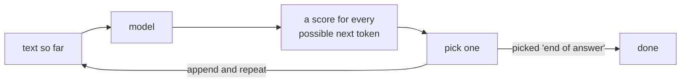
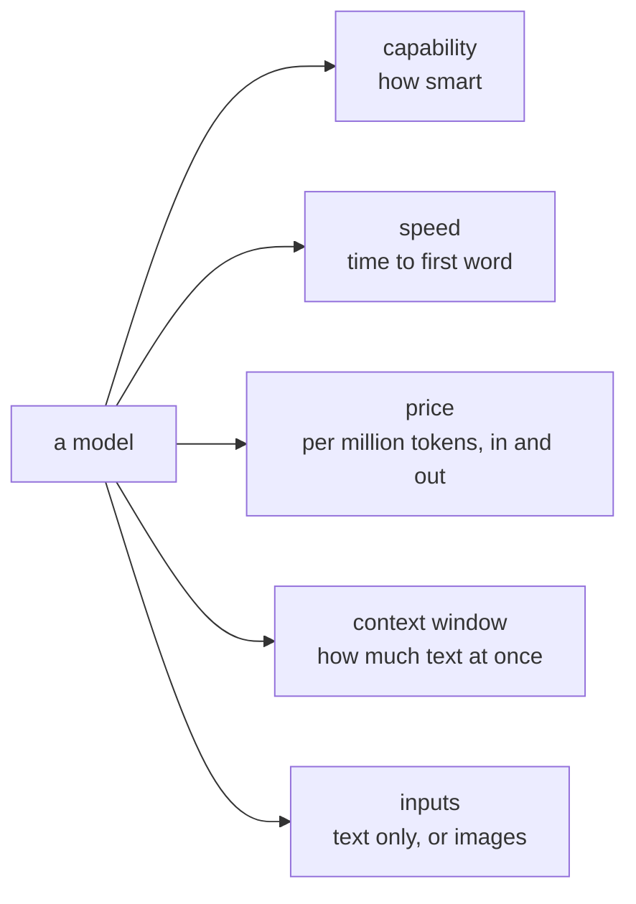
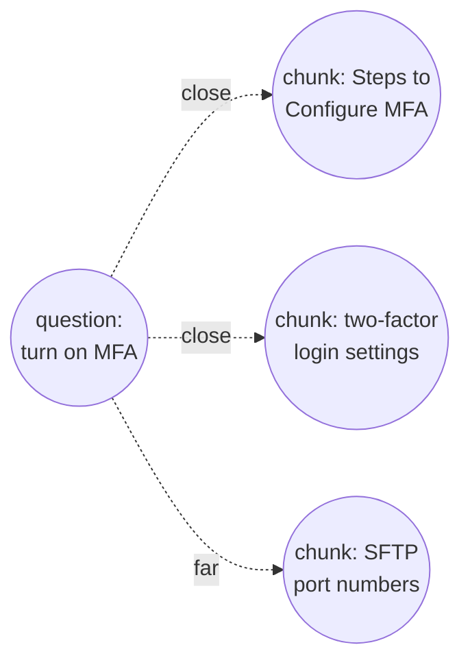
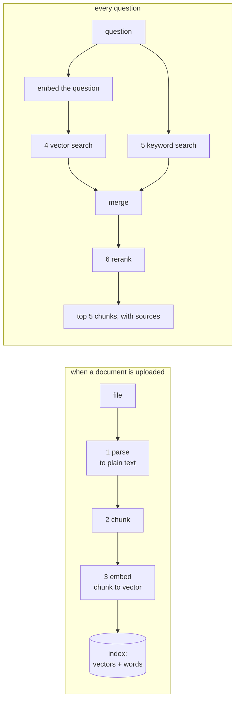
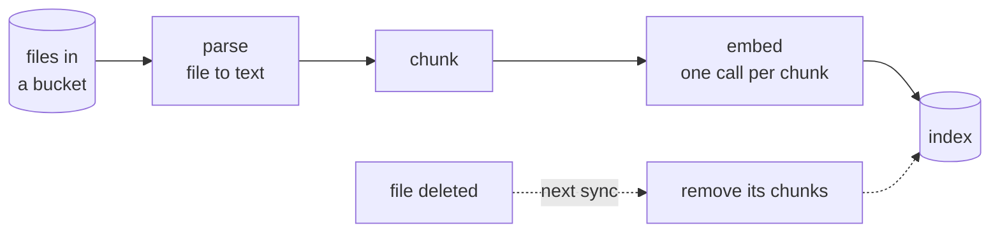
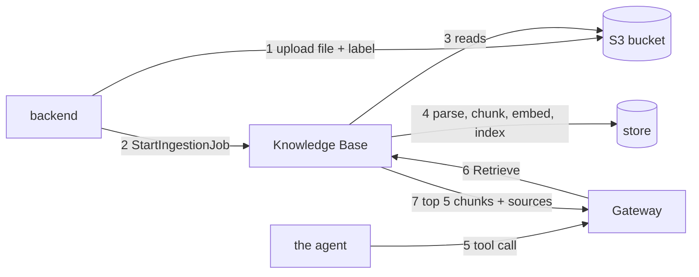
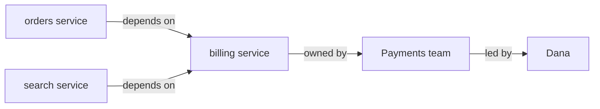

# Part D: AI from zero

**The story so far.** You can type commands, you know how a web page talks to a server, and you know the AWS basics: an account, identities and permissions, and S3, where your uploaded file now sits with its `tenant_id: dev` label. The file is stored, but nothing can answer a question from it yet. This part is the AI: what a model is, how text becomes numbers, how search finds the right pages, how AWS keeps the index up to date, and what a knowledge graph adds.

**In this part:**

- **11. Models and tokens:** what a language model does, where you get one, and how you pay for it.
- **12. Embeddings:** turning meaning into numbers, and the databases that search them.
- **13. RAG:** every kind of retrieval-augmented generation, from the simplest to the most advanced, and the one we built.
- **14. The Knowledge Base and the sync:** how documents get parsed, chunked and indexed, and how the index stays fresh.
- **15. GraphRAG:** knowledge graphs, when they beat plain search, and the cost clock.

---

## 11. Models and tokens

**Where we are.** Part C ended with your guide stored in S3. Before we can search it or answer from it, we need to know what the thing that writes the answer actually is.

### The problem

We want to ask "how do I enable MFA for a user?" and get a correct answer in plain words. Something has to read the question and write a reply.

Think of a friend who has read almost every book in the library. Ask them anything general and they answer well. But they have never read *your* 246-page manual. If you ask about it, they either guess or say they do not know. That friend is a language model.

### The idea from zero

A **model** is a very large function: text in, text out.

```
"What is the capital of France?"  -->  [ model ]  -->  "Paris."
```

It was built by showing a computer an enormous amount of text until it got good at one job: **predicting what comes next**. That is all. It has no database and does no lookup. It knows only the patterns in its training text. Your uploaded manual was not in that text, which is why we add search (lesson 13): we hand the model the right pages at question time.

**Tokens.** Models do not read letters or whole words. They read **tokens**: common chunks of text. In English a token is about three quarters of a word. "Authentication" might be two or three tokens; "the" is one.

```
"How do I enable MFA?"   ->   How | do | I | enable | MF | A | ?     7 tokens (the split varies by model)
```

**Next-token prediction.** A model writes one token at a time. It looks at everything so far, scores every possible next token, picks one, adds it to the end, and repeats. An answer of 300 tokens is 300 turns of this loop.



**Context window.** The "text so far" has a size limit: the **context window**, measured in tokens. It holds everything the model sees in one call: the standing rules, the chat so far, the passages we found, the question, and the answer being written. Anything that does not fit is simply not seen. Large models in 2026 hold from tens of thousands up to around a million tokens.

**Temperature.** When the model "picks one", it can always pick the top-scored token, or sometimes pick a lower one. **Temperature** is that dial. Near 0: the same question gives nearly the same answer every time, good for facts. Higher: more varied wording, good for brainstorming, worse for accuracy.

**Billing.** Every call is billed per token, separately for **input** (what you send: the question, the rules, the passages) and **output** (what comes back). Output usually costs several times more per token than input, because each output token is one full turn of the loop above. Prices are quoted per million tokens. In our app the input is almost always much bigger than the output, because the passages from the search go in with the question.

### The whole field

There are two separate choices: **where the model comes from**, and **how you get your own knowledge into it**.

**Choice 1: where the model comes from.**

First, a word you will see everywhere. A model's **weights** are its billions of learned numbers: the model itself, as a file. **Closed weights** means only the company has that file; you can only send it text over the internet. **Open weights** means the company published the file; anyone can download it and run it on their own machines.

| Approach | How it works | Good for | Limits | Typical tools |
|---|---|---|---|---|
| provider API | send text to the model maker's own API, pay per token | the newest closed models, the fastest start | one company's models, one more vendor account, data leaves your cloud | Anthropic API, OpenAI API, Google Gemini API |
| cloud marketplace | your cloud provider hosts many companies' models behind one API, billed on your cloud bill | teams already on that cloud; switching models without new contracts; permissions and logs in one place | not every model is offered; features can lag the provider's own API | Amazon Bedrock, Google Vertex AI, Microsoft Azure's model catalog |
| self-hosting | download open weights and run them on your own GPUs | full control, data never leaves, no per-token fee at high volume | you buy or rent GPUs and run the servers; the biggest models need many GPUs | vLLM, Ollama, llama.cpp; models like Llama, gpt-oss, Mistral's open models |

**Provider API.** The simplest: sign up, get a key, send a request. You get each company's newest model first. The catch is one account per company, and your data goes to that company.

**Cloud marketplace.** One API, many companies' models, on the bill you already pay. **Amazon Bedrock** is AWS's version: Mistral, Amazon's own Nova, Meta's Llama, Anthropic's Claude and others, pay per token. Which model you use is one setting. Permissions are the same IAM you met in lesson 9 (Part C). This is what most companies already on a cloud do.

**Self-hosting.** Run an open-weights model yourself. Cheap per token only when the GPUs are busy all the time, and someone has to keep those servers healthy. Common for strict privacy rules or very high, steady volume.

**Choice 2: how your own knowledge gets in.**

| Approach | How it works | Good for | Limits | Typical tools |
|---|---|---|---|---|
| prompting | write the rules and any needed facts straight into the request | tone, format, rules; small facts that fit in the context window | the context window is finite; every token is paid on every call | any model; a system prompt (lesson 19, Part E) |
| RAG | search your documents per question, put only the best passages in the request | large or changing document sets; answers with citations | only as good as the search; adds a search step | Bedrock Knowledge Bases, LangChain, LlamaIndex (lesson 13) |
| fine-tuning | train the model some more on your own examples, producing a changed model | a style, a format, a narrow task done thousands of times | costly; stale the day a document changes; bad at storing facts; no citations | Bedrock custom models, OpenAI fine-tuning, LoRA on open weights |

**Prompting.** Always the first step. If the whole answer fits in the prompt, you need nothing else.

**RAG.** The answer when the documents are too big to send every time, or change often. Change a document, re-index it, and the next answer uses it. No training. Lesson 13 is all about it.

**Fine-tuning.** Teaches *behavior* (a voice, a format, a label set), not reliable *facts*. A fine-tuned model still cannot tell you which page a fact came from. Teams fine-tune after prompting and RAG are working, not instead of them.

**The rule most teams follow:** prompt first, add RAG for knowledge, fine-tune only for behavior that prompting cannot get.

**Choosing a model.** Every model sits somewhere on five dials. Choosing is deciding which dials matter for the job.



For an agent there is a sixth dial no model card shows well: **how reliably it uses tools**. You find that only by trying.

### Our choice, and why

- **Where:** Amazon Bedrock, the cloud marketplace. We are already on AWS, IAM covers it, and switching models is one setting. Locked in README.md: models are reached through Bedrock, not a provider's own SDK.
- **Knowledge:** RAG, not fine-tuning. The guide can change, and every answer must point at its source.
- **Model:** **Mistral Large 3**. It changed twice, and both changes teach something (lesson 25, Part F, has the full story):

| Model | Why picked | Why dropped |
|---|---|---|
| Llama 4 Maverick | cheap, decent, streams | could not use tools while streaming, which an agent needs |
| gpt-oss-120b | cheaper still, cited correctly, admitted gaps | could not drive the browser, a multi-step tool |
| **Mistral Large 3** | the only one decent at both documents and the browser | still here |

The lesson from that: the model card says "tool calling: yes" and does not mention "while streaming". The only proof is a real call. Test with the hardest tool the agent will have.

**At larger scale** we would measure first (lesson 29, Part G), then consider a cheaper model for easy questions and the strong one for hard ones, and self-hosting only if volume became huge and steady.

### In our project

- **Where the model is set:** one setting on the Harness (lesson 17, Part E), not a line of our code. Changing it is one dropdown.
- **Model id:** `mistral.mistral-large-3-675b-instruct`.
- **What a question costs:** lesson 24 (Part F). A measured document question was 14,472 tokens in, 147 out, 2 model calls, under 1 cent.

**Try it**

In the app, under every answer: "13655 tokens in · 287 out · 2 model calls". Most of the input is the passages the search found.

Then Bedrock console, **Playground**: pick Mistral Large 3 and ask it anything. Same model, no documents, no tools. Ask "what are the steps to enable MFA in SecureTransfers?" and watch it guess or refuse: it has never seen your manual.

### Check yourself

1. Why is input usually much bigger than output in our app?
<details><summary>Answer</summary>
Every question goes to the model together with the rules and the passages the search found. Those passages are thousands of tokens; the answer is a few hundred.
</details>

2. What does a model know, and what does it not know?
<details><summary>Answer</summary>
It knows the patterns in the text it was trained on. It does not know anything that was not in that text, such as your uploaded manual, unless you put it in the request.
</details>

3. You want answers from 3,000 company documents that change weekly, with citations. Prompting, RAG or fine-tuning?
<details><summary>Answer</summary>
RAG. The documents do not fit in one prompt, fine-tuning would be stale every week and cannot cite, and RAG only needs a re-index when a document changes.
</details>

4. What is the difference between a provider API and a cloud marketplace like Bedrock?
<details><summary>Answer</summary>
A provider API is one company's models from that company. A marketplace is your cloud hosting many companies' models behind one API, with your cloud's permissions and bill.
</details>

5. Why did the model have to change twice?
<details><summary>Answer</summary>
Llama 4 Maverick on Bedrock could not use tools while streaming, and the Harness always streams. gpt-oss-120b could not drive the multi-step browser tool. Mistral Large 3 handled both.
</details>

---

## 12. Embeddings: meaning as numbers

**Where we are.** Lesson 11 showed that a model only knows what is in its request, so we must find the right pages of the guide first. Finding pages "about the same thing" as a question needs a way to compare meanings. That is this lesson.

### The problem

You ask "how do I turn on MFA?". The guide says "Steps to Configure MFA". Different words, same meaning. A plain word match would miss it.

Think of a library where books are shelved by topic, not by title. Books on the same subject sit next to each other even if their titles share no words. We want to shelve every paragraph of the guide that way, then walk to the shelf where the question belongs.

### The idea from zero

Computers cannot compare meanings, only numbers. An **embedding model** turns a piece of text into a list of numbers, a **vector**, such that texts with similar meaning get similar lists, even with different words.

```
"How do I turn on MFA?"                -> [ 0.12, -0.80, 0.33, ... ]   1,024 numbers
"enable two-factor authentication"     -> [ 0.11, -0.78, 0.35, ... ]   close to the first
"what is the capital of France?"       -> [-0.60,  0.20, -0.05, ... ]  far away
```

Picture a map with 1,024 directions instead of two. Every chunk of text is a pin on it, and "close on the map" means "similar in meaning". Searching by meaning is finding the pins closest to the question's pin.



No single number in the vector means anything by itself. Only the whole list carries meaning. Do not try to read them.

**Measuring "close".** Three common ways:

| Measure | What it compares | Notes |
|---|---|---|
| **cosine similarity** | the angle between two vectors; 1.0 same direction, 0 unrelated | ignores length, only direction counts |
| **dot product** | multiply matching numbers and add them up | equals cosine when every vector has length 1; the fastest to compute |
| **Euclidean distance** | straight-line distance between the two pins | smaller is closer |

Most embedding models are made to be used with cosine. If you **normalize** every vector (scale it to length 1), cosine and dot product give the same ranking, and stores use the faster dot product.

**Dimensions and cost.** The length of the list is the vector's **dimensions**. More dimensions can hold finer shades of meaning, but every number takes memory. A 1,024-number vector of 4-byte floats is about 4 KB. A million chunks is about 4 GB of vectors before the index adds its own overhead. Some models let you ask for fewer dimensions, and some stores keep smaller numbers (8-bit or even 1-bit) to cut memory, at a small cost in accuracy.

### The whole field

Two choices again: **which embedding model**, and **where the vectors are stored and searched**.

**Embedding models.** Provider APIs (OpenAI, Cohere, Google, Voyage), cloud marketplaces (on Bedrock: Amazon Titan Text Embeddings and Cohere Embed), or open models you run yourself (for example the E5 and BGE families, via sentence-transformers). The rules that matter: use the **same model** for chunks and questions, and changing the model means re-embedding everything, because two models' maps are not comparable.

**Where vectors live.**

| Approach | How it works | Good for | Limits | Typical tools |
|---|---|---|---|---|
| in memory, a library | vectors in a file or in RAM inside your program | prototypes, notebooks, up to millions on one machine | no server, no sharing, you handle saving and updates | FAISS, NumPy, Chroma |
| vectors in your existing database | a vector column next to your normal tables | teams already on Postgres; joins with normal data | tuning is on you at very large scale | pgvector (Postgres) |
| search engine with vectors | a full-text search engine that also stores vectors | hybrid search (words and meaning) in one place | a cluster to run or pay for | OpenSearch, Elasticsearch |
| dedicated vector database | a server built only for vector search, self-hosted or managed cloud | large scale, filters, fast updates | one more system to run and pay for | Pinecone (managed only), Qdrant, Weaviate, Milvus |
| vectors in object storage | vectors stored cheaply in buckets, searched on demand | huge collections searched now and then; lowest storage cost | slower per query than a database held in memory | Amazon S3 Vectors |
| fully managed RAG store | the search service picks and hides the store for you | no store to design at all | fewer knobs, less visibility | Bedrock managed Knowledge Base, Azure AI Search, Vertex AI Search |
| graph database with vectors | vectors stored next to a knowledge graph | GraphRAG (lesson 15) | priced for graphs, not cheap as a plain store | Neptune Analytics, Neo4j |

**In memory.** Where everyone starts. FAISS, from Meta, searches millions of vectors on one machine. Nothing to operate, nothing shared.

**pgvector.** Adds a vector type to Postgres. The most common "boring and good" choice in industry, because most teams already run Postgres and can filter chunks with plain SQL.

**OpenSearch and Elasticsearch.** Search engines built for keywords that added vectors. One system gives both halves of hybrid search (lesson 13).

**Dedicated vector databases.** Pinecone is a managed cloud service only; Qdrant, Weaviate and Milvus are open source with managed cloud versions. Chosen when vector search is the core of the product.

**S3 Vectors.** AWS's store that keeps vectors in S3-style buckets. Much cheaper storage, slower queries: good for big archives.

**Fully managed.** The RAG service owns the store. You never see it. Our main Knowledge Base is this.

**Finding the closest pins fast.** Comparing the question with every vector (**exact** or **brute-force** search) is fine for thousands and too slow for many millions. **Approximate nearest neighbour (ANN)** indexes take shortcuts and accept occasionally missing the true closest vector:

| Index | How it works | Trade-off |
|---|---|---|
| flat (none) | compare with every vector | exact, slow at scale |
| **IVF** | group the vectors into clusters ahead of time; at search time, only look inside the few clusters nearest the question | small memory; recall drops if the answer sits in a cluster not searched |
| **HNSW** | link each vector to its near neighbours in layers; walk the links toward the question | very fast and accurate; uses more memory; the common default |

pgvector, OpenSearch, Qdrant, Weaviate and FAISS all offer HNSW; pgvector and FAISS offer IVF too.

### Our choice, and why

We run two Knowledge Bases (lesson 14), so we sit in two rows of that table:

| | `docs-copilot-kb` | `docs-copilot-graph-kb` |
|---|---|---|
| embedding model | chosen and hidden by AWS (`embeddingModelType: MANAGED`) | Titan Text Embeddings V2, 1,024 dimensions, `FLOAT32` |
| store | managed, invisible | Neptune Analytics graph `g-3h3xul06x6` |

- **Why managed embeddings for the main one:** a locked decision in README.md. The built-in reranker only works with the managed embeddings, and we get no store to run.
- **Why not OpenSearch Serverless:** banned by budget in README.md; it bills a minimum capacity every hour, used or not.
- **Why Titan for the graph:** a self-managed Knowledge Base makes you pick the model, and Titan V2 is AWS's own, billed per token.

**At larger scale:** pgvector or OpenSearch if we wanted control of chunks and ranking, S3 Vectors for a huge cheap archive.

### In our project

- **Where vectors are made:** during the sync (lesson 14), one embedding call per chunk. Our code never touches a vector.
- **What we can see:** the graph Knowledge Base's model and dimensions, in its configuration. The managed one shows only `MANAGED`.

**Try it**

Turn a sentence into a real vector with the same model the graph uses:

```
aws bedrock-runtime invoke-model --model-id amazon.titan-embed-text-v2:0 \
  --region us-west-2 --profile docs-copilot-dev --cli-binary-format raw-in-base64-out \
  --body '{"inputText":"How do I enable MFA for a user?","dimensions":1024,"normalize":true}' vec.json
python3 -c "import json; v = json.load(open('vec.json'))['embedding']; print(len(v), v[:8])"
```

Output on 2026-09-11:

```
1024 [-0.0379, -0.0058, 0.0501, 0.0426, 0.01, 0.0556, -0.0054, -0.0114]
```

That is what "a chunk's vector" means: 1,024 numbers like these. The sentence was 11 tokens. `"normalize": true` scales the list to length 1, so comparing two vectors compares only their direction. Delete `vec.json` afterwards.

Run it again with `"enable two-factor authentication"` and with `"what is the capital of France?"`. The numbers look random to us; what matters is that the first two lists point the same way and the third does not.

See the graph Knowledge Base's embedding settings:

```
aws bedrock-agent get-knowledge-base --knowledge-base-id 3AD25HSRSD --region us-west-2 \
  --profile docs-copilot-dev --query 'knowledgeBase.knowledgeBaseConfiguration'
```

It shows `amazon.titan-embed-text-v2:0`, `"dimensions": 1024`, `"embeddingDataType": "FLOAT32"` (checked 2026-09-15). The same call on `0JTWTJABTV` shows only `"embeddingModelType": "MANAGED"`.

### Under the hood: how an embedding model learns meaning

It is trained by **contrastive learning**: show it millions of text pairs that belong together (a question and its answer, a title and its article, two sentences from one paragraph) and pairs that do not. Pull the vectors of matching pairs together, push non-matching pairs apart. After enough of that, "close in vector space" means "belongs together" for texts the model never saw ([E5 paper](https://arxiv.org/html/2212.03533v2)). A second stage fine-tunes on human-labeled pairs and on **hard negatives**: texts that look similar but are not, which is where the model learns the fine distinctions. Titan Text Embeddings V2 outputs 1,024 numbers; `normalize: true` scales every vector to length 1 so only direction counts.

### Under the hood: why the index needs shortcuts

Comparing one question vector with a million chunk vectors is a million dot products per question. **HNSW** (Hierarchical Navigable Small World) builds a graph where each chunk is linked to its nearest neighbors, in layers: a sparse top layer of long-range links, denser layers below. A search starts at the top, greedily walks toward the question, drops a layer, walks again, and at the bottom does a small beam search. It touches a few hundred vectors instead of a million, at the cost of occasionally missing the true nearest one, hence "approximate" ([the paper](https://arxiv.org/abs/1603.09320)).

```
top layer      A ----------------------------- F           few nodes, long jumps
middle layer   A -------- C -------- E ------- F
bottom layer   A -- B -- C -- D -- E -- F -- G -- H         every node, short links
               start at A on top, jump toward the question, drop down, repeat
```

The managed store hides all of this. Neptune Analytics holds a vector index for the graph Knowledge Base.

### Check yourself

1. What does one number in the vector mean?
<details><summary>Answer</summary>
Nothing on its own. Only the whole list, compared with other lists, carries meaning.
</details>

2. Why can meaning-search find a passage that uses different words than your question?
<details><summary>Answer</summary>
The embedding model puts texts with similar meaning close together, whatever the words. The question's vector lands near the passage's vector.
</details>

3. When do cosine similarity and dot product give the same ranking?
<details><summary>Answer</summary>
When every vector is normalized to length 1, as Titan does with `"normalize": true`.
</details>

4. Your team already runs Postgres and has 200,000 chunks. Which store would most teams pick, and why?
<details><summary>Answer</summary>
pgvector. No new system to run, it handles that size easily with an HNSW index, and chunks can be filtered with normal SQL.
</details>

5. What does HNSW give up to be fast?
<details><summary>Answer</summary>
Exactness. It touches only a few hundred vectors, so it can occasionally miss the true nearest one. It also uses more memory than IVF.
</details>

---

## 13. RAG: how a document becomes an answer

**Where we are.** Lesson 11 gave us a model that knows nothing about the guide. Lesson 12 gave us a way to find text by meaning. This lesson joins them: find the right passages, hand them to the model, get an answer with citations.

### The problem

The guide is 246 pages. Sending all of it with every question is slow and costly, and the model would still have to find the one paragraph that matters. Training the model on it is slow, expensive, and stale the day a page changes (lesson 11).

Think of an **open-book exam**. You are not expected to memorize the book. You are expected to find the right pages quickly and answer from them, pointing at where you read it. RAG is an open-book exam for the model, where our search is the one flipping pages.

### The idea from zero

**RAG** stands for retrieval-augmented generation. In plain words: find the right parts of your documents first, then hand them to the model with the question, so it answers from them instead of guessing.

```
question --> find the relevant chunks --> give them to the model --> answer + citations
             ^^^^^^^^^^^^^^^^^^^^^^^^
             the "find" step is where all the engineering is
```

RAG needs no training: change a document, re-index it, the next answer uses it.

RAG is judged on two failures:

- **Retrieval miss:** the right passage was never found, so the model cannot answer or makes something up.
- **Hallucination:** the passage was found, but the model wrote something it does not say.

**The pipeline, step by step.** Our Knowledge Base runs all of this for us, but "the service handles it" is never the whole answer. Here is what happens inside.



**1. Parse.** Turn a PDF, Word file or web page into plain text. Harder than it sounds: a PDF has no notion of "paragraph", just characters at coordinates. Lesson 14 covers parsers.

**2. Chunk.** Cut the text into pieces small enough to be precise and large enough to carry meaning.

```
too small:    "15 days."                      matches nothing useful
too large:    the whole manual                matches everything, weakly
about right:  one paragraph, about 300 tokens  "Steps to Configure MFA: 1. Select User..."
```

The trick to remember is **overlap**: neighboring chunks share a little text, so a sentence cut at the edge lands in both instead of being lost to both.

**3. Embed.** Each chunk becomes a vector (lesson 12). One embedding call per chunk at upload time, one per question at query time.

**4. Vector search.** Find the chunks whose vectors are closest to the question's, using an index like HNSW (lesson 12).

**5. Keyword search.** Vector search misses things that have no meaning to embed: error codes, product names, exact phrases. `SFTP` or `PPO` are just letters. Keyword search finds them instantly. **Hybrid** search runs both and merges the two ranked lists, commonly by position (a chunk that is 1st in one list and 3rd in the other beats one that is 10th in both).

**6. Rerank.** Retrieval is fast and rough. A **reranker** is slow and careful: it reads the question and each candidate chunk *together* and scores how well the chunk answers. Search looks at thousands of chunks; the reranker looks at the top 20 or so and re-sorts them. The embedding model saw the chunk and the question separately; the reranker sees them side by side, and can notice a chunk that mentions MFA but is about a different product.

**7. Cite.** Every chunk comes back with where it came from. The model is told to mark which chunk supports each claim as `[1]`, `[2]`, and the page turns those marks into links to the source cards. A citation is not proof that the answer is right, only that the model pointed somewhere. Reading the cited passage is how you check.

### The whole field

"RAG" is not one thing. It is a ladder. Each rung fixes a failure of the rung below, and costs a little more.

| Approach | How it works | Good for | Limits | Typical tools |
|---|---|---|---|---|
| naive RAG | chunk, embed, take the top few by vector search, paste into the prompt | a first prototype | misses exact terms; rough ranking; one-shot | FAISS or pgvector plus a few lines of code |
| better chunking | fixed size, recursive, semantic, or parent-child chunks | fixing answers that are cut off or out of context | changing it means re-indexing | LangChain and LlamaIndex splitters; Bedrock chunking options |
| hybrid search | keyword (BM25) and vector search, lists merged (RRF) | codes, names, exact phrases plus meaning | two indexes to keep | OpenSearch, Elasticsearch, Weaviate, Qdrant, pgvector plus Postgres full-text |
| reranking | a cross-encoder re-sorts the top 20 to 100 results | pushing the best passage to the top | adds a model call per question | Cohere Rerank, open BGE rerankers, Bedrock rerank models |
| query transformation | a model rewrites the question, writes several versions, or writes a fake answer to search with (HyDE) | vague, chatty or multi-part questions | an extra model call before searching | LangChain, LlamaIndex |
| contextual retrieval | before indexing, a model adds a short "where this chunk sits in the document" note to each chunk | chunks that make no sense alone ("it costs $5") | a model call per chunk at ingest | a prompt at ingest; Anthropic published the method |
| metadata filtering | chunks carry labels; the search only looks at chunks whose labels match | per-user or per-team documents, dates, product versions | labels must be set correctly at upload | every serious vector store and managed service |
| agentic RAG | the model decides whether to search, what to search for, which source, and whether to search again | mixed questions; several sources; follow-ups | more model calls; less predictable | agent frameworks, Bedrock and AgentCore agents |
| corrective and self-reflective RAG | a grader checks the passages (and the draft answer); if weak, rewrite the query, search elsewhere, or retry | high-stakes answers where a miss is costly | slower and more expensive per question | LangGraph recipes; the CRAG and Self-RAG papers |
| GraphRAG | also walk a graph of entities and relationships built from the documents | "how does X relate to Y" across many passages | costly to build; lesson 15 | Microsoft GraphRAG, LightRAG, Bedrock GraphRAG |
| long context instead of RAG | skip search; send whole documents in a very large context window | a handful of documents; questions that need the whole thing | pays for every token on every call; models attend less well to the middle of very long inputs | any long-context model, often with prompt caching |

**Naive RAG.** The five-line version most tutorials show. It works surprisingly often, which is why people stop here too early.

**Chunking strategies.** How you cut decides what can ever be found.

- **Fixed size:** every N tokens, with overlap. Simple and predictable; cuts through sentences and tables.
- **Recursive:** try to split on paragraphs; if a piece is still too big, split it on sentences, then words. Respects the text's own shape. The most common default in frameworks.
- **Semantic:** embed each sentence and cut where the meaning jumps. Boundaries follow topics; costs embedding calls at ingest.
- **Parent-child (hierarchical):** small child chunks are searched, but the larger parent chunk around the match is what the model reads. "Small to match, big to read."

**Keyword, vector, hybrid.** Keyword search (BM25) is exact and blind to meaning. Vector search understands meaning and is blind to exact codes. Hybrid runs both and merges them, and is the industry default for production search.

**Reranking.** The cheapest big quality win once hybrid search is in place. The first search casts a wide net; the reranker picks the best few.

**Query transformation.** The user's words are often a poor search query.

- **Query rewriting:** turn "and how do I turn it off?" into "how to disable MFA for a user", using the chat so far.
- **Multi-query:** write three phrasings, search with each, merge the results.
- **Decomposition:** split "compare the SFTP and web upload limits" into two searches.
- **HyDE** (hypothetical document embeddings): ask the model to write a plausible answer, then search with *that* text, because a fake answer looks more like the real passage than the question does.

**Contextual retrieval.** A chunk that says "the limit is 15 days" does not say limit of *what*. At ingest, a model reads the whole document and writes one or two sentences of context for each chunk, which are stored with the chunk before it is embedded and keyword-indexed.

**Metadata filtering.** Labels on chunks, such as owner, team, product or date, and a filter on every search. It is how one index can serve many people without showing one person's documents to another.

**Agentic RAG.** Search becomes a *tool* the model may call (lesson 16, Part E), instead of a fixed step before every answer. The model can skip search for "hello", pick between several sources, write its own query, and search again if the first results were thin.

**Corrective and self-reflective RAG.** Add a checker. **Corrective RAG** grades the retrieved passages and, if they look irrelevant, rewrites the query or falls back to web search. **Self-reflective RAG** (Self-RAG) has the model judge whether it needs to retrieve and whether its own answer is supported, then retry.

**GraphRAG.** Adds a knowledge graph so connections spread across many passages can be followed. Lesson 15.

**Long context instead of RAG.** If the whole document set fits in the context window, you can skip search entirely. Simple and sometimes best for a few documents. It pays for every token on every question, gets slow, and models tend to use the middle of a very long input less well than the start and end.

**How teams build it.**

| Approach | How it works | Good for | Limits | Typical tools |
|---|---|---|---|---|
| by hand | your own code: a parser, a splitter, an embedding call, a vector store, a prompt | full control; learning; unusual needs | you build and maintain every step | pypdf, sentence-transformers, pgvector, a model SDK |
| framework | a library with ready parts for loaders, splitters, stores, retrievers and rerankers | fast assembly; swapping parts; custom pipelines | the servers and the store are still yours to run; abstractions can hide what happens | LangChain, LlamaIndex, Haystack |
| managed service | point a cloud service at your files; it parses, chunks, embeds, indexes and searches | small teams; no servers; standard document search | fewer knobs; tied to one cloud | Amazon Bedrock Knowledge Bases, Azure AI Search, Google Vertex AI Search |

In industry, many teams start with a framework or a managed service, and move hot paths to hand-built code once they know exactly which knobs matter.

### Our choice, and why

We sit on four rungs of the ladder, all bought, not built:

| Rung | Where it happens in our project |
|---|---|
| **hybrid search** | the managed Knowledge Base `docs-copilot-kb` always searches by meaning and by words together |
| **reranking** | the same Knowledge Base reranks with a service-managed reranker; our Gateway target sets only `numberOfResults: 5`, so reranking stays on by default |
| **agentic RAG** | the Harness's model decides per question: web browser, `docs___Retrieve`, or `graph___search_graph`, and writes its own short search query (prompt rule 2, lesson 19, Part E) |
| **metadata label** | every upload gets `tenant_id: dev` in a `.metadata.json` next to the file (lesson 10, Part C), so every chunk carries it. On main, no search filters on it: there is one user |

Plus a GraphRAG Knowledge Base for relationship questions (lesson 15).

**Why managed:** the first plan was OpenSearch plus our own parse, chunk and embed pipeline and reciprocal rank fusion in Python (lesson 25, Part F). The managed Knowledge Base gave hybrid search, a reranker and a parser built in, with no servers, for pennies at our size. That is a locked decision in README.md.

**What we do not have:** contextual retrieval, multi-query or HyDE, and a corrective grader. **At larger scale** the first things to try, measured with an eval set (lesson 29, Part G), would be hierarchical chunking and a filter on every search.

> **On the login branch:** every document search carries a filter with the signed-in person's id, added in code before the call, so each person searches only their own documents (lesson 33, Part H). The graph search stays shared (lesson 34, Part H).

### In our project

- **Steps 1 to 6:** the managed Knowledge Base, on the AWS side. Our code never touches a chunk or a vector.
- **Step 7:** the page. `frontend/lib/citations.ts` finds the `[1]` markers, and `frontend/components/Chat.tsx` draws each as a link to source card 1.
- **The routing rule:** `backend/prompts/assistant.md`, rule 2: search the documents with `docs___Retrieve` first; for "how does X relate to Y", call `graph___search_graph` instead.

**Try it**

Console: **Bedrock**, **Knowledge bases**, `docs-copilot-kb`, **Test**. Choose retrieve only (no answer generation), ask "steps to enable MFA for a user". You see the chunks, their scores and their source file. Lesson 14 shows the same from the terminal, with everything AWS returns.

### Under the hood: why each step exists

Every step in the pipeline is the fix for a failure of the step before it. Read the chain that way and nothing in it is arbitrary.

```
a model knows nothing about your documents      -> give it the documents at question time (RAG)
the documents are too big to hand over whole    -> cut them into chunks
a PDF is not text, it is characters at x,y      -> parse first
computers cannot compare meanings               -> embed: turn meaning into numbers
comparing against every chunk is too slow       -> an index with shortcuts (HNSW)
meaning-search misses exact codes and names     -> add keyword search (BM25), merge (RRF)
the merged top 20 is rough                      -> a careful second pass (the reranker)
the model may still make things up              -> cite by position, so a human can check
```

### Under the hood: chunking in Bedrock

For a Knowledge Base where you choose the settings, the chunking choice is fixed when a data source is created, so it costs a re-index to change ([docs](https://docs.aws.amazon.com/bedrock/latest/userguide/kb-chunking.html)):

| Strategy | How it cuts | The idea behind it |
|---|---|---|
| default | about 300 tokens, at sentence boundaries | a paragraph is the natural unit of one idea |
| fixed size | N tokens with an overlap percentage | predictable; overlap so a sentence at the edge lands in both neighbors |
| hierarchical | small child chunks inside large parent chunks; search matches children, but returns the parent | "small to match, big to read": a precise match, then enough context around it |
| semantic | embed each sentence with its neighbors, cut where the meaning jumps (a dissimilarity percentile) | boundaries follow topics, not token counts; costs a model call per document |

Practitioners' 2026 default for production is hierarchical plus hybrid search plus reranking ([benchmark of all five](https://dev.to/aws-builders/real-benchmark-5-chunking-strategies-in-amazon-bedrock-knowledge-bases-4211)). The graph Knowledge Base has no chunking setting, so it uses the default. The managed one has no chunking setting to choose: AWS decides. Whether hierarchical would answer better on the guide is exactly the kind of question an eval set (lesson 29, Part G) settles and a hand test cannot.

### Under the hood: BM25, in words

A chunk scores high for a query word when the word appears in the chunk often (with diminishing returns: the tenth occurrence adds little), when the word is rare across all chunks (rare words carry information, "the" carries none), and the score is discounted for long chunks (they contain everything by accident). That is the whole formula. It has been the standard since the 1990s because it works.

### Under the hood: reciprocal rank fusion

Vector scores and BM25 scores are on unrelated scales, so you cannot add them. RRF ignores scores and uses positions: each chunk earns `1 / (k + rank)` from each list, with `k` around 60, and the sums are sorted. First place in one list and absent in the other beats fifth place in both. Position-based, so the two systems never fight. RRF is the common method; AWS does not say exactly how the managed Knowledge Base merges its two lists.

```
chunk A: 1st in vector, absent in keyword   ->  1/61           = 0.0164
chunk B: 5th in vector, 5th in keyword      ->  1/65 + 1/65    = 0.0308   B wins
chunk C: 2nd in vector, 1st in keyword      ->  1/62 + 1/61    = 0.0325   C wins overall
```

### Under the hood: bi-encoder versus cross-encoder

The embedding model is a **bi-encoder**: it encodes the question and each chunk *separately*, which is what makes pre-computing an index possible. A **cross-encoder**, the reranker, reads question and chunk *together* in one pass, attention flowing between the two, and outputs one relevance score. Far more accurate, and far too slow to run against every chunk, so it runs only on the top 20 or so from the first stage ([why the split](https://weaviate.io/blog/cross-encoders-as-reranker)). That two-stage shape, fast and rough then slow and careful, is the shape of almost every search system.

### Under the hood: cheap knobs and expensive knobs

Query-time settings (how many results, reranking on or off, a metadata filter, splitting a question in two) cost nothing to try and revert. Chunking and parsing are design-time and cost a re-index. The discipline: read the symptom, try the cheapest matching knob, measure on a fixed question set, and re-index only when a query-time change cannot fix a real recall gap ([retrieval quality guide](https://hidekazu-konishi.com/entry/amazon_bedrock_knowledge_bases_retrieval_quality_engineering.html)).

### Check yourself

1. Name the steps between a file and a search result.
<details><summary>Answer</summary>
Parse, chunk, embed, index at upload time. Then at question time: embed the question, vector search and keyword search, merge, rerank, return the top chunks with their sources.
</details>

2. Why does a chunk need overlap with its neighbor?
<details><summary>Answer</summary>
A sentence cut at a chunk edge would otherwise be split in half and match nothing. With overlap it lands whole in at least one of the two chunks.
</details>

3. Give one question vector search misses and keyword search catches.
<details><summary>Answer</summary>
Anything built on an exact code or name, such as "what port does SFTP use?" or an error code. The letters carry no meaning for the embedding, but keyword search matches them exactly.
</details>

4. What does a reranker see that the embedding model did not?
<details><summary>Answer</summary>
The question and the chunk together, in one pass. The embedding model saw each alone, so it cannot notice that a chunk mentions the right word but answers a different question.
</details>

5. Which rungs of the RAG ladder does our project use, and which part decides which search to run?
<details><summary>Answer</summary>
Hybrid search and reranking (inside the managed Knowledge Base), a metadata label on every chunk, GraphRAG as a second source, and agentic RAG: the Harness's model picks the tool and writes the query, following prompt rule 2.
</details>

---

## 14. The Knowledge Base and the sync

**Where we are.** Lesson 13 showed the pipeline: parse, chunk, embed, index, then search. This lesson is the first half of it, the part that runs when a document arrives, and how the index keeps matching what is in the bucket.

### The problem

A file lands in S3. Nothing can search it yet. Somebody has to read it, cut it, embed it and file it in the index. And when a file changes or is deleted, the index must follow, or the agent will quote a page that no longer exists.

Think of a library's cataloguing desk. New books arrive in a box. Before anyone can find them, a librarian reads each title page, writes the catalogue cards and shelves the book. When a book is withdrawn, its cards come out too. That desk is **ingestion**, and a round of cataloguing is a **sync**.

### The idea from zero

An **ingestion pipeline** turns raw files into searchable chunks:



A **sync** is one run of that pipeline over the source. It compares what is in the source with what is in the index, processes new and changed files, and removes deleted ones. AWS calls one sync an **ingestion job**.

A **Knowledge Base** is AWS's managed search over documents: you point it at a bucket, it runs the whole pipeline of lesson 13, and it answers `Retrieve` calls with the best chunks.

### The whole field

**Parsing: getting text out of files.**

| Approach | How it works | Good for | Limits | Typical tools |
|---|---|---|---|---|
| plain text extraction | read the text characters stored inside the file | clean digital files: .txt, .md, .html, .docx, most PDFs | loses tables and reading order; sees nothing in images or scans | pypdf, pdfplumber, BeautifulSoup, python-docx |
| OCR | optical character recognition: read letters out of a picture of the page | scanned pages, screenshots, photos | reading order and tables still weak; errors on poor scans | Tesseract, Amazon Textract |
| layout-aware parsing | detect headings, columns, tables and figures, and keep their structure | manuals, reports, forms with tables | slower; tuned per document type | Unstructured, Docling, Azure AI Document Intelligence, Textract layout |
| multimodal model parsing | a model that reads images looks at each page and writes it out as text, tables and figure descriptions | messy pages, charts, diagrams | cost per page or per token; can occasionally invent text | Bedrock's foundation-model parser, Bedrock Data Automation, LlamaParse |

**Plain text extraction.** Free and fast. A PDF has no notion of "paragraph", just characters at coordinates, so two-column layouts and tables come out jumbled.

**OCR.** Needed when the "text" is really a picture. It reads letters, not structure.

**Layout-aware.** Keeps a table a table and a heading a heading, so chunks follow the document's real sections.

**Multimodal models.** The newest and most flexible, and the most expensive. The model describes a diagram in words, so its meaning becomes searchable.

Chunking and embedding happen right after parsing, at ingest (lessons 12 and 13), so a parsing mistake is baked into every chunk until the next re-index.

**Sync styles: keeping the index fresh.**

| Approach | How it works | Good for | Limits | Typical tools |
|---|---|---|---|---|
| manual or batch | someone presses sync, or a schedule re-reads everything nightly | documents that change rarely | stale between runs | a console button, a cron job |
| event-driven on upload | each upload triggers a sync or a per-file ingest | apps where users upload files and want answers soon | bursts of uploads need queuing or de-duplication | S3 event notifications to Lambda or a queue; an API call after upload |
| change data capture | watch a database's or app's change log and index only what changed | documents living in databases, wikis, ticket systems | more moving parts; each source needs its own connector | Debezium, database streams, vendor connectors |

**Managed versus do-it-yourself ingestion.**

| Approach | How it works | Good for | Limits | Typical tools |
|---|---|---|---|---|
| do it yourself | your worker reads files, calls a parser, a splitter and an embedding model, writes to your store; a queue feeds it | custom parsing or chunking; any store | a queue, workers, retries and monitoring to run | SQS plus a worker, Celery, LangChain or LlamaIndex loaders |
| managed | the search service owns the pipeline; you start a sync and read its status | small teams; standard files | fewer knobs; one sync at a time | Bedrock Knowledge Bases, Azure AI Search indexers, Vertex AI Search |

### Our choice, and why

- **Managed ingestion:** both Knowledge Bases run their own pipeline in the background, on AWS's side. So we needed **no queue or worker** of our own. That was a whole piece of the original plan (SQS plus a worker, lesson 25, Part F), gone. Locked in README.md.
- **Event-driven on upload:** our backend starts a sync right after it stores the file. No S3 event, no schedule.
- **One sync at a time per data source:** starting a second one while the first runs fails with `ConflictException` (or `ServiceQuotaExceededException`). Our upload treats that as "the file is stored, the next sync will pick it up", not as an error.
- **Deletes:** a deleted file is removed from the index on the next sync. Both data sources have `dataDeletionPolicy: DELETE`.

**At larger scale** with many uploads a minute, we would add a queue so bursts collapse into one sync, or move to a store that indexes files one at a time.

**Two Knowledge Bases over one bucket.** We run two, each cutting and indexing the same files in its own way:

| | `docs-copilot-kb` (managed) | `docs-copilot-graph-kb` (self-managed) |
|---|---|---|
| id | `0JTWTJABTV` | `3AD25HSRSD` |
| data source id | `PRRFGHTJBS` | `6B3TDMPBRL` |
| who picks the embedding model | AWS | we did: Titan Text Embeddings V2 |
| where the vectors live | AWS's store, invisible | Neptune Analytics, a graph database we can name |
| search | always hybrid, with a service-managed reranker | vector search, then a graph walk (lesson 15) |
| parser | managed "smart parsing" (`SMART_PARSING`) | default, text only |
| extra step at sync | none | a model extracts entities from every chunk (lesson 15) |
| reached by the agent through | the Gateway directly | a small Lambda behind the Gateway |

Every upload starts a sync of **both**. The page watches the managed one (polling every 5 seconds until it says COMPLETE). The graph one runs in the background and is best effort: if it is busy or the graph is stopped, the upload still succeeds and the file reaches graph search at the next sync.



**What a sync of your guide took** (246 pages, 2026-09-11):

| Knowledge Base | Time | Result |
|---|---|---|
| managed | 17 min 39 s | 1 file indexed, 0 failed |
| graph | 2 min 10 s | 1 file indexed, 0 failed |

The managed one was the slower of the two; its smart parsing does more work per page than the graph's plain text extraction.

> **On the login branch:** each upload's label key becomes the person's own id instead of `tenant_id`, which is what the per-person search filter matches on (lesson 33, Part H).

### In our project

`backend/app/documents.py`:

- **`upload`:** refuses anything but `.pdf .md .txt .html .docx .csv`, and files over 50 MB. Writes the label `tenants/dev/<name>.metadata.json` **first**, then the file, so a failure never leaves a file without its label. Then starts both syncs.
- **`start_sync`:** asks a Knowledge Base to re-read the bucket. Returns the job id, or `None` if a sync is already running.
- **`sync_status`:** what the sidebar polls, for the managed Knowledge Base: status and scanned, indexed and failed counts.

`frontend/components/Sidebar.tsx`: `watchSync`, the 5-second poll.

**Try it**

What each Knowledge Base holds:

```
aws bedrock-agent list-knowledge-base-documents --knowledge-base-id 0JTWTJABTV \
  --data-source-id PRRFGHTJBS --region us-west-2 --profile docs-copilot-dev \
  --query 'documentDetails[].[identifier.s3.uri,status]' --output text
```

The guide shows `INDEXED`. Older files show `NOT_FOUND`: a marker that the file left the bucket, with no content kept.

A real search, with everything AWS returns:

```
aws bedrock-agent-runtime retrieve --knowledge-base-id 0JTWTJABTV --region us-west-2 \
  --profile docs-copilot-dev --retrieval-query '{"text":"steps to enable MFA for a user"}' --output json
```

The top result on 2026-09-11:

```
score      0.794
text       "Steps to Configure MFA 1. Select User Navigate to Secure Store tab and use the
            filtering controls to locate the desired user. 2. Open Configuration Click on the
            Edit User button and navigate to MFA tab. ... [X] Settings [ ] Core MFA [X] ..."
metadata   tenant_id: dev                        <- our label from lesson 10
           _document_title: Secure_Transfers_User_Guide_-_Final-1.pdf
           _chunk_id: Z6B52XpIHq7DqTDSpF0LIx643x2UIkaSvGwfBKke4Ao
```

That text **is a chunk**: one piece of the guide, exactly as stored. The `[X] Settings [ ] Core MFA` part comes from a screenshot of checkboxes in the guide.

See how the managed data source parses:

```
aws bedrock-agent get-data-source --knowledge-base-id 0JTWTJABTV --data-source-id PRRFGHTJBS \
  --region us-west-2 --profile docs-copilot-dev --query 'dataSource.vectorIngestionConfiguration'
```

On 2026-09-15 it shows `"parsingStrategy": "SMART_PARSING"`.

Console: **Bedrock**, **Knowledge bases**, `docs-copilot-kb`, the data source, **Sync history**: every sync with its time and counts.

### Under the hood: parsing, three ways

For a Knowledge Base where you choose the settings, Bedrock offers three parsers ([docs](https://docs.aws.amazon.com/bedrock/latest/userguide/kb-advanced-parsing.html)):

| Parser | What it does | Cost |
|---|---|---|
| default | extracts text only, from .txt, .md, .html, .docx, .xlsx, .pdf | free |
| foundation model | a model reads each page as an image and writes it out as text, tables and figure descriptions; you can edit its prompt | per token |
| Bedrock Data Automation | the same job as a managed service, no prompt to write | per page |

The graph Knowledge Base has no parsing setting, so it uses the default: text only. The managed Knowledge Base does not use this menu at all; its configuration names its own strategy, `SMART_PARSING`, and its separate image, audio and video extraction settings are `DISABLED`.

### Under the hood: what a sync job reports

`get_ingestion_job` returns a status (`STARTING`, `IN_PROGRESS`, `COMPLETE`, `FAILED` and others) and a set of counts. `sync_status` in `documents.py` boils those down to what the sidebar needs:

```
scanned  = numberOfDocumentsScanned
indexed  = numberOfNewDocumentsIndexed + numberOfModifiedDocumentsIndexed
failed   = numberOfDocumentsFailed
```

A sync covers the whole bucket, so it never reveals names or content, only counts.

### Check yourself

1. Name the four steps of a sync.
<details><summary>Answer</summary>
Parse each new or changed file to text, cut it into chunks, embed each chunk, and write the chunks and vectors to the index. Deleted files have their chunks removed.
</details>

2. Why is `ConflictException` from a sync start not an error for us?
<details><summary>Answer</summary>
It only means a sync is already running. The file is safely in S3, and the next sync will pick it up, so the upload still succeeds.
</details>

3. Why does the page show "Ready to ask" while the graph is still working?
<details><summary>Answer</summary>
The page watches only the managed Knowledge Base's sync. The graph sync is best effort and runs in the background.
</details>

4. Where does `tenant_id: dev` in a search result come from?
<details><summary>Answer</summary>
From the `.metadata.json` file the backend writes next to each upload (lesson 10, Part C). The Knowledge Base copies it onto every chunk of that file.
</details>

5. Your documents live in a wiki that changes all day. Which sync style fits, and why not a nightly batch?
<details><summary>Answer</summary>
Change data capture or event-driven: index each page as it changes. A nightly batch would leave answers up to a day stale.
</details>

---

## 15. GraphRAG: the knowledge graph, and the cost clock

**Where we are.** Lessons 13 and 14 built chunk search: find the passages closest to a question. This lesson adds a map of how the things in those passages connect, for questions no single passage answers.

### The problem

Chunk search answers "where is X mentioned". It struggles with "how does X relate to Y" when the answer is spread over several passages that never mention each other.

Think of a detective's corkboard. Each index card is a clue (a chunk). On their own, the cards are just a pile. The detective pins photos of the people and places, and runs string between them: "works for", "was seen at". Now a question like "who links the warehouse to the mayor?" is answered by following the string, not by rereading every card. A knowledge graph is that corkboard.

### The idea from zero

A **knowledge graph** records **things** (entities: projects, folders, user roles, MFA, SFTP) and **how they relate** (relationships, the edges), each edge pointing back to the chunk that stated it.

**When the graph is built (at sync time):** besides chunking and embedding, an AI model reads every chunk and writes out the things it names and their relationships. This is **entity extraction**.

```
chunk: "The billing service is owned by the Payments team, led by Dana."

entities:      billing service (Service), Payments (Team), Dana (Person)
relationships: billing service --owned by--> Payments
               Payments --led by--> Dana
```

Do that for every chunk, link the same entity across chunks, and you have a graph.

**When you search:** a normal vector search finds the closest chunks, then the graph is walked one or two hops from the things in those chunks to other chunks that mention the same things, even with different wording. Both sets come back as the passages.



"Which teams depend on billing, and who owns them?" now brings back the orders, search, Payments and Dana chunks, though no single chunk mentions all of them. A question that needs several of these steps is called **multi-hop**.

### The whole field

**Where graphs are stored.** A **graph database** stores nodes and edges directly, so "follow this edge" is fast, where a normal table database would need many joins.

| Database | What it is | Query language | Notes |
|---|---|---|---|
| Neo4j | the most widely used graph database; self-hosted or its managed cloud | Cypher | large community; vector index built in |
| Amazon Neptune Database | AWS's managed graph database for always-on applications | Gremlin, openCypher, SPARQL | a cluster, billed by the hour |
| Amazon Neptune Analytics | AWS's in-memory graph engine for analysis, with vector search | openCypher | billed per hour of capacity; what Bedrock GraphRAG uses |

**How entities get extracted.** Classic language tools (named-entity recognition, as in spaCy) find names but not how they relate. Today most teams give a model each chunk and ask for entities and relationships as structured output, either **open** (any entity type the model finds) or **schema-guided** (only the types you list, such as Service, Team, Person). Schema-guided graphs are cleaner; open ones find more.

**The approaches, simplest to most advanced.**

| Approach | How it works | Good for | Limits | Typical tools |
|---|---|---|---|---|
| plain vector or hybrid RAG | no graph; lesson 13 | most questions; one or a few documents | weak on multi-hop and "whole corpus" questions | any RAG stack |
| hand-built graph plus vectors | your code asks a model for entities per chunk, stores them in a graph database, and your queries walk it | a known domain with a clear schema | you design the schema, the prompts, the de-duplication and the queries | Neo4j or Neptune plus a model; LangChain and LlamaIndex graph modules |
| Microsoft GraphRAG | extract entities and relationships, group them into **communities** (clusters of closely linked entities), have a model write a summary of each community | "what are the main themes across all these documents?" (global questions) as well as entity questions | indexing is expensive: many model calls; re-indexing on change is costly | Microsoft's open-source `graphrag` library |
| LightRAG | a lighter graph index: entities and relationships searched by keywords at two levels (specific and broad), no community summaries | graph benefits at much lower indexing cost; adding documents without a full rebuild | less suited to whole-corpus summaries | the open-source LightRAG project |
| managed GraphRAG | the cloud service extracts entities at sync and walks the graph at search | teams on that cloud who want a graph without building one | few knobs; storage billed by the hour | Amazon Bedrock Knowledge Bases with Neptune Analytics |

**Plain RAG.** The baseline every graph approach must beat. With hybrid search and a reranker (lesson 13), it answers many relationship questions already.

**Hand-built.** Full control over what an "entity" is. Also the most work: the same thing will appear as "MFA", "multi-factor authentication" and "2FA", and merging those is on you.

**Microsoft GraphRAG.** Its big idea is the community summaries. For a question about the whole collection, it searches the summaries (**global search**) instead of individual chunks, which plain RAG cannot do well. For a question about one entity, it starts from that entity and its neighbors (**local search**). The price is a model call for every chunk and every community at indexing time.

**LightRAG.** Built as a cheaper answer to the same problem: keep the entity and relationship index, skip the community step, and allow new documents to be merged in without rebuilding everything.

**Managed GraphRAG.** Bedrock does the extraction and the graph walk; you choose the extraction model and pay for Neptune Analytics.

**When a graph beats plain vector search:**

- **Multi-hop questions:** the answer needs A to B to C, and no passage names A and C together.
- **Many documents that share entities:** people, systems and products mentioned across hundreds of files.
- **Whole-collection questions:** themes and summaries (Microsoft GraphRAG's community summaries).
- **Explainability:** you can show the path of connections behind an answer.

**When it is not worth the cost:**

- **Few documents:** one manual rarely has connections that hybrid search plus reranking misses.
- **Lookup questions:** "what port does SFTP use?" needs one chunk, not a walk.
- **Fast-changing documents:** every change means extraction model calls again.
- **Tight budgets:** extraction calls at ingest, plus a graph database that often bills by the hour.

### Our choice, and why

- **Managed GraphRAG:** Bedrock GraphRAG on Neptune Analytics. A locked decision in README.md, instead of Neo4j plus our own extraction prompt: AWS-native and quick to set up. The cost clock below is the price.
- **Extraction model:** **Nova 2 Lite**, with the method `CHUNK_ENTITY_EXTRACTION`: one pass per chunk.
- **Embeddings in the graph:** Titan Text Embeddings V2, 1,024 numbers each (lesson 12).
- **How the agent chooses it:** prompt rule 2 sends "how does X relate to Y" questions to `graph___search_graph`; the tool's description says the same.

**Neptune Analytics** is the graph database that stores all of it: the chunks, their vectors and the graph. It is private: its public connectivity is off (`publicConnectivity: false`), so only AWS services in the account reach it.

**The cost clock.** Unlike everything else in this project, Neptune **bills by the hour whether or not it is used.**

| State | Price (16 m-NCU, the smallest size, us-west-2) |
|---|---|
| running (AVAILABLE) | $0.48 an hour, about $11.50 a day |
| stopped | about $0.05 an hour, about $1.20 a day, everything kept |
| deleted | $0 |

The rule: **start it before you need it, stop it after, delete it when done for good.** When done, delete the Knowledge Base **first**, then the graph: deleting the Knowledge Base does not delete the graph, and the graph bills until it is deleted. While the graph is stopped, the agent's graph tool fails and the agent answers from the document search instead.

**Honest assessment.** This is the one piece of the system that is heavier than what it returns. With one manual, hybrid search plus reranking answers most "how do X and Y relate" questions nearly as well, and the graph's ranking is less stable (the same question returned page 14 one hour and page 29 the next). That is the "not worth the cost" list above, seen in real life. It earned its place as a learning exercise. Whether it stays is a decision for after the demo. **At larger scale**, with hundreds of documents sharing systems and teams, an eval set (lesson 29, Part G) would show whether the graph wins; if it did and summaries mattered, Microsoft GraphRAG or LightRAG would be worth a look.

> **On the login branch:** document searches become per person, but the graph search stays shared: any signed-in person may search it (lesson 34, Part H).

### In our project

- **The Knowledge Base:** `docs-copilot-graph-kb` (`3AD25HSRSD`), data source `6B3TDMPBRL`, storing everything in Neptune graph `g-3h3xul06x6`.
- **The sync:** `backend/app/documents.py` starts it on every upload, best effort (lesson 14).
- **The tool:** `infra/lambda/graph_search/handler.py`, behind the Gateway target `graph` (lesson 18, Part E). The Gateway's Knowledge Base connector accepts only managed Knowledge Bases, so this Lambda calls `Retrieve` with `numberOfResults: 5` and reshapes the answer to look like the managed connector's, labeling each passage with its file name only.
- **The tool's description:** `infra/lambda/graph_search/tool-schema.json`: "Use it for questions about how things are connected or related across documents".

**Try it (graph running)**

Start it, wait until AVAILABLE (5 to 15 minutes), stop it after:

```
aws neptune-graph start-graph --graph-identifier g-3h3xul06x6 --region us-west-2 --profile docs-copilot-dev
aws neptune-graph get-graph   --graph-identifier g-3h3xul06x6 --region us-west-2 --profile docs-copilot-dev --query status
aws neptune-graph stop-graph  --graph-identifier g-3h3xul06x6 --region us-west-2 --profile docs-copilot-dev
```

Then the same search as lesson 14, against the graph:

```
aws bedrock-agent-runtime retrieve --knowledge-base-id 3AD25HSRSD --region us-west-2 \
  --profile docs-copilot-dev --retrieval-query '{"text":"how do projects, folders and user roles relate"}' --output json
```

A top result on 2026-09-11:

```
score      1.542                                      <- graph scores are on a different scale
text       "It also offers comprehensive monitoring and reporting capabilities to track
            transfer activities and ensure compliance. ..."   (1,814 characters)
metadata   tenant_id: dev
           x-amz-bedrock-kb-document-page-number: 14   <- this one tells you the page
```

Compare with lesson 14: the graph's chunks are longer (1,500 to 1,800 characters against 900) and carry the page number. Two Knowledge Bases, two ways of cutting and labeling the same guide. The Lambda passes only the file name on to the agent, so the page number does not reach the source cards.

See the extraction step in the data source (works while the graph is stopped):

```
aws bedrock-agent get-data-source --knowledge-base-id 3AD25HSRSD --data-source-id 6B3TDMPBRL \
  --region us-west-2 --profile docs-copilot-dev \
  --query 'dataSource.vectorIngestionConfiguration.contextEnrichmentConfiguration'
```

On 2026-09-15 it shows `"method": "CHUNK_ENTITY_EXTRACTION"` and the model `us.amazon.nova-2-lite-v1:0`.

Console: **Neptune**, **Analytics**, **Graphs**, `g-3h3xul06x6`: its size, status, and vector index (1,024 dimensions).

### Check yourself

1. What extra step does a graph sync do that a normal sync skips?
<details><summary>Answer</summary>
Entity extraction: a model (Nova 2 Lite for us) reads every chunk and writes out the entities it names and the relationships between them, which become the graph.
</details>

2. What does the graph add at query time?
<details><summary>Answer</summary>
After the vector search finds the closest chunks, the graph is walked from the entities in those chunks to other chunks that mention the same entities, and those come back too.
</details>

3. What does the graph cost running, stopped, and deleted, and what must be deleted first?
<details><summary>Answer</summary>
About $0.48 an hour running, about $0.05 an hour stopped, $0 deleted. Delete the Knowledge Base first, then the graph, because deleting the Knowledge Base leaves the graph billing.
</details>

4. What happens to a relationship question while the graph is stopped?
<details><summary>Answer</summary>
The graph tool fails, and the agent answers from the document search instead.
</details>

5. What do Microsoft GraphRAG's community summaries make possible that plain RAG does badly?
<details><summary>Answer</summary>
Questions about the whole collection, such as "what are the main themes?". It searches summaries of clusters of related entities instead of single chunks.
</details>

---

**Next:** Part E, The agent. We now have a model and two searches; Part E shows the loop that lets the model choose between them, and the browser, on its own.
