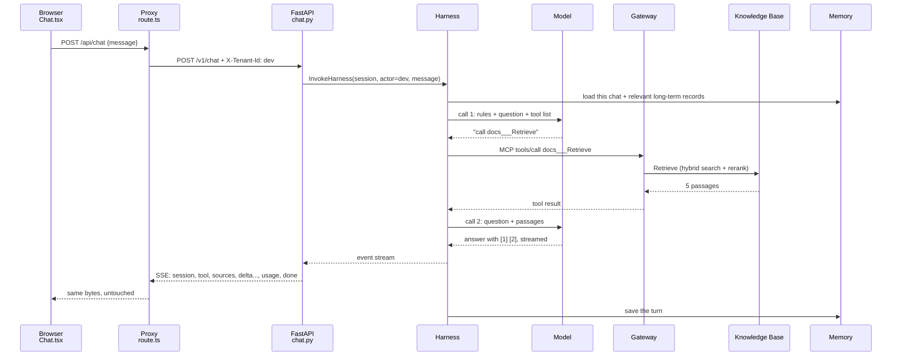

# Part F: Putting it together

**The story so far.** You know every piece on its own: the terminal and git (Part A), requests, FastAPI, streaming and the page (Part B), AWS, permissions and S3 (Part C), models, embeddings, RAG and the graph (Part D), and the agent with its tools, prompt, memory and browser (Part E). Pieces on their own do not answer a question. This part joins them into one working system and asks the questions a real team asks next: where does a request go, what does it cost, why is it shaped like this, and how do we know it works.

**In this part:**

- **Lesson 23:** one question, followed through all twelve hops.
- **Lesson 24:** what costs money, when, and how teams keep the bill down.
- **Lesson 25:** what we tried, what we dropped, and how teams write decisions down.
- **Lesson 26:** running it, testing it, and breaking it on purpose.

## 23. One question, end to end

**Where we are.** Lesson 22 (Part E) named the identity at every hop. Now we follow one real question through all of those hops in order, from your keyboard to the words on the screen and the record left behind.

### The problem

You press Enter, and ten seconds later an answer appears with sources. In between, eight different programs touched your question, on your laptop and in AWS. When an answer is slow, wrong, or fails, you need to know *which* of those eight to look at.

Think of a parcel. You drop it off, and it passes a counter, a sorting depot, a truck, a hub, a courier. If it arrives late, you do not guess. You read the tracking history: every scan, where, and when. This lesson is the tracking history for one question.

### The idea from zero

Three ideas make a request traceable.

1. **A map of the hops.** Before anything runs, draw who calls whom, in order. A **sequence diagram** is that map: one vertical line per program, one arrow per call, time running downwards.
2. **A name for the request.** Give the request an id when it enters, and pass that id along at every hop. Then every log line anywhere can say "this is about request 7f3e". This is called a **request id** or **correlation id**.
3. **A note at each hop.** Each program writes a log line when it receives, finishes, or fails: which request, what happened, how long it took.

```
             request id: 7f3e
you ──► page ──► proxy ──► backend ──► agent ──► tool ──► search
         │         │          │           │        │         │
       log:7f3e  log:7f3e   log:7f3e    log:7f3e  log:7f3e  log:7f3e
```

With all three, "why was that answer slow?" becomes a search for one id, not an afternoon of guessing.

### The whole field

| Approach | How it works | Good for | Limits | Typical tools |
|---|---|---|---|---|
| **Sequence diagram** | draw the hops by hand, before or after building | understanding and design reviews | shows what *should* happen, not what did | Mermaid, PlantUML, a whiteboard |
| **Print and plain logs** | each program prints a line to its own terminal or file | one program, one developer | lines from different programs cannot be joined up | `print`, Python `logging`, `console.log` |
| **Structured logs with a request id** | every line is JSON with fixed fields, including the request id, sent to one place | a few services, searching by id | you still rebuild the order and timing yourself | JSON logs into CloudWatch Logs, Elasticsearch, Loki, Datadog |
| **Provider request ids** | every cloud call returns an id the provider can look up | "which exact AWS call failed?" | covers only the provider's side | AWS `RequestId`, CloudTrail |
| **Distributed tracing** | each hop records a **span** (start, duration, attributes); a shared trace id links them into one tree | many services, finding where time went | needs instrumenting code or a platform that does it | OpenTelemetry, AWS X-Ray, Jaeger, Honeycomb, Datadog APM |
| **LLM and agent tracing** | tracing with extra fields for model calls, tokens, tool calls and prompts | agents, where a model decides the path at run time | stores prompts and answers, so privacy needs care | AgentCore observability, Langfuse, LangSmith |

**Sequence diagrams.** The cheapest tool, and the first one any engineer reaches for when joining a system. It costs nothing to run because it does not run. Its weakness is that reality drifts from the drawing.

**Plain logs.** Every program starts here. Fine while you can watch one terminal. Useless once a question crosses a network, because the backend's log does not know what the agent's log said.

**Structured logs with a request id.** The industry's standard first step. The entry point makes an id (or accepts one in a header such as `X-Request-Id`) and every service copies it into its log lines and onward calls. You can search "all lines for 7f3e" across services.

**Provider request ids.** AWS answers every API call with a `RequestId`. Log it on failure and AWS support, or CloudTrail, can find that exact call. It is the other half of your own request id.

**Distributed tracing.** The grown-up version: instead of lines, each hop records a span with a start time and a duration, and spans nest into a tree. The trace id travels between services in a standard header (`traceparent`, from the W3C Trace Context standard). Most teams with more than a handful of services run this, usually through OpenTelemetry so they can switch vendors.

**LLM and agent tracing.** Ordinary tracing sees "a call took 6 seconds". Agent tracing also records which model, how many tokens, which tool the model chose and with what arguments. For agents this matters most, because the path is decided by a model at run time and is different on every question.

### Our choice, and why

We sit at **sequence diagram + plain logs + provider request ids**, with agent tracing available but not yet ours to control.

- **The diagram** below is the map, and the interactive map linked from the course page steps through it.
- **Plain logs** from `logging.basicConfig` in `backend/app/main.py`: one `chat completed tenant=... usage=...` line per answer, never the text.
- **AWS request ids** are logged by `upstream_error()` in `backend/app/aws.py` on every AWS failure, with the error code.
- **No request id of our own** passes between the page, the proxy and the backend. The closest thing is the session id: made at hop 3, sent to the page as the first event, and handed to the Harness as `runtimeSessionId`. It names a conversation, not one request.
- **Agent tracing** comes from the Harness itself, into CloudWatch. Lesson 27 (Part G) turns it on.

Why so little: one user, one backend process, everything visible in two terminals. At a larger scale the upgrade is already named in a `ponytail:` comment in `main.py`: JSON logs plus OpenTelemetry traces, with a request id made at the proxy and carried on every hop.

### In our project

You type **"What are the steps to enable MFA for a user?"** and press Enter in a new chat. Twelve hops. Every one is a lesson you have done.



| Hop | What happens | Where | Lesson |
|---|---|---|---|
| 1 | the browser sends only the new message and `session_id: null` | `Chat.tsx`, `send()` | 7 |
| 2 | the proxy checks the allowlist (`chat`, `documents`, `sessions`; anything else is 404), adds `X-Tenant-Id: dev`, forwards to `API_URL` (port 8001 on this laptop) | `route.ts`, `forward()` | 7 |
| 3 | FastAPI checks the header (400 if bad), the body (422 if bad), makes a UUID session id. Nothing has cost money yet | `tenancy.py`, `chat.py` | 5 |
| 4 | the backend opens the agent's stream, signed as your IAM user. A refusal becomes 503 or 502 here | `chat.py`, `harness_stream` | 6, 9 |
| 5 | the Harness starts a session machine, loads short-term memory (empty: new chat) and searches long-term memory for `dev` | AWS | 17, 20 |
| 6 | model call 1: rules + question + tool list. The model reasons, then writes a tool call: `docs___Retrieve {"retrievalQuery": {"text": "enable MFA user"}}`. Rule 2 sent it there | AWS | 16, 19 |
| 7 | the Harness calls the Gateway over MCP, signed as the Harness role. `docs___Retrieve` = target `docs`, tool `Retrieve` | AWS | 18 |
| 8 | the Knowledge Base embeds the question, runs hybrid search, reranks, returns 5 chunks with their source file and labels. The Gateway role makes this call | AWS | 13, 14 |
| 9 | model call 2: question + passages. The model writes the answer, citing by position: `[1]`, `[2]` | AWS | 16 |
| 10 | `relay()` translates the stream: `session` first, `tool` when the call's block stops, `sources` when the result's block stops, `delta` per text piece, `usage` summed, `done` | `chat.py`, `relay` | 6, 17 |
| 11 | the page decodes bytes, parses events, and draws: the tool line, the source cards, the words as they come, `[1]` as a link | `Chat.tsx`, `lib/sse.ts`, `lib/citations.ts`, `lib/markdown.ts` | 7 |
| 12 | the Harness saves about ten events to Memory. Minutes later, the strategies extract records. Because this was a new chat, the sidebar reloads and labels it with its first question | AWS, `sessions.py` | 20 |

> **On the login branch:** the proxy forwards your sign-in token instead of `X-Tenant-Id: dev`, and that token is checked three times: at the backend, at Runtime, and at the Gateway (lesson 35, Part H).

**The two other paths.** A **URL question**: hop 6 picks the browser. No Gateway; the Harness drives Chrome directly: open, navigate, read, close. The page text goes into call 2. A **relationship question**: hop 6 picks `graph___search_graph`. The Gateway invokes our Lambda, which searches the graph Knowledge Base. Only while the graph is started.

**And one upload.** The sidebar sends the file as a multipart form. The proxy forwards it with its `Content-Type` intact. `documents.py` cleans the name, checks type and size, writes the label then the file to S3, starts both syncs. The sidebar polls the managed sync every 5 seconds until it is COMPLETE, FAILED or STOPPED.

**Try it**

Watch the log side of the trace. With both servers running, ask the MFA question and look at terminal 1 (the backend). You should see one line when the answer finishes, in this shape:

```
... INFO app.chat chat completed tenant=dev usage={'input_tokens': ..., 'output_tokens': ..., 'model_calls': 2}
```

That single line is everything our own code records about the question. The other hops live in AWS: the Harness's trace (lesson 27, Part G) and CloudTrail for the calls themselves (lesson 9, Part C).

### Check yourself

1. At which hop could a bad request be rejected without spending anything?
<details><summary>Answer</summary>

Hop 2 (the proxy's allowlist, 404) and hop 3 (FastAPI: a bad `X-Tenant-Id` is 400, a bad body is 422). Both happen before any AWS call, so nothing is billed.

</details>

2. Name the identity making the call at hop 4, at hop 7, and at hop 8.
<details><summary>Answer</summary>

Hop 4: your IAM user, through the `docs-copilot-dev` profile. Hop 7: the Harness role. Hop 8: the Gateway role.

</details>

3. What does `relay()` wait for before sending a `tool` event, and why?
<details><summary>Answer</summary>

The tool call's content block to stop. The tool's input arrives as several small JSON pieces; only when the block stops is the input complete and parseable.

</details>

4. You upload a file and ask a relationship question about it at once. Why might the graph not know it yet?
<details><summary>Answer</summary>

The graph Knowledge Base only sees a file after its own sync finishes, and that sync has a model read the whole file to extract things and relations. It is slower than the main sync, which the sidebar watches. The upload can say "Ready to ask" while the graph is still reading.

</details>

5. Our backend has no request id of its own. What is the closest thing it has, and why is it not quite the same?
<details><summary>Answer</summary>

The session id. It follows the question from hop 3 to the Harness and back to the page. But it names a whole conversation, so every question in the same chat shares it. A request id names one request.

</details>

---

## 24. What costs money, and when

**Where we are.** Lesson 23 followed one question through twelve hops. Several of those hops are AWS services that send a bill. This lesson prices each hop, and shows the ways teams keep AI bills under control.

### The problem

A normal website costs roughly the same whether a visitor asks something simple or something hard. An AI app does not. One question can cost a tenth of a cent, the next one ten cents, and a forgotten database can cost money all night while nobody uses it.

Think of a household. Some bills arrive every month whether you are home or not (rent). Some grow with use (electricity). Some are per item (a taxi ride). To keep spending sane you need to know which kind each bill is, and you want a warning before the month's total gets out of hand.

### The idea from zero

Every cloud service charges in one or more of four ways.

| Kind | You pay for | Household version |
|---|---|---|
| **per hour** | time the thing exists or runs, used or not | rent |
| **per request** | each call made | a taxi ride |
| **per token** | the text going into and out of a model | a phone call billed by the minute |
| **per stored gigabyte** | data kept, per month | a storage unit |

For AI, **tokens** (lesson 11, Part D) are usually the biggest line. A model bills tokens **in** (everything you send: rules, history, tool results, the question) and tokens **out** (what it writes). Out usually costs several times more per token than in, but in is usually far larger.

What makes tokens in grow:

```
one model call's input =
    system prompt (the rules)
  + tool descriptions
  + conversation history
  + tool results (passages, or a whole web page)
  + the question
```

And an agent makes **several model calls per question** (lesson 16, Part E), sending most of that input again each time. Two calls means paying for the rules twice.

### The whole field

| Approach | How it works | Good for | Limits | Typical tools |
|---|---|---|---|---|
| **Budgets and alarms** | a monthly spend line that emails someone when crossed | every account, from day one | warns, does not stop spending | AWS Budgets, GCP and Azure budgets |
| **Cost reports** | spend grouped by service, day, or tag | finding which service grew | arrives hours late; says "Bedrock", not "which question" | AWS Cost Explorer, cost allocation tags |
| **Turn off idle things** | stop or delete per-hour resources when unused | dev and demo setups | someone must remember, or a schedule must do it | scripts, scheduled jobs, stop commands |
| **Track cost per answer** | record tokens and model calls for every answer; multiply by price | knowing what a feature costs, spotting outliers | needs logging and up-to-date prices | app logs, LLM tracing tools (Langfuse, LangSmith), agent traces |
| **Smaller input** | fewer or shorter passages, trimmed history, shorter rules | the biggest lever on token cost | too little context makes answers worse | retrieval settings, history summarising |
| **Response caching** | store the answer to a question; the same question again returns the stored answer without calling the model | repeated identical or near-identical questions | stale answers; per-user data must never leak between users | Redis, a database, semantic caches keyed by embeddings |
| **Prompt caching** | the provider remembers the start of a prompt it has seen recently; resending that same start is billed at a reduced rate | long fixed rules or documents sent on every call | only helps when the prompt's beginning is identical; only some models and providers | the prompt caching feature of model providers, Bedrock among them |
| **Model routing** | send each question to the cheapest model that can handle it; escalate to a strong model only when needed | mixed traffic of easy and hard questions | the router can pick wrong; two models to test | a small classifier, rules, gateway products |
| **Limits per user** | cap requests or tokens per user per day | public apps, abuse protection | needs identity (a login) to be fair | rate limiters, API gateways |

**Budgets and alarms.** The safety net every team sets first. An alarm is a smoke detector, not a sprinkler: it tells you, it does not put the fire out. Stopping spend automatically is possible but rarely used, because it can also stop production.

**Cost reports.** Where you go after the alarm: which service grew? Tags on resources let a team split the bill by project or feature.

**Turn off idle things.** Anything billed per hour costs the same at 3 a.m. as at noon. For development setups, stopping it when idle is often the largest saving there is.

**Track cost per answer.** Cost reports cannot tell you that one question cost 10 cents. Your app can, if it records tokens in, tokens out and model calls for each answer. Teams chart this per feature and alert on outliers.

**Smaller input.** Since input tokens dominate, the first real optimisation is sending less: fewer retrieved passages, a short history, rules without repetition.

**Response caching.** The classic web trick applied to AI: same question, same answer, no model call. A **semantic cache** also matches questions with the same meaning but different words, using embeddings (lesson 12, Part D). The danger is serving one user's answer to another.

**Prompt caching.** Different from response caching: the model still runs and writes a new answer, but the provider does not reprocess a prompt beginning it has seen moments ago, and bills that part at a reduced rate. It rewards putting the fixed parts (rules, tool list) first and the changing parts (the question) last.

**Model routing.** Most questions are easy. A router tries a small cheap model first, or picks the model from the question's type, and uses the expensive model only when needed. Common at scale; extra work to build and test.

**Limits per user.** Once real people use an app, one heavy user can dominate the bill. A per-user cap needs to know who the user is.

### Our choice, and why

We use **a budget alarm, cost reports, turning off the graph, and a usage count per answer**. Nothing more yet.

- **Budget alarm:** $30 a month on the account (lesson 8, Part C), against about $200 in credits.
- **Turn off idle things:** the Neptune graph is the only part billed per hour, so it is started before a demo and stopped after (`docs/demo.md`).
- **Cost per answer, half done:** every answer ends with a `usage` event (tokens in, tokens out, model calls), shown under the answer and logged by the backend. It is counted in tokens, not dollars.
- **No caching, no routing, no per-user limits.** One user asking different questions, at about 1 cent each, gives caching and routing almost nothing to save. Per-user limits need a login.

At a larger scale, in this order: turn token counts into dollars per answer and chart them; trim input (history and passage count); cache fixed prompt beginnings if the model supports it; route easy questions to a smaller model; cap spend per user once there is a login.

### In our project

| Part | When it costs | About how much |
|---|---|---|
| Neptune graph | **every hour it exists**, running or stopped | $0.48 an hour running, about $0.05 stopped, $0 deleted |
| the model (Mistral Large 3) | per question | about 1 cent for a document question, 2 to 8 cents for a web page |
| syncs | per upload | fractions of a cent per small file; a few cents for the guide's graph extraction |
| Harness, Gateway, Lambda, Memory, Browser | only while used | cents |
| S3, IAM, the Knowledge Bases' storage | always | close to zero at our size |

> **On the login branch:** the Harness is replaced by an agent on AgentCore Runtime, billed per second of CPU and memory while a session is busy and nothing while idle, plus Cognito, free for the first 10,000 monthly users (lesson 32, Part H).

Measured: a document question was 14,472 tokens in, 147 out, 2 model calls, under 1 cent. A web page read was 158,618 tokens in, 275 out, 4 model calls, about 8 cents.

Read those numbers with the idea above: out is tiny in both. The web page is expensive because the whole page's text is *input*, and it is sent again on each of 4 calls. That is the "smaller input" lever in action.

The rule: **stop the graph when you are done, delete it when done for good.** The $30 budget alarm is the safety net if either is forgotten.

**Try it**

Console: **Billing and Cost Management**, **Cost Explorer**, group by service, this month. Or:

```
aws ce get-cost-and-usage --time-period Start=2026-09-01,End=2026-10-01 --granularity MONTHLY \
  --metrics UnblendedCost --group-by Type=DIMENSION,Key=SERVICE --profile docs-copilot-dev \
  --query 'ResultsByTime[0].Groups[].[Keys[0],Metrics.UnblendedCost.Amount]' --output text
```

`End` is not included in the range, so `2026-10-01` covers all of September. Each Cost Explorer API call is itself billed a small amount; the console view is free.

Then ask one document question in the app and read the usage line under the answer: tokens in, tokens out, model calls. That is your cost per answer, in tokens.

### Check yourself

1. Which is the only part billed while idle?
<details><summary>Answer</summary>

The Neptune graph. It bills every hour it exists: $0.48 running, about $0.05 stopped. Only deleting it stops the clock.

</details>

2. Why is a web page read 8 times the cost of a document question?
<details><summary>Answer</summary>

Input tokens. The whole page's text goes into the model (158,618 tokens in, against 14,472), and the agent made 4 model calls instead of 2, resending that input. Output was small in both.

</details>

3. What is the difference between response caching and prompt caching?
<details><summary>Answer</summary>

Response caching skips the model: the same question gets the stored answer. Prompt caching still runs the model and writes a fresh answer, but the provider bills a repeated prompt beginning at a reduced rate.

</details>

4. Does the $30 budget stop AWS from charging more?
<details><summary>Answer</summary>

No. It sends an alarm when spend crosses the line. It is a warning, not a cap.

</details>

5. Why would model routing save little in this project today?
<details><summary>Answer</summary>

A document question already costs about 1 cent, and there is one user. Routing saves money when there is a lot of traffic and many easy questions; here the extra model to test would cost more effort than it saves.

</details>

---

## 25. What was tried and dropped, and why

**Where we are.** Lessons 23 and 24 showed the system as it is and what it costs. It did not start this way. This lesson is the history: what was planned, what was tried, what was dropped, and how teams write such choices down so the next person does not repeat them.

### The problem

Six months from now someone asks: "Why don't you run your own search database? Why this model and not Llama?" If the answer lives only in someone's head, it is lost, and the team pays to rediscover it, often by making the same mistake again.

Think of a family recipe with notes in the margin: "tried less sugar, went flat", "oven runs hot, use 170". The recipe is the current system. The notes are the decisions. Without the notes, the next cook repeats every failed experiment.

### The idea from zero

Two separate things need recording.

1. **Decisions:** a choice between options, with the reason. "We use X instead of Y, because Z." Worth recording when it is hard to undo or someone will question it later.
2. **Changes:** what changed, and when. "Version 1.3: uploads now allow `.docx`."

And behind many decisions sits one recurring question: **build or buy?** Write it yourself, or use something someone else made and runs.

```
             more control, more work
build it ◄──────────────────────────────► buy it
yourself   open source    managed         a finished
           you host       service         product (SaaS)
             less control, less work
```

### The whole field

**How teams record decisions and changes**

| Approach | How it works | Good for | Limits | Typical tools |
|---|---|---|---|---|
| **Commit messages** | each commit says what changed and why, often in a fixed format | the smallest changes; history per line of code | scattered; hard to read as a story | git, Conventional Commits (`feat:`, `fix:`, `docs:`) |
| **A decision table in the README** | one table: decision, instead of, why | small projects, one place to look | no room for context or a record of how the decision changed over time | a Markdown table |
| **Architecture decision records (ADRs)** | one short numbered file per decision: context, decision, consequences, status. Never edited once accepted; a new ADR replaces an old one | teams, long-lived systems, onboarding | needs the habit of writing one each time | Markdown files in `docs/adr/`, adr-tools |
| **Changelog** | a dated list of user-visible changes per version | libraries and products with users | says *what*, rarely *why* | `CHANGELOG.md` (the Keep a Changelog format), GitHub Releases |
| **Design docs and RFCs** | a longer proposal written and reviewed *before* building | big or risky changes, many reviewers | slow; can go stale after the build | Google Docs, Notion, RFC pull requests |

**Commit messages.** Every team has them, whether they write them well or not. A format like Conventional Commits makes them searchable and lets tools build a changelog from them.

**A decision table.** The lightest form of decision record. One screen, easy to read, easy to keep current. It loses the story: you see the final choice, not the attempts before it.

**Architecture decision records.** The most common industry practice for decisions. Each record is short (a page), numbered, and kept forever. When a decision changes, a new record says so and marks the old one as replaced. The value is that the *reasoning at the time* survives, including options that were rejected.

**Changelogs.** For people who use the software: what is new, fixed, or removed in each version. Libraries and products keep them; internal apps often skip them and rely on git history.

**Design docs and RFCs.** Written before a large change, so others can find problems while fixing them is still cheap. Common in big companies and open-source projects.

**Build vs buy**

| Approach | How it works | Good for | Limits | Typical tools |
|---|---|---|---|---|
| **Build it yourself** | write the code | your core product, the thing that makes you different | you write it, test it, run it, and fix it at 3 a.m. | your own code |
| **Open source, self-hosted** | use someone's code, run it on your servers | control without writing everything | you still run it: upgrades, backups, scaling | OpenSearch, Neo4j, Postgres, LangGraph |
| **Managed service** | the provider runs the software; you configure it and pay per use | standard pieces nobody wants to operate | less control; limits you cannot change; the bill grows with use; hard to leave | Bedrock Knowledge Bases, AgentCore, RDS |
| **A finished product (SaaS)** | a complete tool you sign up for | whole jobs outside your focus | least control; data lives with the vendor | hosted search, hosted chat products |

The usual rule in industry: **build what makes you different, buy what everyone needs.** Search, login, databases and queues are rarely a product's advantage, so teams buy or reuse them. The trade is lock-in and limits: when a managed service cannot do something, you wait for the provider or leave.

### Our choice, and why

**Recording.** We use **commit messages and a decision table**, no ADR files and no changelog.

- **Commit messages** follow Conventional Commits: 27 of the 29 commits on main start with a type such as `feat:`, `fix:` or `docs:`, sometimes with a scope, like `fix(web):`.
- **The decision table** is README section 5, "Locked decisions": decision, instead of, why in one line. "Locked" means it is not reopened without a reason.
- **This lesson's table** is the part the README table loses: the attempts, in order.
- **No `CHANGELOG.md`, no `docs/adr/`.** There are no versions and no users besides the builder.

At a larger scale: turn each locked decision into a short ADR (the "why" column is already the core of one), and add a changelog once other people use releases.

**Build vs buy.** Nearly everything was **bought as a managed service**. Our own code is the page, the proxy, the backend, and one Lambda. Chunking, embeddings, hybrid search, reranking, the agent loop, memory and the browser are AWS services we configured. That fits the rule above: none of those pieces is what makes this app different, and at our size they cost cents. The price is visible in the table below: a model limit, a Harness limit, a per-hour graph.

### In our project

The final shape is simpler than every earlier plan. Each change below was a lesson.

| When | Was | Became | Why |
|---|---|---|---|
| start | uv workspace with `src/` layout, root `.env` | one flat `backend/app` | one package; the extra folders and second config file did nothing |
| start | Docker compose | two terminals | nothing is deployed; two commands do the job |
| start | Llama 4 Maverick as the chat model, called by our own code | the Harness calls the model | our `llm.py` was deleted; the loop, tools and memory became configuration |
| week 1 | Llama 4 Maverick | gpt-oss-120b | the Harness always streams, and Llama 4 on Bedrock cannot use tools while streaming |
| week 1 | gpt-oss-120b | Mistral Large 3 | gpt-oss could not drive the multi-step browser tool |
| plan | OpenSearch + our own parse/chunk/embed pipeline + reciprocal rank fusion in Python | the managed Knowledge Base | hybrid search, reranker and parser built in; no servers; pennies at our size |
| plan | Neo4j + our own extraction prompt | Bedrock GraphRAG on Neptune Analytics | AWS-native, quick to set up; the cost clock is the price |
| plan | LangGraph supervisor + specialist agents + FastMCP tool servers | one Harness + the Gateway | the supervisor was over-engineering at this scale; the Gateway is already an MCP server |
| plan | Postgres in Docker for chat history | AgentCore Memory | sessions and messages come free with the Harness; no database to run |
| plan | Cognito login, per-tenant search filter | no login, single user, `dev` stub | finish the product end to end first; the tenant plumbing stays as a stub |
| plan | SQS queue + worker for indexing | the Knowledge Base's own sync | the sync already runs in the background |
| plan | Code Interpreter trial, research agent on Runtime | dropped, and "later, maybe" | not worth it yet |
| after the fresh start | conversations shown by time, raw `**markdown**`, browser steps as "Used browser" | first-question titles, a small markdown reader, "Opened <url>" | found only by driving the app in a real browser; command-line tests could not see them |

> **On the login branch:** three more rows: Cognito login added, the Harness replaced by a Strands agent on AgentCore Runtime that forwards the person's token, and a Cedar rule on the filter key instead of its value (lesson 30, Part H).

**Things that bit, and the fix**

| What happened | Why | Fix |
|---|---|---|
| "This model doesn't support tool use in streaming mode" | Llama 4 limit on Bedrock | a different model |
| the agent said its only tool was the document search | allowed tools had `aws_browser_v1` without `@` | `@aws_browser_v1` |
| given a URL, the agent searched the documents | the browser rule came after "search the documents first" | browser rule moved to rule 1 |
| answers cited as `【1†L13-L17】` | gpt-oss's own habit | prompt rule 3 demands `[1]`; the page accepts both anyway |
| a web search found nothing | Google blocks automated browsers with a CAPTCHA | rule 1 sends searches to DuckDuckGo's plain HTML results page, then opens the best result |
| test answers steered by old "facts" | all test runs shared one actor id, so memory leaked between them | a fresh actor id per test run |
| "Gateway execution role lacks permission to invoke Lambda" | deny by default | one inline policy on the Gateway role |
| three permission walls creating the Knowledge Base | least privilege on a sandbox account | `AdministratorAccess` on the dev user, recorded honestly |
| the first frontend CI run failed on a missing type | Next.js generates some types locally; CI starts clean | `next typegen` before `tsc` (the `typecheck` script in `frontend/package.json`) |
| a wiped conversation still listed, empty | AgentCore can delete events but not the conversation | the sidebar hides chats with no events |
| a tenant id starting with `_` would break Memory calls | actor ids must start with a letter or digit | the tenant check tightened |

**Try it**

Read the decisions the way a new team member would:

```
cd ~/Projects/personal/Docs_Copilot
sed -n '/^## 5. Locked decisions/,/^## 6/p' README.md
git log --oneline
```

The first shows the decision table. The second shows every change, newest first, each with its Conventional Commits prefix. Pick one row from the table above and find the commit that made it.

### Check yourself

1. Llama 4 Maverick supports tool use. Why could the Harness not use it?
<details><summary>Answer</summary>

The Harness always streams, and Llama 4 on Bedrock cannot use tools while streaming.

</details>

2. Name three things the managed services made unnecessary.
<details><summary>Answer</summary>

Any three of: our own parse, chunk and embed pipeline with OpenSearch; our own rank fusion in Python; Neo4j with our own extraction prompt; a Postgres database for chat history; an SQS queue and worker for indexing; FastMCP tool servers; our own agent loop in `llm.py`.

</details>

3. What did the real-browser test find that the 51 automated tests could not?
<details><summary>Answer</summary>

Chats listed by time instead of titles, raw `**markdown**` in answers, and browser steps shown as "Used browser". The tests check data and events; only a person looking at the page sees how it reads.

</details>

4. What does an architecture decision record keep that README section 5 loses?
<details><summary>Answer</summary>

The context at the time, the options rejected, the consequences, and the history: an ADR is never edited, a new one replaces it. The README table shows only the current choice and one line of why.

</details>

5. By the "build what makes you different" rule, which piece of this project would a company most likely build itself?
<details><summary>Answer</summary>

The product experience: the page and the backend that shapes answers, sources and uploads for its users. Search, memory, the agent loop and the browser are general pieces, so they were bought as managed services.

</details>

---

## 26. Running, testing, and breaking it on purpose

**Where we are.** Lesson 25 was the history of how the system got its shape. This lesson is how you run it today, how you know it still works after a change, and how you learn it deeply by breaking it on purpose.

### The problem

You change one line. Did anything else break? Clicking through the app after every change is slow, you forget cases, and some failures (AWS busy, a broken connection) you cannot even trigger by clicking. And when something does break, you need a method, not luck.

Think of a car. It gets built in a workshop, tested on a closed track, then driven on real roads. Its parts are checked one by one before assembly, the assembled car gets a few long test drives. And crash tests break cars on purpose, so the failures are known before a customer finds them.

### The idea from zero

**Environments.** The same code runs in more than one place, each with its own settings and data.

```
local  ─────►  staging  ─────►  production
your laptop    a copy of prod    real users,
fake or dev    for final checks  real data,
data                             real money
```

**Automated tests.** Small programs that run your code and check the result. A **test pyramid** says how many of each kind to have:

```
            /\          end-to-end: the whole system, like a user
           /  \         few: slow, fragile, but real
          /----\
         /      \       integration: several parts together
        /        \      some
       /----------\
      /            \    unit: one function or one route
     /______________\   many: fast, exact, cheap
```

**Test doubles.** A unit test must not call AWS: it would be slow, cost money, and fail when the network does. So the test swaps the real thing for a stand-in. There are several kinds of stand-in (next section).

**Breaking on purpose.** Predict what a failure will look like, cause it, and check. If your prediction was wrong, your mental map was wrong, and now you know where.

### The whole field

**Environments**

| Approach | How it works | Good for | Limits | Typical tools |
|---|---|---|---|---|
| **Local only** | everything runs on the laptop; cloud services are real but a dev account | one developer, learning, prototypes | "works on my machine"; no copy of production | two terminals, `.env` files |
| **Local + CI** | every push runs the checks on a clean machine | catching what your laptop hides (missing files, stale types) | CI tests code, not a running deployment | GitHub Actions, GitLab CI |
| **Preview environments** | each pull request gets its own temporary deployment | reviewing a change by using it | cost; needs automated deploys | Vercel previews, Render previews |
| **Staging** | a long-lived copy of production with fake data | final checks before release | drifts from production; costs as much as a smaller production | a second AWS account or stack |
| **Production** | where real users are | the real thing | mistakes cost users and money | infrastructure as code, feature flags, gradual rollout |

**The test pyramid, level by level**

| Approach | How it works | Good for | Limits | Typical tools |
|---|---|---|---|---|
| **Static checks** | read the code without running it: style, types, likely bugs | catching whole classes of mistakes instantly | cannot check behavior | ruff, mypy, ESLint, TypeScript |
| **Unit tests** | call one function or route with stand-ins for everything outside | exact behavior, error paths, fast feedback | stand-ins can differ from the real service | pytest, Node's test runner, Jest, Vitest |
| **Integration tests** | several real parts together, sometimes a real database or cloud dev account | "do these pieces really fit?" | slower, may cost money, flakier | pytest with real services, Testcontainers |
| **End-to-end tests** | drive the real app like a user, in a real browser | "does it work for a person?" | slowest, most fragile | Playwright, Cypress |
| **Manual exploratory checks** | a person uses the app and looks | how it reads and feels | not repeatable, easy to skip | a checklist, a demo script |
| **Evaluations** | score an AI's answers against a set of questions | quality of model output, which ordinary tests cannot pin down | needs a question set and a judge | covered in lesson 29 (Part G) |

**Static checks.** The bottom-most layer, below even unit tests: free, instant, and they never flake.

**Unit tests.** The bulk of any healthy test suite. They should be fast enough to run on every change.

**Integration tests.** They catch the gap unit tests leave: the stand-in said one thing, the real service does another.

**End-to-end tests.** One or two per important user journey. More than that becomes a maintenance burden, because any small page change breaks them.

**Manual checks and evaluations.** Some things only a person or a scoring model can judge: whether markdown renders, whether an answer is right.

**Test doubles**

| Kind | How it works | Good for | Limits | Typical tools |
|---|---|---|---|---|
| **Stub** | returns a fixed answer, nothing else | "given this response, does my code behave?" | checks nothing about how it was called | a small function, `unittest.mock` return values |
| **Mock** | returns answers *and* checks it was called in the expected way | "did my code make exactly this call?" | tests become tied to implementation details | `unittest.mock`, Jest mocks |
| **Spy** | wraps or records calls so the test can inspect them afterwards | checking calls without scripting them in advance | similar coupling to mocks | a list of recorded calls, Jest spies |
| **Fake** | a small working version of the real thing, usually in memory | realistic behavior across many calls | someone must keep it faithful to the real service | moto (AWS in memory), an in-memory database |
| **Recorded responses** | real responses captured once, replayed in tests | shapes that match reality exactly | go stale when the service changes | VCR.py, Polly.js, hand-copied captures |

In practice the words blur: many teams call every stand-in a "mock". What matters is knowing *what* your stand-in checks and *how far* it can drift from the real service.

**Breaking things on purpose**

| Approach | How it works | Good for | Limits | Typical tools |
|---|---|---|---|---|
| **Failure tests** | unit tests that make a stand-in fail: throttled, broken, malformed | proving each error path, forever | only the failures you thought of | pytest with fakes |
| **Manual break exercises** | change one thing by hand, predict, observe, restore | learning a system; checking a runbook | not repeatable; must be undone | this lesson's table |
| **Fault injection** | a tool adds errors, delays, or outages to a running system | testing retries, timeouts and alarms under real conditions | needs a safe environment and a stop button | AWS Fault Injection Service, Toxiproxy |
| **Chaos engineering** | fault injection run regularly, often in production, with a hypothesis each time | large systems that must survive failures | only for mature teams with good monitoring | Chaos Monkey, Gremlin |

**How engineers debug, step by step**

1. **Reproduce it.** Make it happen again on purpose. A bug you cannot trigger, you cannot confirm fixed.
2. **Read the actual error.** The full message, the status code, the log line. Most bugs name themselves.
3. **Find the hop.** Walk the request (lesson 23): did the page send it? did the proxy forward it? did the backend answer? Split the path in half until one hop is left.
4. **Form one hypothesis and change one thing.** Changing three things at once hides which one mattered.
5. **Verify the fix,** then **write a test** that fails without it, so it cannot come back.

### Our choice, and why

- **Environments: local + CI.** Everything runs on the laptop; the AWS services are real ones in a dev account. There is no staging and no production, because nothing is deployed (README section 5). GitHub Actions (`.github/workflows/ci.yml`) runs every check on each push to main and on every pull request.
- **Tests: static checks + many unit tests + manual end-to-end.** ruff and mypy for Python, ESLint and TypeScript for the page, then 51 unit tests. There are no automated integration or end-to-end tests. The end-to-end check is a person: driving the app in a real browser (lesson 25 shows what that found) and `docs/demo.md`.
- **Doubles: fakes that record calls, moto, and hand-copied captures.** `FakeAgentCore` and `FakeKb` return canned answers *and* record every call, so tests can assert "the agent was never called" (spy-like). S3 is `moto`, a real fake. The event shapes in the fakes are copied from a real InvokeHarness stream and real Memory events captured on 2026-09-11 (recorded responses, by hand).
- **Breaking: failure tests + manual break exercises.** No fault injection tool: one user, nothing deployed.

At a larger scale: a staging account built from infrastructure as code, a few Playwright end-to-end tests for the main journeys, an integration test against the real dev Knowledge Base, and evaluations (lesson 29, Part G) as a CI gate.

### In our project

**Run it.** Two terminals.

```
# terminal 1: the API (port 8001, because another project holds 8000)
cd ~/Projects/personal/Docs_Copilot/backend
uv run uvicorn app.main:app --reload --port 8001

# terminal 2: the page
cd ~/Projects/personal/Docs_Copilot/frontend
npm run dev
```

Open http://localhost:3000. `frontend/.env.local` must say `API_URL=http://localhost:8001` (copy `.env.example` the first time and change the port: the example says 8000). `backend/.env` must hold the IDs (copy `.env.example`).

**Check it.** The same commands CI runs.

```
cd backend && uv run ruff check . && uv run ruff format --check . && uv run mypy . && uv run pytest -q
cd frontend && npm run lint && npm run typecheck && npm test
```

CI adds one step first on each side: `uv sync --locked` fails if `uv.lock` is out of date with `pyproject.toml`, and `npm ci` installs exactly what `package-lock.json` says.

Count the tests yourself:

```
cd backend && uv run pytest --collect-only -q | tail -1
```

```
38 tests collected in 0.15s
```

**What the 51 tests cover.** 38 backend (pytest) and 13 frontend (Node's built-in test runner). AWS is never called: the tests swap the AWS clients for fakes (`FakeAgentCore` in `backend/tests/helpers.py`, `FakeKb` in `backend/tests/test_documents.py`), passed in through FastAPI's dependency overrides, and use `moto`, a library that fakes S3 in memory. botocore's own Stubber cannot fake a streaming response, which is why the chat fake is hand-written.

- **`test_chat.py` (15):** the exact event order on the happy path; the exact call made to the Harness; a fresh session id; a tool result that is not a search gives no sources; a bad tenant header is 400 and the agent is never called (3 cases); an invalid body is 422 and the agent is never called (4 cases); throttling is 503 with `Retry-After`; other errors are 502 without leaking AWS's text; an error event mid-stream and a broken connection both become `error`.
- **`test_documents.py` (14):** upload writes the label then the file and starts both syncs; a busy sync keeps the file; a busy graph sync leaves the main sync running; a refused graph sync does not fail the upload; file names can never leave the tenant folder (3 cases); wrong type is 415 and writes nothing; too large is 413; a bad tenant is 400 and writes nothing; a sync refused for another reason is 502; the list shows only this tenant's files, without labels; sync status counts new and modified files as indexed; a malformed job id is 422.
- **`test_sessions.py` (9):** newest first; empty chats hidden; the title is the first question; a long title is shortened; only question and answer text, in order; every page of events read; malformed memory text skipped; a malformed session id is 422 and costs nothing; a Memory error is 502.
- **frontend (13):** the SSE parser (5: complete events, events split across chunks, keep-alive comments, CRLF, an event with no name), the citation splitter (4: text and markers, no markers, gpt-oss's marker style, non-numbers ignored), the markdown reader (4: a real answer, wrapped lines, headings and inline code, a lone asterisk).

"Never called" and "writes nothing" are checked on every rejection: a bug there would cost money or leave junk on every bad request.

> **On the login branch:** 73 tests (54 backend, 14 frontend, 5 agent), a third check command for `agent/`, and you sign in before using the page (lesson 35, Part H).

**Clean up memory.** To remove test-derived long-term records (lesson 20, Part E):

```
aws bedrock-agentcore list-memory-records --memory-id docs_copilot_assistant-6aIbceHbw1 \
  --namespace /actors/dev/preferences/ --region us-west-2 --profile docs-copilot-dev \
  --query 'memoryRecordSummaries[].memoryRecordId' --output text
aws bedrock-agentcore batch-delete-memory-records --memory-id docs_copilot_assistant-6aIbceHbw1 \
  --region us-west-2 --profile docs-copilot-dev --records memoryRecordId=<id> memoryRecordId=<id>
```

**Break it on purpose.** Reading builds a map; breaking things makes it stick. For each: predict what will happen, break it, check, then **put it back**. Use the debugging steps above when the result surprises you.

| Break this | Predict, then check | Lesson |
|---|---|---|
| in `route.ts`, remove the `X-Tenant-Id` header | every request fails. Which status, and which file sends it? | 5, 7 |
| upload a `.exe` file | rejected before S3 is touched. Which status? | 10 |
| in the Harness console, change `@aws_browser_v1` back to `aws_browser_v1`, ask a URL question | the agent never opens the page. Why? | 17 |
| with the graph stopped, ask "how do folders relate to user roles?" | what does the tool return, and what does the agent say? | 15 |
| swap rules 1 and 2 in the prompt (a test-page override is enough) | which tool does a URL question pick now? | 19 |
| in IAM, detach `InvokeGraphSearchLambda` from the Gateway role, ask a relationship question | where does the chain break, and what error shows? | 9, 22 |
| in `backend/.env`, add a line `FOO=bar`, start the server, ask a question | the server starts, but the first request that reads the settings fails with a 500. What does the terminal error say? | 5 |

**Try it**

The last row, captured. Settings are read only when the first request needs them (`get_settings()` is called from `aws.py`, not at startup), so the server starts and the error shows in terminal 1 on that request:

```
pydantic_core._pydantic_core.ValidationError: 1 validation error for Settings
foo
  Extra inputs are not permitted [type=extra_forbidden, input_value='bar', input_type=str]
```

A typo in a setting name fails loudly instead of being silently ignored. Remove the line afterwards.

### Check yourself

1. Why do the tests never call AWS, and what do they use instead?
<details><summary>Answer</summary>

Real calls would be slow, cost money, need credentials, and fail when the network does. The tests use `FakeAgentCore` and `FakeKb`, injected through FastAPI's dependency overrides, and `moto` for S3.

</details>

2. `FakeAgentCore` returns canned answers and records every call. Which kinds of test double is it?
<details><summary>Answer</summary>

A stub (fixed answers) with spy behavior (recorded calls that tests check, such as "never called"). Its event shapes are hand-copied recorded responses. Only `moto` is a full fake.

</details>

3. Which level of the test pyramid does this project not automate at all, and what stands in for it?
<details><summary>Answer</summary>

Integration and end-to-end tests. A person driving the app in a real browser, and the demo script, stand in for them.

</details>

4. A bad tenant header test checks the status is 400. Why does it also check the agent was never called?
<details><summary>Answer</summary>

A 400 that still called the agent would look correct from outside but spend money on every bad request. "Never called" proves the rejection happens before any AWS call.

</details>

5. Every question suddenly returns 502. Walk the first three debugging steps.
<details><summary>Answer</summary>

Reproduce: ask one question and see the 502 again. Read the error: the backend terminal logs the failing action with the AWS error code and request id. Find the hop: 502 comes from `upstream_error()`, so the backend reached AWS and AWS refused; expired credentials are a common cause, checked with `aws sts get-caller-identity --profile docs-copilot-dev`.

</details>

**Next:** Part G, Running it like production, because a system that works on one laptop still needs to be watched, fenced in, and measured before real people rely on it.
