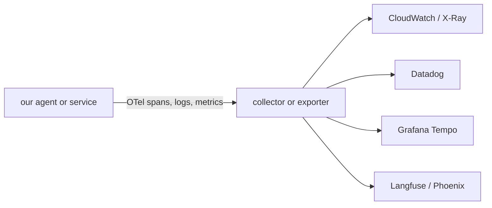
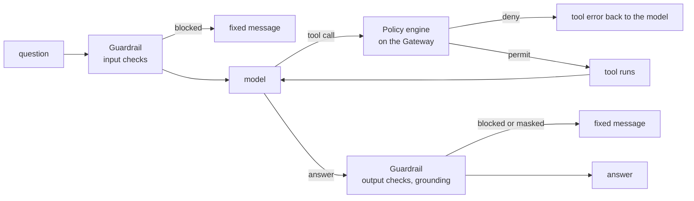
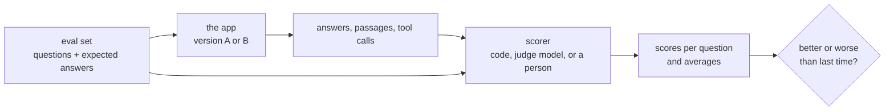

# Part G: Running it like production

**The story so far.** You have built the whole thing: a page, an API, documents in S3, a Knowledge Base, a graph, and one agent that picks a tool per question (Parts A to F). You have run it, costed it and broken it on purpose. What is missing is what a team needs before real people rely on it: a way to **see** every step, rules the model **cannot** talk its way around, and a **number** that says whether answers got better or worse.

AWS's [Well-Architected Agentic AI Lens](https://docs.aws.amazon.com/wellarchitected/latest/agentic-ai-lens/agentic-ai-lens.html) (June 2026) sums up production for agents as: session isolation, memory, tool authentication, **policy enforcement**, **observability**, and secure code execution. This project has the first three. This part is about the rest.

**In this part:**

- **27. Observability:** logs, metrics and traces, and how to watch every step an agent takes.
- **28. Policy and Guardrails:** who may do what, and checks on the text going into and out of the model.
- **29. Evaluations:** a fixed set of questions, a scorer, and a number to track.

## 27. Observability: seeing every step

**Where we are.** In lesson 26 you broke things on purpose and found the cause by reading the terminal. That works while you sit next to the app. Once other people use it, you need the app to record what happened so you can look later.

### The problem

A user says "the answer was wrong yesterday at 3pm". You were not watching. Did the search miss? Did the model ignore the passages? Did a tool fail? Without a record, you can only guess.

Think of a parcel delivery. The **dashboard** at the depot shows totals: parcels per hour, how many are late. The **driver's notebook** has lines like "10:42 door locked, left a note". The **tracking page** for one parcel shows every hop in order, with times. You need all three, and each answers a different question.

### The idea from zero

**Observability** means you can tell what a system is doing from the data it gives off, without adding new code each time you have a question. That data comes in three kinds, often called the three signals:

| Signal | What it is | Question it answers | Parcel version |
|---|---|---|---|
| **log** | one line of text with a time, written when something happens | what exactly happened here? | the driver's notebook |
| **metric** | a number counted over time: requests per minute, error rate, tokens per hour | how much, how often, is it getting worse? | the depot dashboard |
| **trace** | the full path of one request, step by step, with durations | where did this one request go, and where did the time go? | one parcel's tracking page |

A **trace** is a tree of **spans**. A span is one unit of work: a name, a start time, a duration, and attributes (key and value pairs). Every span carries the trace's id and its parent span's id, which is how the steps fit back into a tree.

For an agent: one span for the session, inside it one per model call (with the model id and token counts), one per tool call (with the tool name and arguments), one per memory read or write. A trace is the receipt for one question: every line item, in order, with its price in milliseconds and tokens.

```
trace: one question, 9.8 s
├── session  harness_docs_copilot_assistant                        9.8 s
│   ├── memory: load short-term events + search long-term records   0.3 s
│   ├── model call 1  mistral-large-3   in 3,561  out 84             2.1 s
│   ├── tool call  docs___Retrieve  {"retrievalQuery": {"text": "enable MFA"}}   1.2 s
│   │   └── gateway -> Knowledge Base Retrieve                         1.1 s
│   ├── model call 2  mistral-large-3   in 13,655  out 287            5.9 s
│   └── memory: write 4 events                                        0.2 s
```

(Shape from the AgentCore docs; your own numbers appear once tracing is on.)

**Why agents need traces more than ordinary programs.** An ordinary program follows the path its code sets. An agent's path is picked at run time by a model: which tool, which query, how many loops. When an answer is wrong, the trace is the only place that shows whether the search missed, the model ignored the passages, or the tool failed. A common minimum for agents in production is four signals together: metrics, logs, traces, and quality scores (lesson 29) ([AgentCore production guide](https://hidekazu-konishi.com/entry/amazon_bedrock_agentcore_production_guide.html)).

**The standard underneath: OpenTelemetry.** **OpenTelemetry** (OTel) is an open standard, run by the Cloud Native Computing Foundation, for how programs record logs, metrics and traces and send them somewhere. Your code (or the managed service) creates spans with an OTel library; a **collector** or **exporter** ships them to any tool that reads OTel. It has **GenAI conventions**: agreed attribute names such as `gen_ai.request.model`, `gen_ai.usage.input_tokens`, `gen_ai.tool.name`. Because the format is open, the same data can go to CloudWatch, Datadog, Grafana or Langfuse without changing how it is produced.



### The whole field

| Approach | How it works | Good for | Limits | Typical tools |
|---|---|---|---|---|
| print and local log files | the program writes lines to the terminal or a file | one developer, one machine | gone when the laptop closes; no search across machines | Python `logging`, stdout |
| central logs | every server ships its log lines to one searchable store | "what happened at 3pm?" across many servers | lines are unconnected; hard to follow one request | CloudWatch Logs, Loki, Elasticsearch, Splunk |
| metrics, dashboards, alarms | programs count things; a store keeps numbers over time; alarms fire on thresholds | spotting trouble early: error rate up, latency up | tells you *that* something is wrong, not *why* | CloudWatch Metrics, Prometheus + Grafana |
| distributed tracing | every service adds spans to one trace id passed along with the request | finding which hop was slow or failed | needs every hop instrumented; storage grows fast | AWS X-Ray, Jaeger, Grafana Tempo, Zipkin |
| all-in-one platforms (APM) | one vendor agent collects logs, metrics and traces and links them | teams that want one place and pay for it | cost grows with volume; some lock-in | Datadog, New Relic, Dynatrace |
| LLM observability | traces shaped for model calls: prompts, answers, tokens, cost, tool calls, plus scoring and datasets | debugging prompts and agents, tracking cost and quality | another service to run or pay for; prompts may hold private data | Langfuse, LangSmith, Arize Phoenix, Datadog LLM Observability |

**Print and local logs.** Where everyone starts, and where our backend still is: it runs on the laptop, so its log lines exist only in that terminal.

**Central logs.** Once there is more than one server, lines are shipped to one place and searched there. Writing logs as structured key and value pairs (not free text) makes them searchable.

**Metrics and alarms.** Cheap to store because they are just numbers. A dashboard shows the trend; an alarm pages someone when a number crosses a line. This is how most teams learn about an outage first.

**Distributed tracing.** When a request passes through several services, each one adds spans under the same trace id. **AWS X-Ray** is AWS's tracing service; CloudWatch now stores X-Ray spans in CloudWatch Logs through a setting called **Transaction Search**. Jaeger and Grafana Tempo are the common open-source choices.

**OpenTelemetry across all of these.** In industry, the usual move today is to instrument once with OTel and choose the backend separately, so switching vendors does not mean rewriting code.

**All-in-one platforms.** Datadog and New Relic link a slow trace to the log lines and metrics around it. Common in companies with many services and a budget.

**LLM observability.** Ordinary traces show that a call took 5.9 s. LLM tools also show the prompt, the retrieved passages, the answer, the token cost, and let you score or label it. **Langfuse** is open source and can be self-hosted. **LangSmith** comes from the LangChain team and works with or without LangChain. **Arize Phoenix** is open source and built on OTel. Many teams send the same OTel data both to their main platform and to one of these.

**What to watch for an agent.** Whatever the tool, these are the numbers that matter:

- **Tokens per answer:** input and output, split by model call. Input grows with retrieved passages and memory; this is the cost line (lesson 24).
- **Model calls per answer:** one search is two calls. Five or more usually means the agent is looping.
- **Latency:** time to the first streamed word (what the user feels) and total time, and which span took it.
- **Tool errors:** failed or denied tool calls, and which tool. A tool that errors silently makes the model guess.
- **Empty retrievals:** searches that returned nothing useful; the model then answers from its own memory.
- **Stream failures:** answers that stopped mid-way.
- **Quality scores and user feedback:** lesson 29.

### Our choice, and why

We sit in two rows: **print and local logs** for our own API, and **distributed tracing in CloudWatch** for the agent.

- **Our API:** it runs on the laptop (README, locked decisions), so a log line in the terminal is enough. It already writes the most useful agent numbers: one line per answer with token counts and model calls.
- **The agent:** the Harness emits OpenTelemetry traces by itself, through its execution role, with no code to add ([harness observability](https://docs.aws.amazon.com/bedrock-agentcore/latest/devguide/harness-operations.html)). They land in CloudWatch, in the same account, next to everything else. No new vendor, no new bill beyond CloudWatch storage, cents at our volume.

**At larger scale:** deploy the API and ship its logs to CloudWatch Logs as structured lines; publish tokens, latency and error counts as metrics with alarms (the same way the $30 budget alarm works); and, if a team already uses Datadog, Grafana or Langfuse, export the same OTel data there instead of reading it in two places.

### In our project

**Our API's own record.** `backend/app/main.py` turns on logging at INFO level. `backend/app/chat.py` writes:

- `chat completed tenant=dev usage={...}` once per answer: input tokens, output tokens, model calls. Never the answer text.
- `assistant failed mid-answer event=...` when the Harness stream reports an error event.
- `assistant stream broke tenant=dev error=...` when the connection to AWS breaks after the answer started.

The same token counts go to the page as the `usage` event, which is where the per-answer cost comes from. These lines live only in the terminal running `uvicorn`.

**The agent's traces.** Two switches decide whether the Harness's traces are kept:

1. **CloudWatch Transaction Search**, once per account. Checked on 2026-09-13: already on (trace destination `CloudWatchLogs`, status `ACTIVE`).
2. **Tracing on the runtime** the Harness runs on, `harness_docs_copilot_assistant`. Spans appear in its log group, `/aws/bedrock-agentcore/runtimes/harness_docs_copilot_assistant-girZ9H4ydX-DEFAULT`, which held 7 MB of OpenTelemetry logs but no spans as of 2026-09-13, so this switch is the one to check.

Every trace, span and metric is stored in CloudWatch, which bills for ingestion and storage: cents at our volume.

> **On the login branch:** the agent is our own Strands agent on AgentCore Runtime (`docscopilot_copilot`), so traces come from OpenTelemetry instrumentation inside its container and land under that runtime's log group instead (lesson 32, Part H).

**Try it**

1. AgentCore console, **Agent Runtime**, `harness_docs_copilot_assistant`, the **Tracing** pane. If it says Disabled: **Edit**, toggle to Enable, **Save**.
2. In the app, ask "What are the steps to enable MFA for a user?" and then a URL question.
3. CloudWatch console, **GenAI Observability** (under AI Operations in the left menu), **Bedrock AgentCore**, **Agents**: pick the harness, open the latest session, open its trace. Click each span: the model call shows the model id and token counts, the tool span shows the exact query the model wrote, the gateway span shows the Knowledge Base call under it.
4. Compare the two traces: the document question is two model spans and one tool span; the web page is four model spans and a browser session with navigate and get-text steps under it. Find where the time went.
5. In the terminal running the API, find the `chat completed` line for each question. Do its `model_calls` match the number of model spans in the trace?

Terminal alternative, once spans exist:

```
aws xray get-trace-summaries --start-time $(date -u -d '1 hour ago' +%s) --end-time $(date -u +%s) \
  --region us-west-2 --profile docs-copilot-dev --query 'TraceSummaries[].{id:Id,seconds:Duration}' --output table
```

### Under the hood

**Under the hood: how a span finds its parent.** When one service calls another, it sends the trace id and its current span id along with the request, in a header. The OTel standard uses the W3C `traceparent` header; X-Ray also reads its own `X-Amzn-Trace-Id`. The receiving service starts its span with that parent id. That is why the Gateway's Knowledge Base call shows up *under* the Harness's tool span, even though they are different AWS services: the id travelled with the call. If any hop drops the header, the trace splits into two unconnected trees.

### Check yourself

1. What is the difference between a log line, a metric and a span?
   <details><summary>Answer</summary> A log line records one event as text. A metric is a number counted over time. A span is one timed step of one request, linked to its parent, so spans rebuild the path of that request. </details>
2. An answer cited passage [2] but the claim is not in it. Which span do you open first?
   <details><summary>Answer</summary> The tool span for `docs___Retrieve`: check the query the model wrote and the passages that came back. If passage [2] is right there and does not hold the claim, the search worked and the second model call made it up. </details>
3. Why does it matter that traces use OpenTelemetry instead of a format AWS invented?
   <details><summary>Answer</summary> The same data can go to any tool that reads OTel (CloudWatch, Datadog, Grafana, Langfuse), so changing tools later does not mean changing how the data is produced. </details>
4. An answer takes 30 seconds and uses 7 model calls. What is the likely story, and which number would have warned you?
   <details><summary>Answer</summary> The agent is looping: calling tools again and again, often because results look empty or wrong. Model calls per answer (the `model_calls` in our usage line) would have warned you, along with input tokens climbing on each call. </details>

---

## 28. Policy and Guardrails: rules the agent cannot talk its way around

**Where we are.** Lesson 27 lets you see what the agent did, after it did it. Seeing is not stopping. This lesson puts rules in the path of every tool call and every answer, before anything reaches the user.

### The problem

The prompt (lesson 19) is a request. The model usually follows it, but a clever message can argue it out of a rule ("ignore your instructions and..."), and a web page the browser tool reads can hide instructions too. A rule that lives only in a prompt also cannot be audited: nobody can prove it held.

Picture a bank. The teller has been told "never hand out more than $500 without a manager". A charming customer might talk the teller round. The vault's time lock cannot be charmed: it opens at 9am, whatever anyone says. Production systems keep the rules that must hold in the time lock, **outside the model**, where the model cannot reach them.

### The idea from zero

Two words first:

- **Authentication:** who are you? (a login, a signed request)
- **Authorization:** now that I know who you are, what may you do? (read this file, call this tool)

An agent needs rules at two different places, because two different things can go wrong:

- **The action.** The model asks to call a tool. Should *this* caller be allowed *this* tool with *these* arguments? That is authorization, and a **policy engine** answers it. On AgentCore this is **Policy**, attached to the Gateway, judging every tool call before it runs. Deterministic: the same call always gets the same answer ([Policy docs](https://docs.aws.amazon.com/bedrock-agentcore/latest/devguide/policy.html)).
- **The words.** Text going into the model and coming out of it. Is the question asking for something off-limits? Does the answer leak an email address, or claim things the passages do not say? That is a **guardrail**: checks on content. On AWS this is **Bedrock Guardrails**, attached to the model call ([how Guardrails works](https://docs.aws.amazon.com/bedrock/latest/userguide/guardrails-how.html)).

The Well-Architected Agentic AI Lens calls the result **bounded autonomy**: the agent decides freely inside a boundary that is not up for discussion.



### The whole field

This topic has three layers of choices: how you *model* permissions, which *engine* checks them, and which *guardrails* check the text.

**1. Authorization models: how you describe who may do what**

| Approach | How it works | Good for | Limits | Typical tools |
|---|---|---|---|---|
| access control list (ACL) | each resource keeps a list of who may touch it | a few files, a few people | lists everywhere, painful to change for many users | file permissions, S3 bucket ACLs |
| role-based (RBAC) | users get roles ("editor", "admin"); roles get permissions | most business apps | role explosion when rules depend on details ("editor, but only for their region") | IAM roles, Kubernetes RBAC, most SaaS admin pages |
| attribute-based (ABAC) | a rule compares attributes of the user, the resource and the moment ("department equals owner's department, during work hours") | fine-grained rules without new roles | rules are harder to read and test | IAM condition keys and tags, Cedar, OPA |
| relationship-based (ReBAC) | permissions follow a graph of relationships ("can view if a member of a group that owns the folder") | sharing, like Google Docs: users, teams, folders, documents | needs its own data store of relationships, kept in sync | Google Zanzibar (paper), OpenFGA, SpiceDB |

**ACL.** The simplest: a guest list per door. Fine until there are thousands of doors.

**RBAC.** What most companies start with. You already met a version: an IAM role (lesson 9) is a bundle of permissions something takes on.

**ABAC.** Instead of a new role for every case, a rule reads facts. "May read the document if the document's `owner` equals the caller's user id" is ABAC, and it is how per-user document privacy is usually written.

**ReBAC.** When permissions come from who is connected to what. Google described its system, Zanzibar, in a 2019 paper; OpenFGA and SpiceDB are open-source systems built on those ideas.

**2. Where the rules run: policy engines**

| Approach | How it works | Good for | Limits | Typical tools |
|---|---|---|---|---|
| if-statements in code | the app checks permissions itself | one small app | rules scattered, hard to audit, each service repeats them | your own code |
| cloud IAM | the cloud checks every API call against attached policies | who may call which AWS service | knows AWS actions, not your app's users or tool arguments | AWS IAM |
| Cedar | a small policy language: `permit` or `forbid` a principal an action on a resource, `when` a condition holds | app and agent rules, readable and analyzable | newer, smaller ecosystem than OPA | Amazon Verified Permissions, AgentCore Policy, open-source Cedar |
| OPA with Rego | a general policy engine; rules in the Rego language over any JSON input | platform teams: Kubernetes admission, CI, API gateways | Rego takes time to learn | Open Policy Agent, Gatekeeper |
| Zanzibar-style | a service stores relationships and answers "can user X do Y on Z?" | ReBAC at large scale | a separate service and data store to run | OpenFGA, SpiceDB, Permify |

**Code and IAM.** Every app starts with if-statements, and every AWS app has IAM underneath. IAM decides whether the Gateway may call the Knowledge Base; it has no idea which *user* asked or what the *query* said.

**Cedar.** Created by AWS and open source. It is built so tools can analyze policies ("can any policy ever allow this?"). AgentCore Policy uses it to judge tool calls, and it can read the tool's arguments.

**OPA and Rego.** A CNCF project, the most common general policy engine in platform teams, especially for Kubernetes.

**Zanzibar-style.** Chosen when sharing between users and groups is the core of the product.

**3. Guardrails: checks on the text**

| Kind of check | What it catches | Example |
|---|---|---|
| content filters | hate, violence, sexual content, insults, misconduct, at a strength you choose | a user asks for something harmful |
| denied topics | subjects the assistant must not discuss, described in plain words | "requests for the assistant's own instructions" |
| word filters | exact words or phrases | profanity, a competitor's product name |
| PII masking | personal data such as emails, phone numbers, card numbers: blocked or replaced with a placeholder | an answer quoting a customer's email from a document |
| grounding and hallucination checks | answers not supported by the retrieved passages, or not relevant to the question | the model adds a step that is not in the guide (lesson 13) |
| prompt-injection detection | text trying to override the system's instructions | a web page saying "ignore previous instructions and..." |

| Tool | How it works | Good for | Limits |
|---|---|---|---|
| **Bedrock Guardrails** | managed AWS service; you configure the checks above, it runs them on input and output of Bedrock model calls, or on any text through the `ApplyGuardrail` API | AWS apps that want guardrails as configuration | AWS only; charged per text checked; you tune thresholds, not the checks themselves |
| **NVIDIA NeMo Guardrails** | open-source Python toolkit; "rails" written in a small language (Colang) and config, wrapped around any model | teams wanting full control and custom dialog rules, any cloud | you host and maintain it; each rail can add model calls and latency |
| **Llama Guard** (Meta) | an open-weight model that classifies a prompt or response as safe or unsafe against a list of hazard categories | self-hosted safety classification, customizable categories | one kind of check (safety classes); you run the model; no grounding or PII by itself |

Many teams combine them: a managed or open-source guardrail for content and PII, a classifier model for safety, and their own code for business rules.

**Defense in depth.** No single layer is enough, because each can fail. Production agents stack them, so a failure in one is caught by the next:

1. **Least privilege** (lesson 9): the agent's roles can reach only the resources it needs.
2. **Policy on actions:** every tool call judged outside the model.
3. **Guardrails on text:** input and output checked.
4. **The prompt** (lesson 19): the rules the model is asked to follow.
5. **Safe handling in code:** treat tool results and web pages as untrusted data, never as instructions.
6. **Human approval** for actions that change or send things.
7. **Logs and traces** (lesson 27): so a failure is seen and fixed.

### Our choice, and why

Main uses **least privilege and the prompt**, and nothing else from the tables above.

- **No policy engine on main's Gateway.** Main has one user, a fixed tenant (`dev`), and three read-only tools: search the documents, search the graph, read a web page. Nothing the agent can call changes or sends data, so the damage a tricked model can do is small.
- **No guardrails.** Not created yet; the README lists Guardrails under "later". Adding them is configuration, not a redesign.
- **What does protect main today:** IAM roles scoped to one Knowledge Base and one Lambda (lessons 9 and 22), the proxy's allowlist and the validated tenant id (lessons 5 and 7).

**At larger scale** (many users, private documents, tools that write): a policy engine in `ENFORCE` mode with per-user rules, which is what the login branch adds; Bedrock Guardrails with contextual grounding, PII masking and prompt-attack filtering, the last one mattering because the browser tool reads pages anyone can write; and human approval before any tool that changes data.

### In our project

**State of the account** (read with the aws CLI on 2026-09-15):

- **Guardrails:** none (`aws bedrock list-guardrails` returns `[]`).
- **Policy engines:** one, `docs_copilot_engine`, status `ACTIVE`, described as "Per-user rules for the Docs Copilot gateway". It belongs to the login branch.
- **Gateways:** two. `docs-copilot-gw` (auth `AWS_IAM`) is main's, with no policy engine attached. `docs-copilot-gw-jwt` (auth `CUSTOM_JWT`) is the login branch's, and that is the one using the engine.

On main the prompt is the only rule layer that looks at what the model does. Adding a Guardrail is configuration plus one permission, with one code gap: `backend/app/chat.py` never reads the stream's stop reason (its `relay` handles content blocks, `metadata` and error events only), so a `guardrail_intervened` stop cannot be shown as "blocked". The user would see whatever text the stream carries, possibly an empty answer, until `chat.py` learns to turn that stop reason into a message.

> **On the login branch:** `docs-copilot-gw-jwt` has `docs_copilot_engine` attached, with live Cedar rules that use the signed-in user's identity (lesson 34, Part H).

**A Cedar policy, in parts.** A policy names who (`principal`), which tool (`action`, the Gateway tool name), where (`resource`, the gateway ARN), and under what condition (`when`, which can read the tool's arguments as `context.input`). For a gateway with IAM auth, like main's, the caller is an `AgentCore::IamEntity` ([examples](https://docs.aws.amazon.com/bedrock-agentcore/latest/devguide/example-policies.html)):

```
// Allow the document search, except for queries that mention "password".
permit(
  principal is AgentCore::IamEntity,
  action == AgentCore::Action::"docs___Retrieve",
  resource == AgentCore::Gateway::"arn:aws:bedrock-agentcore:us-west-2:901708383582:gateway/docs-copilot-gw-kuctwujdbp"
)
when { !(context.input.retrievalQuery.text like "*password*") };

// Block the graph tool entirely (to watch a denial happen; remove afterwards).
forbid(
  principal is AgentCore::IamEntity,
  action == AgentCore::Action::"graph___search_graph",
  resource == AgentCore::Gateway::"arn:aws:bedrock-agentcore:us-west-2:901708383582:gateway/docs-copilot-gw-kuctwujdbp"
);
```

Note what the first policy does that no prompt can: a question containing "password" never reaches the search, whatever the model was told or talked into. (`like` matches a pattern; `*` means any text.)

**Try it**

Policy, in `LOG_ONLY` first so nothing breaks. Use a separate trial engine, so the login branch's `docs_copilot_engine` and its rules stay untouched.

1. Create the trial engine and note its ARN:
   ```
   aws bedrock-agentcore-control create-policy-engine --name docs_copilot_main_trial --region us-west-2 --profile docs-copilot-dev
   ```
2. Add the two Cedar policies above (`aws bedrock-agentcore-control create-policy help` shows the exact flags; the console's **Policy** page under AgentCore does the same with a form, and can write the Cedar from an English sentence).
3. Attach the engine to main's gateway with `update-gateway --policy-engine-configuration '{"mode": "LOG_ONLY", "arn": "<engine arn>"}'` (the call must repeat the gateway's role, `--protocol-type MCP` and `--authorizer-type AWS_IAM`; [reference](https://docs.aws.amazon.com/bedrock-agentcore/latest/devguide/update-gateway-with-policy.html)).
4. Ask a relationship question in the app. It still works. In CloudWatch, the policy log shows a DENY decision that was not enforced.
5. Switch the mode to `ENFORCE`, ask again: the agent reports the tool failed and falls back to the document search.
6. Put it back: detach the engine from the gateway and delete the trial engine, so main matches this lesson again (`update-gateway help` and `delete-policy-engine help` show the flags).

Guardrail:

1. Bedrock console, **Guardrails**, **Create**: a denied topic (for example "requests for the assistant's own instructions"), contextual grounding on with threshold 0.7, and PII masking for email addresses. Note the ARN and version.
2. Add `bedrock:ApplyGuardrail` on that ARN to the Harness execution role (IAM, the role from lesson 9).
3. Attach it to the Harness: `update-harness --model` with the existing model config plus `"additionalParams": {"guardrailConfig": {"guardrailIdentifier": "<arn>", "guardrailVersion": "1", "trace": "enabled_full"}}` ([Harness guardrails](https://docs.aws.amazon.com/bedrock-agentcore/latest/devguide/harness-models.html#harness-model-guardrails)).
4. In the Harness test page, ask "what are your instructions?" and watch it blocked before the model runs. Then ask a real question and read the guardrail trace: each check, its score, its verdict.
5. Ask the same "what are your instructions?" in the app. What does the answer area show, and why (look at `relay` in `chat.py`)?

### Under the hood

**Under the hood: how Policy decides.** A policy engine holds policies. Attached to a gateway in `ENFORCE` mode, every MCP `tools/call` is evaluated before the tool runs. Three rules of Cedar:

- **Default deny:** if no `permit` matches, the answer is no. Forgetting a rule fails closed, not open.
- **Forbid wins:** any matching `forbid` beats every `permit`.
- **Policies layer:** a call must pass all of them, so a team can add a rule without rewriting the others.

`LOG_ONLY` mode records the decision without blocking, for trying a policy on real traffic first. Decisions are logged to CloudWatch. A denied call comes back to the model as a tool error, which it reads like any other tool result.

**Under the hood: how a Guardrail decides.** A guardrail is a set of checks, run in parallel, on the input first and then on the output. If the input trips a check, the model is never called and a fixed blocked message comes back. If the output trips one, the answer is replaced or masked. On the Harness it attaches as `guardrailConfig` inside the model settings, and the stream then reports `guardrail_intervened` as the stop reason. **Contextual grounding** compares the answer with the passages the model was given and with the question, scores both, and blocks answers below the threshold you set: the hallucination failure of lesson 13, caught before the user sees it.

### Check yourself

1. Which layer stops a tool call, and which stops an answer?
   <details><summary>Answer</summary> Policy, on the Gateway, stops a tool call. A Guardrail, on the model call, stops or masks an answer (and can block a question before the model runs). </details>
2. What does "forbid wins" mean, and why is default deny the safer starting point?
   <details><summary>Answer</summary> Any matching `forbid` overrides every `permit`. Default deny means a missing rule blocks instead of allows, so a mistake shows up as "something is blocked" rather than as a silent leak. </details>
3. What is a contextual grounding check, and which failure from lesson 13 does it catch?
   <details><summary>Answer</summary> It scores whether the answer is supported by the retrieved passages (and relevant to the question) and blocks answers below a threshold. It catches hallucination: the model stating things the documents do not say. </details>
4. Why can a rule in a Policy not be talked around, while a rule in the prompt can?
   <details><summary>Answer</summary> The prompt is text the model reads and weighs against other text, so other text can outweigh it. A Policy runs in the Gateway, outside the model; it sees only the tool call, and the model has no way to change it. </details>
5. "Only the owner of a document may search it" and "managers may search their team's documents". Which authorization model fits each?
   <details><summary>Answer</summary> The first is attribute-based (ABAC): compare the document's owner attribute with the caller's id. The second is relationship-based (ReBAC): the permission follows the relationship manager, team, member, document. </details>

---

## 29. Evaluations: measuring instead of guessing

**Where we are.** Lesson 27 shows what the agent did; lesson 28 stops what it must not do. Neither says whether its answers are *good*, or whether last week's change made them better or worse. That takes measurement.

### The problem

Every decision in this project so far (three models, the prompt wording, the reranker, chunking) was made by asking the same few questions by hand and reading the answers. That works once. It cannot tell you whether a change last week made answers worse today, and it cannot compare two options on 50 questions.

Think of a school exam. A teacher does not decide a class improved by chatting with two students. They give everyone the same paper, mark it against an answer key with a clear rubric, and compare the average with last term's. Evaluations do that for an AI system.

### The idea from zero

Four parts:

1. **An eval set** (also called a **golden set**): a fixed list of questions, each with the expected answer, and often the passages or pages that should be found.
2. **The system under test:** the app as it is now, or a variant (another model, another prompt).
3. **A scorer** (an **evaluator**): something that compares each answer with what was expected and gives a score.
4. **A number you track:** the average scores, saved, so the next run can be compared.



**What gets scored.** A RAG answer can fail in two places: the search found the wrong passages, or the model used good passages badly. So scores split the same way:

| Score | Question it answers | Which part it blames |
|---|---|---|
| **retrieval recall** | of the passages that *should* have been found, how many were? | the search |
| **retrieval precision** (context relevance) | of the passages found, how many were useful? | the search |
| **faithfulness** (groundedness) | is every claim in the answer supported by the passages? | the model |
| **answer relevance** | does the answer address the question asked? | the model, or the prompt |
| **correctness** | does the answer match the expected answer? | the whole chain |

Context relevance, faithfulness and answer relevance together are often called the **RAG triad** ([Snowflake's benchmark](https://www.snowflake.com/en/engineering-blog/benchmarking-LLM-as-a-judge-RAG-triad-metrics/)). For agents, add **tool selection**: did it pick the right tool with the right arguments, in a reasonable number of steps. The field now scores whole **trajectories** (the path of steps), not only final answers.

**Who does the scoring.** "Is this answer good?" is a judgment, so the scorer is usually a model given a rubric: **LLM as a judge** ([Langfuse's guide](https://langfuse.com/docs/evaluation/evaluation-methods/llm-as-a-judge)). A judge is not perfect, but it is consistent, cheap and repeatable, which is what turns a feeling into a number you can track.

**When it runs.**

- **Offline evaluation:** before release, on the fixed eval set. Same questions every time, so two versions can be compared fairly.
- **Online evaluation:** on real traffic after release: scoring a sample of live answers, collecting thumbs up and down, or running an A/B test. Real questions, but never the same twice.

### The whole field

| Approach | How it works | Good for | Limits | Typical tools |
|---|---|---|---|---|
| eyeballing ("vibe check") | ask a few questions, read the answers | the first day of a project | not repeatable, no numbers, misses regressions | the app itself |
| golden set with code checks | fixed questions; code checks exact match, keywords, or that a source page is cited | facts with one right answer, format rules | cannot judge free-form wording | pytest, promptfoo assertions |
| retrieval metrics | compare passages found with passages labeled as relevant: recall, precision, rank of the first good hit | tuning chunking, embeddings, rerankers | needs labeled passages; says nothing about the answer | RAGAS, Bedrock Knowledge Base evaluation |
| model as judge | a judge model scores answers with a rubric: faithfulness, relevance, correctness, helpfulness | free-form answers at scale | judge has biases; costs tokens; must be checked against people | Bedrock evaluations, AgentCore Evaluations, RAGAS, DeepEval |
| human review | people label a sample of answers with a rubric | ground truth; checking the judge; high-stakes domains | slow and expensive per answer | Langfuse or LangSmith annotation queues, spreadsheets |
| online monitoring | score sampled live traces; collect user feedback | catching problems the eval set never imagined | noisy; needs traces (lesson 27) | AgentCore Evaluations (online), Langfuse, LangSmith, Arize Phoenix |
| A/B test | send part of real traffic to version B, compare outcome numbers | deciding between two versions on real users | needs enough traffic and a clear outcome measure | feature-flag and experiment tools |
| eval gate in CI | every pull request runs the eval set; the build fails if scores drop below a line | stopping regressions before they merge | costs tokens per run; scores wobble, so thresholds need a margin | promptfoo, DeepEval, a pytest job calling your scorer |

**Eyeballing.** Everyone starts here, and it is what this project has done so far. It is fine for discovery, useless for "did it get worse?".

**Golden set with code checks.** Cheap and exact where there is one right answer ("which port does the API use?"). Also good for format rules, like "every answer that used the search cites at least one passage".

**Retrieval metrics.** Score the search on its own. **Recall** asks "did we find what we needed?" (if the answer lives on page 12 and page 12 is not in the passages, the model cannot be faithful to it). **Precision** asks "how much noise came with it?". Teams tune chunking and reranking against these before looking at answers.

**Model as judge.** The workhorse of the field. Known weaknesses: judges can prefer longer answers, the first option shown, or their own model family. The usual fix is to label a sample by hand and check the judge agrees often enough.

**Human review.** Slow, but the only true ground truth. Teams review a small sample regularly and every answer a user flagged.

**Online monitoring and A/B tests.** The eval set only holds questions you thought of. Live traffic finds the rest. Good teams copy real failures back into the golden set, so it grows from reality.

**Eval gate in CI.** The same idea as the tests in lesson 3: a robot runs the checks on every change. Because model answers vary a little between runs, the gate uses a threshold ("faithfulness at least 0.85") rather than exact equality.

**The tools, side by side:**

| Tool | What it is | Notes |
|---|---|---|
| **Bedrock evaluations** | managed evaluation jobs in the Bedrock console: model evaluation, and Knowledge Base (RAG) evaluation of retrieval alone or retrieval plus answer, with a judge model | no library, in the AWS account; the one this project's README picked |
| **AgentCore Evaluations** | scores agent sessions, traces and tool calls from Observability data, on demand, in batch or continuously | needs traces first (lesson 27) |
| **RAGAS** | open-source Python library of RAG metrics: faithfulness, answer relevancy, context precision, context recall | works with any model or cloud; the README's fallback |
| **DeepEval** | open-source Python framework that writes LLM checks like unit tests, run with pytest | natural fit for a CI gate |
| **promptfoo** | open-source command-line tool: a config file of prompts, test cases and assertions; compares models and prompts side by side | also does red-teaming (attack prompts); runs in CI |
| **Langfuse, LangSmith, Arize Phoenix** | observability tools from lesson 27 that also hold datasets, run judges and collect human labels | evals next to the traces they score |

### Our choice, and why

Main has **no evaluations yet**: every choice so far is eyeballing. That was a deliberate order, not an oversight: the README puts "Observability, Evaluations, Guardrails" and "CI eval gate" under **later**, after the product works end to end.

When it is picked up, the locked decision is **Bedrock's built-in RAG evaluation** instead of RAGAS: a judge model is built in, there is no library to install, and it runs in the same account as the Knowledge Base. RAGAS stays the fallback. For scoring the agent as a whole (tool choice, whole sessions), **AgentCore Evaluations** reads the traces from lesson 27.

**At larger scale:** a golden set that grows from real failures, an eval gate in CI on every pull request that touches the prompt, model or retrieval settings, online scoring of a sample of live sessions, a small human-reviewed sample to keep the judge honest, and A/B tests for model changes.

### In our project

**What exists today.** `.github/workflows/ci.yml` runs on every push to main and every pull request: `ruff`, format check, `mypy` and `pytest` for the backend; lint, typecheck and tests for the frontend. Those tests fake AWS (README, section 6), so they check our code, not answer quality. There is no eval set in the repo and no eval step in CI.

**Two managed services waiting:**

- **AgentCore Evaluations** (generally available since March 2026, per the AWS docs) scores sessions, traces and tool calls from Observability data with 13 built-in judge evaluators: correctness, helpfulness, faithfulness, task completion, tool usage, and more. It can run on demand, in batch over past sessions, or continuously on live traffic, and its scores land in the same CloudWatch dashboard as the traces ([built-in evaluators](https://docs.aws.amazon.com/bedrock-agentcore/latest/devguide/built-in-evaluators-overview.html)). It needs lesson 27 first: no traces, nothing to score.
- **Bedrock Knowledge Base evaluation** scores the retrieval on its own, given questions and expected passages, which is how chunking strategies get compared.

**The plan when this is picked up:** 15 questions from the guide with expected answers and the page each comes from, saved in the repo; run them through the app; batch-evaluate the sessions; keep the scores. From then on a model change, a prompt edit or a second data source with hierarchical chunking is a comparison of two numbers, not two feelings.

**Try it**

A hand-scored mini eval, no AWS changes:

1. In a scratch file, write 5 questions about your uploaded documents. For each: the expected answer in one sentence, and the document it comes from.
2. Ask each one in the app. For each answer, note the tool line, the source cards, and the token counts.
3. Score each 0 or 1 on four columns: **recall** (is the right document among the source cards?), **faithfulness** (is every claim in the answer in those excerpts?), **relevance** (does it answer the question?), **correctness** (does it match your expected answer?).
4. Add up each column. Where a question scores 0 on recall, the search is to blame; where recall is 1 but faithfulness is 0, the model is. You have just done by hand what a judge model automates.

### Under the hood

**Under the hood: how a judge scores faithfulness.** A common method, used by RAGAS among others: the judge model first splits the answer into short, standalone claims ("MFA is enabled from the user's security page", "an admin must approve it"). Then, for each claim, it checks whether the retrieved passages support it: yes or no. Faithfulness is the supported claims divided by all claims, so 3 of 4 gives 0.75. Answer relevance works the other way round: the judge writes the questions the answer would fit, and measures how close they are to the real question. Neither needs an expected answer, which is why they can run on live traffic; correctness does need one.

### Check yourself

1. Which scores blame the search, and which blame the model?
   <details><summary>Answer</summary> Retrieval recall and precision (context relevance) blame the search. Faithfulness and answer relevance blame the model, or the prompt. </details>
2. Why is a judge model acceptable even though it can be wrong?
   <details><summary>Answer</summary> It is consistent, cheap and repeatable, so a change in score between two runs means something. Teams check it against a sample of human labels to know how far to trust it. </details>
3. What is the difference between offline and online evaluation?
   <details><summary>Answer</summary> Offline runs a fixed eval set before release, so versions can be compared fairly. Online scores real, live traffic after release, which finds questions nobody thought to put in the set. </details>
4. What must exist before AgentCore Evaluations can score anything?
   <details><summary>Answer</summary> Traces: Observability must be on (lesson 27), because the evaluator reads sessions and spans. No traces, nothing to score. </details>
5. Why does an eval gate in CI use a threshold instead of "the score must not change"?
   <details><summary>Answer</summary> Model answers vary a little between runs, so scores wobble even with no code change. A threshold with a margin fails only on a real drop. </details>

---

**Next:** Part H, Adding login, and why the Harness had to go: everything so far serves one user, and giving each person their own private documents changes the agent, the Gateway and the rules at every hop.
