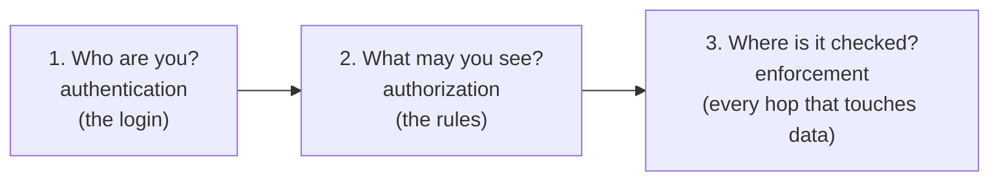
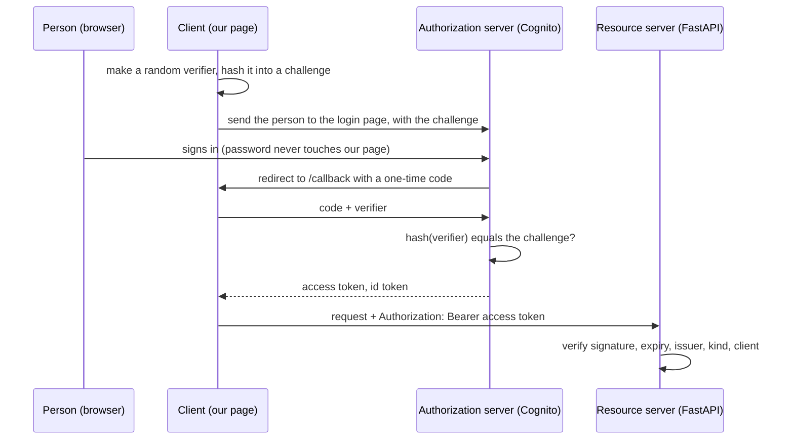
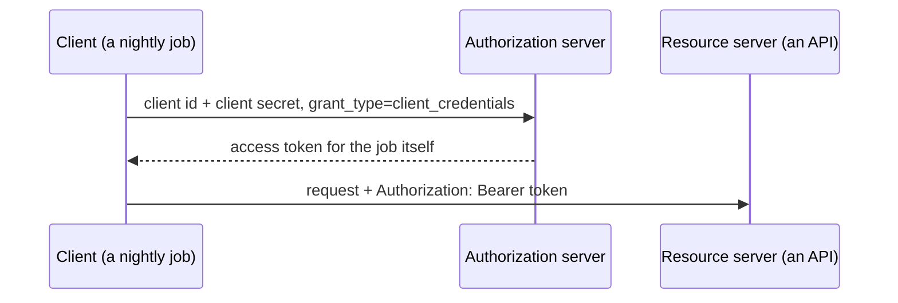
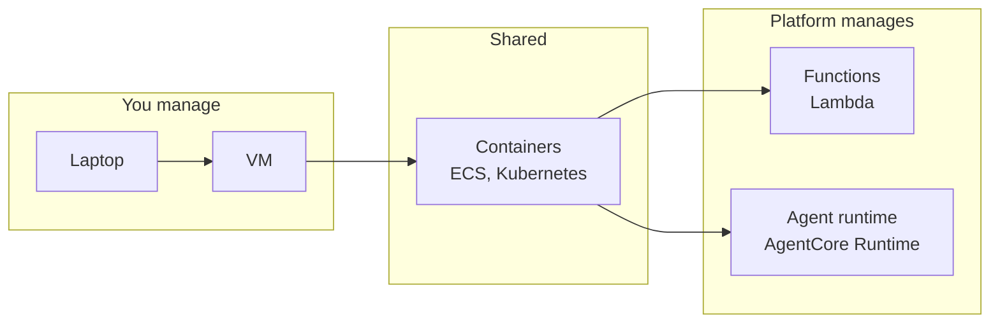
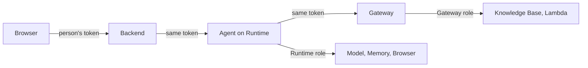
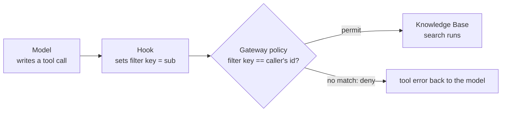
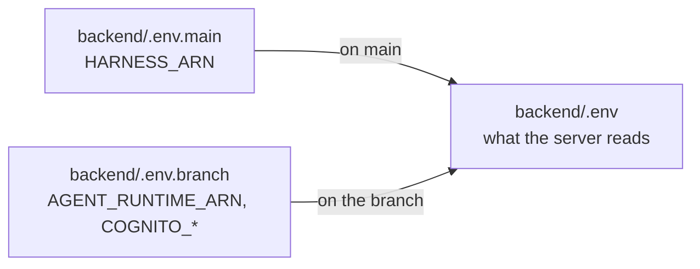
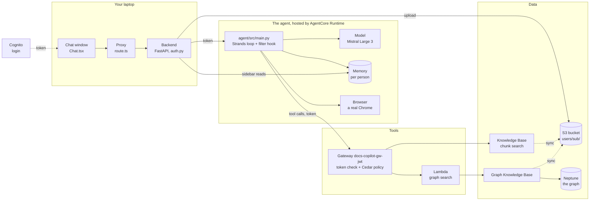

# Part H: Adding login, and why the Harness had to go

**The story so far.** You have built and run the whole of Docs Copilot on `main`: a page, a FastAPI backend, a Knowledge Base, a knowledge graph, and the AgentCore Harness answering with tools, memory and a browser. You have also seen how production teams watch, fence and measure an agent (Part G). There is one thing `main` cannot do: tell people apart. It has one user, called `dev`. This part follows the branch `feat/login-runtime-agent`, where the app learns who is asking, keeps each person's documents private, and in the process has to replace the Harness with an agent of our own.

**In this part:**

- **30. Why the Harness had to go:** the need for many people with private documents, the four ways we tried, the two walls, the decision.
- **31. Login from zero:** passwords, sessions, tokens, OAuth, OpenID Connect, JWTs, and how our page signs in with Cognito.
- **32. Hosting your own agent:** laptops, virtual machines, containers, functions and agent runtimes, and how our agent runs on AgentCore Runtime.
- **33. Your identity at every hop:** how one person's login travels from the browser to the tools, and how data stays apart.
- **34. Rules the model cannot break:** the live Cedar policy on the Gateway, the proof, and the one honest gap.
- **35. What changed everywhere else, and running it:** every earlier lesson that changes, the new big picture, switching branches, tests, deploy, cleanup.

## 30. Why the Harness had to go

**Where we are.** Part G ended with an agent that is watched, fenced and measured, but that still serves exactly one person. This lesson is the turning point of the story: what it took to serve many people, and why the managed agent we liked could not come along.

### The problem

On `main`, everyone who opens the page is the same user, `dev`. Every upload lands in `tenants/dev/`, every chat is stored under the actor `dev`, and every search sees every document. That is fine for a demo on one laptop. It is not fine the moment a second person uploads their payslip.

Think of an office with one big filing cabinet. Anyone who walks in can open any drawer. A bank does it differently: one building, one vault, but every customer has their own safe deposit box, the guard checks your ID at the door, and the box only opens with your key. The building is shared; what is inside each box is not.

We needed the bank. Three things, all at once:

1. **Know who is asking.** A real login, not a header that says `dev`.
2. **Keep each person's things apart.** Files, chats, memory and search results, per person.
3. **Make the rule hold even if the model misbehaves.** The agent decides which tool to call and with which arguments. A rule that the model can forget is not a rule.

### The idea from zero

**A tenant** is one customer whose data must stay apart from everyone else's. It can be a company (in business software) or a single person (in ours). **Multi-tenancy** means one running copy of the app serves many tenants at once, instead of one copy per customer.

Every multi-tenant app answers the same three questions, in order:



The third question is the hard one in an agent app, because a question passes through many programs:

```
browser --> backend --> agent --> model
                          |
                          +--> Gateway --> Knowledge Base  (the documents)
                          +--> Memory                      (the chats)
```

The backend can know who you are. But the search does not happen in the backend. It happens two hops later, when the agent calls the Gateway. So "who is asking" has to survive the trip from the backend, through the agent, to the Gateway. If it is lost on the way, the Gateway only sees "the agent", and the agent works for everybody.

**What `main` already had.** The door existed but was never locked. Every upload wrote a small label next to the file, `{"metadataAttributes": {"tenant_id": "dev"}}` (lesson 10), so a search *could* be limited to one label. Nothing ever applied that limit, because there was only one user.

### The whole field

Once we added a login (lesson 31), four ways to make the search per person were on the table. They go from least to most work.

| Approach | How it works | Good for | Limits | Typical tools |
|---|---|---|---|---|
| **Filter in our backend** | the backend knows the user and tells the agent, in the message or the prompt, to search only that user's label | a quick prototype | the model writes the tool call, so the filter is only as reliable as the model; the Gateway still cannot tell who asked | any agent, any framework |
| **JWT inbound on the Harness** | the Harness checks the person's login token itself instead of an AWS signature | knowing who called the agent | the Harness calls the Gateway as its own AWS role, so the person's identity stops at the Harness | AgentCore Harness with a JWT authorizer |
| **3-legged OAuth through the token vault** | the Harness asks AgentCore Identity's token vault for a token *for this person*, and calls the Gateway with it | agents that call other companies' apps (GitHub, Google) as the person | the person must consent once through a return address; the product path must support it end to end | AgentCore Identity outbound credential providers |
| **Our own agent** | write the loop ourselves, receive the person's token, and pass the same token on to every tool call | full control over identity and every tool call | we now own about 200 lines of code, their tests and their deploy | Strands, LangGraph, OpenAI Agents SDK, on a runtime (lesson 32) |

**Filter in our backend.** The easiest. It fails the third requirement: if a clever message talks the model into leaving out the filter, or writing someone else's, nothing downstream can notice. It also leaves the Gateway blind, so no policy there could help.

**JWT inbound on the Harness.** A **JWT** is a signed login token (lesson 31). AgentCore lets a Harness accept one on the way in. We tried it, and it works for that one hop. But when the Harness then calls a tool, it signs the call with its own AWS role. The person is gone.

**3-legged OAuth through the token vault.** "3-legged" means three parties: the person, the app, and the login service (lesson 31). AgentCore Identity has a **token vault** built for exactly this: it keeps OAuth clients and hands an agent a token that acts for one person. This is what the Harness offers for acting as a person downstream.

**Our own agent.** What most teams do once they need per-user rules inside the loop: use a framework, host it somewhere, and treat the user's identity as ordinary data the code passes along. The price is owning code that a managed service used to own.

**The two walls.** We went down the table in order, and hit these:

1. **JWT on the Harness works, but the token does not travel.** The Harness accepts the person's token inbound. It cannot forward that token to a Gateway. The Gateway still sees only the Harness's role.
2. **The token vault path never started.** Every attempt to have the Harness fetch a person's token failed with the same error: `You must provide a ResourceOauth2ReturnUrl`. That is the address the person's browser returns to after consenting. The Harness never sends it, so the consent step could not begin. Tested four ways on 2026-09-14.

With both managed routes closed, only the last row was left.

### Our choice, and why

**Our own agent**, written with **Strands** and hosted on **AgentCore Runtime**. The decision, as recorded in the branch's `README.md`:

| Decision | Instead of | Why, in one line |
|---|---|---|
| Our own Strands agent on AgentCore Runtime | the AgentCore Harness | the Harness cannot carry a person's identity to the Gateway with Cognito (tested four ways, 2026-09-14); our own code can, and Cedar on the Gateway then enforces per-person search |

Why this is not as big a step as it sounds:

- **Strands is the framework the Harness itself is built on** (lesson 16). The loop, the model call and the tools are the same library; we just call it ourselves.
- **Runtime is the hosting service the Harness itself runs on** (lesson 17). Same isolated machine per session, same region, same memory resource.
- **The token becomes one line.** `MCPClient(url=GATEWAY_URL, headers={"Authorization": f"Bearer {token}"})`: the Gateway now sees the person.
- **We gain a hook.** Code that runs before every tool call and writes the filter itself, so the model never chooses it (lesson 33).

At a larger scale the shape would stay the same. What would change: a login provider that can issue a fresh token per downstream service (token exchange, lesson 33), a policy on every tool rather than one, and isolated storage for tenants that pay for it.

### In our project

- **The branch:** `feat/login-runtime-agent`. Main keeps the Harness and no login; nothing on main was removed.
- **The Harness stays deployed** for main: `docs_copilot_assistant`, with its IAM Gateway `docs-copilot-gw-kuctwujdbp`. The branch README's plan: retire both after the demo.
- **The new pieces**, each with its own lesson: Cognito login (31), the agent in `agent/` (32), the token at every hop (33), the Cedar policy on a new Gateway `docs-copilot-gw-jwt` (34).
- **What was removed on the branch:** `backend/app/tenancy.py` (the `X-Tenant-Id` check) and `backend/prompts/assistant.md` (the prompt moved into the agent's code, lesson 19).

### Try it

See the whole chapter as commits, oldest at the bottom, without leaving your branch:

```
git log --oneline main..feat/login-runtime-agent
```

prints (captured 2026-09-15):

```
83d8412 docs: audit fixes for the branch demo (graph is shared, branch switch, second account, map hop label)
90960f1 docs: know what you built, on one page, for the login version
2676b23 feat: container build for the Runtime agent (browser driver needs it); CI job for agent tests; course consistency pass and OAuth from zero
4dea9e2 feat: the agent searches the web on DuckDuckGo when no URL is given (prompt rule 1)
001e7ba docs: placeholders instead of the test users' ids
7166c2d docs: course, README and demo for the login, the Runtime agent and the Cedar policy
408140d feat: Strands agent on AgentCore Runtime replaces the Harness
e5b0228 wip: Cognito login, per-user documents, Strands agent on Runtime
```

And the size of the change:

```
git diff --stat main feat/login-runtime-agent | tail -1
```

```
 57 files changed, 10863 insertions(+), 886 deletions(-)
```

Most of those lines are generated: `agent/uv.lock`, `agent/src/requirements.txt` and the CDK project's `package-lock.json`. The hand-written core is `backend/app/auth.py` (100 lines), `frontend/lib/auth.ts` (142) and `agent/src/main.py` (202).

### Under the hood

**Under the hood: AgentCore Identity, the three parts**

**AgentCore Identity** is the AWS piece for the two identities IAM (lesson 9) does not cover: the *end user* talking to the agent, and the *agent itself* when it reaches other apps ([Identity docs](https://docs.aws.amazon.com/bedrock-agentcore/latest/devguide/identity.html)). It has three parts:

| Part | What it is | On `main` | On this branch |
|---|---|---|---|
| **workload identity** | an identity record for each agent and gateway, created automatically; how an agent proves *which agent* it is to the token vault | exists on the Gateway (`workload-identity/docs-copilot-gw-kuctwujdbp`), unused | exists for the Runtime and the new Gateway, unused by our code |
| **inbound authorizer** | a JWT check on a Harness, Runtime or Gateway: callers send a login token instead of an AWS signature, checked against the provider's discovery URL and allowed client ids | not used: the backend signs with IAM as your user | on the Runtime and on the Gateway (lessons 32 and 33) |
| **outbound credential providers** and the **token vault** | stored OAuth clients and API keys, so an agent can call GitHub, Google or Slack, as itself (2-legged) or as a person after consent (3-legged), without the code seeing the secret | not used: every tool is inside our account | tried for the Harness and dropped: the return URL wall above |

**Why the halves are linked.** Per-person outbound tokens only make sense when the inbound call carried a person. With IAM inbound, the agent does not know which human asked, so AWS's Harness docs say plainly that SigV4 callers get no per-user identity propagation ([Harness security](https://docs.aws.amazon.com/bedrock-agentcore/latest/devguide/harness-security.html)). On `main` there is no login and no third-party app, so both halves have nothing to do. On the branch, the inbound half is in use, and the outbound half was replaced by simply forwarding the same token.

### Check yourself

1. Name the three questions every multi-tenant app answers, and say which one was hard for an agent.
<details><summary>Answer</summary>

Who are you (authentication), what may you see (authorization), and where is it checked (enforcement). The third was hard: the search happens two hops after the backend, at the Gateway, so the person's identity has to survive the trip through the agent.
</details>

2. Why is "filter in our backend" not enough, even if the model follows the instruction every time we test it?
<details><summary>Answer</summary>

The model writes the tool call, so the filter is only a request to the model. A clever message can talk it out of it, and the Gateway, which only sees the agent's role, has no way to notice.
</details>

3. JWT inbound on the Harness worked. Why did it not solve the problem?
<details><summary>Answer</summary>

It only covers the call into the Harness. The Harness calls the Gateway as its own AWS role and cannot forward the person's token, so the Gateway still cannot tell who asked.
</details>

4. What did the error `You must provide a ResourceOauth2ReturnUrl` mean?
<details><summary>Answer</summary>

The token vault's 3-legged flow needs an address to send the person back to after they consent. The Harness never sent one, so the consent step could not start and no per-person token was ever issued.
</details>

5. Why was writing our own agent a smaller step than it sounds?
<details><summary>Answer</summary>

The Harness is built on Strands and runs on AgentCore Runtime. Our agent uses the same framework on the same hosting service; what we add is about 200 lines that pass the token along and a hook that sets the filter.
</details>

## 31. Login from zero

**Where we are.** Lesson 30 decided the app must know who is asking. Before any token can travel through the agent, someone has to hand one out. This lesson builds login from nothing: passwords, sessions, tokens, OAuth, and the exact way our page signs in.

### The problem

The app must be sure that the person asking for "my documents" really is that person, without ever touching their password, and every later program in the chain must be able to check that too.

The everyday version is a hotel. The front desk checks your passport once. It gives you a key card that opens your room and the gym until Thursday. The room door never sees your passport; it only checks the card. If you lose the card, the desk cancels it, and you are still you. Login systems are built on exactly that split: prove who you are once, at one desk, and carry a card everywhere else.

### The idea from zero

**Two words that every login story mixes up:**

- **Authentication** answers *who are you?* Signing in is authentication.
- **Authorization** answers *what may you do?* IAM policies (lesson 9) and Cedar rules (lesson 34) are authorization.

A login proves the first. Everything that reads "who" and decides "what" is the second.

**Step 1: the password, and why nobody stores it.** The oldest login is a username and a password. A careful server never saves the password itself. It saves a **hash**: the result of a one-way function that is easy to compute and practically impossible to reverse. At sign-in, the server hashes what you typed and compares hashes. It adds a random **salt** per user first, so two people with the same password get different hashes, and it uses a deliberately slow hash (bcrypt, scrypt or Argon2) so guessing billions of passwords takes too long. A fast hash like plain SHA-256 is the wrong tool for passwords.

**Step 2: remembering you between requests.** HTTP forgets everything between requests (lesson 4). There are two ways to avoid asking for the password on every click:

| | **Session and cookie** | **Token** |
|---|---|---|
| after sign-in the server gives you | a random session id in a **cookie** | a signed **token** |
| the server keeps | a table: session id to user | nothing: the token carries the facts, signed |
| each request | the browser sends the cookie automatically | the page sends `Authorization: Bearer <token>` |
| to check it | look the id up in the table | verify the signature |
| good for | one website with one server | many services that all need to check the same person |

A **cookie** can be marked `HttpOnly` (page scripts cannot read it), `Secure` (HTTPS only) and `SameSite` (not sent from other sites). A token does not need a shared table, which is why it wins when many separate programs (our backend, Runtime, the Gateway) must each check the same person.

**Step 3: API keys, for programs.** An **API key** is a long random string that identifies a program, not a person. It is simple, and it is how many public APIs start. It usually never expires, carries no user, and is only as safe as the place it is stored.

**Step 4: OAuth 2.0, letting one program act for you at another.** OAuth is the standard way a program gets a token to act for you, without you giving it your password. Four roles appear in every OAuth story:

| Role | Plain words | In our project |
|---|---|---|
| **resource owner** | the person | you |
| **client** | the program that wants to act for the person | our web page |
| **authorization server** | the login service that checks the person and issues tokens | Cognito |
| **resource server** | the program that holds what the person wants, and checks the token | FastAPI, Runtime and the Gateway |

**Step 5: grant types, the ways to get a token.** OAuth defines several **grants**, one per situation:

| Grant | Who is present | How it works | Use it for |
|---|---|---|---|
| **authorization code + PKCE** | a person | the client sends the person to the login page, gets a one-time code back, trades it for tokens | any app with a person: web pages, phone apps, desktop apps |
| **client credentials** | no person | the program sends its client id and secret, gets a token for itself | machine to machine: a nightly job, one service calling another |
| **device code** | a person, on another screen | the device shows a short code; the person types it on their phone; the device polls until approved | TVs, command-line tools, anything without a good keyboard |
| **refresh token** | nobody new | the client trades a long-lived refresh token for a fresh access token | staying signed in after the access token expires |
| **implicit** (deprecated) | a person | the token came straight back in the browser's address bar | nothing now: tokens leaked through browser history and logs |
| **resource owner password** (deprecated) | a person | the app collects the password itself and sends it to the login service | nothing now: it defeats the point of never showing the app your password |

Current OAuth security guidance (RFC 9700) says not to use the last two. **PKCE** (Proof Key for Code Exchange, said "pixie") was added to the authorization code grant for clients that cannot keep a secret, and is now recommended for every client.

**2-legged and 3-legged.** The "legs" are the parties in the handshake.

**3-legged: a person, a client, a login service.** The person is present and consents. This is the authorization code grant, and it is what our page does:



**2-legged: a client and a login service, no person.** The token acts as the program itself. This project does not use it; its AWS services use IAM roles for that job instead (lesson 9).



**Step 6: OpenID Connect, the "who" on top of OAuth.** OAuth on its own only says "this token may do X". It does not define how the client learns *who* signed in. **OpenID Connect (OIDC)** adds that: ask for the scope `openid`, and the login service returns an **id token** describing the person (their id, and their email if you ask for the `email` scope). OIDC also defines a **discovery document** at `/.well-known/openid-configuration` listing the provider's endpoints and where its public keys live. Cognito, Google, Okta and Entra ID all speak OIDC.

**Step 7: what a JWT is.** A **JWT** (JSON Web Token, said "jot") is three base64url pieces joined by dots:

```
eyJhbGciOiJSUzI1NiIsImtpZCI6Ii4uLiJ9 . eyJzdWIiOiI8eW91ciBzdWI+Iiwi... . k3Xy9...
|---------- header ----------|        |--------- claims ---------|     |-- signature --|
{"alg": "RS256", "kid": "<key id>"}   {"sub": "<your sub>",             RSA signature over
                                       "iss": "https://cognito-idp...",  header + claims,
                                       "client_id": "pnij50p1g7e237mffctm84v9v",
                                       "token_use": "access",            made with the pool's
                                       "scope": "openid email",          PRIVATE key
                                       "exp": 1789...}
```

- **Anyone can read the claims.** Base64 is an encoding, not encryption. Never put a secret in a token.
- **Only the issuer can make the signature**, with its private key. Change one character of the claims and the signature no longer matches.
- **Anyone can verify the signature** with the issuer's public key.

**Step 8: JWKS, where the public keys live.** The issuer publishes its public keys as a **JWKS** (JSON Web Key Set) at a fixed URL. Each key has a `kid` (key id), and each token's header names the `kid` that signed it. A verifier fetches the set once, caches it, and fetches again only when a token names a key it has not seen, which is how key rotation works without downtime.

**Step 9: three tokens, three jobs.**

| Token | For | Who reads it | Lifetime |
|---|---|---|---|
| **access token** | proving to an API that this person may act | resource servers | short, often an hour |
| **id token** | telling the client who signed in | the client only; never send it to an API as proof | short |
| **refresh token** | getting a new access token without signing in again | the login service only | long: days or months |

### The whole field

Login is solved in many ways. From simplest to most advanced:

| Approach | How it works | Good for | Limits | Typical tools |
|---|---|---|---|---|
| **Password + server session** | the app stores salted password hashes and a session table; a cookie carries the session id | a single website | you own password storage, reset emails, breach risk | Django auth, Rails Devise, Passport.js |
| **API keys** | a long random string per program | server-to-server access to a public API | no user, no expiry by default, easy to leak | Stripe keys, AWS access keys (lesson 9) |
| **OAuth 2.0 + OIDC tokens from a provider** | a login service signs people in and issues JWTs; apps verify signatures | apps with many services, phone apps, APIs | more moving parts: redirects, keys, expiry | Cognito, Auth0, Okta, Entra ID, Keycloak |
| **Social login** | the provider lets people sign in with an account they already have | consumer apps that want fewer abandoned sign-ups | you depend on Google or Apple being up and allowing you | Sign in with Google, Apple, GitHub |
| **Enterprise SSO** | one company login opens every work app | business software sold to companies | each customer's setup differs; SAML is XML-heavy | SAML 2.0, OIDC, Okta, Entra ID |
| **MFA and passkeys** | a second factor, or no password at all | anything worth stealing | recovery when a device is lost | TOTP apps, WebAuthn passkeys |

**Password + server session.** The classic. Fine for one site, but you own every hard part: hashing, lockouts, reset links, breach notices. Most teams now avoid building this themselves.

**API keys.** Right for programs, wrong for people. A key identifies *who is calling* at the level of an app, not a person, and it rarely expires.

**OAuth 2.0 + OIDC.** The industry default for modern apps: a dedicated login service, tokens that every service can check on its own, and standard libraries in every language.

**Social login.** An OIDC provider you did not run. Most providers (Cognito included) can **federate**: your pool trusts Google or Apple, and still issues its own tokens to your app.

**Enterprise SSO.** **Single sign-on** means signing in once for many apps. Companies usually do it through **SAML 2.0**, an older XML standard where the company's identity provider sends a signed "assertion" to each app, or through OIDC. Business software is expected to support both.

**MFA and passkeys.** **Multi-factor authentication** asks for two of: something you know (a password), something you have (a phone app showing a 6-digit TOTP code), something you are (a fingerprint). SMS codes are the weakest second factor because phone numbers can be hijacked. **Passkeys** (the WebAuthn standard) replace the password with a key pair made per website on your device; the site keeps only the public key, and a fake site cannot use it, which makes passkeys resistant to phishing.

**Who runs the login service.** An **identity provider** (IdP) is the product that plays authorization server:

| Provider | Kind | Known for |
|---|---|---|
| **Amazon Cognito** | managed, AWS | user pools, hosted managed login, cheap at small scale, native to AWS services |
| **Auth0** | managed (owned by Okta) | developer experience, many ready integrations |
| **Okta** | managed | workforce SSO for companies |
| **Microsoft Entra ID** (formerly Azure AD) | managed | companies on Microsoft 365 |
| **Keycloak** | open source, you host it | full control, no per-user fee, you run the servers |
| **Clerk** | managed | drop-in sign-in components for web frameworks |
| **Firebase Authentication** | managed, Google | phone and web apps on Firebase |

### Our choice, and why

**Cognito with managed login, authorization code with PKCE, a public app client.**

- **Cognito**, because every other piece is AWS and AgentCore's JWT authorizers take any OIDC discovery URL. Its free tier covers the first 10,000 monthly users (lesson 24).
- **Managed login**, Cognito's hosted sign-in page, so our code never sees a password and we store no hashes.
- **A public client** (no client secret), because a page in a browser cannot keep a secret: anyone can open the developer tools.
- **PKCE**, because without a secret, PKCE is what stops a stolen code from being traded for tokens.
- **Scopes `openid email`**: the email is the only thing the page shows.
- **Tokens in `sessionStorage`**: per browser tab, gone when the tab closes. Page scripts can read it, so a script injected into the page (cross-site scripting) could steal a token; the one-hour expiry limits the damage.
- **No refresh token.** After an hour the next request gets a 401 and the page signs in again. The code comment in `frontend/lib/auth.ts` marks this as a deliberate shortcut.

**At a larger scale:** keep the tokens out of the browser entirely with a backend-for-frontend that holds them and gives the page an `HttpOnly` cookie (our Next.js proxy, lesson 7, is already in the right place for that), use refresh tokens, turn on MFA or passkeys in the pool, put the login page on our own domain, and add SAML or OIDC federation for company customers.

### In our project

**The AWS side.** A Cognito user pool `us-west-2_kMn6l3sGV` and one app client `pnij50p1g7e237mffctm84v9v`. These ids are public identifiers, not secrets: they appear in every login URL. The pool's discovery URL, which Runtime and the Gateway use (lesson 33):
`https://cognito-idp.us-west-2.amazonaws.com/us-west-2_kMn6l3sGV/.well-known/openid-configuration`.

**The page signs in** (`frontend/lib/auth.ts`, four steps):

| Step | Function | What it does |
|---|---|---|
| 1 | `signIn()` | makes a 64-character random verifier, keeps it in `sessionStorage` under `pkce_verifier`, sends the browser to `<domain>/oauth2/authorize` with `response_type=code`, the client id, `redirect_uri=<origin>/callback`, the scope, and `code_challenge` = SHA-256 of the verifier, base64url, method `S256` |
| 2 | (Cognito) | shows the login page; on success redirects to `/callback?code=...` |
| 3 | `finishSignIn()` | on `frontend/app/callback/page.tsx`: posts `grant_type=authorization_code`, the code, the same redirect URI and the verifier to `<domain>/oauth2/token`; stores the access token, the id token and an expiry one minute early under `tokens` |
| 4 | `accessToken()` | returns the access token, or null when absent or expired |

Two more: `currentEmail()` reads the email from the id token, only to show it in the header (not verified, which is fine for display). `signOut()` forgets the tokens and sends the browser to Cognito's `/logout`.

**Every request carries the token** (`frontend/lib/api.ts`): `apiFetch()` adds `Authorization: Bearer <token>`. No token: sign in. A 401 back: forget the tokens and sign in. The proxy (`frontend/app/api/[...path]/route.ts`) forwards exactly two headers to FastAPI: `authorization` and `content-type`.

**The backend verifies it** (`backend/app/auth.py`). `get_user` is a FastAPI dependency (lesson 5) on every route. It reads the `Authorization` header, then `verify_access_token` checks, in order:

1. **signature**, with the pool's public key for the token's `kid`, from the JWKS URL, cached by PyJWT's `PyJWKClient`; algorithm `RS256` only
2. **expiry**: `exp` is in the future (and `exp`, `iat`, `sub`, `token_use`, `client_id` must all be present)
3. **issuer**: `iss` is `https://cognito-idp.us-west-2.amazonaws.com/us-west-2_kMn6l3sGV`
4. **kind**: `token_use` is `access`, because the id token has the same signer
5. **app client**: `client_id` is ours, so a token minted for another app on the same pool is refused

Any failure is a 401 `Sign in to continue.` with `WWW-Authenticate: Bearer`; the reason goes to the log only. If Cognito's key endpoint cannot be reached, the answer is a 503: our problem, not the caller's. The routes receive a `User` with `id` (the `sub`) and `token` (the raw token, forwarded to the agent in lesson 33).

**Settings.** `backend/.env` holds `COGNITO_USER_POOL_ID` and `COGNITO_CLIENT_ID`; `backend/app/settings.py` builds the issuer and the JWKS URL from them. `frontend/.env.local` holds `NEXT_PUBLIC_COGNITO_DOMAIN` and `NEXT_PUBLIC_COGNITO_CLIENT_ID`: the `NEXT_PUBLIC_` prefix means the browser receives them, which is fine for public identifiers.

**Tests.** `backend/tests/test_auth.py`: a good token gives the `sub`; an expired token, another pool, an id token, another app client, a wrong signature and garbage are all 401 without saying why; a missing header or a wrong scheme is 401. `frontend/lib/auth.test.ts` checks the PKCE hash against Cognito's own documented example.

### Try it

Get a token for your own account without the page. The app client allows Cognito's direct sign-in API for testing; the page never uses it. **(app running)** for the last two lines:

```
TOKEN=$(aws cognito-idp initiate-auth --client-id pnij50p1g7e237mffctm84v9v --auth-flow USER_AUTH \
  --auth-parameters USERNAME=you@example.com,PREFERRED_CHALLENGE=PASSWORD,PASSWORD='...' \
  --region us-west-2 --profile docs-copilot-dev --query AuthenticationResult.AccessToken --output text)
echo $TOKEN | cut -d. -f2 | tr '_-' '/+' | base64 -d 2>/dev/null | python3 -m json.tool
curl -H "Authorization: Bearer $TOKEN" localhost:8001/v1/sessions
curl localhost:8001/v1/sessions
```

- **The second line** prints the claims in plain JSON: look for `sub` (your permanent id), `iss`, `client_id`, `token_use` and `exp`. (If `base64` complains about padding, the JSON may still print; it is only the missing `=` at the end.)
- **The third** returns your chats as JSON.
- **The fourth** has no token and returns `{"detail":"Sign in to continue."}` with status 401, before any AWS call.

Now break the signature on purpose: change the last character of `$TOKEN` and call again. Still 401. The claims did not change; the signature no longer matches them.

### Under the hood

**Under the hood: why PKCE stops a stolen code**

The code comes back in the browser's address bar, the least private place on a computer: history, extensions, a malicious app registered for the same link on a phone. Without PKCE, a public client has no secret, so whoever holds the code can trade it.

PKCE adds a secret that is made per sign-in and never leaves the tab:

```
before the redirect:   verifier  = 64 random characters        kept in sessionStorage
                       challenge = base64url(SHA-256(verifier)) sent to Cognito in the URL
at the token endpoint: the page sends the code AND the verifier
                       Cognito computes base64url(SHA-256(verifier)) and compares with the challenge
```

A thief sees the code and, at most, the challenge. Getting the verifier back from the challenge would mean reversing SHA-256. So the stolen code is useless, and the real page, which kept the verifier, is the only one that can finish.

### Check yourself

1. What is the difference between authentication and authorization? Give one example of each from this project.
<details><summary>Answer</summary>

Authentication proves who you are: signing in on Cognito's page. Authorization decides what you may do: the Cedar rule that only lets you search documents labelled with your own id, or an IAM policy.
</details>

2. Why does our page use authorization code with PKCE and not the client credentials grant?
<details><summary>Answer</summary>

Client credentials is for a program acting as itself, with a secret. Our page acts for a person and runs in a browser, where no secret can be kept. The authorization code grant brings the person, and PKCE replaces the missing secret with a per-sign-in verifier.
</details>

3. Anyone can read a JWT's claims. Why can nobody change `sub` to someone else's id?
<details><summary>Answer</summary>

The signature covers the header and the claims and is made with the pool's private key. Changing any claim breaks the signature, and every verifier checks it with the pool's public keys from the JWKS URL.
</details>

4. Why does `auth.py` check `token_use` and `client_id`, when the signature is already valid?
<details><summary>Answer</summary>

The id token is signed by the same pool, so a valid signature alone could let an id token pass as an access token. And other app clients on the same pool get validly signed tokens too; checking `client_id` refuses tokens minted for a different app.
</details>

5. Where does the page keep the token, what is the risk, and what would a larger app do instead?
<details><summary>Answer</summary>

In `sessionStorage`, per tab. Any script running in the page can read it, so cross-site scripting could steal it; the one-hour expiry limits the damage. A larger app would keep tokens on a backend-for-frontend and give the browser only an `HttpOnly` cookie.
</details>

## 32. Hosting your own agent

**Where we are.** Lesson 31 gave the page a token. Lesson 30 decided that our own code, not the Harness, must receive it. Code has to run somewhere. This lesson is about that somewhere: every common way to host a program, and how our agent ended up in a container on AgentCore Runtime.

### The problem

On `main`, AWS ran the agent for us. Now the agent is a Python file, `agent/src/main.py`, and it has to be reachable from the backend at any hour, handle several people at once, keep one person's session away from another's, check the caller's token, and stop costing money when nobody is asking.

Think of a food business. You can cook in your own kitchen (only works while you are home), rent a restaurant (you pay rent even when it is empty), sell from a food truck that parks wherever there is space (portable, but you still drive it), cater through a service that brings its own kitchen per event (you only bring the recipe), or join a food court built for your kind of food, where the landlord handles the doors, the cleaning and the security, and you just cook.

### The idea from zero

**A program needs four things to run:** a machine (CPU and memory), an operating system, its dependencies (the libraries in `pyproject.toml`), and a way for requests to reach it (a port, lesson 3). Every hosting option is a different split of who provides which of those.

**A virtual machine (VM)** is a whole computer simulated in software on a bigger physical one. You get an operating system and do everything else yourself.

**A container** packs your program *with its dependencies and a minimal operating system userland* into one file, the **image**, which runs the same on any machine with a container engine. Unlike a VM, containers share the host's operating system kernel, so they start in seconds and are small.

**A Dockerfile** is the recipe for an image. Ours, `agent/src/Dockerfile`, in full:

```dockerfile
FROM python:3.12-slim                             # start from an image that already has Python
WORKDIR /app                                      # every later path is inside /app
COPY requirements.txt .                           # the pinned dependency list
RUN pip install --no-cache-dir -r requirements.txt  # install them
COPY main.py .                                    # our code, last
EXPOSE 8080                                       # Runtime talks to the agent on 8080
CMD ["python", "main.py"]                         # what runs when the container starts
```

**Layers.** Each instruction adds a **layer**: a saved snapshot of the files it changed. When you rebuild, every layer whose inputs did not change is reused from cache. That is why the file copies `requirements.txt` and installs it *before* copying `main.py`:

```
layer 1  python:3.12-slim                 reused
layer 2  requirements.txt                 reused unless dependencies changed
layer 3  pip install (the slow one)       reused unless layer 2 changed
layer 4  main.py                          rebuilt on every code change: small and fast
```

Copy the code first and every one-line code change would reinstall every library.

**arm64.** Processors speak different instruction sets. Most laptops and older servers are **x86-64**; Apple Silicon and AWS's Graviton processors are **arm64**. An image is built for one of them, and a machine of the other kind cannot run it directly. AgentCore Runtime runs arm64, so our image must be built for arm64. Building arm64 on an x86 laptop needs emulation; the AgentCore CLI avoids that by building in the cloud, in CodeBuild (AWS's build-machine service).

**A serverless function** is the smallest unit: you upload one function, and the platform runs it per call, starts more copies under load, and bills per call. Our graph search Lambda (lesson 18) is one.

**A managed agent runtime** is hosting designed for agents: long, streaming, tool-calling sessions, each isolated, with the caller's identity checked at the door.



### The whole field

| Approach | How it works | Good for | Limits | Typical tools |
|---|---|---|---|---|
| **Laptop** | run the program in a terminal | building and testing | off when the lid closes; one machine; not reachable from outside | `uv run`, `npm run dev` |
| **Virtual machine** | rent a computer, install everything, keep it running | full control, long-running servers, unusual software | you patch the OS, handle scaling, pay while idle | Amazon EC2, Google Compute Engine, Azure VMs |
| **Containers on an orchestrator** | ship an image; the orchestrator places, restarts and scales copies | most production web services today | clusters, networking and deploys to learn; always-on copies cost money | Amazon ECS (on Fargate or EC2), Kubernetes (EKS, GKE, AKS), Google Cloud Run |
| **Serverless functions** | upload a function; runs per call, scales to zero | short event-driven work: a webhook, a small tool | a time limit per call (15 minutes on Lambda), cold starts, awkward for long streams | AWS Lambda, Google Cloud Functions, Azure Functions |
| **Managed agent runtime** | ship agent code or an image; the platform runs one isolated session per conversation and checks callers | agents: long streaming turns, per-session isolation, identity at the door | tied to one cloud's agent services; newer, fewer knobs | Amazon Bedrock AgentCore Runtime, Google Vertex AI Agent Engine, Azure AI Foundry Agent Service |

**Laptop.** Where every program starts, and where our page and backend still run (lesson 26). It stops being enough the moment something must be reachable when you are not.

**Virtual machine.** Maximum control, maximum chores. Teams still use VMs for databases they run themselves, for special hardware, and for software that expects a whole machine.

**Containers on an orchestrator.** The industry's default for services. An **orchestrator** keeps the requested number of copies running, replaces crashed ones and rolls out new versions. **Amazon ECS** is AWS's simpler one; on **Fargate** you do not even see the machines. **Kubernetes** is the open-source standard every cloud offers (EKS on AWS), powerful and much more to learn. Our budget rules out EKS.

**Serverless functions.** Perfect for small tools, and a poor fit for an agent turn that can stream for minutes and open a browser.

**Managed agent runtime.** The newest row. It is a container platform shaped for agents: a separate small machine per session, so one person's files and memory in the process never meet another's, and an inbound authorizer, so a request without a valid token never reaches your code.

### Our choice, and why

**AgentCore Runtime, with a container image.** It sits in the last row because:

- **It already checks the token.** Runtime's JWT authorizer verifies the person's Cognito token before our code runs (lesson 33). On ECS we would write that ourselves.
- **One isolated machine per session.** Two people's turns never share a process.
- **It bills per second while a session is busy**, nothing while idle (lesson 24).
- **It is the same service the Harness ran on**, next to our Memory, Browser and Gateway, in `us-west-2`.

Only the agent is deployed. The page and the API still run on the laptop (a locked decision in the README), because the agent is where the token chain and the traces live.

**A container, not a zip.** Runtime can also take a zip of the code. Our first deploy did, and the browser tool failed on Runtime with `PermissionError(13)` while it worked on the laptop (the story is in Under the hood below). A Runtime cannot switch from zip to container, so the agent was recreated under a new name: `docscopilot_docscopilotagent-zvW96BDxn1` became `docscopilot_copilot-cEMT6NGCod`.

**At a larger scale:** the same Runtime, with the page and API moved onto ECS Fargate or a static host behind a load balancer, images built by CI on every merge, and separate `dev` and `prod` deployment targets.

### In our project

**The folder.** `agent/` is its own Python project, separate from `backend/`, because it has its own dependencies and its own container:

```
agent/
  pyproject.toml, uv.lock     dependencies: bedrock-agentcore, mcp, strands-agents, strands-agents-tools[agent-core-browser]
  src/main.py                 the agent (202 lines)
  src/requirements.txt        the pinned list the container installs, made by `uv export --no-dev --no-hashes --no-emit-project`
  src/Dockerfile              the recipe above
  tests/test_main.py          5 tests: the hook, the token, the event translation
  agentcore/agentcore.json    the Runtime's settings
  agentcore/aws-targets.json  where to deploy: account 901708383582, us-west-2
  agentcore/cdk/              the CDK project the CLI deploys with
  agentcore/.cli/deployed-state.json   what was deployed: runtime id, ARN, role, stack name
```

**The Runtime's settings** (`agent/agentcore/agentcore.json`, the runtime entry):

| Setting | Value | Means |
|---|---|---|
| `name` | `copilot` | with the project name, the Runtime is `docscopilot_copilot` |
| `build` | `Container` | build an image from `src/Dockerfile` (was `CodeZip`) |
| `codeLocation`, `entrypoint` | `src/`, `main.py` | what goes into the build |
| `networkMode`, `protocol` | `PUBLIC`, `HTTP` | reachable over the internet, spoken over HTTP |
| `authorizerType` | `CUSTOM_JWT` | callers must bring a login token, not an AWS signature |
| `customJwtAuthorizer.discoveryUrl` | the Cognito pool's `/.well-known/openid-configuration` | where Runtime finds the issuer and the public keys |
| `customJwtAuthorizer.allowedClients` | `pnij50p1g7e237mffctm84v9v` | only tokens minted for our page's app client |
| `requestHeaderAllowlist` | `Authorization` | the request headers passed through to our code; without this, the code could not read the token to forward it |
| `environmentVariables` | `GATEWAY_URL`, `MEMORY_ID` | read by `main.py` at start |

`runtimeVersion` still says `PYTHON_3_14`, left from the zip build; with a container, the image's own Python (3.12, from the Dockerfile) is what runs.

**Deploying.** One command, from `agent/`:

```
npx @aws/agentcore deploy --yes
```

What it does: reads `agentcore.json`, builds the arm64 image in CodeBuild, and deploys the CloudFormation stack `AgentCore-docscopilot-default` from `agent/agentcore/cdk`, which creates or updates the Runtime and its role `AgentCore-docscopilot-def-ApplicationAgentCopilotRu-XbAAaqizEXVJ`. **CDK** (Cloud Development Kit) is AWS's way of describing resources in code (TypeScript here) that it turns into a **CloudFormation** template, AWS's own deploy format. The CLI generated that CDK project; we never edited it.

Two things bit on the first deploy (lesson 25): the build said `tsc: command not found`, then complained about an option newer TypeScript removed. Fix: run `npm install` inside `agent/agentcore/cdk` once, so the project's own pinned TypeScript is used.

The role got one policy added by hand, `DocsCopilotAgentTools`: call the model, read and write our memory, use the browser. The Gateway is *not* in it: the agent calls the Gateway with the person's token, not with the role (lesson 33).

**The contract with Runtime.** `BedrockAgentCoreApp()` makes a small web server on port 8080 with two routes: `POST /invocations` (one turn) and `GET /ping` (health check). Runtime routes each request by the header `X-Amzn-Bedrock-AgentCore-Runtime-Session-Id` (33 to 100 characters; the backend uses a UUID), so every turn of one chat reaches the same session machine.

**A walk through `agent/src/main.py`, top to bottom:**

1. **Settings.** `REGION`, `GATEWAY_URL` (the JWT Gateway `docs-copilot-gw-jwt-mkbslle0rs`), `MEMORY_ID` (`docs_copilot_assistant-6aIbceHbw1`, the same memory main uses) and `MODEL_ID` (`mistral.mistral-large-3-675b-instruct`), each overridable by an environment variable.
2. **`SYSTEM_PROMPT`.** The seven rules of lesson 19, now in code. It says nothing about the per-person filter: that is code, not a request.
3. **`OwnDocumentsOnly`**, a Strands **hook**. Before every tool call, if the tool is `docs___Retrieve`, it sets `retrievalConfiguration.managedSearchConfiguration.filter` to `{"equals": {"key": <user id>, "value": "owner"}}`, replacing anything the model wrote (lesson 33).
4. **`user_id_from(token)`.** Decodes the middle part of the token and returns `sub`. It does not verify the signature, on purpose: Runtime already did, before this code ran.
5. **`memory_for(user_id, session_id)`.** An `AgentCoreMemorySessionManager` with the person's id as `actor_id`. Before each turn it searches `/actors/{actorId}/facts/` and `/actors/{actorId}/preferences/` (top 5, relevance at least 0.3) and this session's summary (top 1) (lesson 20).
6. **`translate(event)`.** Turns Strands' stream events into five small JSON shapes: `text`, `tool`, `tool_result`, `usage`, and `error`.
7. **`app = BedrockAgentCoreApp()`** and the **entrypoint** `chat(payload, context)`:
   - reads `Authorization` from `context.request_headers`; no token yields an `error` event and stops
   - reads the message; empty yields an `error` event
   - opens the Gateway as an `MCPClient` with `Authorization: Bearer <the same token>`
   - makes an `AgentCoreBrowser` tool
   - builds `Agent(model=BedrockModel(...streaming=True), tools=[gateway, browser.browser], system_prompt=..., session_manager=memory_for(...), hooks=[OwnDocumentsOnly(user_id)])`
   - streams `agent.stream_async(message)` and yields each translated event as a JSON string; Runtime frames each yield as one Server-Sent Event line (lesson 6)
   - on any exception, logs it and yields an `error` event (first 300 characters); `finally` stops the Gateway client
8. **`if __name__ == "__main__"`** runs the server on `PORT`, default 8080, so it can run on a laptop next to the backend.

**What comes out**, captured on 2026-09-15 for one question with one search:

```
{"type": "tool", "name": "docs___Retrieve", "input": {"retrievalQuery": {"text": "expense approval rule"}}}
{"type": "tool_result", "text": "{\"retrievalResults\":[...]}"}
{"type": "text", "text": "Expenses under $50 need no approval..."}
{"type": "usage", "input_tokens": 16920, "output_tokens": 44, "model_calls": 2}
```

The `tool` line shows the model's own input, *without* the filter: the hook changes the call on its way to the tool, not the model's message.

**The backend's side** (`backend/app/chat.py`). No AWS SDK: SDKs sign with IAM, and a Runtime with a JWT authorizer accepts bearer tokens. So `agent_events` uses a plain streaming HTTP client, `httpx2`, with a 300-second read timeout, and posts to
`https://bedrock-agentcore.us-west-2.amazonaws.com/runtimes/<ARN, URL-encoded>/invocations?qualifier=DEFAULT`
with the person's token and the session header. It opens the stream *before* the response starts, so a refusal can still become a real 401, 503 or 502. `read_events` decodes each `data:` line twice, because Runtime JSON-encodes the JSON string the agent yielded.

**CI.** `.github/workflows/ci.yml` has a third job, `agent`: `uv sync --locked`, `ruff check`, `ruff format --check`, `pytest`.

### Try it

Run the agent on the laptop exactly as Runtime would, from `agent/`:

```
cd agent
PORT=8081 AWS_PROFILE=docs-copilot-dev uv run python src/main.py
```

In a second terminal, with `$TOKEN` from lesson 31's Try it, call it the way the backend does:

```
curl -N -X POST localhost:8081/invocations -H "Content-Type: application/json" \
  -H "Authorization: Bearer $TOKEN" -H "X-Amzn-Bedrock-AgentCore-Runtime-Session-Id: $(uuidgen)" \
  -d '{"message": "What is the expense approval rule?"}'
```

Every line that comes back is one of the shapes above. Two things differ from the real Runtime: nothing checks the token on your laptop (Runtime's authorizer does that in AWS), and the calls to the model, memory and browser use your own `docs-copilot-dev` credentials instead of the Runtime role. The Gateway still checks the token either way.

Then the same against AWS: replace `localhost:8081/invocations` with the Runtime URL above, using `AGENT_RUNTIME_ARN` from `backend/.env`. Drop the `Authorization` header and Runtime refuses before your code runs.

### Under the hood

**Under the hood: why the zip broke the browser**

The browser tool (lesson 21) drives a real Chrome that AWS runs, using **Playwright** (`playwright==1.62.0` in `src/requirements.txt`). Playwright's Python package ships a small **driver program** inside it, and the library starts that program as a separate process.

On Linux, a file can only be started as a program if its **execute permission bit** is set. `pip install` on the laptop sets it. The zip deploy packed the installed files into a zip, and when that zip was unpacked on Runtime the driver arrived without its execute bit. Starting it failed with error number 13, `EACCES`, which Python reports as `PermissionError(13)`. The same code worked on the laptop because nothing was zipped there.

A container image does not have this problem. Its layers are tar archives, which record each file's permissions, and `pip install` runs *inside* the image build on Linux, so the driver is executable in the image exactly as it would be on any Linux machine. The fix was not a code change: it was a different way of packaging the same code.

### Check yourself

1. Why does the Dockerfile copy `requirements.txt` and install it before copying `main.py`?
<details><summary>Answer</summary>

Each instruction is a cached layer. With dependencies first, a code change only rebuilds the small last layer; the slow install layer is reused. The other order would reinstall every library on every edit.
</details>

2. Why is a Lambda function a poor home for this agent, when it is fine for the graph search?
<details><summary>Answer</summary>

The graph search is one short call. An agent turn streams for up to minutes, makes several model calls and may drive a browser. Functions have a per-call time limit and cold starts, and no per-session isolation or login check at the door.
</details>

3. What does Runtime do before `chat()` runs, and why does `user_id_from` skip checking the signature?
<details><summary>Answer</summary>

Runtime's JWT authorizer verifies the token against the Cognito discovery URL and the allowed client id, and routes the request to the session's machine. Because a request with a bad token never reaches our code, reading `sub` without verifying again is safe.
</details>

4. What would break if `requestHeaderAllowlist` did not list `Authorization`?
<details><summary>Answer</summary>

Runtime would still verify the token, but the header would not be passed to our code. `chat()` would find no token, yield an error, and could not forward it to the Gateway.
</details>

5. The same code worked on the laptop and failed on Runtime as a zip. What was different, and why did a container fix it?
<details><summary>Answer</summary>

The zip lost the execute permission on Playwright's driver program, so starting it failed with `PermissionError(13)`. A container image keeps file permissions in its layers, and the install runs inside the Linux build, so the driver stays executable.
</details>

## 33. Your identity at every hop

**Where we are.** The page has a token (lesson 31) and the agent has a home that checks it (lesson 32). A question still passes through four programs before it touches a document. This lesson follows the person's identity through every one of them, and shows how their data stays apart from everyone else's.

### The problem

Checking the token at the front door is not enough. The document search happens at the Gateway, two hops after the backend. The chats live in Memory. The files live in S3. At each of those places, something must know *whose* request this is, and must not be fooled by a program in the middle.

Think of a hospital wristband. At admission, the desk checks your ID once and puts a band on your wrist. The ward nurse, the lab and the pharmacy each scan the same band before they act. They do not re-admit you, and they do not take the porter's word for who you are. If the band did not travel with you, the pharmacy would have to trust whoever walked in holding a prescription.

### The idea from zero

**A hop** is one program calling another. At every hop there are two separate questions:

1. **Which program is calling?** Answered by the program's own identity: an IAM role (lesson 9).
2. **On whose behalf?** Answered by the person's identity: here, their Cognito token.

On `main`, only the first question existed: every hop was a role, and the person was always `dev`. On the branch, both travel together. The program's role still decides what AWS actions it may take; the person's token decides whose data those actions may touch.



**Data isolation** is the other half: once each hop knows who is asking, the data must be arranged so that asking for "mine" can only ever return mine.

### The whole field

Two parts: how identity travels, and how data is kept apart.

**Carrying a person through services**

| Approach | How it works | Good for | Limits | Typical tools |
|---|---|---|---|---|
| **Forward the same token** | each service passes the person's token unchanged to the next; each verifies it | a few services that all trust one login pool | a token accepted everywhere can be replayed anywhere that trusts the pool; no per-service limits | any OIDC provider; plain `Authorization` headers |
| **Token exchange / on-behalf-of** | a middle service trades the person's token at the login service for a new one aimed only at the next service | many services, least privilege per hop | needs a login service that offers it; an extra call per hop | OAuth token exchange (RFC 8693), Microsoft Entra on-behalf-of flow, Keycloak, Okta |
| **Service identity + user id claim** | the caller authenticates as itself and passes "this is for user 123" as a field | internal systems where services trust each other | the next service must trust the caller not to lie about the user | IAM roles or mTLS between services, plus a request field |
| **Trusted internal headers** | an edge gateway verifies the token once and adds `X-User-Id`; inner services trust that header | a private network behind one gateway | anyone who reaches the inner network can forge the header | API gateways (AWS API Gateway authorizers, Kong), service meshes (Istio, Envoy) |

**Forward the same token.** The simplest honest chain: nobody in the middle can change who the person is, because nobody in the middle can sign. The cost is that every service accepts the same token, so a leaked token works everywhere in the chain until it expires.

**Token exchange.** The grown-up version. Each hop gets a token that is valid only for the next service (its **audience**), often with fewer permissions. A leaked token is then useful in one place only.

**Service identity + user id claim.** Common inside companies: services prove who *they* are to each other and pass the user id as data. It works when the caller is trusted, and fails silently when it is not.

**Trusted internal headers.** Fast and simple, and only as safe as the network wall around the inner services.

**Keeping tenants' data apart.** Cloud architects often call these three models **silo**, **bridge** and **pool**:

| Model | How it works | Good for | Limits | Typical tools |
|---|---|---|---|---|
| **Silo: a separate stack per tenant** | each tenant gets their own copy: account, database, index | regulated or very large customers | cost and operations multiply by the number of tenants | a separate AWS account or deployment per customer |
| **Bridge: shared app, separate data store per tenant** | one app, but a database, schema or search index per tenant | medium tenants who need hard data walls | many indexes to create, sync and pay for | an index per tenant, a Knowledge Base per tenant, a schema per tenant |
| **Pool: shared everything, filtered by tenant** | one data store; every row or chunk carries a tenant label; every query filters on it | many small tenants, lowest cost | one missed filter leaks data, so the filter must be enforced, not remembered | database row-level security, search metadata filters, S3 prefixes |

Most products start with **pool** for everyone and move their biggest or most regulated customers to **bridge** or **silo** later.

### Our choice, and why

**Forward the same token, and the pool model with an enforced filter.**

- **Forwarding** works because every hop trusts the same Cognito pool and checks the same app client. Our chain is short (backend, Runtime, Gateway), and all of it is ours.
- **Pool** because one Knowledge Base, one bucket and one memory resource cost pennies, and the Knowledge Base already supports metadata filters. A Knowledge Base per person would multiply sync jobs and resources for no gain at this size.
- **The filter is enforced twice**, so neither the model nor a bug can skip it: the agent's hook writes it, and the Gateway's Cedar policy refuses any search without the caller's own id (lesson 34).

**Honest gaps.** The backend still calls S3 and Memory as your IAM user with `AdministratorAccess` (the dev shortcut from lesson 9); the per-person folder and actor come from the verified token *in code*, not from IAM. And the knowledge graph is shared (lesson 34).

**At a larger scale:** token exchange so each hop gets a token only for the next service; per-request AWS credentials scoped to the person's prefix instead of an admin user; and bridge or silo for tenants that need a hard wall.

### In our project

**The whole chain for one document question.** Each "verify" is a separate program checking the same token on its own:

```mermaid
sequenceDiagram
    participant B as Browser<br/>lib/api.ts
    participant P as Proxy<br/>route.ts
    participant F as FastAPI<br/>auth.py, chat.py
    participant R as Runtime<br/>JWT authorizer
    participant A as Agent<br/>main.py
    participant G as Gateway<br/>docs-copilot-gw-jwt
    participant K as Knowledge Base
    B->>P: POST /api/chat, Authorization: Bearer token
    P->>F: forwards only Authorization and Content-Type
    F->>F: verify 1: signature, expiry, issuer, token_use, client_id
    F->>R: POST /invocations, same token, session id
    R->>R: verify 2: signature, expiry, issuer, allowed client
    R->>A: chat(), Authorization header allowed through
    A->>A: user id = sub; hook sets filter key = sub
    A->>G: MCP tools/call docs___Retrieve, same token
    G->>G: verify 3: signature, expiry, issuer, allowed client
    G->>G: Cedar: filter key == principal.id?
    G->>K: Retrieve with the filter, as the Gateway role
    K-->>G: only chunks labelled with this sub
    G-->>A: passages
    A-->>F: text, tool, tool_result, usage
    F-->>B: SSE, through the proxy
```

**Who acts at each hop**

| Hop | Caller | Acts as | What makes it work |
|---|---|---|---|
| page calls the backend | the browser | the person, `Authorization: Bearer <token>` | FastAPI verifies the token (`backend/app/auth.py`) |
| backend calls the agent | FastAPI on your laptop | the same token | Runtime's JWT authorizer: Cognito's discovery URL and our app client id |
| agent calls the model | agent on Runtime | the Runtime role | invoke the model (`DocsCopilotAgentTools`) |
| agent calls a tool | agent on Runtime | the same token again | the Gateway's JWT authorizer, then its Cedar policy (lesson 34) |
| document search | Gateway | Gateway role | Retrieve on the managed Knowledge Base |
| graph search, step 1 | Gateway | Gateway role | `lambda:InvokeFunction` on our function |
| graph search, step 2 | Lambda | Lambda role | `bedrock:Retrieve` on the graph Knowledge Base |
| web page | agent on Runtime | the Runtime role | start sessions of the default browser |
| memory read and write | agent on Runtime | the Runtime role | events and records on our memory |
| sidebar, upload, file list | FastAPI on your laptop | your IAM user `yashubitra` | `AdministratorAccess`; folder and actor taken from the token's `sub` |
| sync reads the bucket | each Knowledge Base | its own role | made by the console |

**The three verifiers**

| Verifier | Checks | Where configured |
|---|---|---|
| FastAPI | signature, expiry, issuer, `token_use == access`, `client_id` | `backend/app/auth.py`, keys fetched once and cached |
| Runtime | signature, expiry, issuer, allowed client ids | `agent/agentcore/agentcore.json`, `authorizerConfiguration` |
| Gateway | the same | the gateway's custom JWT authorizer, allowed client = the page's app client |

**Why there is a second Gateway.** Main's Gateway, `docs-copilot-gw-kuctwujdbp`, checks IAM signatures. Switching it to JWT failed with `Authorizer type cannot be updated for an existing gateway`: a gateway's login type is fixed when it is created. So the branch made a new one, `docs-copilot-gw-jwt-mkbslle0rs`, with the same two targets (`docs` and `graph`), and main keeps the old one. The first try at its allowed client named the wrong app client and the Gateway answered `insufficient_scope`; the fix was to allow exactly the client whose token the agent forwards, `pnij50p1g7e237mffctm84v9v`.

**The Gateway lets the agent see the filter.** The `docs` target exposes two arguments to the agent: `retrievalQuery.text` and the metadata `filter`. That is on purpose: the policy can only judge an argument it can see.

**`sub` is the person's id everywhere:**

| Where | How the id is used | File |
|---|---|---|
| S3 folder | uploads go to `users/<sub>/`; the file list is a prefix search on it, hiding `.metadata.json` files | `backend/app/documents.py`, `user_prefix()` |
| document label | `users/<sub>/<file>.metadata.json` holds `{"metadataAttributes": {"<sub>": "owner"}}`, written *before* the file, so a failed second write leaves a label with no file, never a file with no owner | `documents.py`, `upload()` |
| search filter | `{"equals": {"key": "<sub>", "value": "owner"}}` on every `docs___Retrieve`, set by the hook | `agent/src/main.py`, `OwnDocumentsOnly` |
| Memory actor | the agent writes events and records under `actorId = sub`; long-term records live in `/actors/<sub>/...` | `main.py`, `memory_for()` |
| sidebar | `list_sessions` and `list_messages` pass `actorId = sub`, so another person's session id finds nothing | `backend/app/sessions.py` |
| Cedar principal | `AgentCore::OAuthUser` whose `id` is the `sub` | the Gateway's policy (lesson 34) |

**Why the label's key is the id, and the value is just `"owner"`.** It looks backwards. It is that way because the Gateway's Cedar policy can compare a filter's *key* with the caller's id, but treats filter *values* as an unknown type it refuses to compare with a string (lesson 34). The obvious design, key `user_id` and value `<sub>`, could not be enforced.

**One thing any signed-in person may ask about.** `GET /v1/documents/sync/{job_id}` is not filtered by person: a sync covers the whole bucket and only reveals counts, never names or content.

**Tests.** `agent/tests/test_main.py`: the hook adds the person's filter, *replaces* a filter the model wrote with another person's key, and leaves other tools alone; the user id is read from the token's `sub`. `backend/tests/test_documents.py`: the label's key is the user id, and the list hides other users' files.

### Try it

**Make a second person** (once), with the commands from the branch's `docs/demo.md`:

```
aws cognito-idp admin-create-user --user-pool-id us-west-2_kMn6l3sGV --username <second email> \
  --user-attributes Name=email,Value=<second email> Name=email_verified,Value=true \
  --message-action SUPPRESS --region us-west-2 --profile docs-copilot-dev
aws cognito-idp admin-set-user-password --user-pool-id us-west-2_kMn6l3sGV --username <second email> \
  --password '<a password with a digit>' --permanent --region us-west-2 --profile docs-copilot-dev
```

`SUPPRESS` means no invitation email; `--permanent` means no forced password change at first sign-in. Only one person had an account before this; this makes the second.

**See the folders.** List the bucket:

```
aws s3 ls s3://docs-copilot-901708383582 --recursive --human-readable --profile docs-copilot-dev
```

Your files are under `users/<your sub>/`, each with its label. Captured on 2026-09-15:

```
2026-09-15 00:36:13  420 Bytes users/<your sub>/team-handbook.md
2026-09-15 00:36:13   62 Bytes users/<your sub>/team-handbook.md.metadata.json
```

**Watch nothing leak (app running).** Ask a question about one of your documents. Click **Sign out**, sign in as the second person, and ask the same question. Their sidebar is empty, their document list is empty, and the answer says the documents do not cover it. Sign back in as yourself: your chats are all still there.

### Under the hood

**Under the hood: the cost of forwarding one token everywhere**

Every hop in our chain accepts the same token, because each one checks the same three things: our pool as issuer, a valid signature, and our app client. That is exactly why forwarding works, and exactly its weakness.

- **Replay.** Anything that receives the token (our backend, the agent, a log line that accidentally printed it) holds a key that also opens Runtime and the Gateway for that person, for up to an hour. Our code never logs the token; `auth.py` logs only a refusal reason and `chat.py` logs only the user id and token counts.
- **No narrowing.** The token that reaches the Gateway carries the same scope as the one the page got. A token-exchange design would hand the agent a token valid only for the Gateway, and nothing else.
- **Why it is acceptable here.** Every program in the chain is ours or AWS's, the chain is three verifiers long, the token lives an hour, and the one rule that matters most (whose documents) is enforced at the last hop by a policy that reads the token's own `sub`, not a claim any middle program could change.

### Check yourself

1. At the hop "agent calls the Gateway", which identity answers "which program is calling" and which answers "on whose behalf"?
<details><summary>Answer</summary>

On this branch the Gateway sees only the person's token: it verifies the token, and its Cedar principal is that person. The program's own role is not used for this hop; the Runtime role is used for the model, Memory and the browser.
</details>

2. Name the three places that verify the token, and the one check FastAPI does that the others express as "allowed clients".
<details><summary>Answer</summary>

FastAPI, Runtime's JWT authorizer, and the Gateway's JWT authorizer. FastAPI compares the `client_id` claim with our app client; Runtime and the Gateway do the same through their allowed client list. FastAPI also checks `token_use` is `access`.
</details>

3. Our design is the pool model. What is its main danger, and what two things stop it here?
<details><summary>Answer</summary>

One missed filter leaks another tenant's data. Here the agent's hook always writes the filter with the person's id, and the Gateway's Cedar policy refuses any document search whose filter key is not the caller's id.
</details>

4. Why could the branch not simply switch main's Gateway to check login tokens?
<details><summary>Answer</summary>

A gateway's authorizer type is fixed at creation: the update failed with "Authorizer type cannot be updated for an existing gateway". So a second gateway, `docs-copilot-gw-jwt`, was created, and main keeps the IAM one.
</details>

5. Someone guesses another person's session id and asks the backend for its messages. What comes back, and why?
<details><summary>Answer</summary>

Nothing. `sessions.py` always passes the caller's own `sub` as the Memory `actorId`, and events are stored per actor, so another person's session is not found under this actor.
</details>

## 34. Rules the model cannot break

**Where we are.** Lesson 33 showed the agent's hook writing "only this person's documents" into every search. Lesson 28 (Part G) showed the kinds of rules (RBAC, ABAC, ReBAC), the engines that run them (Cedar, OPA), and that main's Gateway has no policy attached. This lesson puts a real Cedar policy on the branch's Gateway, proves it, and names the one place it does not reach.

### The problem

The hook is our code. Code has bugs, gets refactored, and can be run on a laptop with a line commented out. If the hook is the *only* thing standing between a person and someone else's documents, one bad commit is a data leak. The model is no better: a web page the browser tool reads could contain instructions aimed at it.

Think of a bank. The teller follows the procedure: check the ID, check the account. That is the hook. The vault door has a time lock that opens only at certain hours, whatever the teller believes and whatever a customer says. That is the policy. Good banks have both, and the door does not care how convincing anyone is.

### The idea from zero

**Three places a rule can live**, from weakest to strongest:

| Layer | What it is | Can the model get around it? | Can our own bug get around it? |
|---|---|---|---|
| **prompt** | a sentence the model is asked to follow (lesson 19) | yes, with a clever message | yes |
| **agent code** | the hook writes the filter before the tool runs | no: the model never sees the filter | yes |
| **policy at the tool's door** | the Gateway checks every tool call against rules before running it | no | no: it checks what actually arrives, whoever sent it |



**What makes a per-person policy possible.** A policy can only judge what it can see. Our Gateway sees two things on every call:

- **the caller**, from the verified token. In Cedar, a caller with a login token is an `AgentCore::OAuthUser` whose `id` is the token's `sub`. (On main's IAM Gateway the caller is an `AgentCore::IamEntity`, a role, which says nothing about the person.)
- **the tool's arguments**, as `context.input`, including the filter the hook wrote.

A rule that compares the two ("the filter's key must equal the caller's id") is **attribute-based access control** (ABAC, lesson 28): it compares an attribute of the request with an attribute of the caller.

**Modes and defaults** (the details are in lesson 28's Under the hood):

- **Default deny.** No `permit` matches, the call is refused. A missing rule fails closed.
- **`LOG_ONLY`** records each decision without blocking, to try rules on real traffic. **`ENFORCE`** blocks.

### The whole field

Where teams enforce "you may only see your own data" in an agent system:

| Approach | How it works | Good for | Limits | Typical tools |
|---|---|---|---|---|
| **Prompt instructions** | tell the model which user's data to use | nothing that must hold | the model can be argued out of it | the system prompt |
| **Code in the agent** | a hook or wrapper rewrites or checks each tool call | fixing arguments the model must not choose | one bug, or one run with the hook removed, skips it | Strands hooks, LangGraph nodes, middleware |
| **The data service enforces it** | the database or API reads the caller's identity and filters itself | the strongest single place: nothing can ask around it | the service must receive and trust the person's identity; managed search services often do not | Postgres row-level security, APIs that check the token's owner |
| **A policy engine in front of the tools** | every tool call is judged against rules before it runs | agents with many tools; rules outside the code, auditable | only sees arguments and identity, not the data itself | AgentCore Policy (Cedar), Amazon Verified Permissions, OPA at an API gateway |
| **Separate data per tenant** | nothing to filter: each tenant's store holds only their data | hard walls, regulated data | cost and operations per tenant (lesson 33's bridge and silo) | an index, Knowledge Base or account per tenant |

**Prompt instructions.** Useful for tone and tool choice. Never for access.

**Code in the agent.** Right for *writing* the correct argument, so the model never has to. Wrong as the only check.

**The data service enforces it.** The gold standard when the data store can see the person. Our managed Knowledge Base cannot: it is called by the Gateway's role and runs whatever filter it is given.

**A policy engine in front of the tools.** The next best thing, and the natural fit for agents, because every tool call already passes through one door. Cedar and OPA are the common engines (lesson 28 compares them).

**Separate data per tenant.** Removes the question instead of answering it, at a price.

### Our choice, and why

**Code in the agent *and* a Cedar policy on the Gateway, in `ENFORCE` mode.** The hook writes the filter so the model never has to; the policy refuses any search whose filter is not the caller's own, so neither the model nor a bug in the hook can leak documents. This is defense in depth: two independent layers, each enough on its own for this rule.

**At a larger scale:** a data service that reads the person's identity itself where possible; relationship-based rules (ReBAC, lesson 28) the day documents can be *shared* between people; and policies written for every tool, including the ones that are allowed to everyone today.

### In our project

**The engine.** `docs_copilot_engine`, status `ACTIVE`, described as "Per-user rules for the Docs Copilot gateway", attached to `docs-copilot-gw-jwt` in `ENFORCE` mode. The Gateway role got three permissions for it: `GetPolicyEngine` on the engine, `AuthorizeAction` and `PartiallyAuthorizeActions` on the gateway.

**The two live policies:**

```
// docs_only_own_documents: a person may search only documents labelled with their own id.
permit(
  principal is AgentCore::OAuthUser,
  action == AgentCore::Action::"docs___Retrieve",
  resource == AgentCore::Gateway::"arn:aws:bedrock-agentcore:us-west-2:901708383582:gateway/docs-copilot-gw-jwt-mkbslle0rs"
) when {
  context.input has retrievalConfiguration &&
  context.input.retrievalConfiguration has managedSearchConfiguration &&
  context.input.retrievalConfiguration.managedSearchConfiguration has filter &&
  context.input.retrievalConfiguration.managedSearchConfiguration.filter has equals &&
  context.input.retrievalConfiguration.managedSearchConfiguration.filter.equals.key == principal.id
};

// graph_any_signed_in_user: the knowledge graph is shared; any signed-in person may search it.
permit(
  principal is AgentCore::OAuthUser,
  action == AgentCore::Action::"graph___search_graph",
  resource == AgentCore::Gateway::"arn:aws:bedrock-agentcore:us-west-2:901708383582:gateway/docs-copilot-gw-jwt-mkbslle0rs"
);
```

**Reading the first one slowly:**

- **`principal is AgentCore::OAuthUser`**: only callers with a verified login token.
- **`action == ..."docs___Retrieve"`**: only the document search.
- **`resource == ...`**: only on this gateway.
- **The `has` lines**: the filter must exist, all the way down. Cedar requires checking an optional field with `has` before reading it; without a filter, the condition is false.
- **The last line**: the filter's key equals the caller's own `sub`.

No filter: no permit matches, denied by default. Someone else's key: denied. There is no `forbid` rule; default deny does all the refusing.

**Why the key, not the value.** The natural rule would be `filter.equals.value == principal.id`. It cannot be written: the Gateway types the filter's `value` as unknown (a search filter value can be text, a number or a list), and Cedar refuses to compare an unknown type with a string. The key is always a string, so the label was turned around: key = the person's id, value = `"owner"` (lesson 33). An earlier version of the rule on the value was dropped for exactly this reason (lesson 25).

**The proof**, captured on 2026-09-15 by calling the Gateway directly as one person, bypassing our agent:

| Call | Result |
|---|---|
| search with my own id as the filter key | allowed, results returned |
| search with another person's id as the key | denied: "No policy applies to the request (denied by default)" |
| search with no filter at all | denied, same message |
| graph search | allowed (the graph is shared) |

And through the app: two people asked the same question; the uploader got the answer with a citation, the other got "not in your documents".

**The honest gap: the knowledge graph is shared.** The second policy lets any signed-in person search the graph. Follow the call and you see why nothing narrower is possible today:

- **The tool takes only `query`.** `infra/lambda/graph_search/handler.py` calls `retrieve` on the graph Knowledge Base with the query text and nothing else: no filter.
- **The graph is built from the whole bucket.** Its sync reads every `users/<id>/` folder, so its entities and passages come from everyone's uploads.
- **The Lambda cannot tell who asked.** The Gateway invokes it as the Gateway role, with the tool's arguments.

So a relationship question can quote another person's upload. The branch's demo script says to state this out loud.

**Ways to close it**, from cheapest to most expensive:

| Option | What changes | Cost |
|---|---|---|
| **turn the graph off for signed-in use** | delete `graph_any_signed_in_user`; default deny then refuses every graph search, and the agent gets a tool error it can answer around with the document search | one policy deleted; lose relationship questions |
| **filter the graph like the documents** | add a filter argument to the graph tool's schema and the Lambda, have the hook set it to the person's id, pass it to the graph Knowledge Base's `retrieve`, and give the graph a Cedar rule like the first one | a few lines per layer, *if* the graph Knowledge Base honors metadata filters the same way; that must be tested first |
| **a graph per person** | a separate graph Knowledge Base, and Neptune graph, per person | Neptune bills $0.48 an hour per running graph (lesson 24): not viable here |

### Try it

**See it.** AgentCore console, **Policy**, `docs_copilot_engine`: its two policies. Then **Gateways**, `docs-copilot-gw-jwt`: the policy engine field, set to `ENFORCE`.

**Watch a denial.** With `$TOKEN` from lesson 31, call the Gateway directly with someone else's key (any made-up id works):

```
cd agent && uv run python -c "
import os
from strands.tools.mcp import MCPClient
url = 'https://docs-copilot-gw-jwt-mkbslle0rs.gateway.bedrock-agentcore.us-west-2.amazonaws.com/mcp'
with MCPClient(url=url, headers={'Authorization': 'Bearer ' + os.environ['TOKEN']}) as c:
    r = c.call_tool_sync(tool_use_id='t', name='docs___Retrieve', arguments={'retrievalQuery': {'text': 'expenses'},
        'retrievalConfiguration': {'managedSearchConfiguration': {'filter': {'equals': {'key': 'not-me', 'value': 'owner'}}}}})
    print(r['status'], r['content'][0]['text'][:120])
"
```

It prints `error Tool execution failed: Tool Execution Denied ... denied by default`. Change `not-me` to your own `sub` and it prints `success`. (Run `export TOKEN` first if you set it without `export`, so Python can read it.)

**Break the hook, keep the door.** In `agent/src/main.py`, make `add_filter` `return` on its first line. Run the agent on the laptop (lesson 32's Try it) and ask a documents question. The model's search now arrives with no filter, and the Gateway refuses it: "denied by default". Put the line back.

**Watch without blocking.** Switch the gateway's policy mode to `LOG_ONLY` in the console, repeat the broken-hook test, and look for the `LogOnlyDecisionFlips` metric under `AWS/Bedrock-AgentCore` in CloudWatch: decisions that would have been denies. Switch back to `ENFORCE`.

### Check yourself

1. The hook already writes the right filter every time. Why add a policy too?
<details><summary>Answer</summary>

The hook is our code: a bug, a refactor or a laptop run with it removed skips it. The Gateway policy checks what actually arrives, whoever sent it, so the rule holds even when the hook does not.
</details>

2. What is `principal.id` in our policy, and why could main's Gateway not write this rule?
<details><summary>Answer</summary>

It is the `sub` of the verified login token, because the caller is an `AgentCore::OAuthUser`. Main's Gateway authenticates with IAM, so its principal is an `AgentCore::IamEntity` (the Harness role), which says nothing about which person asked.
</details>

3. A search arrives with no filter at all. Which rule refuses it?
<details><summary>Answer</summary>

None explicitly. The only document-search `permit` requires a filter whose key equals the caller's id; with no match, Cedar's default deny refuses the call.
</details>

4. Why is the person's id stored as the label's key, not its value?
<details><summary>Answer</summary>

The Gateway types the filter's value as unknown, and Cedar refuses to compare an unknown type with a string. The key is a string, so comparing the key with `principal.id` works.
</details>

5. Explain the shared-graph gap in two sentences, and name the cheapest safe fix.
<details><summary>Answer</summary>

The graph search tool takes only a query, the Lambda runs it without any filter, and the graph is built from everyone's uploads, so a relationship question can quote another person's documents. The cheapest safe fix is to delete the graph permit, so default deny refuses graph searches and the agent uses the per-person document search.
</details>

## 35. What changed everywhere else, and running it

**Where we are.** Lessons 30 to 34 covered the new pieces: the reason, the login, the agent's home, the token's path, the policy. A change this size touches almost every earlier lesson a little. This last lesson collects those changes in one place, redraws the whole system, and shows how to run the branch and get back to `main` safely.

### The problem

You now have two working versions of one app. They need different settings, different AWS resources and different commands, and they live in the same folder. Switching carelessly means a server that refuses to start, or worse, a page that talks to the wrong agent.

Think of a theatre with two productions in the same week. Same stage, same lights, different sets and different cast lists. The crew keeps each set in its own labelled crates and swaps them completely between shows. Nobody performs Tuesday's play with half of Monday's scenery.

### The idea from zero

**A branch changes the code; it does not change the files git ignores.** `git switch` swaps every tracked file to the other branch's version (lesson 2). Your real settings, `backend/.env` and `frontend/.env.local`, are ignored by git on purpose (they hold your ids), so they stay exactly as they were. The code changes; its settings do not follow.

**Our backend refuses settings it does not know.** `backend/app/settings.py` treats an unknown key in `.env` as an error, so a typo fails loudly at start (lesson 5). That is good, and it is also why one `.env` cannot serve both branches:

| Key | main | login branch |
|---|---|---|
| `AWS_PROFILE`, `AWS_REGION`, `S3_BUCKET`, `KB_ID`, `KB_DATA_SOURCE_ID`, `GRAPH_KB_ID`, `GRAPH_DATA_SOURCE_ID`, `MEMORY_ID` | yes | yes |
| `HARNESS_ARN` | yes | unknown: refuses to start |
| `AGENT_RUNTIME_ARN`, `COGNITO_USER_POOL_ID`, `COGNITO_CLIENT_ID` | unknown: refuses to start | yes |

So each branch gets its own crate: `backend/.env.main` and `backend/.env.branch`, both ignored by git (the `.env.*` rule, lesson 2), copied into place as `backend/.env` when you switch.



### The whole field

How teams run two versions of one app side by side:

| Approach | How it works | Good for | Limits | Typical tools |
|---|---|---|---|---|
| **Branches + swapped settings files** | one folder; switch the branch and copy in the matching settings | one person, two versions, occasional switching | easy to forget a step; only one version runs at a time | `git switch`, `cp` |
| **Worktrees** | one repository, two folders, each on its own branch with its own settings | running both versions at once on one laptop | two sets of installed dependencies; ports must differ | `git worktree add` |
| **Separate environments** | each version deployed to its own place: dev, staging, production | teams; testing before users see a change | infrastructure per environment | separate AWS accounts or stacks, CI deploy jobs |
| **Feature flags** | one codebase holds both behaviors; a switch at run time picks one per user or per request | releasing gradually, turning a feature off without a deploy | old code paths pile up until removed | LaunchDarkly, AWS AppConfig, Unleash |
| **Merge** | the new version becomes `main`; the old one is retired | the end of the story for a successful branch | old resources must be cleaned up | a pull request (lesson 2) |

**Branches + swapped settings files.** What we do. Cheap and clear, as long as the switching steps are written down.

**Worktrees.** `git worktree add ../Docs_Copilot_main main` would give a second folder permanently on `main`. Both could run at once on different ports.

**Separate environments.** How companies avoid ever testing on production: the same code is deployed several times, each with its own settings.

**Feature flags.** Common for large changes that must ship gradually. Login is a poor fit for a flag here: the two versions use different agents and different gateways.

**Merge.** The branch's README already plans the last step: after the demo, retire the Harness and the old IAM Gateway.

### Our choice, and why

**Branches with two settings files**, switched by hand with three commands. One person, one laptop, and a demo that runs one version at a time. The AWS resources for both versions exist side by side, so nothing on AWS changes when you switch: only which ones your laptop talks to.

**At a larger scale:** merge the branch once the demo is done, delete the Harness and the IAM Gateway, and give the app separate `dev` and `prod` environments instead of two branches.

### In our project

**Lessons 1 to 4** change only in small details on the branch: the folder listing gains `agent/` and `auth.py` (lesson 1), CI gains a third job (lesson 3), and the example request's header becomes `Authorization: Bearer <your login token>` with 401 in place of 400 (lesson 4).

**Lessons 5 to 29, on the login branch:**

| Lesson | On main | On the login branch |
|---|---|---|
| 5 FastAPI | `tenancy.py` checks `X-Tenant-Id`, 400 if bad; 38 backend tests | `auth.py` verifies the token, 401 if bad; tests fake Runtime with `dependency_overrides[get_http]`; 54 backend tests |
| 6 Streaming | `harness_stream` opens the stream, signed as your IAM user | `agent_events` opens it with your token; a refusal becomes 401, 503 or 502 |
| 7 The page | the proxy adds `X-Tenant-Id: dev` | `app/callback/page.tsx`, `lib/auth.ts`, `lib/api.ts`; the proxy forwards only `Authorization` and `Content-Type` |
| 8 What AWS is | about 1,600 lines of code | about 2,200 lines of code, tests aside |
| 9 Identities | the Harness role calls the model, the Gateway, memory and the browser | the Runtime role (with `DocsCopilotAgentTools`) does model, memory and browser; the person's token is an identity of its own; the Gateway role may also ask the policy engine |
| 10 S3 | `tenants/dev/`, label `{"tenant_id": "dev"}`, never filtered | `users/<sub>/`, label `{"<sub>": "owner"}`, filtered on every search |
| 11 Models | the model is a Harness setting | the model is `MODEL_ID` in `agent/src/main.py`, overridable by an environment variable |
| 12 Embeddings | | no change |
| 13 RAG | | no change |
| 14 Knowledge Base | a result's metadata shows `tenant_id: dev` | it shows `<your sub>: owner` |
| 15 GraphRAG | one user, so the shared graph is not a question | the graph is shared between people: the honest gap (lesson 34) |
| 16 What an agent is | the Harness hides the loop | Strands hides the loop, and our agent is that Strands code, grown to 202 lines |
| 17 The Harness | `docs_copilot_assistant`, configuration | our agent on AgentCore Runtime, `docscopilot_copilot` (lesson 32) |
| 18 Gateway | `docs-copilot-gw`, IAM-signed calls | `docs-copilot-gw-jwt`, the person's token, a Cedar policy; the `filter` argument is exposed to the agent |
| 19 The prompt | `backend/prompts/assistant.md`, pasted into the Harness | `SYSTEM_PROMPT` in `agent/src/main.py`; it says nothing about the filter |
| 20 Memory | actor `dev`; the Harness writes | actor = the person's `sub`; Strands' `AgentCoreMemorySessionManager` writes |
| 21 Browser | allowed on the Harness as `@aws_browser_v1` | `AgentCoreBrowser(...).browser` from `strands-agents-tools`, as the Runtime role; needs the container build |
| 22 Who acts at each hop | every hop is an IAM identity | the same token at three hops (lesson 33) |
| 23 One question | 12 hops, no token | the same 12 hops with three token checks, the hook and the Cedar check (below) |
| 24 Cost | Harness, Gateway, Lambda, Memory, Browser per use | Runtime bills per second while a session is busy; Cognito is free for the first 10,000 monthly users |
| 25 Tried and dropped | up to the single-user version | adds: the Harness replaced, the policy on the value replaced by the key, zip replaced by a container, the gateway recreated, `insufficient_scope`, the CDK TypeScript fix |
| 26 Running | no sign-in; 51 tests | sign in first; Cognito settings in both `.env` files; 73 tests; new break-it rows (remove the token, disable the hook) |
| 27 Observability | traces from the Harness's runtime | traces from `docscopilot_copilot`, log group `/aws/bedrock-agentcore/runtimes/docscopilot_copilot-cEMT6NGCod-DEFAULT`; not yet verified on the branch |
| 28 Policy and Guardrails | no engine on main's Gateway | `docs_copilot_engine` in `ENFORCE` on `docs-copilot-gw-jwt` (lesson 34); a Guardrail would attach to `BedrockModel` with `guardrail_id` and `guardrail_version` |
| 29 Evaluations | | no change |

**The whole system on the branch:**



**One question, end to end, with every token check.** You type "What are the steps to enable MFA for a user?" in a new chat:

| Hop | What happens | Token check | Where |
|---|---|---|---|
| 1 | the page sends only the new message and `session_id: null`, with `Authorization: Bearer` | the page makes sure it has an unexpired token, or signs in first | `Chat.tsx`, `lib/api.ts` |
| 2 | the proxy checks the allowlist and forwards the token and the body to port 8001 | none: it only passes the header | `route.ts` |
| 3 | FastAPI verifies the token (401), checks the body (422), makes a session id. Nothing has cost money yet | **check 1**: signature, expiry, issuer, `token_use`, `client_id` | `auth.py`, `chat.py` |
| 4 | the backend opens the agent's stream with the same token | | `chat.py`, `agent_events` |
| 5 | Runtime starts or reuses the session machine and runs `chat()`; the session manager loads this chat and searches long-term memory for this `sub` | **check 2**: Runtime's JWT authorizer | AWS, `main.py` |
| 6 | model call 1: rules, question, tool list; the model asks for `docs___Retrieve` | | AWS |
| 7 | the hook sets the filter key to the `sub`; the agent calls the Gateway over MCP with the same token | **check 3**: the Gateway's JWT authorizer, then **Cedar**: filter key equals `principal.id` | `main.py`, AWS |
| 8 | the Knowledge Base runs hybrid search over this person's chunks only, reranks, returns 5 | none: the Gateway role calls it | AWS |
| 9 | model call 2: question and passages; the answer, citing `[1]`, `[2]` | | AWS |
| 10 | the agent yields `tool`, `tool_result`, `text`, `usage`; `relay()` maps them to `session`, `tool`, `sources`, `delta`, `usage`, `done` | | `main.py`, `chat.py` |
| 11 | the page draws the tool line, the source cards and the words as they arrive | | `Chat.tsx` |
| 12 | the turn is saved to Memory under this `sub`; the sidebar reloads with the same `sub` | the sidebar's request goes through check 1 again | AWS, `sessions.py` |

### Try it

**Switch to the branch** (once per switch, from the project folder):

```
git status
git switch feat/login-runtime-agent
cp -n backend/.env backend/.env.main
cp backend/.env.branch backend/.env
```

- **`git status`** first: git refuses to switch if an uncommitted change would be overwritten. Untracked folders such as `docs/course/` simply come along.
- **`cp -n`** copies main's settings to `backend/.env.main` only if that file does not exist yet (`-n` means never overwrite), so running it twice cannot destroy the saved copy.
- **The last line** puts the branch's settings in place.

Then, the first time only: `cd backend && uv sync` (the branch adds PyJWT), `cd agent && uv sync`, and add `NEXT_PUBLIC_COGNITO_DOMAIN` and `NEXT_PUBLIC_COGNITO_CLIENT_ID` to `frontend/.env.local` (`frontend/.env.example` shows both). `API_URL` there must still say `http://localhost:8001`: the example file says 8000.

**Run it** exactly as in lesson 26: the backend on port 8001, the page on 3000, then open http://localhost:3000 and **Sign in**. The agent is already running on AWS.

**Check it.** All three projects:

```
cd backend && uv run ruff check . && uv run ruff format --check . && uv run mypy . && uv run pytest -q
cd frontend && npm run lint && npm run typecheck && npm test
cd agent && uv run ruff check . && uv run ruff format --check . && uv run pytest -q
```

Captured on the branch: `Success: no issues found in 15 source files`, `54 passed` (backend), `14 passed` (frontend), `5 passed` (agent). **73 tests** in all, and none of them calls AWS: the backend fakes Runtime, Memory and the Knowledge Base, `moto` fakes S3, and the agent's tests need no model and no network.

**Deploy a change to the agent** (only when `agent/src/` or `agentcore.json` changed):

```
cd agent/agentcore/cdk && npm install
cd ../.. && npx @aws/agentcore deploy --yes
```

The `npm install` is needed once (lesson 32). The deploy builds the arm64 image in CodeBuild and updates `docscopilot_copilot`. The backend needs no restart: the Runtime's ARN does not change.

**Try it with two people.** Make the second account with lesson 33's commands, sign out, sign in as them, and ask your question again: empty sidebar, empty document list, "not in your documents".

**Clean up after.**

1. **Stop the graph** if you started it (it bills by the hour, lesson 15):
   ```
   aws neptune-graph stop-graph --graph-identifier g-3h3xul06x6 --region us-west-2 --profile docs-copilot-dev
   ```
2. **Stop the servers**: Ctrl+C in the backend and page terminals.
3. **Go back to main** before running main:
   ```
   git switch main
   cp backend/.env.main backend/.env
   ```
4. **Remove the second account** once you no longer need it:
   ```
   aws cognito-idp admin-delete-user --user-pool-id us-west-2_kMn6l3sGV --username <second email> \
     --region us-west-2 --profile docs-copilot-dev
   ```
5. **Leave the Runtime alone.** It bills only while a session is busy, so an idle agent costs nothing. Test-made memory records can be removed with lesson 26's commands, using `/actors/<your sub>/` in the namespace.

### Check yourself

1. You switched to the branch but forgot `cp backend/.env.branch backend/.env`. What happens when you start the backend, and why?
<details><summary>Answer</summary>

It refuses to start. The old `.env` has `HARNESS_ARN`, which the branch's settings do not know, and lacks `AGENT_RUNTIME_ARN` and the Cognito ids it requires. `settings.py` treats both as errors.
</details>

2. Why does `cp -n backend/.env backend/.env.main` use `-n`?
<details><summary>Answer</summary>

`-n` never overwrites an existing file. If you run the switch steps a second time, when `backend/.env` already holds the branch's settings, the saved copy of main's settings is not destroyed.
</details>

3. In the end-to-end walk, which three programs check the token, and at which hop does Cedar decide?
<details><summary>Answer</summary>

FastAPI (hop 3), Runtime's JWT authorizer (hop 5) and the Gateway's JWT authorizer (hop 7). Cedar decides at hop 7, right after the Gateway's token check and before the Knowledge Base runs.
</details>

4. After editing `SYSTEM_PROMPT`, what must you run before the app on AWS uses the new prompt, and does the backend need a restart?
<details><summary>Answer</summary>

`npx @aws/agentcore deploy --yes` from `agent/` (after `npm install` in `agent/agentcore/cdk` the first time). The backend does not need a restart: it calls the same Runtime ARN, which now runs the new image.
</details>

5. Pick two lessons from Part D or E whose content changed on the branch, and say what changed.
<details><summary>Answer</summary>

For example: lesson 17, where the Harness configuration became our own Strands agent on AgentCore Runtime; and lesson 20, where the Memory actor went from the fixed `dev` to each person's `sub`, written by Strands' session manager instead of the Harness.
</details>

**Next:** the Glossary, every term from all eight parts in one table, for the moment a word from any lesson slips away.
