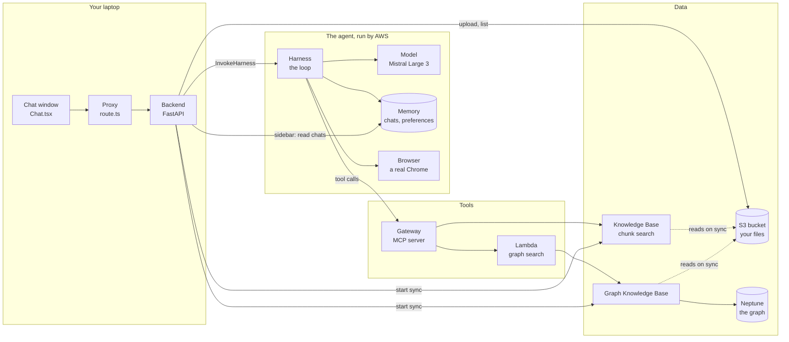
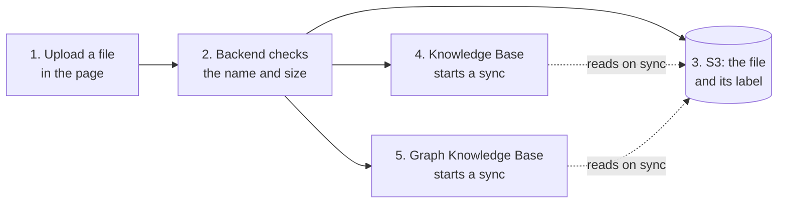
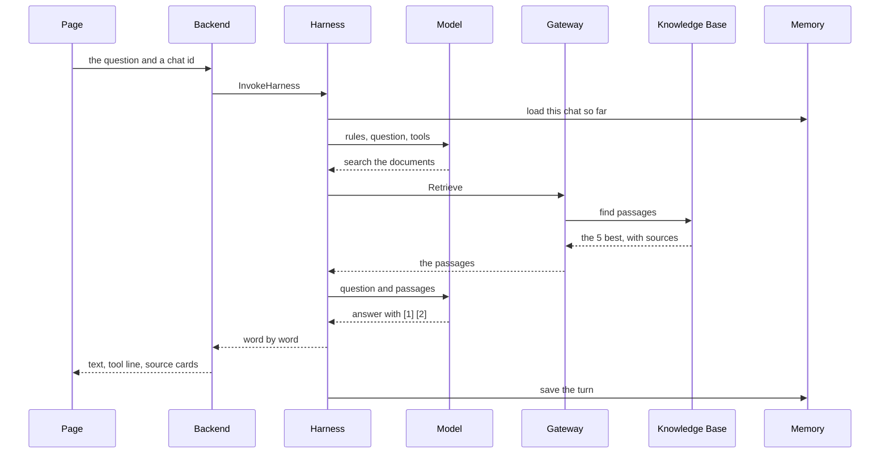
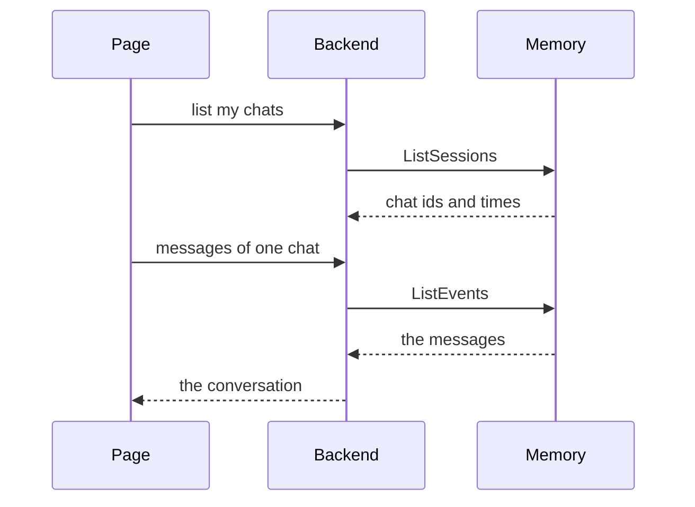

# Docs Copilot: the course

Everything this project uses, taught from zero, as one story in eight
parts. Written for someone who has never opened a terminal. Read the parts
in order: each one starts with the story so far and ends by pointing at the
next.

The page version with a sidebar and a tick box per lesson:
https://claude.ai/code/artifact/5401bc52-4ac5-4eab-a16f-76b075f59394
(a private page on your claude.ai account). These files are the source.

## The story

You want to ask questions about your own documents and get answers that
point at the exact passage. To build that, you first need the tools every
programmer uses (Part A), then the web: how a page talks to a server
(Part B). The documents and the AI live in the cloud, so next comes AWS
(Part C). Then the AI itself: models, embeddings, and every kind of RAG,
the way a model reads documents it was never trained on (Part D). A model
alone only writes text, so you give it tools and a loop: an agent (Part E).
Then you watch one question travel through everything, count what it
costs, and break it on purpose (Part F), and learn how real teams watch,
restrict and measure such a system (Part G).

That is the working version on the `main` branch: one user, no login.
Part H is the next chapter, on the `feat/login-runtime-agent` branch: many
people, each seeing only their own documents. Adding login showed that the
managed agent could not carry a person's identity to the tools, so the
chapter ends with our own agent, hosted by AWS.

| Part | File | Lessons |
|---|---|---|
| A. Before the code | [A-before-code.md](A-before-code.md) | 1 terminal, 2 git, 3 programs, servers and checks |
| B. The web part | [B-web.md](B-web.md) | 4 request and response, 5 FastAPI, 6 streaming, 7 the page |
| C. AWS from zero | [C-aws.md](C-aws.md) | 8 what AWS is, 9 identities and permissions, 10 S3 |
| D. AI from zero | [D-ai-and-rag.md](D-ai-and-rag.md) | 11 models and tokens, 12 embeddings, 13 RAG, 14 the Knowledge Base, 15 GraphRAG |
| E. The agent | [E-agent.md](E-agent.md) | 16 what an agent is, 17 the Harness, 18 tools and MCP, 19 the prompt, 20 memory, 21 the browser, 22 who acts at each hop |
| F. Putting it together | [F-together.md](F-together.md) | 23 one question end to end, 24 cost, 25 tried and dropped, 26 running, testing, breaking |
| G. Running it like production | [G-production.md](G-production.md) | 27 observability, 28 policy and guardrails, 29 evaluations |
| H. Adding login, and why the Harness had to go | [H-login-and-own-agent.md](H-login-and-own-agent.md) | 30 why the Harness had to go, 31 login from zero, 32 hosting your own agent, 33 your identity at every hop, 34 rules the model cannot break, 35 what changed, and running it |
| Glossary | [glossary.md](glossary.md) | every term, with the lesson that teaches it |

## How every lesson works

```
Where we are        how this lesson follows the one before
The problem         what we need, in plain words
The idea from zero  the concept built from nothing, with a picture
The whole field     every common way people solve it, simplest to most advanced
Our choice, and why where this project sits among those ways
In our project      the files, AWS resources, and one thing to try
Under the hood      what the managed service does inside (where it matters)
Check yourself      questions, with answers you can open
```

"The whole field" is there on purpose: you learn the topic, not only the
one tool this project picked. A lesson on RAG teaches every kind of RAG,
then shows which kind we built.

The "Try it" steps use what is in your AWS account: the Secure Transfers
guide and your chats with it. Steps marked **(app running)** need the
backend and the page started (lesson 26). Steps marked **(graph running)**
need the Neptune graph started (lesson 15); stop it when you finish, it
bills by the hour.

## The whole system on one sheet (main)

Solid arrows are calls. Everything on your laptop is code we wrote;
everything on AWS is a service we set up.



Two arrows people miss: our backend reads Memory itself for the sidebar,
and it tells both indexes to start reading after an upload. Everything else
happens inside the agent.

## The same system as three journeys

One sheet shows the parts. These show what actually happens, one story each.

**Journey 1: you upload a file** (lessons 10 and 14)



**Journey 2: you ask a question** (lesson 23)



**Journey 3: you open a past chat** (lesson 20)



The agent is not in journey 3 at all: the sidebar is our backend reading
Memory directly.


If you remember only three sentences, remember these:

1. **The page talks only to our backend.** The chat window calls a small proxy, which calls our FastAPI server on your laptop. Nothing in the browser talks to AWS.
2. **The backend hands your question to an agent that AWS runs.** The Harness loops: ask the model, run the tool it wants, give it the result, ask again, until it has an answer. The answer streams back piece by piece.
3. **Every AWS call is made by some identity, and that identity needs permission for exactly that call.** Almost every AWS error you will see is one of these missing one permission.

An **interactive map** of the same system lives here:
https://claude.ai/code/artifact/b6c44e72-b148-49bc-9011-4a5d4da730d2
Keep it open next to the course. Click any box for what it is, where its
code lives, where it is in the AWS console, which identity it acts as, and
what it costs. Step through the four paths (a document question, a web
page, a relationship question, an upload) with the arrow keys.

If you remember only three sentences, remember these:

1. **The page talks only to our backend.** The chat window calls a small proxy, which calls our FastAPI server on your laptop. Nothing in the browser talks to AWS.
2. **The backend hands your question to an agent that AWS runs.** The agent loops: ask the model, run the tool it wants, give it the result, ask again, until it has an answer. The answer streams back piece by piece.
3. **Every call is made by some identity, and that identity needs permission for exactly that call.** Almost every AWS error you will see is one of these missing one permission.

Part H redraws this sheet for the login branch (lesson 35).

An **interactive map** of the main system:
https://claude.ai/code/artifact/b6c44e72-b148-49bc-9011-4a5d4da730d2
Click any box for what it is, where its code lives, which identity it acts
as, and what it costs. Step through the four paths with the arrow keys.

`docs/demo.md` is the script for showing the app to people. It is not a lesson.
