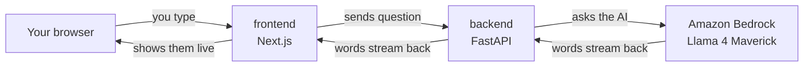
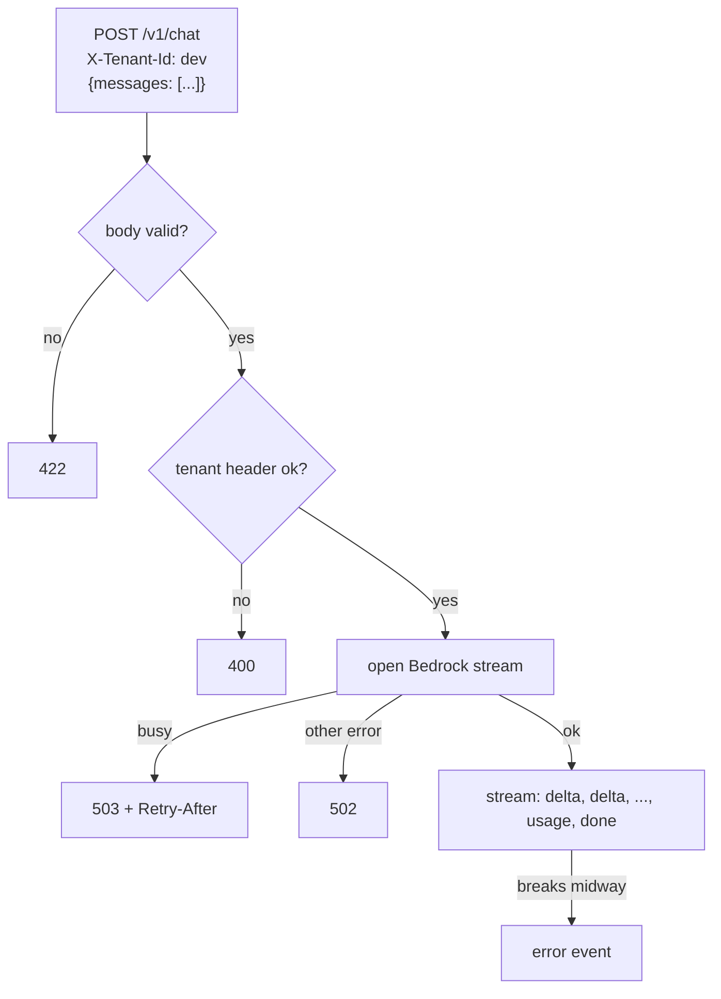
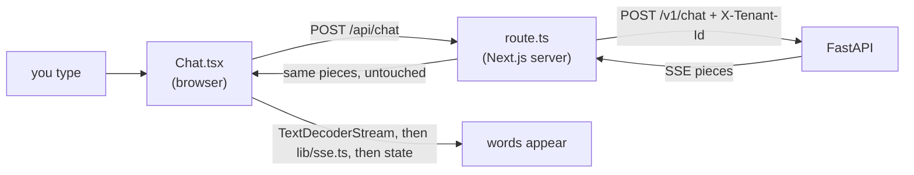

# D1 build log: skeleton + streaming chat

What was built, in what order, and what was checked. Concepts live in the
tracks, linked from each step.

---

## Goal

A chat page. You type a question, an AI answers, words appear one by one.



No login, no database, no document search. Those arrive in D2.
[Later: document search arrived in D2. Login and a database never did:
the project stayed single-user, and chat history lives in AgentCore Memory.]

---

## Progress

```
[x] Step 0  AWS setup           aws.md 5.4 has the checklist
[x] Step 1  repo skeleton
[x] Step 2  backend API         FastAPI + Bedrock streaming
[x] Step 3  frontend            Next.js chat page
[-] Step 4  docker compose      dropped: two terminals do the job
```

---

## Step 0: AWS setup

Done in the browser. Every item explained in `aws.md` sections 2 to 5.
Model choice explained in `ai.md` section 2: Llama 4 Maverick, profile
`us.meta.llama4-maverick-17b-instruct-v1:0`, tested in the Playground.

---

## Step 1: repo skeleton

### What was created

```
backend/pyproject.toml     the backend project: deps + ruff, mypy, pytest config   tooling.md 2, 3
backend/uv.lock            exact versions                                            tooling.md 2.2
backend/.python-version    3.12                                                      tooling.md 2.3
backend/.env.example       settings template                                         tooling.md 4
.gitignore                 what git must not track                                   tooling.md 1.4
README.md                  front page: run, layout, decisions, rules
.github/workflows/ci.yml   checks on every push (not pushed yet)                     tooling.md 5
docs/learning/             these files
```

Layout rule: Python in `backend/`, Node in `frontend/`.

### What was verified

- `uv sync` installs ruff, mypy, pytest. `ruff check` passes.
- First commit pushed to GitHub over SSH. CI file left out on purpose.

---

## Step 2: backend API

### What it does, in one picture



### Files

| File | Job | Explained in |
|---|---|---|
| `backend/app/main.py` | creates the app, logging, `/healthz` | web.md 7 |
| `backend/app/chat.py` | the endpoint: validation, errors, SSE | web.md 2 to 6 |
| `backend/app/llm.py` | Bedrock client, Converse call, event parsing [Later: deleted in D2; the Harness calls the model now] | aws.md 5.5 to 5.7 |
| `backend/app/settings.py` | config from env vars and `backend/.env` | tooling.md 4 |
| `backend/app/tenancy.py` | reads and checks `X-Tenant-Id` | web.md 3 |
| `backend/tests/test_chat.py` | 13 tests with a fake Bedrock [Later: rewritten in D2 for the Harness] | tooling.md 7 |

### Decisions made in this step

| Decision | Why | Instead of |
|---|---|---|
| one flat project: `backend/app`, `backend/tests` | one package today; FastAPI's own docs use this shape | a uv workspace with `src/` layout (built first, then flattened on 2026-09-10: extra folders and a second `pyproject.toml` for nothing) |
| settings read `backend/.env`, env vars win | shortest path locally; Docker and ECS just set env vars | a root `.env` loaded with `uvicorn --env-file ../.env` (tried first, removed with the flatten) |
| open the Bedrock stream in a dependency | errors can still become 502/503 before the 200 is sent | opening it inside the generator, where every error becomes a 200 |
| `def chat`, not `async def` | boto3 blocks; FastAPI runs `def` in a thread | `async def`, which would freeze the server during every answer |
| validator: first and last message must be `user` | tested live, that is exactly Bedrock's rule | a stricter "must alternate" rule Bedrock does not need |
| fake client via dependency overrides | Stubber cannot fake an event stream (tested) | botocore Stubber |
| boto3 `standard` retries | retries throttling, 3 attempts; the default `legacy` is older | default settings |
| `max_output_tokens = 1024` | caps the cost of one answer | no cap |
| `httpx2` for tests | `httpx` is unmaintained, Starlette warns about it | `httpx` |

Shortcuts marked in the code with `ponytail:` (known limits, planned upgrades):

- `tenancy.py`: trusts the header. Anyone can claim any tenant. Cognito in D2. [Later: dropped; no login, one tenant stub `dev`.]
- `main.py`: plain-text logs. JSON logs and tracing in D5 and D7. [Later: the plan was renumbered; tracing is later/maybe.]

### What was verified

```
uv run ruff check .              All checks passed
uv run ruff format --check .     7 files already formatted
uv run mypy .                    Success: no issues found in 7 source files
uv run pytest -q                 13 passed
```

Settings behavior, checked by hand:

```
no .env file, env var set      works, uses the env var
typo key in .env               startup error: "Extra inputs are not permitted"
```

Live run against real Bedrock, 2026-09-10:

```
POST /v1/chat "Name three planets, one word each, comma separated."
  event: delta  data: "Mars"
  event: delta  data: ", Jupiter"
  event: delta  data: ", Saturn."
  event: usage  data: {"input_tokens": 46, "output_tokens": 7, "latency_ms": 208}
  event: done   data: [DONE]
no tenant header                 -> 400
conversation ends with assistant -> 422
server log: chat completed tenant=dev input_tokens=46 output_tokens=7 latency_ms=208
```

After the flatten, same check through `uv run uvicorn app.main:app`:
`"OK"`, 41 tokens in, 2 out, 180 ms.

### Run it yourself

From `backend/`, in one terminal:

```
uv run uvicorn app.main:app --reload
```

Then either open http://localhost:8000/docs and try `POST /v1/chat`, or
in a second terminal:

```
curl -N -X POST localhost:8000/v1/chat \
  -H 'X-Tenant-Id: dev' -H 'Content-Type: application/json' \
  -d '{"messages":[{"role":"user","content":"Tell me a two-line joke."}]}'
```

`-N` tells curl not to buffer, so you see pieces arrive live. `Ctrl+C`
stops the server.

[Later: the API runs on port 8001, and since D2 the body is
`{"message": "...", "session_id": null}`, not a `messages` list. See
`journey.md` for today's request.]

### Words met

endpoint, HTTP method, header, body, status code, Pydantic, validation,
dependency (FastAPI), dependency override, SSE, streaming, blocking,
thread pool, uvicorn, Converse API, ClientError, BotoCoreError, retry,
fake, fixture, parametrize, type stubs, build system. All in `glossary.md`.

---

## Step 3: frontend

### What it does, in one picture



### Files

| File | Job | Explained in |
|---|---|---|
| `frontend/app/page.tsx` | the page at `/`, renders the chat | web.md 8, 9 |
| `frontend/app/layout.tsx` | wraps every page; tab title "Docs Copilot" | web.md 8 |
| `frontend/app/api/chat/route.ts` | the proxy to FastAPI [Later: replaced in D2 by `app/api/[...path]/route.ts`] | web.md 10 |
| `frontend/components/Chat.tsx` | the chat window: state, sending, reading the stream | web.md 11 |
| `frontend/lib/sse.ts` | turns streamed text into events | web.md 11.1 |
| `frontend/lib/sse.test.ts` | 5 tests for the parser | tooling.md 10 |
| `frontend/.env.example` | template for `API_URL` | web.md 10.2 |

### Decisions made in this step

| Decision | Why | Instead of |
|---|---|---|
| the browser calls a Next.js route, which calls FastAPI | same origin (no CORS), backend address and future tokens stay on the server | the browser calling FastAPI directly |
| `fetch` + reader + our own 40-line parser | `EventSource` only sends GET; the parser is small and tested | `EventSource`, or an extra library |
| Node's built-in test runner | no test library to install or configure | Vitest or Jest |
| `API_URL` without `NEXT_PUBLIC_` | server-only, never shipped to browsers | a public variable |
| `"type": "module"` in `package.json` | tells Node the files are ES modules, so it stops guessing (and warning) when running the `.ts` tests | leaving Node to guess |
| Tailwind | create-next-app's default; styles live next to the markup | a separate CSS file |
| `--no-agents-md`, `--disable-git` | no AI tooling files; no second repo inside ours | the defaults |
| typecheck runs `next typegen && tsc --noEmit` | CI has no `.next/`, so Next's generated types (`LayoutProps`) must be made first. The first CI run failed without it (tooling.md 9) | plain `tsc --noEmit`, which only passed on the laptop |
| `agentRules: false` in `next.config.ts` | `next dev` 16.3+ writes `AGENTS.md` and `CLAUDE.md` whenever it detects an AI agent; this stops it (tooling.md 9.1) | deleting the files, which `next dev` re-creates |

Shortcut marked `ponytail:` in `route.ts`: every browser is tenant `dev`.
Cognito login replaces it in D2. [Later: dropped; no login.]

### What was verified

```
npm run lint        clean
npm run typecheck   clean
npm test            5 passed
npm run build       ○ /  (static)    ƒ /api/chat  (dynamic)
GitHub CI           backend + frontend jobs green on commit b6a2f14
                    (the first run failed on missing generated types; tooling.md 9)
```

End to end on 2026-09-10, browser path, real Bedrock (seconds.milliseconds
when each line arrived):

```
21.986  event: delta   data: "1"
21.993  event: delta   data: " 2"
21.997  event: delta   data: " 3 4 5"
...
22.140  event: delta   data: " 40"
22.144  event: usage   data: {"input_tokens": 50, "output_tokens": 80, "latency_ms": 373}
```

Pieces arrived one after another, so the proxy streams instead of
buffering. Also: an invalid conversation came back as 422 through the
proxy, and with FastAPI stopped the page got 502 "The backend is not
reachable."

Then in a real browser (automated with Playwright), two turns:

```
you:   In two short sentences, what is retrieval-augmented generation?
model: Retrieval-augmented generation is a technique ... (streamed in)
       48 tokens in · 58 out · 730 ms
you:   Now say it in one sentence a child would understand.
model: Retrieval-augmented generation is like a super smart computer that
       looks up information in a big library ...
       126 tokens in · 35 out · 454 ms
```

Enter sent the message, the answer streamed into the bubble, the usage
line appeared, and the browser console had zero errors. The second turn
understood "it", and its input grew from 48 to 126 tokens: the whole
conversation was sent again (web.md 11.2).

### Run it yourself (the demo)

Two terminals.

```
# terminal 1: the API (8001, because another project holds 8000)
cd backend
uv run uvicorn app.main:app --reload --port 8001

# terminal 2: the web page
cd frontend
npm run dev
```

Open http://localhost:3000 and ask something. `frontend/.env.local` must
say `API_URL=http://localhost:8001` (copy `.env.example` the first time).

### Words met

App Router, server component, client component, route handler, BFF,
proxy, CORS, static page, npm, package.json, package-lock.json,
node_modules, devDependencies, Tailwind, ESLint, TextDecoderStream,
useState, useEffect, functional update, type stripping. All in
`glossary.md`.

---

## Step 4: docker compose

Dropped. Two terminals do the same job, and nothing is deployed. Docker
may come back with deployment (later/maybe).

---

## Check yourself

1. Which file would you open to see why a decision was made?
2. A request with a valid body but no tenant header: which status, and was Bedrock called?
3. Why is the Bedrock stream opened in a dependency and not in the endpoint body?
4. Why was the workspace removed, and what would bring it back?
5. Name one shortcut marked `ponytail:` and when it gets fixed.
6. Trace one message from the textarea to Bedrock and back: which files does it pass through?
7. What would break if `route.ts` read the whole FastAPI response before returning it?
