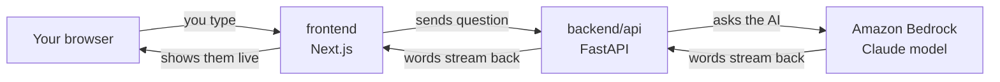
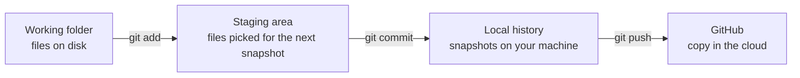
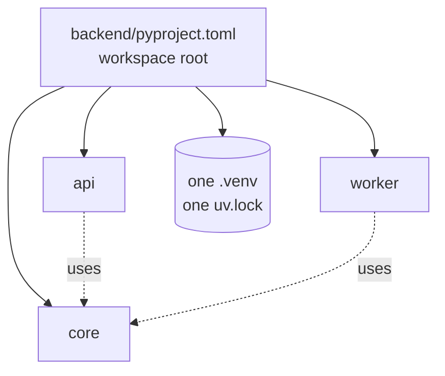
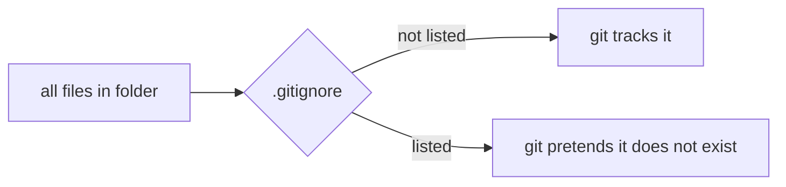
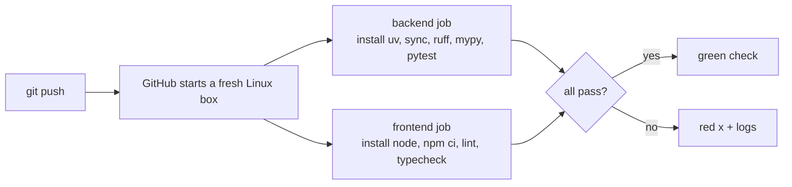

# D1: skeleton + streaming chat

This file explains every file in the repo in plain words. Read it top to
bottom once, then use it as a lookup.

If a word is new, jump to the **Words** section at the bottom.

---

## 1. What are we building in D1?

A chat page. You type a question, an AI answers, and the words appear one by
one instead of all at once.



Three moving parts. Two we write (frontend, backend). One we rent (Bedrock).

---

## 2. Where we are

```
[x] Step 1  repo skeleton        <- you are here, reading
[ ] Step 2  backend/api          FastAPI + Bedrock streaming
[ ] Step 3  frontend             Next.js chat page
[ ] Step 4  docker compose       run both with one command
```

---

## 3. Step 1: the repo skeleton

### 3.1 What is a "repo"?

A repo is a folder that git watches. Git remembers every version of every
file you tell it about, so you can go back in time.

Files move through three places:



- `git add` = "include this file in the next snapshot"
- `git commit` = "take the snapshot"
- `git push` = "upload snapshots to GitHub"

**One thing to remember:** nothing reaches GitHub without a commit first.

### 3.2 The folder layout

```
Docs_Copilot/
  frontend/          the web page (JavaScript / TypeScript)   [step 3]
  backend/           the server code (Python)                [step 2]
    pyproject.toml   list of Python tools we need
    uv.lock          exact versions of those tools
    .python-version  which Python to use
  docs/learning/     this file
  .github/workflows/ CI: robot that checks the code on GitHub
  .gitignore         list of files git must NOT track
  .env.example       template for secrets and settings
  README.md          the front page of the repo
  CLAUDE.md          local notes for the AI assistant, not in git
```

Rule of thumb: **Python lives in `backend/`, web code lives in `frontend/`.**

---

## 4. The files, one at a time

Each card: what it is, why it exists, the one thing to remember.

### 4.1 `backend/pyproject.toml`

**What:** the settings file for the Python side. Says which tools we need
and how they should behave.

**Why:** Python by itself has no idea what `fastapi` is. This file is the
shopping list. `uv` (our package manager) reads it and installs everything.

It also declares a **workspace**: several Python packages that share one
install.



Without a workspace, `api` and `worker` would each install their own copy
of everything and could end up on different versions. With a workspace,
one install, one lockfile, no drift.

The root has no `[project]` table on purpose. It is a folder that holds
packages, not a package itself. uv calls this a "virtual root".

The `[dependency-groups] dev` list holds tools only developers need
(ruff, mypy, pytest). They are installed by default and skipped in the
Docker image later with `--no-dev`.

**One thing to remember:** `pyproject.toml` = what we want.

Docs: https://docs.astral.sh/uv/concepts/projects/workspaces/

### 4.2 `backend/uv.lock`

**What:** a generated file listing the exact version of every package,
including packages-of-packages.

**Why:** `pyproject.toml` says "ruff, version 0.12 or newer". Today that
resolves to 0.16.6. Next year it might resolve to 0.20. The lockfile freezes
today's answer so everyone (you, CI, Docker) installs the same thing.

```
pyproject.toml   = shopping list     "ruff >= 0.12"
uv.lock          = the receipt       "ruff == 0.16.6, sha256=..."
```

Never edit it by hand. uv rewrites it. Do commit it.

**One thing to remember:** `uv.lock` = what we actually got.

### 4.3 `backend/.python-version`

**What:** one line: `3.12`.

**Why:** this machine has Python 3.11, 3.12, 3.13 and 3.14 installed. Without
this file uv would grab the newest (3.14). Some AWS libraries lag behind the
newest Python, so we pin 3.12, which everything supports.

**One thing to remember:** the whole project runs on Python 3.12.

### 4.4 `.gitignore`

**What:** a list of file patterns git must ignore.

**Why:** some files should never be uploaded:

```
.venv/          installed packages, huge, rebuildable with uv sync
node_modules/   same idea for JavaScript
.env            REAL secrets. Never in git.
__pycache__/    Python's temp files
```

Picture a filter between your folder and git:



There is one trick in ours:

```
.env.*            ignore .env.local, .env.prod, everything like it
!.env.example     EXCEPT this one, the ! means "un-ignore"
```

**One thing to remember:** `.env` is ignored, `.env.example` is not.

### 4.5 `.env.example`

**What:** a template of settings with placeholder values and a comment on
each line.

**Why:** the real settings (AWS profile name, model IDs) live in `.env`,
which is ignored by git. A new machine copies the template and fills in
real values:

```
cp .env.example .env     then edit .env
```

`AWS_REGION` is fixed to `us-west-2`. That is the AWS region where the
Bedrock rerank feature and AgentCore both exist. Picking it once avoids a
painful move later.

**One thing to remember:** `.env.example` is safe to share, `.env` is not.

### 4.6 `README.md`

**What:** the front page of the repo. GitHub shows it automatically.

**Why:** it holds the commands to run the project, the folder layout, the
decisions we locked (and why), and a checklist of the 8 deliverables.

**One thing to remember:** when unsure what a decision was, check README
"Locked decisions" first.

### 4.7 `.github/workflows/ci.yml`

**What:** instructions for a robot on GitHub. Every time you push, it runs
the checks.



One detail worth knowing: the job runs `uv sync --locked`. The `--locked`
flag makes it fail if `uv.lock` is out of date with `pyproject.toml`. A
plain `uv sync` would silently fix the lockfile and hide the mistake.

This file is **not pushed yet**. The backend and frontend folders do not
exist, so the robot would fail. It goes into git with step 3.

**One thing to remember:** CI is the same checks you run locally, on a
clean machine, automatically.

### 4.8 `CLAUDE.md`

**What:** notes for the AI assistant.

**Why it is not in git:** this machine has a global rule that hides
`CLAUDE.md` from git, plus a hook that blocks commits containing it. The
policy is: the repo must make sense without AI tooling files. So everything
a human needs lives in `README.md`, and `CLAUDE.md` just points there.

**One thing to remember:** if it matters to the project, it goes in README,
not CLAUDE.md.

---

## 5. Words

| Word | Plain meaning |
|---|---|
| package | a chunk of reusable code someone published, e.g. `fastapi` |
| dependency | a package our code needs to run |
| package manager | tool that downloads and installs packages. Ours is `uv` |
| lockfile | exact versions of everything installed, so installs are repeatable |
| venv | a private folder of installed packages for this project only |
| workspace | several Python packages sharing one venv and one lockfile |
| lint | automatic check for style mistakes and common bugs (`ruff`) |
| typecheck | automatic check that types line up, e.g. no string where an int goes (`mypy`) |
| CI | continuous integration: a robot runs lint, typecheck, tests on every push |
| commit | one saved snapshot of the repo |
| remote | a copy of the repo somewhere else, usually GitHub, named `origin` |

---

## 6. Check yourself

Answer each in one sentence. If one is hard, reread that card.

1. Why does `backend/pyproject.toml` have no `[project]` table?
2. What is the difference between `pyproject.toml` and `uv.lock`?
3. Why is `.env` ignored but `.env.example` is not?
4. What does `uv sync --locked` catch that `uv sync` hides?
5. Why is `CLAUDE.md` not in the repo?

---

## 7. What was verified

- `uv sync --all-packages` from `backend/` installs ruff 0.16.6, mypy 2.3.1,
  pytest 9.1.1.
- `uv run ruff check .` passes.
- Two warnings are expected until step 2 creates `backend/api`:
  - uv: no `requires-python` in the workspace. A virtual root cannot declare
    it. It goes away once `api/pyproject.toml` declares `>=3.12`.
  - mypy: no `.py` files found. Same reason.

---

## 8. Next

Step 2: `backend/api`. A FastAPI server with one endpoint that streams a
Bedrock answer. New words coming: endpoint, SSE, async, streaming.
