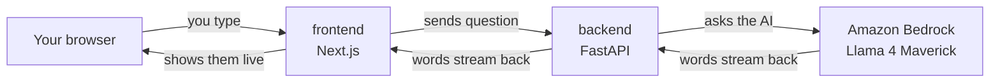
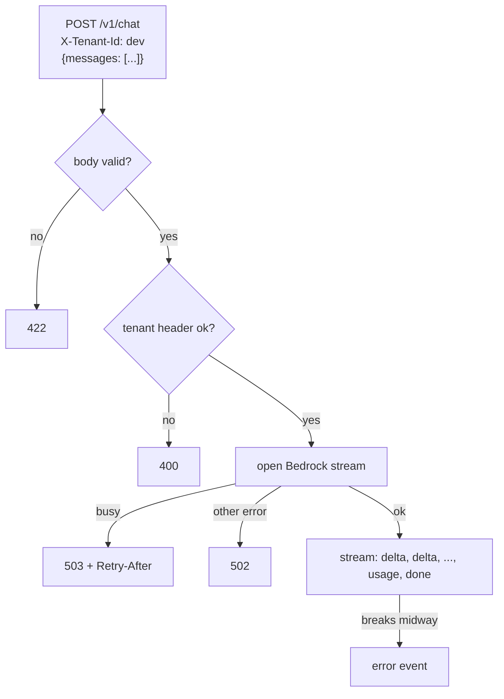

# D1 build log: skeleton + streaming chat

What was built, in what order, and what was checked. Concepts live in the
tracks, linked from each step.

---

## Goal

A chat page. You type a question, an AI answers, words appear one by one.



No login, no database, no document search. Those arrive in D2.

---

## Progress

```
[x] Step 0  AWS setup           aws.md 5.4 has the checklist
[x] Step 1  repo skeleton
[x] Step 2  backend API         FastAPI + Bedrock streaming
[ ] Step 3  frontend            Next.js chat page
[ ] Step 4  docker compose      run both with one command
```

---

## Step 0: AWS setup

Done in the browser. Every item explained in `aws.md` sections 2 to 5.
Model choice explained in `ai.md` section 2: Llama 4 Maverick, profile
`us.meta.llama4-maverick-17b-instruct-v1:0`, tested in the Playground.

---

## Step 1: repo skeleton

### What was created

```
backend/pyproject.toml     the backend project: deps + ruff, mypy, pytest config   tooling.md 2, 3
backend/uv.lock            exact versions                                            tooling.md 2.2
backend/.python-version    3.12                                                      tooling.md 2.3
backend/.env.example       settings template                                         tooling.md 4
.gitignore                 what git must not track                                   tooling.md 1.4
README.md                  front page: run, layout, decisions, rules
.github/workflows/ci.yml   checks on every push (not pushed yet)                     tooling.md 5
docs/learning/             these files
```

Layout rule: Python in `backend/`, Node in `frontend/`.

### What was verified

- `uv sync` installs ruff, mypy, pytest. `ruff check` passes.
- First commit pushed to GitHub over SSH. CI file left out on purpose.

---

## Step 2: backend API

### What it does, in one picture



### Files

| File | Job | Explained in |
|---|---|---|
| `backend/app/main.py` | creates the app, logging, `/healthz` | web.md 7 |
| `backend/app/chat.py` | the endpoint: validation, errors, SSE | web.md 2 to 6 |
| `backend/app/llm.py` | Bedrock client, Converse call, event parsing | aws.md 5.5 to 5.7 |
| `backend/app/settings.py` | config from env vars and `backend/.env` | tooling.md 4 |
| `backend/app/tenancy.py` | reads and checks `X-Tenant-Id` | web.md 3 |
| `backend/tests/test_chat.py` | 13 tests with a fake Bedrock | tooling.md 7 |

### Decisions made in this step

| Decision | Why | Instead of |
|---|---|---|
| one flat project: `backend/app`, `backend/tests` | one package today; FastAPI's own docs use this shape | a uv workspace with `src/` layout (built first, then flattened on 2026-09-10: extra folders and a second `pyproject.toml` for nothing) |
| settings read `backend/.env`, env vars win | shortest path locally; Docker and ECS just set env vars | a root `.env` loaded with `uvicorn --env-file ../.env` (tried first, removed with the flatten) |
| open the Bedrock stream in a dependency | errors can still become 502/503 before the 200 is sent | opening it inside the generator, where every error becomes a 200 |
| `def chat`, not `async def` | boto3 blocks; FastAPI runs `def` in a thread | `async def`, which would freeze the server during every answer |
| validator: first and last message must be `user` | tested live, that is exactly Bedrock's rule | a stricter "must alternate" rule Bedrock does not need |
| fake client via dependency overrides | Stubber cannot fake an event stream (tested) | botocore Stubber |
| boto3 `standard` retries | retries throttling, 3 attempts; the default `legacy` is older | default settings |
| `max_output_tokens = 1024` | caps the cost of one answer | no cap |
| `httpx2` for tests | `httpx` is unmaintained, Starlette warns about it | `httpx` |

Shortcuts marked in the code with `ponytail:` (known limits, planned upgrades):

- `tenancy.py`: trusts the header. Anyone can claim any tenant. Cognito in D2.
- `main.py`: plain-text logs. JSON logs and tracing in D5 and D7.

### What was verified

```
uv run ruff check .              All checks passed
uv run ruff format --check .     7 files already formatted
uv run mypy .                    Success: no issues found in 7 source files
uv run pytest -q                 13 passed
```

Settings behavior, checked by hand:

```
no .env file, env var set      works, uses the env var
typo key in .env               startup error: "Extra inputs are not permitted"
```

Live run against real Bedrock, 2026-09-10:

```
POST /v1/chat "Name three planets, one word each, comma separated."
  event: delta  data: "Mars"
  event: delta  data: ", Jupiter"
  event: delta  data: ", Saturn."
  event: usage  data: {"input_tokens": 46, "output_tokens": 7, "latency_ms": 208}
  event: done   data: [DONE]
no tenant header                 -> 400
conversation ends with assistant -> 422
server log: chat completed tenant=dev input_tokens=46 output_tokens=7 latency_ms=208
```

After the flatten, same check through `uv run uvicorn app.main:app`:
`"OK"`, 41 tokens in, 2 out, 180 ms.

### Run it yourself

From `backend/`, in one terminal:

```
uv run uvicorn app.main:app --reload
```

Then either open http://localhost:8000/docs and try `POST /v1/chat`, or
in a second terminal:

```
curl -N -X POST localhost:8000/v1/chat \
  -H 'X-Tenant-Id: dev' -H 'Content-Type: application/json' \
  -d '{"messages":[{"role":"user","content":"Tell me a two-line joke."}]}'
```

`-N` tells curl not to buffer, so you see pieces arrive live. `Ctrl+C`
stops the server.

### Words met

endpoint, HTTP method, header, body, status code, Pydantic, validation,
dependency (FastAPI), dependency override, SSE, streaming, blocking,
thread pool, uvicorn, Converse API, ClientError, BotoCoreError, retry,
fake, fixture, parametrize, type stubs, build system. All in `glossary.md`.

---

## Step 3: frontend

Not started. Will add: Next.js App Router, a route handler that forwards
to the API, a client component that reads the stream. Sections go into
`web.md`.

---

## Check yourself

1. Which file would you open to see why a decision was made?
2. A request with a valid body but no tenant header: which status, and was Bedrock called?
3. Why is the Bedrock stream opened in a dependency and not in the endpoint body?
4. Why was the workspace removed, and what would bring it back?
5. Name one shortcut marked `ponytail:` and when it gets fixed.
