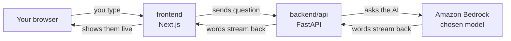

# D1 build log: skeleton + streaming chat

What was built, in what order, and what was checked. Concepts live in the
tracks, linked from each step.

---

## Goal

A chat page. You type a question, an AI answers, words appear one by one.



No login, no database, no document search. Those arrive in D2.

---

## Progress

```
[x] Step 0  AWS setup           aws.md section 5.4 has the checklist
[x] Step 1  repo skeleton
[ ] Step 2  backend/api         FastAPI + Bedrock streaming
[ ] Step 3  frontend            Next.js chat page
[ ] Step 4  docker compose      run both with one command
```

---

## Step 0: AWS setup

Done in the browser. Every item explained in `aws.md` sections 2 to 5.
Model choice explained in `ai.md` section 2. Remaining: model access for
the chosen model and its ID into `.env`.

---

## Step 1: repo skeleton

### What was created

```
backend/pyproject.toml     uv workspace root + ruff + mypy config    tooling.md 2, 3
backend/uv.lock            exact versions                            tooling.md 2.2
backend/.python-version    3.12                                      tooling.md 2.3
.gitignore                 what git must not track                   tooling.md 1.4
.env.example               settings template                         tooling.md 4
README.md                  front page: run, layout, decisions, rules
.github/workflows/ci.yml   checks on every push (not pushed yet)     tooling.md 5
docs/learning/             these files
```

Layout rule: Python in `backend/`, Node in `frontend/`. See `tooling.md`
2.1 for why the workspace root is `backend/` and not the repo root.

### What was verified

- From `backend/`: `uv sync --all-packages` installs ruff 0.16.6, mypy
  2.3.1, pytest 9.1.1. `uv run ruff check .` passes.
- Two warnings are expected until step 2 creates `backend/api`: uv says no
  `requires-python` in the workspace (a virtual root cannot declare it),
  mypy says no `.py` files. Both vanish once `api/pyproject.toml` exists.
- First commit pushed to GitHub over SSH. CI file left out of the commit
  on purpose (it would fail with no code).

### Words met

git, commit, remote, staging, workspace, lockfile, venv, lint, typecheck,
CI, dependency group. All in `glossary.md`.

---

## Step 2: backend/api

Not started. Will add: FastAPI, async, SSE streaming, Bedrock Converse
API, first tests. Sections go into `web.md` and `aws.md` 5.

---

## Check yourself

1. Which file would you open to see why a decision was made?
2. Where does the explanation of a concept live, and where does the build log point?
3. What is still missing from AWS before step 2 can make a call?
