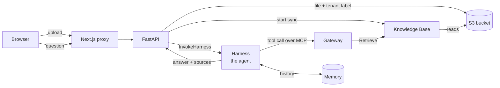
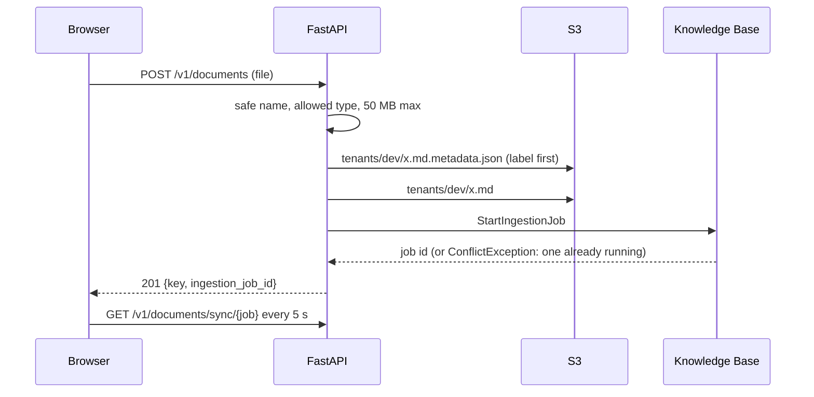

# D2 build log: documents, agent, citations

What was built, in what order, and what was checked. Concepts live in the
tracks, linked from each step.

---

## Goal

Upload a document. Ask about it. The answer comes from the document, with
numbered sources you can open.



Our code is the two boxes on the left of the arrows into AWS: the page and
FastAPI. Everything from the bucket rightwards is configured, not coded.

---

## Progress

```
[x] Step 1  S3 bucket                       aws.md 6, 6.1
[x] Step 2  managed Knowledge Base          aws.md 7, 7.1a, 7.4a
[x] Step 3  Gateway (KB as an MCP tool)     aws.md 10.3a, 10.3b
[x] Step 4  Harness (the agent)             aws.md 10
[x] Step 5  model change: gpt-oss-120b      ai.md 2.7
[x] Step 6  backend                         upload, chat relay, sessions
[x] Step 7  frontend                        proxy, sidebar, sources
[x] Step 8  harness prompt update, commit   Yash
```

---

## Steps 1 to 4: AWS, all in the console

Every option on every form is explained in the track sections above. The
IDs that came out of it live in `backend/.env.example`.

Checked before writing any code (aws.md 7.4a, 10.3b):

```
upload README.md + tenant label   -> sync 2.5 min, 1 indexed, 0 failed
gateway tools/list                -> one tool: docs___Retrieve
Retrieve through the gateway      -> 5 passages, with source and tenant_id
filter tenant_id=other            -> 0 passages (a hand-made filter test worked; the app applies no filter)
```

---

## Step 5: the model change

The first question in the harness playground failed with:

```
ValidationException: This model doesn't support tool use in streaming mode.
```

The harness always streams, and Llama 4 on Bedrock can only use tools when
not streaming. Every cheap model was tested with a real streamed tool call
and a real answer; the table and the choice are in `ai.md` 2.7.
**gpt-oss-120b** won: cheaper than Maverick, correct, cited, honest when the
documents did not have the answer.

---

## Step 6: backend

### Files

```
backend/app/aws.py         one client per AWS service + one error mapper (503 busy, 502 failed)
backend/app/documents.py   POST /v1/documents, GET /v1/documents, GET /v1/documents/sync/{job}
backend/app/chat.py        POST /v1/chat: relays the harness stream as our SSE events
backend/app/sessions.py    GET /v1/sessions, GET /v1/sessions/{id}/messages (from Memory)
backend/app/settings.py    the five IDs the app needs; refuses to start without them
backend/prompts/assistant.md   the harness system prompt (pasted into the console)
deleted: backend/app/llm.py    the harness calls the model now, not our code
```

### Upload: two S3 writes, then a sync



Why the label goes first: if the second write fails, what is left is a label
with no file (harmless). The other order could leave a file with no tenant.

Why `ConflictException` is not an error: a data source runs one sync at a
time (checked live: the second start fails with "There is an ongoing
ingestion job"). The file is stored and the next sync picks it up.

### Chat: translating the harness stream

The harness streams every step of its loop. Captured live on 2026-09-11:

```
messageStart assistant
  reasoning deltas        "Need to retrieve... use docs___Retrieve"   -> not shown
  toolUse start + deltas  {"retrievalQuery": {"text": "..."}}         -> event: tool
messageStop tool_use
metadata usage            (model call 1)
messageStart user
  toolResult start + 8 deltas: one JSON string cut in pieces          -> event: sources
messageStop tool_result
messageStart assistant
  reasoning deltas                                                    -> not shown
  text deltas             "Neptune Analytics was removed..."          -> event: delta
messageStop end_turn
metadata usage            (model call 2)                              -> event: usage (summed)
```

`relay()` in `chat.py` does exactly this table. The key idea: a tool call and
a tool result arrive in pieces, so they are collected until their block's
`contentBlockStop`, then parsed once.

The browser sends only the new message and a `session_id`. The history lives
in Memory; the harness loads it itself.

### Sessions: reading Memory

One turn with one search leaves about ten Memory events: a
"conversational" event per message (question, tool call, tool result,
answer), each holding the message as JSON text, plus "blob" events with the
agent's internal state. `sessions.py` keeps only messages that have text,
which drops tool calls, tool results and blobs.

`actorId` is the tenant. Memory is stored per actor and session, so a
guessed session id from another tenant returns nothing.

### Checked

```
ruff check, ruff format --check, mypy strict   clean
pytest                                         33 passed (FakeAgentCore, FakeKb, moto for S3)
live, real AWS:
  POST /v1/chat          session, tool, sources, 6 deltas, usage, done
                         3,535 tokens in, 317 out, 2 model calls
  GET  /v1/sessions      the new conversation listed
  GET  .../messages      exactly the question and the answer
```

---

## Step 7: frontend

### Files

```
frontend/app/api/[...path]/route.ts   one proxy for chat, documents, sessions (allowlist)
frontend/components/Chat.tsx          conversation, tool trace, citation markers, source cards
frontend/components/Sidebar.tsx       conversations, upload, sync status
frontend/lib/citations.ts (+ test)    splits "[1]" out of the answer text
deleted: frontend/app/api/chat/route.ts   the catch-all replaces it
```

### One proxy instead of five

`[...path]` is a catch-all folder: `/api/documents/sync/ABC` arrives with
`params.path = ["documents", "sync", "ABC"]`. The first part must be `chat`,
`documents` or `sessions`, otherwise 404, so the proxy cannot reach anything
else on the backend (checked: `/api/healthz` is 404).

### Checked, end to end through the proxy

```
page                         200
upload glossary.md           201, job 8H0CHX3NGL
sync                         COMPLETE after 2 min: 2 scanned, 1 indexed, 0 failed
"what does RRF mean?"        tool call, 5 sources all from glossary.md,
                             answer: "reciprocal rank fusion ... [1]"
sessions                     the new conversation on top
```

---

## Things that bit, and the fix

| What happened | Why | Fix |
|---|---|---|
| Hand-made MCP call: "Unsupported protocol version" | the gateway speaks 2025-11-25 and 2026-07-28 only | send `MCP-Protocol-Version: 2025-11-25` (the harness does this itself) |
| Harness: "doesn't support tool use in streaming mode" | Llama 4 limitation on Bedrock | gpt-oss-120b, ai.md 2.7 |
| Answer cited as `【1†L13-L17】` | gpt-oss's own citation habit | prompt rule 2 now demands `[1]` exactly |
| Tenant `_x` would break Memory calls | actor ids must start with a letter or digit | tenant check tightened in `tenancy.py` |
| App refuses to start with GATEWAY_URL in `.env` | settings reject unknown keys on purpose | removed; the harness knows its gateway |
| mypy: "conftest found twice" | `tests/` was not a package | empty `tests/__init__.py` |
| typecheck: missing `app/api/chat/route.js` | stale generated types in `.next/dev` | delete `.next/dev`; CI starts clean anyway |

---

## Not done yet, on purpose

- **Tenant filter on search.** The gateway's KB target has no filter, so a
  search sees every tenant's chunks. Fine with one tenant (`dev`).
  [Later: no login, single user, so no filter is needed.]
- **Harness role is broader than needed** (Browser, Code Interpreter, EFS
  permissions by default). [Later: tightening is later/maybe.]
- **Conversation titles.** Memory stores none, so the sidebar shows the time.

---

## Check yourself

1. Why does the upload write the `.metadata.json` file before the document?
2. The browser never sends the chat history. Where does the agent get it?
3. What does `contentBlockStop` mean, and why does `relay()` wait for it?
4. Why does one answer with one search cost two model calls?
5. What stops the Next.js proxy from forwarding `/api/healthz`?
6. Llama 4 Maverick supports tool use. Why could the harness not use it?
