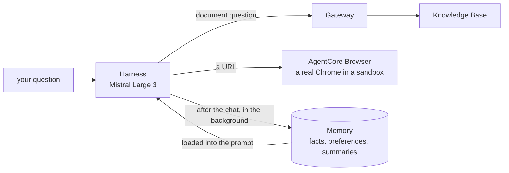

# D3 build log: the browser and long-term memory

Short on purpose (hybrid pace, decided 2026-09-11): what these are, why they
are here, what changed, what was checked. Deeper internals come in the
reverse-learning pass.

---

## Goal

Two new abilities for the same agent, with no new backend code:

1. **Browser:** give it a URL and it reads the live page.
2. **Long-term memory:** tell it something once ("short bullet points, I am
   a beginner") and a brand-new conversation already knows.



---

## What the browser is

A real web browser that AWS runs for the agent, in an isolated session that
is thrown away afterwards. The agent does not "fetch a URL"; it drives the
browser one action at a time:

```
init_session   open a browser session
navigate       go to the URL
get_text       read the page as text (this text is what the model reads)
close          end the session
```

Why it costs more than a document search: a whole page's text goes into the
model, often 30k to 150k tokens, against about 13k for a document question.
That is 2 to 8 cents per page on Mistral Large 3.

The harness uses the AWS-managed default browser (`aws.browser.v1`). Nothing
was created; the harness role already had permission for it.

---

## What long-term memory is

Short-term memory (D2) is the conversation itself, replayed each turn.
Long-term memory is **what gets extracted from conversations** and kept
across them. Three strategies run in the background after each chat:

| Strategy | Keeps | Stored under | Example from our test |
|---|---|---|---|
| User preference | how you like answers | `/actors/dev/preferences/` | "Prefers answers as short bullet points" |
| Semantic | facts about you and your work | `/actors/dev/facts/` | "The user is a beginner learning AWS" |
| Summarization | a summary of each conversation | `/actors/dev/summaries/<session>/` | |

Extraction is not instant: records appeared a few minutes after the chat
ended. On the next conversation, the harness searches these records and adds
the relevant ones to the prompt. Our test: a new chat asked "What is an S3
bucket?" and got back a short bullet point, as the stored preference said.

`dev` in the paths is the actor id, which is our tenant stub. Every user of
this app shares it (no login), so everyone shares one memory.

---

## What changed

| Where | Change |
|---|---|
| Harness, Tools | Browser tool on, `aws.browser.v1` |
| Harness, Allowed tools | `@aws_browser_v1` added. The `@` matters: without it the model never sees the browser |
| Harness, Memory | strategies Semantic and User preference added to Summarization |
| Harness, Model | Mistral Large 3 (ai.md 2.8: gpt-oss could not drive the browser) |
| `backend/prompts/assistant.md` | rule 1 is now "a URL goes to the browser, not the document search" |
| `frontend/components/Chat.tsx` | the tool trace shows "Opened <url>" and hides the other browser steps |
| `frontend/lib/citations.ts` | also accepts gpt-oss-style markers `【1】` |

No backend code changed: the chat relay already forwards any tool call.

---

## Things that bit

| What happened | Why | Fix |
|---|---|---|
| Given a URL, the agent searched the documents | the prompt said "search the documents first" before the browser rule | browser rule moved to rule 1 |
| The agent said its only tool was the document search | allowed tools had `aws_browser_v1` without `@` | `@aws_browser_v1` |
| gpt-oss printed `{"type":"get_content"...}` as its answer | it could not drive a multi-step tool | Mistral Large 3 |
| Test answers were steered by old "facts" | all test runs shared one actor, so memory from earlier tests leaked in | a fresh actor id per test run |
| Memory stored facts from the documents too (the old "8 deliverables" plan) | semantic memory learns from everything the agent sees | known limit; memory records can be deleted |

---

## Checked

On the saved harness (version 4: Mistral Large 3, `@aws_browser_v1`, prompt
equal to the repo file), actor `dev`, no overrides, 2026-09-11:

```
web page     init_session, navigate, get_text; cited the URL
             158,618 tokens in, 275 out, 4 model calls   (about 8 cents)
documents    one search, 5 sources, correct answer cited [1][2]
             14,472 tokens in, 147 out, 2 model calls    (under 1 cent)
memory       "What is IAM?" in a brand-new chat came back beginner-friendly
             and in bullet points: both stored preferences applied unasked
backend      ruff, mypy strict, 33 tests: clean
frontend     lint, typecheck, 9 tests: clean
```

---

## Check yourself

1. Why does reading one web page cost more than answering from the documents?
2. What is the difference between short-term and long-term memory here?
3. Why did the first memory test show nothing right after the chat?
4. What did the `@` in `@aws_browser_v1` change?
5. Every user of this app shares one memory. Why?
