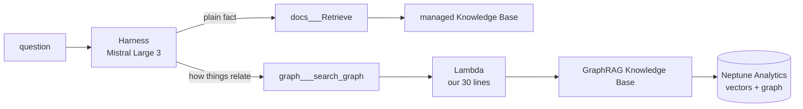

# D4 build log: GraphRAG

Short on purpose (hybrid pace). What it is, why it is here, what was built,
what was checked. The inside story of GraphRAG is in `ai.md` section 5.

---

## Goal

Questions like "how does the Gateway relate to Memory and the Harness?" need
facts that sit in different documents. A second Knowledge Base builds a map
of the things in your documents and how they connect, and the agent gets a
second search tool that uses it.



The agent chooses the tool. Each tool's description tells it when to use it.

---

## What GraphRAG does, in two moments

**When documents sync (build time):**

1. Files are cut into chunks and embedded with Titan Text Embeddings V2, as in any Knowledge Base.
2. **Extra step:** Nova 2 Lite reads every chunk and writes out the things it names (Gateway, Harness, Memory, Neptune...) and how they relate.
3. Chunks, vectors, things and relationships all go into a Neptune Analytics graph.

**When someone searches (query time):**

1. A normal vector search finds the closest chunks.
2. **Extra step:** the graph is walked from those chunks to other chunks that mention the same things, even when the wording is different.
3. Both sets come back as the answer's passages.

Our test showed the difference: for "how does the Gateway relate to Memory
and the Harness?", the graph search returned passages about Harness
sessions, Strands, and long-term memory, connected through shared things.
The plain search stayed closer to the literal words.

---

## Why a Lambda sits in the middle

The Gateway's built-in Knowledge Base connector only accepts **managed**
Knowledge Bases. A GraphRAG Knowledge Base is self-managed (we chose its
embeddings model, its store, its graph model). So:

```
Gateway --invokes--> Lambda docs-copilot-graph-search --Retrieve--> graph Knowledge Base
```

`infra/lambda/graph_search/handler.py` answers in the same shape as the
managed connector, so the chat UI turns graph passages into source cards
with no code change. `tool-schema.json` is the tool's menu entry: name,
description (what the agent reads to decide), and one input, `query`.

---

## What was created (all in the console, 2026-09-11)

| Resource | Name / ID | Key choices |
|---|---|---|
| Knowledge Base | `docs-copilot-graph-kb` / `3AD25HSRSD` | "Unstructured Vector Store KB" (the console's name for self-managed) |
| Data source | `graph-docs` / `6B3TDMPBRL` | the whole bucket; default parser; default chunking (about 300 tokens, can't change later) |
| Embeddings | Titan Text Embeddings V2 | float, 1024 dimensions |
| Graph model | Nova 2 Lite, `us.` cross-region | Claude would need Anthropic's form first |
| Graph store | Neptune Analytics `g-3h3xul06x6` | quick-created: **16 m-NCU** (the smallest), 0 replicas, private |
| Lambda | `docs-copilot-graph-search` | Python 3.13, arm64, env `GRAPH_KB_ID`, timeout 120 s, no function URL |
| Lambda role policy | `graph-kb-retrieve` | `bedrock:Retrieve` on this one Knowledge Base |
| Gateway role policy | `InvokeGraphSearchLambda` | `lambda:InvokeFunction` on this one function |
| Gateway target | `graph` / `QDJSG5GBFV` | MCP target, Lambda ARN, inline schema, outbound auth IAM role |
| Prompt | rule 2 | "how things are connected" questions go to `graph___search_graph` |

Also: `ai.md` and `aws.md` were uploaded (with tenant labels) so the graph
had enough connected material. Both Knowledge Bases index them.

---

## Cost clock

| State | Price (16 m-NCU, us-west-2) |
|---|---|
| running | $0.48 per hour, about $11.50 a day |
| stopped | about $0.05 per hour, everything kept |
| deleted | $0 |

Graph extraction by Nova 2 Lite for four files: a few cents. The Lambda: free
at this usage.

**Stopped on 2026-09-11 at 02:07, until the demo** (it ran about 25 minutes, roughly 20 cents). While stopped, graph
questions fail (the agent can still answer from `docs___Retrieve`). Before
the demo, start it and wait until the status says AVAILABLE (a few minutes):

```
aws neptune-graph start-graph --graph-identifier g-3h3xul06x6 --region us-west-2 --profile docs-copilot-dev
aws neptune-graph get-graph   --graph-identifier g-3h3xul06x6 --region us-west-2 --profile docs-copilot-dev --query status
aws neptune-graph stop-graph  --graph-identifier g-3h3xul06x6 --region us-west-2 --profile docs-copilot-dev
```

Console alternative: Neptune, Analytics, Graphs, select the graph, Actions, Start or Stop.

**Cleanup order when done for good:** delete the Knowledge Base first, then
the Neptune graph. Deleting the Knowledge Base does not delete the graph,
and the graph keeps billing until deleted.

---

## Checked

```
graph KB sync (4 files)       COMPLETE, 0 failed, about 1 minute
Lambda invoked from the CLI   200, 5 passages labeled with file names
Gateway tools/list            docs___Retrieve, graph___search_graph
MCP call to the graph tool    5 passages from ai.md and aws.md
harness, relationship question    chose graph___search_graph, sources ai.md + aws.md
harness, plain fact question      chose docs___Retrieve (no regression)
```

---

## Things that bit

| What happened | Why | Fix |
|---|---|---|
| No "Knowledge Base with vector store" in the menu | the console renamed it | "Unstructured Vector Store KB" |
| First graph search: 9 passages, all from one file | two small files hold too few connected things | uploaded `ai.md` and `aws.md` |
| Asking Neptune for the graph's size failed | the graph was created private (no public endpoint) | fine: only Bedrock needs to reach it |
| "Add target" failed: role lacks permission to invoke Lambda | deny by default: the Gateway role could not call the new function | inline policy `lambda:InvokeFunction` |
| IAM rejected a valid-looking policy name | an invisible character from copy-paste | typed the name by hand |

---

## Check yourself

1. What extra step happens during a GraphRAG sync that a normal sync skips?
2. Why can the Gateway not connect to this Knowledge Base directly?
3. How does the agent decide between `docs___Retrieve` and `graph___search_graph`?
4. Two roles got a new permission. Which roles, and what did each allow?
5. Why delete the Knowledge Base before the Neptune graph?
