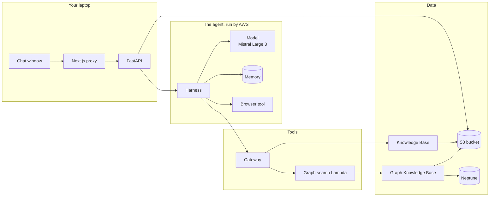

# Start here

A learning path through Docs Copilot, written for someone new to coding and
new to AWS. It goes from the whole picture down to the details, so every new
thing has a place to hang.

```
Level 0   the whole system on one sheet           15 minutes
Level 1   follow one question, hop by hop          45 minutes
Level 2   eight modules, one piece at a time       a few evenings
Level 3   the build logs: what happened and why    whenever you're curious
Practice  break things on purpose                  after Level 2
```

---

## Level 0: the whole system

Open the **interactive map**: https://claude.ai/code/artifact/b6c44e72-b148-49bc-9011-4a5d4da730d2
(a private page on your claude.ai account; `/artifacts` in Claude Code lists it too)

Click through the four paths (document question, web page, relationship
question, upload) with the arrow keys. Click any box for what it is, where
its code lives, where to find it in the AWS console, which identity it acts
as, and what it costs.

If you remember only three sentences, remember these:

1. **The page talks only to our backend.** The chat window calls a small proxy, which calls our FastAPI server on your laptop. Nothing in the browser talks to AWS.
2. **The backend hands your question to an agent that AWS runs.** The Harness loops: ask the model, run the tool it wants, give it the result, ask again, until it has an answer. The answer streams back piece by piece.
3. **Every AWS call is made by some identity, and that identity needs permission for exactly that call.** Your IAM user, the Harness role, the Gateway role, the Lambda role, each Knowledge Base's role. Almost every error you will see in AWS is one of these missing one permission.



---

## Level 1: follow one question

Read **[journey.md](journey.md)**. It follows "Why was Neptune Analytics
dropped from the plan?" through 12 hops, each with the exact file and line,
what the data looks like at that moment, and who is acting. It ends with a
URL question, a relationship question and one upload.

Do it with the code open next to it. After this, every module below is a
closer look at one or two hops you have already seen.

---

## Level 2: the modules

Each module lists what you will be able to explain afterwards, what to
read, one thing to try, and a few questions to answer without looking.
Do them in order: each one uses words from the ones before.

### Module 1: Your tools

**You will be able to explain:** what git, uv, npm, ruff, mypy and pytest each do, and why CI runs them on every push.

**Read:** `tooling.md` 1 to 5, then 9 and 10.

**Try:** `cd backend && uv run pytest -q`, then `cd frontend && npm test`. Read one test in `backend/tests/test_chat.py` and say what it proves.

**Check:** What is a lockfile for? What does CI do that your laptop doesn't?

### Module 2: The web plumbing

**You will be able to explain:** a request and a response, what FastAPI checks before running your code, how an answer streams (Server-Sent Events), and why the page goes through a proxy.

**Read:** `web.md` 1 to 5, 8 to 11, then 10.3 (the catch-all proxy).

**Try:** with the backend running, `curl -N -X POST localhost:8001/v1/chat -H 'X-Tenant-Id: dev' -H 'Content-Type: application/json' -d '{"message":"hi"}'` and watch the events arrive.

**Check:** Why can the status code not change once streaming has started? What does the proxy add to every request?

### Module 3: AWS basics

**You will be able to explain:** an account, an IAM user, a role, a policy, a region and a budget alarm, and read a permission error.

**Read:** `aws.md` 1 to 4, then 11 (every role in this project).

**Try:** in the IAM console, open the Lambda's role and find the one permission we added. Then find the Gateway role's.

**Check:** What is the difference between a user and a role? Which role reads the S3 bucket during a sync?

### Module 4: Models

**You will be able to explain:** tokens, what makes models differ, how to choose one, and why ours changed twice.

**Read:** `ai.md` 1 and 2, then 2.7 and 2.8.

**Try:** Bedrock console, Playground: ask Mistral Large 3 and Nova Lite the same question with two made-up passages to cite.

**Check:** Why could Llama 4 Maverick not drive our agent? What made Mistral Large 3 the pick?

### Module 5: Documents and search (RAG)

**You will be able to explain:** what happens to a file between upload and search: parsing, chunks, embeddings, hybrid search, reranking, citations.

**Read:** `ai.md` 3 and 4, `aws.md` 6 and 7, then `web.md` 13 (uploads, polling, citations).

**Try:** upload a short file of your own in the app, watch the sync status, then ask something only that file answers.

**Check:** What does the reranker add after hybrid search? Why is the tenant label written before the file?

### Module 6: The agent

**You will be able to explain:** the agent loop, tools and MCP, the Harness, the Gateway and its targets, short and long-term memory, the browser, and how the agent's stream becomes our chat events.

**Read:** `ai.md` 6, `aws.md` 10 (all of it, including 10.3c and 10.7), then `web.md` 12.

**Try:** AgentCore console, Harness playground. Ask a document question, then a URL question, and compare the tool calls in the trace.

**Check:** How does the agent pick between its tools? Why is one answer with one search two model calls? What did the `@` in `@aws_browser_v1` change?

### Module 7: GraphRAG, Lambda and the cost clock

**You will be able to explain:** what GraphRAG adds to search, why a Lambda sits between the Gateway and the graph, and how to keep Neptune from costing money.

**Read:** `ai.md` 5 (including 5.3, GraphRAG in this project), `aws.md` 12 (Lambda) and 8 (cost clock), then `D4.md`.

**Try:** start the graph (`aws.md` 8), ask a relationship question in the app, then stop the graph.

**Check:** What extra step does a GraphRAG sync do? Which two roles needed a new permission for the graph path?

### Module 8 (optional, deeper): Threads and the D1 foundations

**You will be able to explain:** why our endpoints are plain `def`, what the thread pool does, and how D1 called Bedrock directly before the Harness existed.

**Read:** `web.md` 6 and 7, `tooling.md` 6 to 8, `aws.md` 5.

**Check:** Why does a blocking boto3 call not freeze the whole server?

---

## Level 3: the build logs

What was built, in order, including what went wrong. Read them as history:
the topic files above describe how things are now.

| Log | What it covers |
|---|---|
| [D1.md](D1.md) | skeleton: FastAPI streaming Bedrock, Next.js chat, CI |
| [D2.md](D2.md) | S3, the managed Knowledge Base, Gateway, Harness, citations, sidebar |
| [D3.md](D3.md) | the browser tool and long-term memory |
| [D4.md](D4.md) | GraphRAG: second Knowledge Base, Neptune, the Lambda target |

### What changed, and why

| When | Change | Why |
|---|---|---|
| D1 | Llama 4 Maverick chosen for chat | cheap, decent, streams |
| D2 | agent built on AgentCore Harness, tools through Gateway, history in Memory | the loop, tools and memory become configuration, not code we maintain |
| D2 | Maverick replaced by gpt-oss-120b | Llama 4 cannot use tools while streaming on Bedrock |
| D3 | gpt-oss replaced by Mistral Large 3 | gpt-oss could not drive the multi-step browser |
| after D2 | no login, single user | finish the product end to end first |
| D4 | graph search behind a Lambda | the Gateway's Knowledge Base connector only accepts managed Knowledge Bases |
| dropped | Postgres, Docker, LangGraph, supervisor agents, Code Interpreter, Cognito | each was redundant once AgentCore covered it, or not worth it yet |

---

## Practice: break it on purpose

Reading builds a map; breaking things makes it stick. Do each one, predict
what will happen first, then check, then **put it back**.

| Break this | Predict, then check | Where to look |
|---|---|---|
| In the proxy (`route.ts`), remove the `X-Tenant-Id` header | every request fails. Which status code, and which file sends it? | `tenancy.py` |
| Upload a `.exe` file | rejected before S3 is touched. Which status code? | `documents.py` |
| In the Harness console, change `@aws_browser_v1` back to `aws_browser_v1` and ask a URL question | the agent never opens the page. Why? | `aws.md` 10.7 |
| With the graph stopped, ask "how does the Gateway relate to Memory?" | what does the tool return, and what does the agent say? | `D4.md` |
| Swap rules 1 and 2 in the harness prompt (a playground override is enough) | which tool does a URL question pick now? | `backend/prompts/assistant.md` |
| In IAM, detach `InvokeGraphSearchLambda` from the Gateway role, then ask a relationship question | where does the chain break, and what error shows up? | `aws.md` 11 |

---

## How these docs are organized

```
start here      README.md (this page), journey.md, the interactive map
topic tracks    ai.md, aws.md, web.md, tooling.md: how things work now
build logs      D1.md to D4.md: what happened, in order
glossary        glossary.md: every new word in one line
```

A topic has one home, in a track. Build logs point at it and never repeat it.
These files change as the project changes; if something is wrong, fix it in
place.
