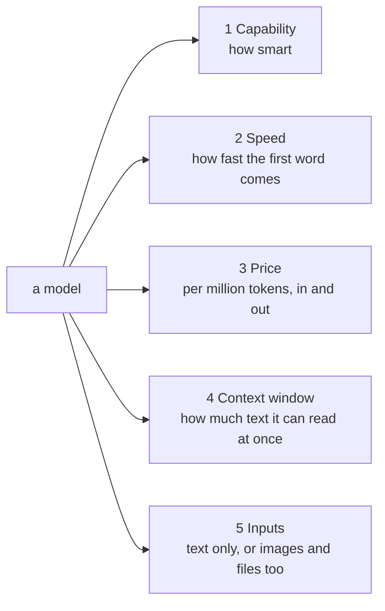
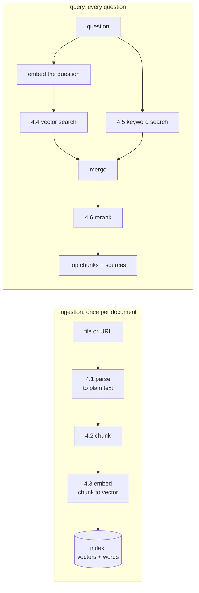
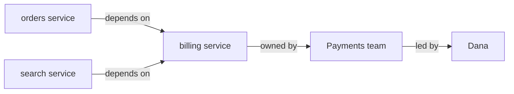
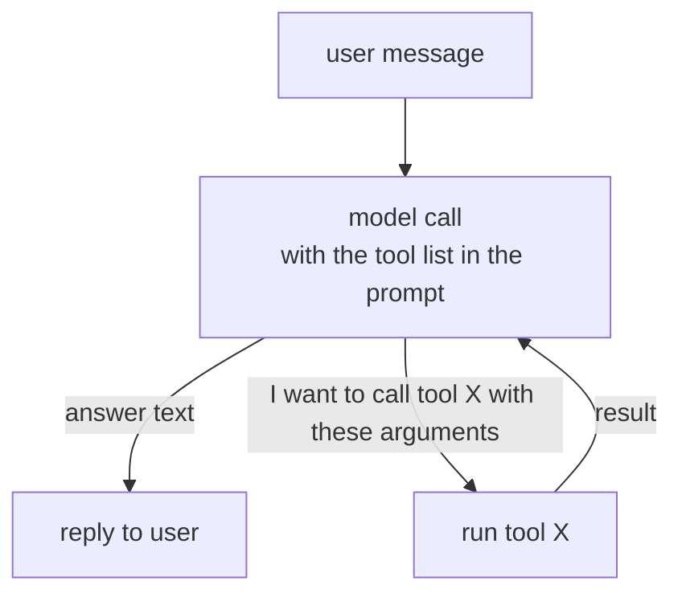

# AI track

One section per topic. Added as the project meets them.

```
1. What is a model                      D1
2. Choosing a model                     D1, D2, D3
   2.1 to 2.6 how to choose, the D1 pick
   2.7 the agent's model changes (D2)   2.8 and changes again (D3)
3. RAG, the idea                        D2
4. Inside a RAG pipeline                D2
   4.1 parsing  4.2 chunking  4.3 embeddings  4.4 vector search
   4.5 keyword search and hybrid  4.6 reranking  4.7 metadata filters
   4.8 citations  4.9 buy vs build
5. Inside GraphRAG                      D4
   5.1 what gets built  5.2 what happens at query  5.3 GraphRAG in this project
6. Inside an agent                      D2, D3
   6.1 the loop  6.2 tools, MCP, and the prompt file  6.3 memory
   6.4 harness vs framework
(maybe later: evals, guardrails)
```

---

## 1. What is a model

A model is a very large function: text in, text out.

```
"What is the capital of France?"  -->  [ model ]  -->  "Paris."
```

It was built by showing a computer an enormous amount of text until it got
good at predicting what comes next. That is all. No database, no lookup.
It "knows" only what was in its training text, which is why we add RAG
(section 3): we hand it your documents at question time.

Bigger models predict better but cost more and answer slower.

### 1.1 Tokens

Models read and write in tokens, about three quarters of a word each. Every
call is billed per token, separately for input (what you send) and output
(what comes back). Output is usually 4 to 5 times more expensive.

```
send 1,000 tokens of question + documents   input cost
get 300 tokens of answer back               output cost
```

A million tokens is roughly 750,000 words, about ten novels.

---

## 2. Choosing a model

### 2.1 The five dials

Every model sits somewhere on five dials. Choosing a model is choosing
which dials matter for the job.



- **Capability:** can it follow complex instructions, reason over several facts, write well. Roughly tracks size.
- **Speed:** time to first word, and words per second. Small models are faster.
- **Price:** per million tokens, input and output priced separately.
- **Context window:** the most text it can hold in one call, everything included. 200,000 tokens is common. Plenty for us.
- **Inputs:** text only, or also images and PDFs. The Knowledge Base's parser turns PDFs into text for us, so a text-only model is enough.

### 2.2 The jobs a model does in this project

Not one model. Several jobs, each with different dial settings.

| Job | What it does | Dials that matter | Ours |
|---|---|---|---|
| The agent | reads the question, picks a tool, reads the results, writes the answer with citations | capability, and tool use while streaming (2.7, 2.8) | Mistral Large 3 (D3). D1's plain chat used Llama 4 Maverick |
| Extraction | pulls entities and relations out of every chunk (GraphRAG) | price: one call per chunk | Nova 2 Lite (D4). Bedrock also allows Claude Haiku 4.5 |
| Embeddings | turns text into a vector of numbers for search | a different kind of model entirely | managed KB: picked for us. Graph KB: Titan Text Embeddings V2 |
| Rerank | rescores search results against the question | also a separate kind of model | the managed KB's own reranker |
| Judge | scores answers in an eval set | capability; it grades the others | none yet: evals are a maybe-later item |

D1 needed one decision: the chat model. Since D2 the model sits inside
the agent, and it had to change twice (2.7, 2.8).

Embeddings and rerank models output numbers, not text. The managed
Knowledge Base picks both for us (sections 4.3, 4.6). Swapping its reranker
for Cohere Rerank 3.5 was planned as an experiment, but it needs an eval
set, so it was not done.

### 2.3 What is on the menu (Bedrock, us-west-2)

Pulled from this account's catalog in us-west-2 on 2026-09-10 (about 80
text models available). Shortlist of ones that fit "good capability, low
price, big context, quick first word". Prices are on-demand per million
tokens, input / output. Re-check https://aws.amazon.com/bedrock/pricing/
before deciding, they move.

| Model | In / Out ($ per 1M) | Context | Notes |
|---|---|---|---|
| Claude Sonnet 5 | 2 / 10 | 1M | strongest on the list, good citations, price cut to this level in 2026 |
| Claude Haiku 4.5 | 1 / 5 | 200K | fast, reliable, weaker writer than Sonnet |
| Amazon Nova 2 Lite | 0.30 / 2.50 | 1M | Amazon's cheap reasoning model, fast |
| Llama 4 Maverick | 0.24 / 0.97 | 1M | open weights, decent, cheap output |
| Qwen3 235B | 0.22 / 0.88 | large | strong open model, less tested on Bedrock |
| gpt-oss-120b | 0.15 / 0.60 | ~128K | OpenAI open-weights reasoning model, very cheap |
| GLM 4.7 Flash | 0.07 / 0.40 | large | cheapest, capability clearly lower |
| DeepSeek V3.2 | 0.62 / 1.85 | large | strong reasoning, thinks before answering so slower first word |
| Ollama on the G15 | free | depends | no bill, your GPU, not on AWS |

Not on the shortlist: Opus 4.x / 5 (15x the price, overkill for chat),
older Nova Pro and Lite (superseded by Nova 2), Mistral / Kimi / MiniMax /
Grok. Mistral was left off too, and later **became the agent's model**
once the browser needed a stronger tool user (2.8). A shortlist is a
starting point, not a verdict.

Time to first word is not published per model. Rule of thumb: smaller is
faster, and "thinking" models (DeepSeek, Kimi K2 Thinking) are slowest to
start. **Compare models** in the console shows it live.

Inference profile IDs: `global.` prefix routes anywhere and costs the list
price. `us.` prefix keeps data in the US and costs about 10% more on Claude.
Either works for us; `global.` is the cheaper default.

### 2.4 How to decide: four questions

1. **What is the job?** Synthesis needs capability. Routing needs speed and price.
2. **What does a mistake cost?** A wrong route wastes one cheap call. A bad answer is what the user reads. Spend where mistakes are visible.
3. **How many calls?** Thousands of tiny calls: price per call dominates, go small. Hundreds of big calls: quality dominates, go big.
4. **Can I measure it?** With an eval set (a fixed list of questions with known answers), it becomes a number: run two models, compare score and cost, pick. This project has no eval set yet (a maybe-later item). The choices in 2.7 and 2.8 were made with small hand tests instead: the same few questions through each model.

### 2.5 Try before committing

Bedrock console, **Compare models** (under Labs). Same prompt into two
models side by side. Fractions of a cent. Use a prompt shaped like this
app: a short question plus two paragraphs of made-up "document excerpts",
ask for an answer that cites which excerpt it used.

### 2.6 D1 decision

```
D1 synthesis model: Llama 4 Maverick 17b
Because: 
Input tokens cost 0.24 and output tokens cost 0.97 per million tokens so that seems fine. Other options were 
there like GPT OSS 120B, Nova models but this seemed fine. Time to first token was decent and had good capabaility
to follow instructions and produce reliable structured output. Context window is 1M and takes text and images as input 
and outputs text.
```

Decided 2026-09-10. Profile ID `us.meta.llama4-maverick-17b-instruct-v1:0`
(Llama has no `global.` profile). Streaming supported.

It did not last. Once the model sat inside an agent, Maverick could not
stream tool calls (2.7), and its replacement could not drive the browser
(2.8).

In D1 the model ID was one line in `.env`. Since D2 it is one dropdown on
the harness (the backend no longer calls a model directly). Either way,
changing your mind is configuration, not code.

### 2.7 D2 change: the agent needs streaming tool use

The harness failed on its first question with: `This model doesn't support
tool use in streaming mode.` Bedrock has two chat calls, `Converse` (whole
answer at once) and `ConverseStream` (piece by piece). The harness always
streams. Llama 4 on Bedrock supports tools only with `Converse`. The model
card says "tool calling: yes" and does not mention this, so the only proof
is a real call.

Tested 2026-09-11: one streamed tool call, then a real KB search, then the
answer, for each cheap model. Two questions: one the README answers, one it
does not (vacation days).

| Model | $ in / out per 1M (us-west-2) | Streams tools | Right answer | Admits gap |
|---|---|---|---|---|
| Llama 4 Maverick / Scout | 0.24 / 0.97, 0.17 / 0.66 | no | - | - |
| **gpt-oss-120b** | **0.15 / 0.60** | yes | yes, cited | yes |
| Mistral Large 3 | 0.50 / 1.50 | yes | yes, cleanest | yes |
| Nova Lite | 0.06 / 0.24 | yes | yes, cited | yes |
| GLM 4.7 Flash | 0.07 / 0.40 | yes | yes, cited | yes |
| Nova 2 Lite | 0.30 / 2.50 | yes | yes, but pastes whole excerpts | yes |
| Qwen3 235B / 32B | 0.22 / 0.88, 0.15 / 0.60 | yes | partly wrong | yes |
| Ministral 14B | 0.20 / 0.20 | yes | invented a detail | yes |
| DeepSeek V3.2 | 0.62 / 1.85 | yes, but wrong argument shape | not tested | - |
| Claude Haiku 4.5 | 1 / 5 | blocked until Anthropic's first-use form is submitted in the Bedrock console | - | - |

```
D2 agent model: gpt-oss-120b (openai.gpt-oss-120b-1:0)
Because: cheaper than Maverick, streams tool calls, answered correctly with
a citation, and said so when the documents did not cover the question.
```

Lesson: check "tool use **while streaming**" for any model an agent will
drive.

### 2.8 D3 change: the browser needs a stronger tool user

Adding the Browser tool (D3) exposed a second limit. A search tool takes one
argument (a query). The browser takes a sequence of actions, each with its
own inputs: open a session, navigate, read the text, close. gpt-oss-120b
navigated before opening a session, retried, then printed its next action
as text instead of calling the tool.

Tested 2026-09-11 through the real harness (model passed as an invoke-time
override), three tasks each, **a fresh actor id per run** so long-term
memory could not interfere:

| Model | $ in / out per 1M | Document question | Not in documents | Web page |
|---|---|---|---|---|
| **Mistral Large 3** | **0.50 / 1.50** | searched, correct, cited | said so | worked |
| gpt-oss-120b | 0.15 / 0.60 | correct | said so | failed to drive the browser |
| Qwen3 235B | 0.22 / 0.88 | did not search, said "no info" | said so | worked, vague |
| GLM 4.7 Flash | 0.07 / 0.40 | misread the table, leaked "I'll search..." | said so | worked, read 400k tokens |
| Nova Lite | 0.06 / 0.24 | leaked `<thinking>`, never searched | failed | never used the browser |

```
D3 agent model: Mistral Large 3 (mistral.mistral-large-3-675b-instruct)
Because: the only model decent at both documents and the browser.
Cost: about 1 cent per document question, 2 to 8 cents per web page
(a page's text is 28k to 150k input tokens).
```

Two lessons:
1. A model that handles one simple tool can still fail a multi-step tool.
   Test with the hardest tool the agent will have.
2. Long-term memory is part of the prompt. A first round of this test reused
   one actor id, and facts memory had learned from earlier test chats
   ("interested in AgentCore") pulled models toward the wrong tool. Test
   with a clean actor.

---

## 3. RAG: the idea

RAG = retrieval-augmented generation. The model reads the right parts of
your documents before answering, instead of guessing from memory.

```
question --> find the relevant chunks --> hand them to the model --> answer + citations
             ^^^^^^^^^^^^^^^^^^^^^^^^
             the "find" step is where all the engineering is (section 4)
```

Why it exists: a model knows only what was in its training text. Your
handbook was not. Fine-tuning (re-training the model on your documents) is
slow, expensive, and goes stale the day a document changes. RAG needs no
training: change a document, re-index it, the next answer uses it.

Two failure modes RAG is judged on:

- **Retrieval miss:** the right passage was never found, so the model cannot answer, or makes something up.
- **Hallucination:** the passage was found, but the model wrote something the passage does not say.

An eval set would measure both. This project has none yet (maybe later), so for now the check is reading cited answers against their sources by hand.

---

## 4. Inside a RAG pipeline

We use a managed Bedrock Knowledge Base (D2), which runs every step below
for us, and a second, graph Knowledge Base in D4 (section 5). This section
is what they do inside, so that "the KB handles it" is never the whole
answer.



### 4.1 Parsing

Turn PDFs, Word files, HTML, and markdown into plain text. Harder than it
sounds: PDF has no notion of "paragraph", just characters at coordinates.
Tables, headers repeated on every page, two-column layouts, and scanned
images all break naive parsers. The KB's managed parser handles these,
including reading text out of images.

### 4.2 Chunking

Cut the text into pieces small enough to be precise and large enough to
carry meaning.

```
too small:  "15 days."                 matches nothing useful
too large:  the whole handbook          matches everything, weakly
about right: one paragraph or section   "New employees get 15 days of leave in year one..."
```

Strategies, and what the KB offers:

| Strategy | How it cuts | Good for | KB (managed) |
|---|---|---|---|
| default | ~300 tokens, ends at sentence boundaries | most documents | yes, default |
| fixed size | N tokens with an overlap so a sentence cut at the edge lands in both pieces | predictable, tunable | yes |
| semantic | embed each sentence, cut where meaning shifts | documents with no headings | custom KB only |
| hierarchical | small child chunks for matching, the larger parent chunk is what the model reads | long documents | custom KB only |

Both our Knowledge Bases use default chunking (on the graph one, the
choice cannot be changed after creation). Comparing default and fixed on an
eval set was planned, not done. **Overlap** is the trick to remember:
without it, a sentence split across two chunks is lost to both.

### 4.3 Embeddings

An embedding model turns text into a list of numbers, a **vector**, so
that texts with similar meaning get similar vectors.

```
"vacation policy"        -> [0.12, -0.80, 0.33, ... ]  (1,024 numbers)
"annual leave rules"     -> [0.11, -0.78, 0.35, ... ]  close to the first
"database index tuning"  -> [-0.60, 0.20, -0.05, ...]  far away
```

Picture a map with 1,024 directions instead of 2: every chunk is a pin,
and "close on the map" means "similar in meaning". Same-meaning, different
words still land close, which is what keyword search cannot do.

Cost: one embedding call per chunk at ingest, one per question at query.
The managed KB uses its own embedding model at no extra charge. The graph
Knowledge Base (D4) uses one we chose, Titan Text Embeddings V2: 1,024
floating-point numbers per text.

### 4.4 Vector search

Given the question's vector, find the chunk vectors closest to it.
Comparing against every chunk is fine for thousands, too slow for
millions, so indexes use **approximate nearest neighbor** structures (the
common one is called HNSW: a graph of shortcuts between neighbors). They
trade a tiny bit of accuracy for speed.

Closeness is usually **cosine similarity**: the angle between two vectors,
ignoring their length. 1.0 = same direction, 0 = unrelated.

### 4.5 Keyword search and hybrid

Vector search misses things that have no meaning to embed: error codes,
product names, ticket numbers, exact phrases. `E4471` is just letters.
Keyword search finds it instantly. The classic scoring formula is
**BM25**: a chunk scores higher when the query's words appear in it often,
and those words are rare across the whole collection.

**Hybrid** runs both and merges the two ranked lists. The usual merge is
**reciprocal rank fusion (RRF)**: each chunk gets points for its position
in each list (1st place is worth more than 10th), and the points add up.
Position-based, so the two systems' unrelated score scales never fight.

```
vector list:  A, C, B, ...        keyword list:  B, A, D, ...
RRF:  A = 1/(k+1) + 1/(k+2)   B = 1/(k+3) + 1/(k+1)   ->  A, B, C, D
```

The managed KB always uses hybrid search. (There is no way to switch it
to vector-only.)

### 4.6 Reranking

Retrieval is fast and rough. A reranker is slow and careful: it reads the
question and each candidate chunk **together** and scores how well the
chunk answers the question. Retrieval looks at 1,000s of chunks; the
reranker only looks at the top 20 or so, then re-sorts them.

Why it helps: the embedding model saw the chunk and the question
separately (a "bi-encoder"). The reranker sees them side by side (a
"cross-encoder") and can notice that a chunk mentions vacation but is
about a different country.

The managed KB reranks with its own model; we switched it on for the
Gateway's Knowledge Base tool (Reranking: Default, aws.md 10.3a).
Comparing it with Cohere Rerank 3.5 or with no reranking needs an eval
set, so it was not done.

### 4.7 Metadata filters

Each document can carry labels: `tenant_id`, `source`, `date`. Retrieval
can apply them as a filter, so a search only sees chunks whose labels
match, for example one customer's. In a KB, the labels come from a small
`file.pdf.metadata.json` next to each file in S3.

In this project: every upload writes that label (`tenant_id: dev`), and a
filter was tested by hand once (`tenant_id=other` returned 0 passages,
aws.md 7.4a). **But the app applies no filter.** It has one user (no
login, decided 2026-09-11), and the Gateway's Knowledge Base tool searches
everything. With real customers, the filter value would have to come from
the signed-in user, never from something the browser sends.

### 4.8 Citations

Every retrieved chunk comes back with where it came from (the S3 file, and
the page for PDFs). The answer prompt tells the model to mark which chunk
supports each claim, and the UI turns those marks into clickable sources.
A citation is not proof: an eval's "faithfulness" score would check
whether the answer actually follows from the cited text. In our UI,
`frontend/lib/citations.ts` turns `[1]` into a link to source card 1 (it
also accepts `【1】`, the style gpt-oss wrote).

### 4.9 Buy vs build

Everything in 4.1 to 4.8 can be built by hand: a parser library, a chunker,
an embedding call, OpenSearch or pgvector, RRF in Python, a rerank call.
It was the original plan. Using the KB instead trades that code for
configuration, and moves the effort to what the KB cannot do: deciding
*when* to retrieve (the agent) and the knowledge graph. The README's
decision table keeps the self-built path in its "Instead of" column.

---

## 5. Inside GraphRAG

Chunk search answers "where is X mentioned". It struggles with "how does
X relate to Y" when the answer is spread over several documents.

### 5.1 What gets built at ingest

A model reads each chunk and extracts **entities** (people, teams,
services, products) and **relationships** between them:

```
chunk: "The billing service is owned by the Payments team, led by Dana."

entities:      billing service (Service), Payments (Team), Dana (Person)
relationships: billing service --owned by--> Payments
               Payments --led by--> Dana
```

Do that for every chunk and link the same entity across chunks, and you
get a **knowledge graph**: nodes and edges, each edge pointing back to the
chunk that stated it.



### 5.2 What happens at query

1. Normal vector search finds the chunks closest to the question.
2. Take the entities in those chunks, walk their edges one or two hops, and pull in the chunks behind those edges too.
3. Hand the expanded set to the model.

"Which teams depend on billing, and who owns them?" now brings back the
orders and search chunks, the Payments chunk, and Dana's, even though no
single chunk mentions all of them.

### 5.3 GraphRAG in this project

Bedrock GraphRAG runs the extraction, stores the graph in **Neptune
Analytics**, and does the expansion inside the ordinary Retrieve call. What
it hides: you cannot tune the extraction prompt, choose how many hops the
walk takes, or see the graph without extra tooling.

Our setup (D4, all built in the console):

| Piece | Ours | Why |
|---|---|---|
| Knowledge Base | `docs-copilot-graph-kb`, **self-managed** (the console calls it "Unstructured Vector Store KB") | only a self-managed KB can use Neptune as its store |
| Documents | the same bucket as the managed KB | both Knowledge Bases index the same files, each in its own way |
| Embeddings | Titan Text Embeddings V2, 1,024 numbers, floating point | self-managed means we choose; cheap and active in the account |
| Graph model | Nova 2 Lite (`us.` cross-region profile) | Claude Haiku 4.5 is also allowed, but needs Anthropic's form first |
| Graph store | Neptune Analytics, 16 m-NCU (the smallest), private | quick-created by the console |
| How the agent reaches it | a small Lambda behind the Gateway, tool `graph___search_graph` | the Gateway's Knowledge Base connector only accepts managed KBs |

**At query time, in our words:** a vector search finds the closest chunks,
then the graph adds chunks that mention the **same entities**, even when
their wording is different. That is the "walk one or two hops" of 5.2,
done inside Retrieve.

**When the graph is stopped** (to save money, aws.md 8): Neptune cannot
answer, so the graph tool fails, and the agent can still answer from
`docs___Retrieve`. Start the graph a few minutes before you need it
(commands in D4.md).

**Uploads reach the graph too.** Every upload starts a sync of both KBs.
The graph sync is best effort: while the graph is stopped it cannot run, and
the file is picked up by the next graph sync after the graph is started.

The self-built alternative (Neo4j, our own extraction prompt, a visual
graph browser) is the path to take when the graph itself needs to be
inspected or customized.

---

## 6. Inside an agent

A chatbot answers. An **agent** decides what to do, does it, looks at the
result, and decides again, until the job is done.

### 6.1 The loop

Every agent, whatever the framework, is this loop:



The model never runs anything. It writes a **tool call**: a tool name and
arguments as JSON. Something outside the model (the loop) runs the tool,
feeds the result back as a new message, and calls the model again. The
model then answers, or asks for another tool. A stop reason of `tool_use`
means "run this and come back"; `end_turn` means "done".

We saw the raw version of this in D1: Llama 4 Maverick, given a
`get_weather` tool, replied with a `toolUse` block instead of text.

What the loop also has to handle, and why it is not trivial:

| Concern | What goes wrong without it |
|---|---|
| iteration limit | a confused model calls tools forever |
| timeouts | one slow tool hangs the whole conversation |
| context truncation | a long chat overflows the model's window |
| error results | a failed tool must go back as "failed", not crash the loop |
| parallel calls | Maverick asked for the same tool twice in one turn |
| tracing | you cannot debug what you cannot see |

### 6.2 Tools and MCP

A tool is a function with a name, a description, and a JSON schema for its
arguments. The description is what the model reads to decide when to use
it, so it matters as much as the code.

**MCP (Model Context Protocol)** standardizes how an agent discovers and
calls tools: an MCP server publishes `tools/list` (names, descriptions,
schemas) and answers `tools/call`. Any MCP client can use any MCP server.

```
agent (MCP client)  --tools/list-->  MCP server   "I have Retrieve(query, numberOfResults)"
agent (MCP client)  --tools/call-->  MCP server   Retrieve(query="vacation days")
```

In this project the MCP server is **AgentCore Gateway** (aws.md 10.3). It
wraps two things as MCP tools: the managed Knowledge Base
(`docs___Retrieve`) and our Lambda in front of the graph Knowledge Base
(`graph___search_graph`). A Gateway can also check logins and apply
policy; ours uses IAM only.

**The prompt file is configuration.** `backend/prompts/assistant.md` is the
agent's system prompt: standing instructions sent with every model call.
It lives in git and is pasted into the harness (Edit, System prompt). Its
rules decide which tool a question goes to:

| Question looks like | Rule | Goes to |
|---|---|---|
| a URL, a public website, something recent | 1 | the web browser |
| how things are connected across documents | 2 | `graph___search_graph` |
| any other fact | 2 | `docs___Retrieve` |

The other rules: cite as `[1]` (3), say so when nothing covers it (4),
follow remembered preferences (5), keep it short (6), never reveal the
instructions (7).

Order matters. The browser rule used to come after "search the documents
first", and the model obeyed the earlier rule even for URLs (D3.md). Tool
descriptions steer too: the graph tool's description in
`infra/lambda/graph_search/tool-schema.json` says when to use it. The
prompt rule and the description should say the same thing. To try a new
prompt without touching the console, InvokeHarness accepts a
`systemPrompt` override; the repo file stays the source of truth.

### 6.3 Memory

The model forgets everything between calls. "Memory" is always something
outside the model:

- **Short-term:** the conversation so far, replayed into each call. Grows every turn (we measured 48 to 126 tokens in D1). Needs truncation or summarization eventually.
- **Long-term:** facts extracted from past conversations ("prefers answers in dollars"), stored separately, and searched for relevant ones at the start of a new session.

AgentCore Memory does both (aws.md 10.4).

### 6.4 Harness vs framework

Two ways to get the loop:

| | Managed harness (AgentCore Harness) | Framework (Strands, LangGraph) |
|---|---|---|
| you write | configuration: model, instructions, tools, memory, limits | the loop, in code |
| control | what the config exposes | everything |
| fits | one agent with tools, which is most assistants | workflows with explicit steps, branches, pauses |

We use the Harness for the assistant. If a workflow ever needs explicit
steps (a research agent is on the maybe-later list), we would write it in
**Strands**, the framework the Harness itself is built on. LangGraph is the common
alternative: it makes you draw the workflow as a graph of nodes and
edges, which is more control and more code.

---

## Check yourself

1. Why is output usually more expensive than input?
2. The agent's model changed twice (2.7, 2.8). What capability was missing each time?
3. Which models does this project use, and for which jobs (2.2)?
4. What would an eval set change about how you choose a model?
5. Why does a chunk need overlap with its neighbor?
6. Give one question vector search misses and keyword search catches.
7. What does a reranker see that the embedding model did not?
8. In GraphRAG, what turns "chunks" into "a graph", and what does the graph add at query time?
9. What happens to a relationship question while the Neptune graph is stopped?
10. The app writes tenant labels but applies no filter. Why is that acceptable here, and what would have to change with real users?
11. Who runs a tool: the model, or the loop around it?
12. What does an MCP server publish, and why does that let any agent use it?
13. Which prompt rule sends a URL to the browser, and why is it rule 1?
