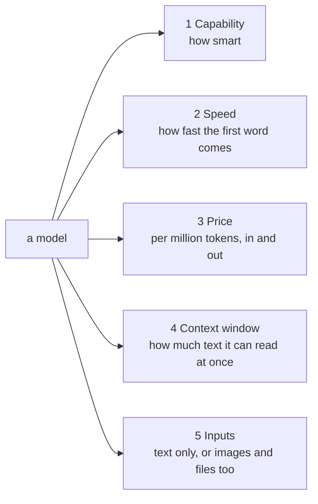

# AI track

One section per topic. Added as the project meets them.

```
1. What is a model                      D1
2. Choosing a model                     D1
3. RAG, the idea and the five kinds     D2 to D5
(next: embeddings, chunking, evals, agents, MCP, A2A, guardrails, knowledge graphs)
```

---

## 1. What is a model

A model is a very large function: text in, text out.

```
"What is the capital of France?"  -->  [ model ]  -->  "Paris."
```

It was built by showing a computer an enormous amount of text until it got
good at predicting what comes next. That is all. No database, no lookup.
It "knows" only what was in its training text, which is why we add RAG
(section 3): we hand it your documents at question time.

Bigger models predict better but cost more and answer slower.

### 1.1 Tokens

Models read and write in tokens, about three quarters of a word each. Every
call is billed per token, separately for input (what you send) and output
(what comes back). Output is usually 4 to 5 times more expensive.

```
send 1,000 tokens of question + documents   input cost
get 300 tokens of answer back               output cost
```

A million tokens is roughly 750,000 words, about ten novels.

---

## 2. Choosing a model

### 2.1 The five dials

Every model sits somewhere on five dials. Choosing a model is choosing
which dials matter for the job.



- **Capability:** can it follow complex instructions, reason over several facts, write well. Roughly tracks size.
- **Speed:** time to first word, and words per second. Small models are faster.
- **Price:** per million tokens, input and output priced separately.
- **Context window:** the most text it can hold in one call, everything included. 200,000 tokens is common. Plenty for us.
- **Inputs:** text only, or also images and PDFs. We extract PDF text ourselves, so text-only is enough.

### 2.2 The jobs a model does in this project

Not one model. Several jobs, each with different dial settings.

| Job | What it does | Dials that matter | When |
|---|---|---|---|
| Synthesis | reads retrieved excerpts, writes the answer with citations | capability. This is what the user reads | D1 |
| Router | reads the question, picks a strategy (direct / search / graph) | speed, price. Tiny output, thousands of calls | D3 |
| Extraction | pulls entities and relations out of every chunk | price. One call per chunk, hundreds of chunks | D4 |
| Embeddings | turns text into a vector of numbers for search | a different kind of model entirely | D2 |
| Rerank | rescores search results against the question | also a separate kind of model | D3 |

D1 needs **synthesis only**. One decision. The router arrives in D3 and
gets decided then, with real numbers from the eval set.

Embeddings and rerank models output numbers, not text. Different catalog,
different decision, D2.

### 2.3 What is on the menu (Bedrock, us-west-2)

Pulled from this account's catalog in us-west-2 on 2026-09-10 (about 80
text models available). Shortlist of ones that fit "good capability, low
price, big context, quick first word". Prices are on-demand per million
tokens, input / output. Re-check https://aws.amazon.com/bedrock/pricing/
before deciding, they move.

| Model | In / Out ($ per 1M) | Context | Notes |
|---|---|---|---|
| Claude Sonnet 5 | 2 / 10 | 1M | strongest on the list, good citations, price cut to this level in 2026 |
| Claude Haiku 4.5 | 1 / 5 | 200K | fast, reliable, weaker writer than Sonnet |
| Amazon Nova 2 Lite | 0.30 / 2.50 | 1M | Amazon's cheap reasoning model, fast |
| Llama 4 Maverick | 0.24 / 0.97 | 1M | open weights, decent, cheap output |
| Qwen3 235B | 0.22 / 0.88 | large | strong open model, less tested on Bedrock |
| gpt-oss-120b | 0.15 / 0.60 | ~128K | OpenAI open-weights reasoning model, very cheap |
| GLM 4.7 Flash | 0.07 / 0.40 | large | cheapest, capability clearly lower |
| DeepSeek V3.2 | 0.62 / 1.85 | large | strong reasoning, thinks before answering so slower first word |
| Ollama on the G15 | free | depends | no bill, your GPU, not on AWS |

Not on the shortlist: Opus 4.x / 5 (15x the price, overkill for chat),
older Nova Pro and Lite (superseded by Nova 2), Mistral / Kimi / MiniMax /
Grok (fine, but nothing they do better for this job).

Time to first word is not published per model. Rule of thumb: smaller is
faster, and "thinking" models (DeepSeek, Kimi K2 Thinking) are slowest to
start. **Compare models** in the console shows it live.

Inference profile IDs: `global.` prefix routes anywhere and costs the list
price. `us.` prefix keeps data in the US and costs about 10% more on Claude.
Either works for us; `global.` is the cheaper default.

### 2.4 How to decide: four questions

1. **What is the job?** Synthesis needs capability. Routing needs speed and price.
2. **What does a mistake cost?** A wrong route wastes one cheap call. A bad answer is what the user reads. Spend where mistakes are visible.
3. **How many calls?** Thousands of tiny calls: price per call dominates, go small. Hundreds of big calls: quality dominates, go big.
4. **Can I measure it?** From D2 the eval set scores answers. Then it is a number: run two models, compare score and cost, pick.

### 2.5 Try before committing

Bedrock console, **Compare models** (under Labs). Same prompt into two
models side by side. Fractions of a cent. Use a prompt shaped like this
app: a short question plus two paragraphs of made-up "document excerpts",
ask for an answer that cites which excerpt it used.

### 2.6 D1 decision

```
D1 synthesis model: Llama 4 Maverick 17b
Because: 
Input tokens cost 0.24 and output tokens cost 0.97 per million tokens so that seems fine. Other options were 
there like GPT OSS 120B, Nova models but this seemed fine. Time to first token was decent and had good capabaility
to follow instructions and produce reliable structured output. Context window is 1M and takes text and images as input 
and outputs text.
```

Decided 2026-09-10. Profile ID `us.meta.llama4-maverick-17b-instruct-v1:0`
(Llama has no `global.` profile). Streaming supported.

Challengers to test against it in D2 once the eval set exists: Nova 2 Lite
(cheaper) and Claude Sonnet 5 (stronger). The recommendation at the time
was Sonnet 5; the cheaper pick is the right call while the rest of the
system is still being built.

The model ID is one line in `.env`. Changing your mind costs 10 seconds.
That is why it is config, not code.

---

## 3. RAG: the idea and the five kinds

RAG = retrieval-augmented generation. The model reads the right parts of
your documents before answering, instead of guessing from memory.

```
question --> find the relevant chunks --> hand them to the model --> answer + citations
             ^^^^^^^^^^^^^^^^^^^^^^^^
             this "find" step is what changes between RAG types
```

Five kinds, one per deliverable, each fixing a weakness of the last:

| # | Kind | How "find" works | Weakness it leaves | When |
|---|---|---|---|---|
| 1 | Naive | vector similarity only | misses exact words (codes, names) | D2 |
| 2 | Hybrid + rerank | vector + keyword (BM25), merged, then rescored | one-shot, cannot chain facts | D3 |
| 3 | Adaptive router | cheap model picks: direct / naive / hybrid / graph | only as good as its options | D3 |
| 4 | GraphRAG | entities and relations in Neo4j, walk the graph | expensive to build | D4 |
| 5 | Agentic | agent loops: search, read, search again, answer | slow, costly, for multi-hop only | D5 |

Plus **Bedrock Knowledge Base** (D3): Amazon's ready-made RAG over the same
documents. Not built by us. The yardstick we measure ours against.

The eval set (30+ questions, scored with RAGAS) says whether each step
improved answers or just added machinery.

---

## Check yourself

1. Why is output usually more expensive than input?
2. Which dial matters most for the router job, and why not capability?
3. Why is D1 only one model decision, not two?
4. What does the eval set change about how you choose a model?
5. What single step differs between the five RAG kinds?
