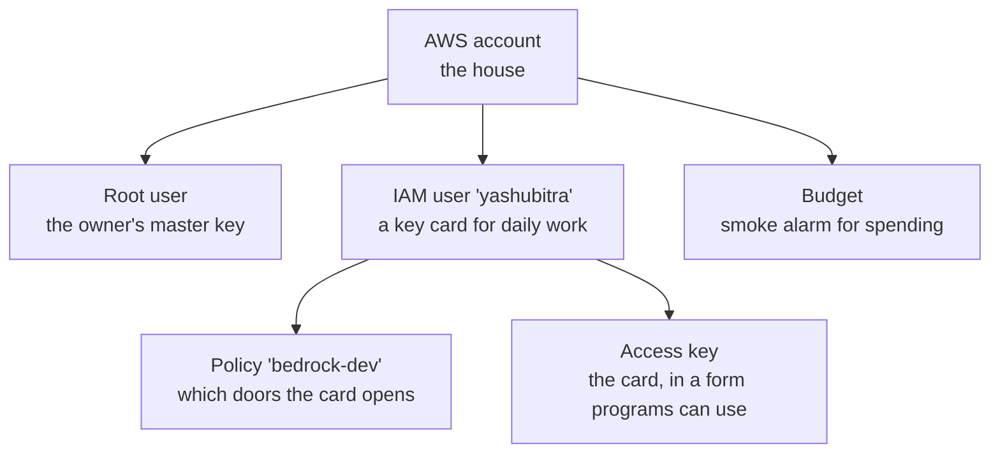

# AWS track

One section per service or concept. Added as the project meets them.

```
1. What AWS is                    D1
2. Account, root, IAM, keys       D1
3. Regions                        D1
4. Budgets                        D1
5. Bedrock                        D1
(next: S3, SQS, Cognito, OpenSearch, AgentCore, Terraform, ECS Fargate, CloudWatch)
```

---

## 1. What AWS is

Amazon rents out computers, storage, and services by the hour or by the
request. Instead of buying a server, you borrow one and pay for what you
use.

```
your laptop                    AWS (Amazon's data centers)
  code you write   --calls-->    AI models (Bedrock)
                                 databases, file storage, servers...
                                 bill at the end of the month
```

---

## 2. Account, root, IAM, keys

Everything fits one picture:



### 2.1 Root user

The email and password the account was created with. Can do anything,
including delete the account or change the card.

**Rule:** root only for owner tasks: MFA, budget, first IAM user. Then
stop using it. If root leaks, someone owns the account. If an IAM key
leaks, they can only do what its policy allows.

### 2.2 IAM user

IAM = Identity and Access Management: the part of AWS that decides who can
do what. An IAM user is a second identity with no powers by default. You
grant exactly what it needs.

Ours: `yashubitra`, no console password, used only from code and terminal.

### 2.3 Policy

A JSON list of allowed actions. Ours, named `bedrock-dev`:

```
bedrock:InvokeModel                    call an AI model
bedrock:InvokeModelWithResponseStream  same, words stream back one by one
bedrock:ListFoundationModels           see which models exist
bedrock:ListInferenceProfiles          see their IDs
budgets:ViewBudget                     read the budget, not change it
```

Nothing creates or deletes. Worst case for a leaked key: a Bedrock bill,
which the budget alarm catches.

### 2.4 Access key and profile

An access key is a username and password for programs:

```
Access key ID       like a username, starts with AKIA...
Secret access key   like a password, shown once
```

`aws configure --profile docs-copilot-dev` stores them in
`~/.aws/credentials` under a **profile** name. Every AWS call the code
makes sends them; AWS finds the user, checks the policy, allows or refuses.

Profile name and IAM username do not need to match.

**Rules:** never paste keys into chat, git, or screenshots. If one leaks,
delete it in IAM and make a new one. One minute.

### 2.5 MFA

A phone code on top of the password. On for root, no exceptions.

---

## 3. Regions

Groups of data centers:

```
us-east-1    N. Virginia
us-west-2    Oregon        <- ours
eu-central-1 Frankfurt
```

Most things live in one region and are invisible from others. Some
services are global (IAM, budgets).

We use **us-west-2** for everything. Two features needed later (Bedrock
rerank, AgentCore) live there. Picking once avoids moving later.

**Gotcha:** the console remembers the last region you looked at. Check the
top right before creating anything. IAM shows "Global", that is normal.

---

## 4. Budgets

An email alarm, not a cap. AWS emails when the month's bill crosses a
percentage of the number you set. It does not stop anything.

Ours: $30 a month, alerts at 50% and 80%. Created before the first paid
call.

---

## 5. Bedrock

Amazon's AI model service. One API, many models (Claude, Nova, Llama,
others). Pay per token. Which model and why: `ai.md` section 2.

Not to be confused with **Bedrock AgentCore**, a separate console for
hosting agents. That is D6.

Also not to be confused with **Bedrock-mantle**, a second console and
endpoint for OpenAI-style and Anthropic-style API calls with API keys. We
use the original **Bedrock-runtime** console: IAM keys, the Converse API,
cross-region inference profiles. The link between them is at the bottom
left of either console.

### 5.1 Model access

Some models need a one-time "request access" per account, from the model's
page in **Model catalog**. Usually instant. Anthropic models may ask for a
short use-case form the first time.

### 5.2 Inference profile IDs

Every model has an ID string. Ones starting with `global.` or `us.` are
cross-region inference profiles: AWS may run the request in another region
for better availability. `global.` = anywhere, list price. `us.` = US only,
about 10% more on Claude. Copy from console, **Inference profiles**, into
`.env`. Never type from memory.

### 5.3 How the code uses all of this


### 5.4 D1 setup checklist

```
[x] account created
[x] MFA on root
[x] budget $30
[x] IAM user yashubitra, no console access
[x] policy bedrock-dev on that user
[x] access key, "Command Line Interface"
[x] aws configure --profile docs-copilot-dev
[ ] model access for the chosen model, region us-west-2
[ ] its us. ID into .env
```

---

## Check yourself

1. Why does the IAM user get a policy but root does not need one?
2. Worst thing someone can do with a leaked `bedrock-dev` key?
3. Does the budget stop spending at $30?
4. Why us-west-2 and not whatever the console shows?
5. Where on the laptop do the access keys end up?
