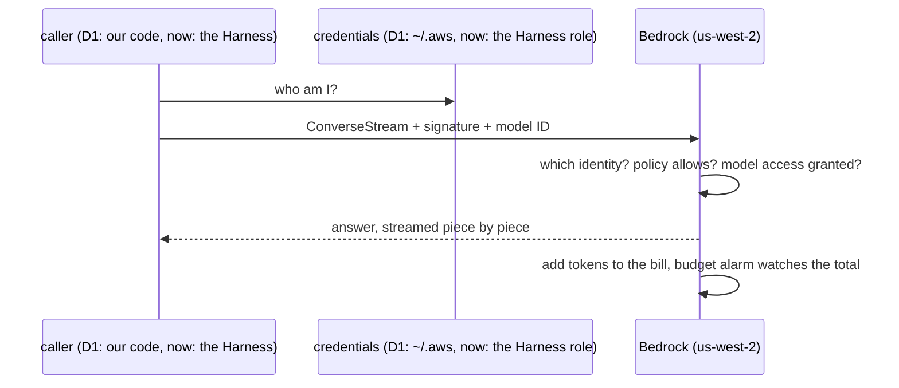
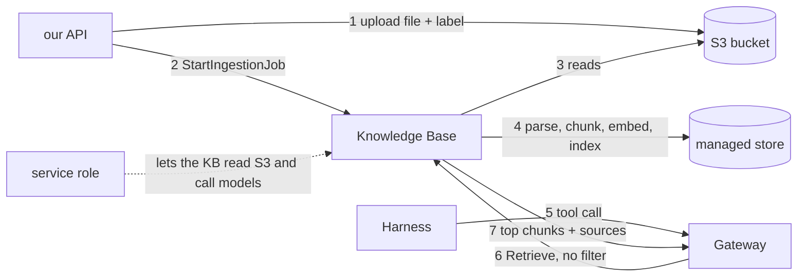
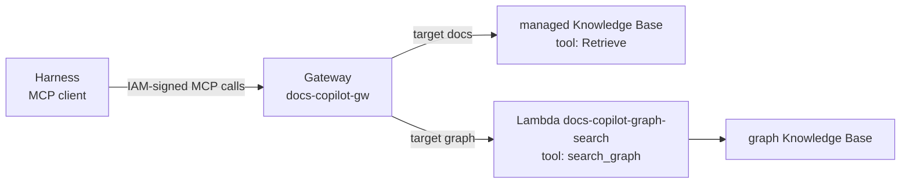
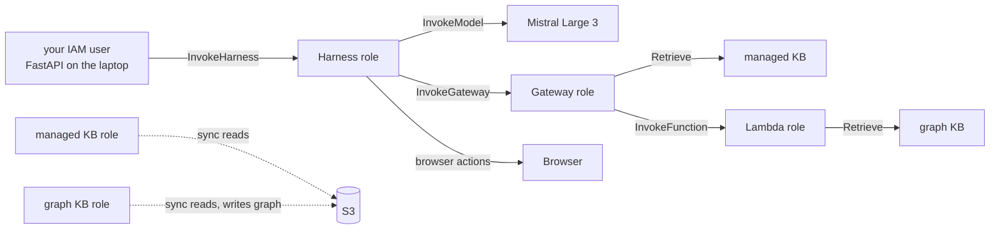

# AWS track

One section per service or concept, added as the project met them. Sections
marked **history** describe how something was first done and name what
replaced it; they stay because the "why" is still worth knowing.

```
1. What AWS is                            D1
2. Account, root, IAM, keys               D1 (policies: history, now AdministratorAccess)
3. Regions                                D1
4. Budgets                                D1
5. Bedrock                                D1
   5.5 Converse API and its stream        history: the Harness calls the model now
   5.6 When AWS says no (errors)
   5.7 Retries
   5.8 Where credentials come from
6. S3                                     D2
7. Bedrock Knowledge Bases                D2, D4
8. Neptune Analytics and the cost clock   D4
9. Free tier, corrected                   D2
10. AgentCore                             D2 to D4
   10.1 the pieces   10.2 Harness   10.3 Gateway   10.3c targets and tool names
   10.4 Memory   10.5 permissions (see 11)   10.6 what stays ours   10.7 the Browser tool
11. Roles: every identity in this project D2 to D4
12. Lambda                                D4
(later, maybe: Runtime for a research agent, Observability, Evaluations, Guardrails, Terraform)
```

---

## 1. What AWS is

Amazon rents out computers, storage, and services by the hour or by the
request. Instead of buying a server, you borrow one and pay for what you
use.

```
your laptop                    AWS (Amazon's data centers)
  code you write   --calls-->    AI models (Bedrock), agents (AgentCore)
                                 databases, file storage, servers...
                                 bill at the end of the month
```

---

## 2. Account, root, IAM, keys

Everything fits one picture:


### 2.1 Root user

The email and password the account was created with. Can do anything,
including delete the account or change the card.

**Rule:** root only for owner tasks: MFA, budget, first IAM user. Then
stop using it. If root leaks, someone owns the account. If an IAM key
leaks, they can only do what its policy allows.

### 2.2 IAM user

IAM = Identity and Access Management: the part of AWS that decides who can
do what. An IAM user is a second identity with no powers by default. You
grant exactly what it needs.

Ours: `yashubitra`. Used from code and the terminal through the
`docs-copilot-dev` profile, and (since D2) from the console with its own
password, so root stays unused.

### 2.3 Policy

A JSON list of allowed actions, attached to a user or a role.

**Today:** `yashubitra` carries one policy, `AdministratorAccess`
(section 2.4b says why).

**D1 history:** the first policy was a tiny one named `bedrock-dev`:

```
bedrock:InvokeModel                    call an AI model
bedrock:InvokeModelWithResponseStream  same, words stream back one by one
bedrock:ListFoundationModels           see which models exist
bedrock:ListInferenceProfiles          see their IDs
budgets:ViewBudget                     read the budget, not change it
```

Nothing could create or delete. The worst case for a leaked key was a
Bedrock bill, which the budget alarm catches. That is the least-privilege
shape a shared account would use; it lives on in `infra/iam/`.

### 2.4 Access key and profile

An access key is a username and password for programs:

```
Access key ID       like a username, starts with AKIA...
Secret access key   like a password, shown once
```

`aws configure --profile docs-copilot-dev` stores them in
`~/.aws/credentials` under a **profile** name. Every AWS call the code
makes sends them; AWS finds the user, checks the policy, allows or refuses.

Profile name and IAM username do not need to match.

**Rules:** never paste keys into chat, git, or screenshots. If one leaks,
delete it in IAM and make a new one. One minute. With `AdministratorAccess`
this matters more than ever: a leaked key is the whole account.

### 2.4a Inline vs managed policies

A policy can live in two places:

```
inline policy     written directly on one user or role. All inline policies on a
                  user together may be at most 2,048 bytes.
managed policy    a separate object with its own name. Up to 6,144 bytes, attachable
                  to many users and roles. AWS ships some ("AWS managed", e.g.
                  AdministratorAccess); you can make your own ("customer managed").
```

We hit the 2,048-byte wall on 2026-09-10: the third inline policy was
refused with "Maximum policy size of 2048 bytes exceeded". The fix was to
create it as a customer managed policy and attach it.

Inline policies are still the right tool for **one small, specific right on
one role**. D4 added two: `graph-kb-retrieve` on the Lambda's role and
`InvokeGraphSearchLambda` on the Gateway's role (section 11).

**D2 history:** before the switch to `AdministratorAccess`, the dev user
carried four policies:

| Policy | Kind | Grants |
|---|---|---|
| `bedrock-dev` | inline | invoke models, list them, read the budget |
| `kb-dev` | inline | Knowledge Base use, one S3 bucket |
| `BedrockAgentCoreFullAccess` | AWS managed | everything in AgentCore |
| `agentcore-setup` | customer managed | create `AgentCore*` roles and stacks, read logs |

All four were removed when `AdministratorAccess` was attached.

### 2.4b Reading a permission error

Every AWS denial names the exact missing action and the exact resource:

```
User: ...user/yashubitra is not authorized to perform: iam:CreatePolicy
on resource: policy AmazonBedrockCloudWatchPolicyForKnowledgeBase_mq0oz
```

That line is the whole diagnosis: add `iam:CreatePolicy` on policies named
like that, nothing more. Three such walls appeared while creating the
Knowledge Base on 2026-09-10. Each was fixed by reading the line.

Then the decision was made to stop: on a sandbox account that one person
controls, the dev user got `AdministratorAccess`, the same power as root
minus account closure and billing changes. What that trades away: a leaked
laptop key is now the whole account, not just a model bill. What it buys:
no more setup walls for **you**.

It does not remove walls for the **services**. In D4 the Gateway failed to
add a target with "Gateway execution role lacks permission to invoke Lambda
function". Same diagnosis method, different identity: the Gateway's role,
not you (section 11).

### 2.5 MFA

A phone code on top of the password. On for root, no exceptions.

---

## 3. Regions

Groups of data centers:

```
us-east-1    N. Virginia
us-west-2    Oregon        <- ours
eu-central-1 Frankfurt
```

Most things live in one region and are invisible from others. Some
services are global (IAM, budgets).

We use **us-west-2** for everything: Bedrock, AgentCore, the Knowledge
Bases, Neptune Analytics (GraphRAG) and Lambda all live there.

**Gotcha:** the console remembers the last region you looked at. Check the
top right before creating anything. IAM shows "Global", that is normal.
(It happened once: AgentCore opened in Ohio and the Knowledge Base seemed
missing.)

---

## 4. Budgets

An email alarm, not a cap. AWS emails when the month's bill crosses a
percentage of the number you set. It does not stop anything.

Ours: $30 a month, alerts at 50% and 80%. Created before the first paid
call.

---

## 5. Bedrock

Amazon's AI model service. One API, many models (Claude, Nova, Llama,
Mistral, others). Pay per token. Which model and why: `ai.md` section 2.
Ours today: **Mistral Large 3**, driven by the Harness (section 10.2).

Not to be confused with **Bedrock AgentCore**, a separate console for
hosting agents. We use it from D2 onward (section 10).

Also not to be confused with **Bedrock-mantle**, a second console and
endpoint for OpenAI-style and Anthropic-style API calls with API keys. We
use the original **Bedrock-runtime** console: IAM keys, the Converse API,
cross-region inference profiles. The link between them is at the bottom
left of either console.

### 5.1 Model access

Some models need a one-time "request access" per account, from the model's
page in **Model catalog**. Usually instant. Anthropic models ask for a
short use-case form the first time; this account has not submitted it, which
is why no Claude model is used (a call fails with "Model use case details
have not been submitted").

### 5.2 Inference profile IDs

Every model has an ID string. Ones starting with `global.` or `us.` are
cross-region inference profiles: AWS may run the request in another region
for better availability. `global.` = anywhere, list price. `us.` = US only,
about 10% more on Claude. Copy from console, **Inference profiles**. Never
type from memory. Some models have only an in-region id, like ours:
`mistral.mistral-large-3-675b-instruct`.

### 5.3 How code reaches a model



### 5.4 D1 setup checklist (history)

```
[x] account created
[x] MFA on root
[x] budget $30
[x] IAM user yashubitra
[x] policy bedrock-dev on that user        (replaced by AdministratorAccess, D2)
[x] access key, "Command Line Interface"
[x] aws configure --profile docs-copilot-dev
[x] model access for Llama 4 Maverick, us-west-2 (tested in Playground)   (replaced, ai.md 2.7)
[x] its us. ID into .env                     (removed from .env in D2)
```

### 5.5 The Converse API and its stream (D1 history)

**D1 history:** in D1 our own code called the model. In D2 that code
(`backend/app/llm.py`) was deleted: the Harness calls the model now, and our
API calls the Harness. The stream shape below is still worth knowing, because
the Harness stream uses the same event names (section 10.2).

Converse is Bedrock's model-agnostic chat API: one request shape for every
model. `converse_stream` is the streaming version. What D1 sent:

```python
client.converse_stream(
    modelId="us.meta.llama4-maverick-17b-instruct-v1:0",
    messages=[{"role": "user", "content": [{"text": "hi"}]}],
    inferenceConfig={"maxTokens": 1024},   # caps answer length, so caps cost
)
```

Note `content` is a **list** of blocks: text, images, documents, tool calls
and tool results are all block types.

What comes back is a stream of events, one dict each:

| Event | Contains |
|---|---|
| `messageStart` | role `assistant` |
| `contentBlockStart` | the start of a block, e.g. a tool call's name |
| `contentBlockDelta` | the next piece: text, tool input, reasoning |
| `contentBlockStop` | end of a block |
| `messageStop` | `stopReason`: `end_turn`, `tool_use`, `max_tokens`, ... |
| `metadata` | `usage` (tokens in and out) and `metrics.latencyMs` |

A model must support tool use **inside this stream** to drive an agent.
Llama 4 Maverick does not, which is why it was replaced (`ai.md` 2.7).

Docs: https://docs.aws.amazon.com/boto3/latest/reference/services/bedrock-runtime/client/converse_stream.html

### 5.6 When AWS says no

boto3 raises one of two kinds of error, for every AWS service:

| Kind | Means | Examples |
|---|---|---|
| `ClientError` | AWS answered, and the answer was an error | `ThrottlingException`, `AccessDeniedException`, `ValidationException`, `ConflictException` |
| `BotoCoreError` | never got a proper answer from AWS | no network, timeout, bad local config |

`err.response["Error"]["Code"]` gives the error name.
`err.response["ResponseMetadata"]["RequestId"]` gives an id AWS support can
look up. We log both. We never pass AWS's message text to the caller.

How we answer the caller, in one place for every AWS call:
`upstream_error()` in `backend/app/aws.py`.

| AWS said | Caller gets |
|---|---|
| `ThrottlingException`, `ServiceUnavailableException`, `TooManyRequestsException` | 503 + `Retry-After: 5` |
| any other error, before streaming | 502 |
| any error after streaming started | `event: error` inside the stream (web.md section 5) |

One error is not an error for us: `ConflictException` from
`StartIngestionJob` means a sync is already running (section 7.2).

A doc summary fetched while building this claimed `ClientError` is a
subclass of `BotoCoreError`. Checking the installed code showed it is not.
Lesson: when a detail matters, check the source, not a summary.

Docs: https://docs.aws.amazon.com/boto3/latest/guide/error-handling.html

### 5.7 Retries

A retry = trying again automatically after a temporary failure, with a
growing pause between tries.

boto3 has three retry modes. The default is still `legacy`. We set
`standard` on every client (`backend/app/aws.py`): up to 3 attempts in
total, and it retries throttling and network blips.

```python
Config(retries={"mode": "standard"})
```

Retries only cover **opening** a stream. A stream that breaks halfway is
not retried: the user already saw part of an answer.

Docs: https://docs.aws.amazon.com/boto3/latest/guide/retries.html

### 5.8 Where the code's credentials come from

```
AWS_PROFILE set (our .env)   ->  ~/.aws/credentials, profile docs-copilot-dev
AWS_PROFILE not set          ->  boto3's default chain: env vars, then the
                                 role of the machine it runs on, if it runs on AWS
```

Code that runs **on** AWS never uses access keys: our Lambda gets its
role's credentials automatically (section 12), and so do the Harness and
Gateway. Only the laptop uses a key.

The server log shows which one it used:
`Found credentials in shared credentials file: ~/.aws/credentials`.

---

## 6. S3

Object storage: a giant key-value store for files. A **bucket** is a
top-level container with a globally unique name; an **object** is one file
under a **key** that looks like a path.

```
bucket: docs-copilot-901708383582
  key:  tenants/dev/README.md                  a file
  key:  tenants/dev/README.md.metadata.json    its labels (section 7.3)
```

Today it holds `README.md`, `glossary.md`, `ai.md` and `aws.md`, each with
its label file.

Things that matter for us:

- **Region:** the bucket lives in us-west-2, same as the Knowledge Bases. Must match.
- **Private by default:** "Block public access" stays on. Only our IAM user and the two Knowledge Bases' service roles read it.
- **No folders, really:** the slashes in a key are just characters. Listing "tenants/dev/" is a prefix search.
- **Cost:** about $0.023 per GB per month, plus fractions of a cent per request. Our corpus is megabytes.
- **Why keep files here at all:** citations name the original file; the Knowledge Bases can be rebuilt from the bucket at any time; a Knowledge Base reads *from* S3, it does not accept uploads directly.

### 6.1 Every option on the "Create bucket" form, and what we picked

Created 2026-09-10 as `docs-copilot-901708383582`.

| Option | Choices | We picked | Why |
|---|---|---|---|
| Bucket type | General purpose / Directory | General purpose | Directory buckets are a special low-latency type in one availability zone. The Knowledge Base only supports general purpose |
| Bucket namespace | Global / Account Regional | Global | names in the global namespace must be unique across all of AWS (hence the account id in ours). The newer account-regional kind has a different address format, and the Knowledge Base connector and IAM policies use the classic `arn:aws:s3:::name` form |
| Object Ownership | ACLs disabled / ACLs enabled | ACLs disabled | ACLs are the old per-object permission lists. Disabled means "only IAM policies decide access", one system instead of two |
| Block all public access | on / off | on | nothing in this bucket is ever meant to be reachable from the internet |
| Bucket Versioning | Disable / Enable | Disable | versioning keeps every old copy of every object (protects against accidental overwrites, costs storage). Re-uploading a document is fine for us |
| Tags | optional | none | labels for cost reports. One project, one account: nothing to separate |
| Default encryption | SSE-S3 / SSE-KMS / DSSE-KMS | SSE-S3 | every object is encrypted at rest either way. SSE-S3 uses keys AWS manages, free. KMS uses a key you manage and audit, with a per-request fee |
| Bucket Key | Enable / Disable | Enable (default) | only matters for KMS; it caches the key to cut KMS calls. Harmless with SSE-S3 |

**Denied by default, proven:** right after creating the bucket, the dev
user (still on its small policies then) could not even ask which region it
was in (`AccessDenied` on `s3:GetBucketLocation`). Creating something as
root does not grant the IAM user anything.

---

## 7. Bedrock Knowledge Bases

A managed RAG service. You give it documents; it runs the whole pipeline
from `ai.md` section 4 and answers `Retrieve` calls with the best chunks.

### 7.1 Managed vs self-managed

| | Managed KB (`docs-copilot-kb`) | Self-managed KB (`docs-copilot-graph-kb`) |
|---|---|---|
| console menu name | Managed KB | "Unstructured Vector Store KB" |
| vector store | AWS's, invisible | you pick: S3 Vectors, OpenSearch, Aurora, **Neptune Analytics**... |
| embedding model | AWS's (managed) | you pick (ours: Titan Text Embeddings V2, 1024 dimensions) |
| search | always hybrid | depends on the store |
| reranker | built in, free (managed embeddings only) | via the Rerank API, paid |
| parser | built in, handles images too | default, or a model |
| chunking | default or fixed-size | also semantic, hierarchical |
| data sources | S3, Web Crawler, Confluence, SharePoint, Drive, ... | S3, custom |
| GraphRAG | no | yes, on Neptune Analytics |
| Gateway connector | yes (section 10.3c) | no: goes behind a Lambda |
| price | $5 per GB of raw data per month + $1 per 1,000 Retrieve calls | pay for the store, embeddings, rerank separately |

So we run **two** over the same bucket: a managed one for documents (D2)
and a self-managed one for the graph (D4). The graph one's form choices
are in `D4.md`.

### 7.1a Every option on the "Create Managed Knowledge Base" form

Created 2026-09-10 as `docs-copilot-kb` (id `0JTWTJABTV`) by the IAM user (a
root user is not allowed to create one).

| Section | Option | We picked | What it means |
|---|---|---|---|
| KB details | Embeddings model | Managed | AWS runs the embedding model (ai.md 4.3) at no extra cost. Required for the free built-in reranker. The alternative lets you pick Titan or Cohere and pay per token |
| | IAM permissions | Create and use a new service role | a **service role** is the identity the Knowledge Base itself uses to read your bucket and call models (section 11) |
| | KMS key | default (AWS owned) | the vector store is encrypted either way; your own key only matters when you must control and audit the key |
| Data source | Type | Amazon S3 | where documents come from. Web Crawler is the one for whole websites |
| | Location / S3 URI | this account, `s3://docs-copilot-901708383582` | the bucket it reads on every sync (data source id `PRRFGHTJBS`) |
| | Crawl ACLs | Disable | ACL crawling copies per-document permissions from sources like SharePoint. S3 has none |
| | Parsing strategy | Managed parser | PDF, Word, HTML to text (ai.md 4.1), images included |
| | Chunking strategy | Default | about 300-token chunks at sentence boundaries (ai.md 4.2). **Cannot be changed later**; comparing strategies means a second data source |
| | Sync schedule | On-demand | a sync (ingestion job) runs only when asked. Our API asks after each upload |
| | Prefix and file filters | none | would limit syncing to certain folders or extensions |
| | Log deliveries | none | sync logs to CloudWatch; useful when a file fails to index, not now |
| Advanced | Content indexing | Default (text) | advanced indexing also reads images, audio, video, at extra cost per file |
| | Max file size | default | |
| | Document deletion safeguard | Off | when on, a sync that would delete many chunks skips deletion, to survive an accidentally emptied bucket. Small corpus: we want deletions to apply |

### 7.2 The pieces



- **Knowledge base:** the top-level object. Has an ID.
- **Data source:** where documents come from (one S3 bucket, or one web crawl). Chunking is set per data source and cannot be changed after.
- **Ingestion job (sync):** the background run that reads new, changed, and deleted files and updates the index. Started by `StartIngestionJob`, finished a minute or a few later. This is why we do not need our own queue and worker. **One at a time per data source:** starting a second one while the first runs fails with `ConflictException` ("There is an ongoing ingestion job"); our upload keeps the file and the next sync picks it up.
- **Service role:** an IAM role the KB assumes to read your bucket and call Bedrock models. The console creates it for you (section 11).

Our upload syncs only the managed Knowledge Base. The graph Knowledge Base
is synced by hand (console: its data source, **Sync**).

### 7.3 Tenant labels: metadata files

Next to each uploaded file goes a tiny JSON:

```
README.md.metadata.json
{ "metadataAttributes": { "tenant_id": "dev", "source": "upload" } }
```

The Knowledge Base stores these labels on every chunk of that file. A
`Retrieve` call **may** carry a filter such as `tenant_id equals "dev"`, and
then only chunks with that label come back. That is how a multi-tenant app
builds a wall inside the search engine.

**What we actually do:** write the labels, apply no filter. The project has
no login and one tenant (`dev`), and the Gateway's filter would be fixed per
target, not per caller (section 10.3). The wall was proven to work by hand
once (section 7.4a) and is otherwise unused.

### 7.4 Retrieve

One call, one question, top chunks back:

```
Retrieve(knowledgeBaseId, retrievalQuery={"text": "..."}, retrievalConfiguration:
  managedSearchConfiguration:
    numberOfResults: 5
    rerankingModelType: MANAGED | CUSTOM | NONE
    filter: optional, e.g. tenant_id equals "dev")
-> retrievalResults: [ {content.text, location.s3Location.uri, score, metadata}, ... ]
```

In the app nobody writes this call by hand: the Gateway makes it when the
agent calls `docs___Retrieve`, with the settings fixed on the target
(section 10.3a). The Harness then gives the chunks to Mistral Large 3, which
writes the answer. The KB also offers `RetrieveAndGenerate`, which writes
the answer for you; we skip it because the agent writes answers.

### 7.4a Verified end to end, before any code

2026-09-10, by hand from the CLI:

```
upload      tenants/dev/README.md  +  README.md.metadata.json {tenant_id: dev}
sync        StartIngestionJob -> 2.5 minutes -> COMPLETE, 1 document indexed, 0 failed
retrieve    via the gateway tool docs___Retrieve("why was Neptune Analytics dropped?")
            -> 5 passages, best score 0.63, each with the S3 source URL and tenant_id=dev
            -> passage [2] is the README's decision table with the Neptune row
tenant wall Retrieve with filter tenant_id=dev   -> 3 passages   (hand test only)
            Retrieve with filter tenant_id=other -> 0 passages
```

So the whole path (bucket, labels, sync, index, hybrid search, rerank,
gateway) works with zero lines of our code. What our code adds is the
upload endpoint, the sync trigger, and the UI.

### 7.5 Permissions our user needs (history)

**D2 history:** the dev user first got an inline policy `kb-dev`:
`bedrock:Retrieve`, `bedrock:StartIngestionJob`, `bedrock:GetIngestionJob`,
and S3 read/write on the one bucket (`infra/iam/kb-dev.json`). It was
replaced by `AdministratorAccess`. The Knowledge Bases' own service roles
are separate identities (section 11).

---

## 8. Neptune Analytics and the cost clock

Neptune Analytics is AWS's graph database engine. Bedrock GraphRAG stores
the knowledge graph (and the vectors) in it. Unlike everything else in this
project, it **bills by the hour whether or not it is used**.

### 8.1 Our graph

```
graph id:      g-3h3xul06x6   (name bedrock-knowledge-base-iboxxq)
created by:    the graph Knowledge Base's "Quick create" (D4, 2026-09-11 01:42)
size:          16 m-NCU  (1 m-NCU = about 1 GB of memory plus compute)
replicas:      0
public:        no  (only AWS services in the account can reach it)
state now:     STOPPED since 2026-09-11 02:07 (ran about 25 minutes, roughly 20 cents)
```

### 8.2 What each size costs (us-west-2, from the AWS Price List API)

| Size | Running | Stopped (10%) |
|---|---|---|
| **16 m-NCU (ours)** | **$0.48 per hour, about $11.50 a day** | **about $0.05 per hour** |
| 32 m-NCU | $0.96 per hour | about $0.10 per hour |
| 64 m-NCU | $1.92 per hour | about $0.19 per hour |
| 128 m-NCU | $3.84 per hour | about $0.38 per hour |
| deleted | $0 | $0 |

**History:** the first plan quoted $3.51 an hour, from an older price and an
older 32 m-NCU minimum. Checking the live price list before D4 showed the
smallest size is now much cheaper.

### 8.3 States and commands

```
CREATING -> AVAILABLE  (running, billed full rate, answers searches)
AVAILABLE -> STOPPING -> STOPPED   (10% rate, keeps everything, searches fail)
STOPPED -> STARTING -> AVAILABLE   (a few minutes)
```

```
aws neptune-graph start-graph --graph-identifier g-3h3xul06x6 --region us-west-2 --profile docs-copilot-dev
aws neptune-graph get-graph   --graph-identifier g-3h3xul06x6 --region us-west-2 --profile docs-copilot-dev --query status
aws neptune-graph stop-graph  --graph-identifier g-3h3xul06x6 --region us-west-2 --profile docs-copilot-dev
```

Console alternative: Neptune, Analytics, Graphs, select the graph, Actions,
Start or Stop.

While stopped, the agent's `graph___search_graph` tool fails; document
questions (`docs___Retrieve`) keep working.

### 8.4 The rule for this project

```
before a demo  -> start the graph, wait for AVAILABLE
after it       -> stop it again
when done      -> delete the graph Knowledge Base FIRST, then the Neptune graph
```

Deleting the Knowledge Base does **not** delete the graph, and the graph
keeps billing until it is deleted. Our data source's deletion policy is
DELETE, so the Knowledge Base must go first. The $30 budget alarm is the
safety net if either is forgotten.

Source: https://aws.amazon.com/neptune/pricing/ and the AWS Price List API
(`aws pricing get-products --service-code AmazonNeptune`).

---

## 9. Free tier, corrected

Earlier notes said this account would get 12 months of free OpenSearch and
RDS hours. Wrong: accounts created after 2025-07-15 get **credits** instead
($100 at sign-up, up to $100 more for trying core services), valid up to
12 months, and no 12-month free service hours. Everything we use draws
from those credits, which is another reason to prefer services that bill
per request (Knowledge Base, S3, Bedrock, AgentCore, Lambda) over ones that
bill per hour (Neptune, OpenSearch domains, RDS).
Source: https://docs.aws.amazon.com/awsaccountbilling/latest/aboutv2/free-tier.html

---

## 10. AgentCore

Bedrock is where models live. **AgentCore** is where agents live: the
loop, the tools, the memory, the tracing, all as managed services. Every
piece is independent; we use a few of them.

### 10.1 The pieces

| Piece | Job | In this project |
|---|---|---|
| **Harness** | a managed agent: model + instructions + tools + memory as config; AWS runs the loop | D2 (the assistant) |
| **Gateway** | turns APIs, Lambda functions, Knowledge Bases and other agents into MCP tools | D2 (`docs` target), D4 (`graph` target) |
| **Memory** | short-term (conversations) and long-term (extracted facts) per user | D2 short-term, D3 long-term |
| **Browser** | a managed browser the agent drives to read web pages | D3 (section 10.7) |
| **Identity** | login with Cognito or others; a token vault so agents can act on a user's behalf | not used: the project has no login |
| **Code Interpreter** | a sandbox where the agent runs Python safely | dropped |
| **Runtime** | serverless hosting for agent code you write (Strands, LangGraph, anything) | later, maybe (a research agent) |
| **Observability** | traces of every step, in CloudWatch | later, maybe |
| **Evaluations** | scores agent sessions and RAG answers with a judge model | later, maybe |
| **Policy** | rules (Cedar) checked on every tool call | later, maybe |
| Registry, Optimization, Payments | catalog, prompt tuning, paid tools | not planned |

Pricing is per use, no hourly minimum (unlike Neptune): Runtime by active
CPU-seconds, Memory per event and record, Gateway per call.

### 10.2 Harness

The assistant is a Harness, `docs_copilot_assistant`
(id `docs_copilot_assistant-bwVinula0L`). What we declare:

```
model:        Mistral Large 3 (mistral.mistral-large-3-675b-instruct); any Bedrock model
              works, and it can be overridden per call, so comparing models is one flag
instructions: the system prompt, backend/prompts/assistant.md (7 rules)
tools:        our Gateway, the Browser. Also possible: Code Interpreter, remote MCP servers,
              inline functions
memory:       managed, strategies SUMMARIZATION, SEMANTIC, USER_PREFERENCE
limits:       maxIterations 10, timeout 5 min, maxTokens 2048
truncation:   sliding window, 30 messages
```

What AWS does: runs each session in its own micro-VM, calls the model,
runs the tools, writes memory, and streams the result back. The stream uses
the same event names as the Converse stream (section 5.5): text, reasoning,
tool calls and tool results arrive as content blocks. Our `relay()` in
`backend/app/chat.py` turns them into seven simple events for the page
(`journey.md` hop 10).

Invoking it is one call, `InvokeHarness`, with a session id (33 to 100
characters; we use a UUID) and an `actorId` (whose memory: our tenant stub
`dev`). Same session id = same conversation.

`InvokeHarness` also accepts per-call overrides of the model, the system
prompt and the allowed tools. We used that to test candidate models and a
new prompt without touching the saved harness.

Not possible in a Harness: a workflow with explicit steps, or several
agents coordinating. For that, code on Runtime (later, maybe).

### 10.2a Every option on the "Create Harness" form

Created 2026-09-11 as `docs_copilot_assistant` with **Advanced create**
(Quick create asks only for a name and uses defaults). The name cannot be
changed later and allows letters, digits and underscores, no dashes.
Edited several times since (Edit on the harness page); version 5 is
current.

| Section | Option | We picked | What it means |
|---|---|---|---|
| Model | Model source | Bedrock | the other choices call LiteLLM, OpenAI or Gemini directly with your own keys |
| | API source | Bedrock (Converse) | Mantle is the OpenAI-style API. Converse is needed for Guardrails, if they are ever added |
| | Model | **Mistral Large 3** | history: Llama 4 Maverick (no tool use while streaming, ai.md 2.7), then gpt-oss-120b (could not drive the browser, ai.md 2.8) |
| | System prompt | `backend/prompts/assistant.md` | the agent's standing instructions: URLs to the browser, facts to the document search, relationships to the graph, cite `[1]`, admit gaps |
| | Parameters | empty | temperature and max tokens stay at the model's defaults |
| Memory | Enable, create new (managed by Harness) | on | the harness creates an AgentCore Memory and saves every message to it; takes 3 to 5 minutes |
| | Strategies | Summarization, Semantic, User preference | long-term memory. Summarization from D2; the other two added in D3 |
| | Short-term expiration | 30 days | raw messages are deleted after this |
| Tools | Gateway | `docs-copilot-gw`, outbound auth IAM | the agent's search tools come from the gateway over MCP |
| | Browser tool | on, AgentCore Browser Tool `aws.browser.v1` | added in D3 (section 10.7) |
| | Code interpreter | off | dropped |
| | Remote MCP server, Custom functions | none | tools hosted elsewhere, or run by our own app |
| Skills | | none | bundles of files and scripts the agent can use |
| Advanced | Filesystem | none | persistent storage between sessions |
| | Network | Public | VPC only when the agent must reach private resources |
| | Custom environment | empty | our own container image, for extra software |
| | Idle session timeout | 15 minutes | a quiet session's machine is stopped, so it stops costing |
| | Max lifetime | 1 hour | the longest a session's machine may live |
| | Truncation | Sliding window, 30 messages | only the last 30 messages go to the model each turn |
| | Allowed tools | `@docs-copilot-gw-kuctwujdbp`, `@aws_browser_v1` | only these tools; removes the built-in shell and file tools, which a document assistant must not have. The `@` matters (section 10.7) |
| | Max iterations / timeout / max tokens | 10 / 5 min / 2048 | caps on one answer: loop turns, time, and length |
| Inbound Auth | | IAM | who may call the harness: any AWS identity with permission. No login in this project, so no JWT |
| Permissions | | create default role | the harness's own identity (section 11) |

Verified after each edit with the CLI (`get-harness`): model, prompt equal
to the repo file, tools, allowed tools, memory
`docs_copilot_assistant-6aIbceHbw1`.

### 10.3 Gateway

An MCP server AWS runs for you. You add **targets**; each becomes tools:



Inbound auth (who may call the gateway): **IAM**. Outbound auth (how the
gateway reaches each target): its own service role (section 11). The
gateway can also hide or fix tool parameters, so the agent sees a simpler
tool than the underlying API.

By default the agent sees only `retrievalQuery.text`; everything else
(`numberOfResults`, reranking, a metadata `filter`) is fixed by the
administrator on the target. Good for safety; for a multi-tenant app it
would be a problem, because the filter is per target, not per caller. With
no login and one tenant, we apply no filter (section 7.3).

### 10.3a Every option on the "Create gateway" form

Created 2026-09-10 as `docs-copilot-gw` (id `docs-copilot-gw-kuctwujdbp`).

| Step | Option | We picked | What it means |
|---|---|---|---|
| 1 details | Semantic search | off | lets an agent search a big tool catalog by meaning, billed per search. We have two tools |
| | Exception level debugging | off | verbose AWS-side logs |
| | Response streaming | on | a tool may stream partial results (the KB's agentic tool does) |
| | Sessions | off | stateful MCP sessions; our calls are one-shot |
| | MCP version | 2026-07-28 (and 2025-11-25) | the protocol versions the gateway speaks; fixed at creation. A client names one in the `MCP-Protocol-Version` header. Found while testing: 2026-07-28 also requires a `_meta` field in every call; 2025-11-25 does not. The harness handles this itself; it matters only for hand-made calls |
| | Interceptor Lambdas | none | your own code to rewrite requests or responses |
| | IAM permissions | create default role | the gateway's **service role**, used to reach targets |
| | Policy engine | none | rules on tool calls (later, maybe) |
| | WAF | off | a web firewall, about $5 a month; our gateway needs AWS credentials to call anyway |
| 2 inbound identity | Inbound auth | AWS IAM | who may call: any AWS identity with `InvokeGateway`. JWT (a login token) is the other choice; no login here. "No authorization" would make it public. "Authenticate only" checks the signature but not permissions |
| 3 target | Protocol | MCP target | the other kinds: inference (call a model), agent (front another agent), custom (raw HTTP) |
| | Name | `docs` | becomes the tool prefix: `docs___Retrieve` |
| | Passthrough | off (aggregated) | the gateway is the MCP server and merges all targets into one tool list; passthrough would make it a proxy to one server |
| | Target type | Connectors, Knowledge Bases | pre-built target for a managed KB |
| | Retrieval type | Standard | exposes `Retrieve` (one hybrid search per call). Agentic would expose `AgenticRetrieveStream`, multi-step planning at $4 per 1,000 calls, overlapping the harness |
| | Source chunks | 5 | passages returned per search |
| | Manual filters | none | a fixed metadata filter, e.g. `tenant_id = dev`, per target. Only needed with many tenants |
| | Model generated filters | off | a model guesses filters from the question, about 2,000 extra tokens per call |
| | Guardrail | none | content safety checks (later, maybe) |
| | Reranking | Default | the free managed reranker (ai.md 4.6). Verified 2026-09-11: the target stores no reranking setting, and a Retrieve with the setting left out returns exactly the same results and scores as `rerankingModelType: MANAGED` (while `NONE` returns different ones), so reranking is on |
| | Agent overrides | none | would let the model change chunk count or pass a user context |
| | Outbound auth | IAM role | how the gateway authenticates to the KB; the only option for this connector |

The second target (`graph`, a Lambda) was added in D4: section 10.3c.

### 10.3b Verified: the gateway as an MCP server

Called by hand on 2026-09-10 with a signed request (curl can sign with
SigV4 given the access key), before any of our code existed:

```
tools/list  ->  one tool: docs___Retrieve
                argument: retrievalQuery.text (string)
tools/call docs___Retrieve {"retrievalQuery": {"text": "vacation days"}}
            ->  {"retrievalResults": []}        (the bucket was still empty)
```

That is the whole contract the harness uses. After D4, `tools/list` returns
two tools: `docs___Retrieve` and `graph___search_graph`.

### 10.3c Gateway targets and tool names

A **target** is one thing behind the gateway. Its type decides where its
tool definitions come from:

| Target type | Tools come from | Ours |
|---|---|---|
| Connectors, Knowledge Bases | AWS defines them (`Retrieve`, optionally `AgenticRetrieveStream`) | `docs` |
| Lambda ARN | a **tool schema** you write | `graph` |
| MCP server | the server's own `tools/list` | none |
| REST API (OpenAPI or Smithy schema), API Gateway | generated from the API description | none |

**Why the graph needed a Lambda:** the Knowledge Base connector accepts
only **managed** Knowledge Bases. The GraphRAG one is self-managed (section
7.1), so a small Lambda sits in between (section 12).

**Tool name = target name + three underscores + tool name.** Target `docs` +
tool `Retrieve` = `docs___Retrieve`; target `graph` + tool `search_graph` =
`graph___search_graph`. The agent sees only these combined names; the
prompt names them to route questions.

**The tool schema** (`infra/lambda/graph_search/tool-schema.json`) is a JSON
list, one entry per tool:

```json
[
  {
    "name": "search_graph",
    "description": "Search the knowledge graph built from the user's documents. Use it for questions about how things are connected...",
    "inputSchema": {
      "type": "object",
      "properties": { "query": { "type": "string", "description": "A short search query naming the things to connect" } },
      "required": ["query"]
    }
  }
]
```

- `name`: the tool part of the name.
- `description`: **what the model reads to decide when to use the tool.** It is part of the prompt, in effect.
- `inputSchema`: the arguments. The Gateway passes them to the Lambda as its `event`, e.g. `{"query": "..."}`.
- `outputSchema`: optional; we left it out.

**Same answer shape on purpose:** the Lambda returns
`{"retrievalResults": [...]}`, the same shape the `docs` connector returns,
so our chat relay turns graph passages into source cards with no code change.

**Adding the `graph` target failed first** with "Gateway execution role
lacks permission to invoke Lambda function". Fixed by the inline policy
`InvokeGraphSearchLambda` on the Gateway's role (section 11). Then target
`graph` (id `QDJSG5GBFV`) became READY.

### 10.4 Memory

A Memory resource (`docs_copilot_assistant-6aIbceHbw1`) holds **events**
grouped by `actorId` (whose memory) and `sessionId` (one conversation). Our
actor is always `dev`.

```
actor dev
  session af0e0ec4-...   events: question, tool call, tool result, answer, agent state, ...
  session 5e96c2ca-...   events: ...
```

`ListSessions(actorId)` gives the sidebar; `ListEvents(actorId, sessionId)`
gives one conversation back, in pages (`nextToken`). One turn with one
search is about ten events: "conversational" ones holding each message as
JSON text, plus "blob" ones with the agent's internal state.
`backend/app/sessions.py` keeps only question and answer text. Sessions
carry a creation time but no title, so the sidebar shows the time.

Long-term memory is a **strategy** on the resource. After a conversation,
AWS extracts records in the background, each strategy into its own
namespace:

```
SEMANTIC          facts         /actors/dev/facts/
USER_PREFERENCE   preferences   /actors/dev/preferences/
SUMMARIZATION     summaries     /actors/dev/summaries/<session>/
```

Records appear a few minutes after a chat, and the harness searches them at
the start of the next one. Events expire after 30 days. Details and the
test that proved it: `D3.md`.

### 10.5 Permissions

Moved to section 11, which lists every identity in the project. Two
AgentCore facts that belong here:

- Calling a harness needs two actions at once: `InvokeHarness` on the harness and `InvokeAgentRuntime` on the runtime underneath it.
- Reading the sidebar needs `ListSessions` and `ListEvents` on the memory.

### 10.6 What stays ours

```
Next.js UI            chat, sidebar, citations, tool-call trace, upload
FastAPI (thin)        tenant stub header -> Memory actor; upload to S3 + label + StartIngestionJob;
                      InvokeHarness and relay the stream; ListSessions / ListEvents for the sidebar
Lambda graph_search   the graph tool behind the Gateway (our code, runs on AWS)
Strands code          a research agent on Runtime (later, maybe)
```

Everything else is configuration of the services above.

### 10.7 The Browser tool

A real Chrome browser that AWS runs for the agent in an isolated session,
thrown away afterwards. We use the AWS-managed default,
**AgentCore Browser Tool** `aws.browser.v1`, so nothing had to be created.

The agent does not "fetch a URL". It drives the browser one action at a
time, and each action is a tool call:

```
init_session   open a browser session
navigate       go to the URL
get_text       read the page as text (this is what the model reads)
get_html, screenshot, click, evaluate   other actions the model may choose
close          end the session
```

On the harness the tool is named `aws_browser_v1`, and the model sees it as
`browser`. **Allowed tools must say `@aws_browser_v1`.** An `@` entry means
"all actions of this tool". The first save used the bare name
`aws_browser_v1`, and the model then reported that its only tool was the
document search: the browser was filtered out.

Driving it takes a model good at multi-step tools: gpt-oss-120b failed,
Mistral Large 3 works (`ai.md` 2.8). It does not go through the Gateway;
the harness calls it directly, as its own role.

**Cost:** billed per second of active use, with a 1-second minimum: $0.0895 per
vCPU-hour and $0.00945 per GB-hour of memory (AgentCore pricing page,
2026-09-11). A page read is seconds, so fractions of a cent. The real cost
is the page text as model input, often 30k to 150k tokens: on Mistral
Large 3, 2 to 8 cents per page. The Harness itself has no charge of its
own; you pay for what it uses.

---

## 11. Roles: every identity in this project

### 11.1 User vs role

- A **user** is a long-lived identity for a person, with a password or access keys. Ours: `yashubitra`.
- A **role** is an identity with no password or keys of its own. Something **assumes** it and gets short-lived credentials automatically. AWS services use roles to act on your behalf.

Every role has two policies, and they answer different questions:

| Policy | Question it answers | Example |
|---|---|---|
| **trust policy** | *who* may assume this role? | "the Lambda service may" (principal `lambda.amazonaws.com`) |
| **permission policy** | *what* may the role then do? | "`bedrock:Retrieve` on knowledge base 3AD25HSRSD" |

The console writes both when it offers "create a new role". When a service
fails with "lacks permission", the fix is almost always the **permission**
policy of **that service's** role, not yours.

### 11.2 Who acts at each step

Every call is made by some identity, and that identity needs permission for
exactly that call:



### 11.3 The table

| Identity | Kind | Made by | May do (the parts we rely on) |
|---|---|---|---|
| `yashubitra` (profile `docs-copilot-dev`) | IAM user | you, D1 | everything: `AdministratorAccess` (section 2.4b). FastAPI calls S3, the Knowledge Base, the Harness and Memory as this user |
| `AmazonBedrockAgentCoreHarnessDefaultServiceRole-yhy2p` | role | console, when the harness was created (D2) | invoke Bedrock models; `InvokeGateway` on our gateway only; read and write its memory; start sessions of the default Browser. Also default rights we do not use (Code Interpreter, file systems) |
| `AmazonBedrockAgentCoreGatewayDefaultServiceRole1789098437928` | role | console, when the gateway was created (D2) | `Retrieve` on the managed Knowledge Base; plus our inline policy `InvokeGraphSearchLambda`: `lambda:InvokeFunction` on `docs-copilot-graph-search` (D4) |
| `AmazonBedrockExecutionRoleForKnowledgeBase_x6ipa` | role | console, when `docs-copilot-kb` was created (D2) | read the bucket, run its managed models, write its index |
| `AmazonBedrockExecutionRoleForKnowledgeBase_vbrt3` | role | console, when `docs-copilot-graph-kb` was created (D4) | read the bucket, call Titan Text Embeddings V2 and Nova 2 Lite, write the Neptune graph |
| `docs-copilot-graph-search-role-xucr5hec` | role | Lambda console, "basic Lambda permissions" (D4) | write its own logs; plus our inline policy `graph-kb-retrieve`: `bedrock:Retrieve` on `3AD25HSRSD` only |

Two roles you may notice in the IAM console that are not in the table:
`AmazonBedrockExecutionRoleForKnowledgeBase_mq0oz` is used by nothing (left
from the first Knowledge Base attempt in D2 that hit permission errors;
safe to delete), and `AWSServiceRoleForBedrockAgentCoreRuntimeIdentity` is
a service-linked role AWS created with the harness for its own use.

The two inline policies we wrote by hand in D4 are the whole lesson in
miniature: one action, one resource, on the role of the service that makes
the call.

---

## 12. Lambda

AWS's run-code-on-demand service. You give it a **function** (some code);
AWS runs it each time something calls it, then freezes it. No server to
keep running; you pay per call and per millisecond.

### 12.1 The parts

| Part | Ours (`docs-copilot-graph-search`) | What it means |
|---|---|---|
| Runtime | Python 3.13 | the language version AWS provides. boto3 comes included |
| Architecture | arm64 | AWS Graviton processors, about 20% cheaper than x86; pure Python runs the same |
| Handler | `lambda_function.lambda_handler` | "open file `lambda_function.py`, call function `lambda_handler`". Our repo file `infra/lambda/graph_search/handler.py` was pasted into that file in the console |
| Event | `{"query": "..."}` | the input. From the Gateway, it is the tool's arguments |
| Context | request info | from the Gateway it also carries `context.client_context.custom["bedrockAgentCoreToolName"]`, e.g. `graph___search_graph` |
| Return value | a dict, sent back as JSON | ours: `{"retrievalResults": [...]}` |
| Environment variables | `GRAPH_KB_ID=3AD25HSRSD` | settings outside the code, like `.env` for the backend |
| Timeout | 120 seconds | the longest one call may run (default 3 s would cut a graph search off) |
| Memory | 128 MB | also sets the CPU share. Plenty for one API call |
| Execution role | `docs-copilot-graph-search-role-xucr5hec` | the identity the code acts as; credentials arrive automatically, no keys (section 11) |
| Function URL | off | would give it a public web address. The Gateway invokes it directly with IAM, so it needs none |
| Deploy | the console's **Deploy** button | until you click it, edited code exists only in the browser |

### 12.2 How our graph search works

```
Gateway --invoke, event {"query": "how does X relate to Y?"}--> lambda_handler (handler.py:31)
   -> bedrock-agent-runtime Retrieve(knowledgeBaseId=GRAPH_KB_ID, 5 results)   (handler.py:38)
   -> each hit relabeled with its file name, like the docs connector does     (handler.py:46)
<-- {"retrievalResults": [{content.text, metadata._document_title, score}, ...]}
```

If the query is empty it returns `{"error": "query is required"}` instead of
calling AWS. The file also carries a self-check that runs with a fake
Knowledge Base, no AWS needed: `python handler.py` prints `ok`.

Verified in D4: invoked from the CLI (HTTP 200, 5 passages), then through
the Gateway over MCP, then chosen by the agent for a relationship question.

**Cost:** fractions of a cent at our usage.

Docs: https://docs.aws.amazon.com/bedrock-agentcore/latest/devguide/gateway-add-target-lambda.html

---

## Check yourself

1. Why does the IAM user get a policy but root does not need one?
2. With `AdministratorAccess` on the dev user, what can someone do with a leaked laptop key?
3. Does the budget stop spending at $30?
4. Why us-west-2 and not whatever the console shows?
5. Where on the laptop do the access keys end up, and why does the Lambda need none?
6. What is the difference between `ClientError` and `BotoCoreError`?
7. Why is `ConflictException` from `StartIngestionJob` not treated as a failure?
8. What does the `.metadata.json` file next to an upload do, and why do we apply no filter?
9. Why do we not need our own queue and worker with a Knowledge Base?
10. What does our Neptune graph cost running, stopped, and deleted, and what must be deleted first?
11. Which AgentCore piece runs the agent loop, and which one turns the Knowledge Base into a tool?
12. How is the name `graph___search_graph` built, and which part of the tool schema does the model read to decide?
13. Why does the graph Knowledge Base sit behind a Lambda instead of a connector?
14. What is the difference between a trust policy and a permission policy?
15. The Gateway said it "lacks permission to invoke Lambda function". Whose policy did we change, and with what?
16. What did the `@` in `@aws_browser_v1` change?
17. What does the handler setting `lambda_function.lambda_handler` mean?
