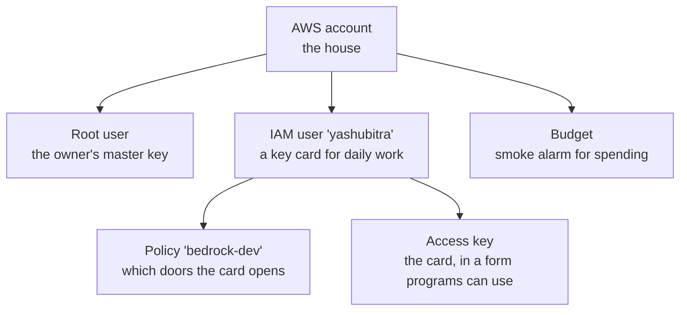
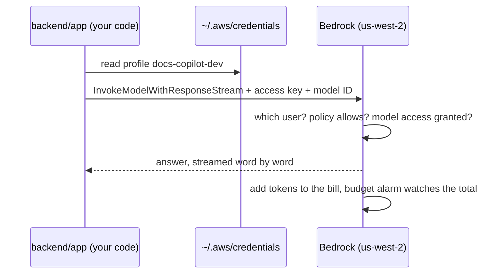
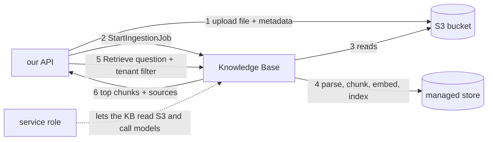
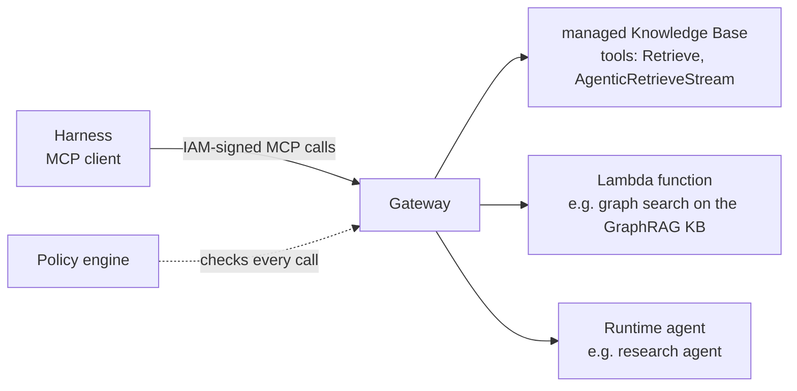

# AWS track

One section per service or concept. Added as the project meets them.

```
1. What AWS is                    D1
2. Account, root, IAM, keys       D1
3. Regions                        D1
4. Budgets                        D1
5. Bedrock                        D1
   5.5 Converse API and its stream
   5.6 When Bedrock says no (errors)
   5.7 Retries
   5.8 Where credentials come from
6. S3                             D2
7. Bedrock Knowledge Bases        D2, D3
8. Neptune Analytics and the cost clock   D4
9. Free tier, corrected           D2
10. AgentCore                     D2 onward
   10.1 the pieces  10.2 Harness  10.3 Gateway  10.4 Memory  10.5 permissions  10.6 what stays ours
(next: Cognito + Identity, Neptune, Runtime, Terraform, CloudWatch)
```

---

## 1. What AWS is

Amazon rents out computers, storage, and services by the hour or by the
request. Instead of buying a server, you borrow one and pay for what you
use.

```
your laptop                    AWS (Amazon's data centers)
  code you write   --calls-->    AI models (Bedrock)
                                 databases, file storage, servers...
                                 bill at the end of the month
```

---

## 2. Account, root, IAM, keys

Everything fits one picture:



### 2.1 Root user

The email and password the account was created with. Can do anything,
including delete the account or change the card.

**Rule:** root only for owner tasks: MFA, budget, first IAM user. Then
stop using it. If root leaks, someone owns the account. If an IAM key
leaks, they can only do what its policy allows.

### 2.2 IAM user

IAM = Identity and Access Management: the part of AWS that decides who can
do what. An IAM user is a second identity with no powers by default. You
grant exactly what it needs.

Ours: `yashubitra`, no console password, used only from code and terminal.

### 2.3 Policy

A JSON list of allowed actions. Ours, named `bedrock-dev`:

```
bedrock:InvokeModel                    call an AI model
bedrock:InvokeModelWithResponseStream  same, words stream back one by one
bedrock:ListFoundationModels           see which models exist
bedrock:ListInferenceProfiles          see their IDs
budgets:ViewBudget                     read the budget, not change it
```

Nothing creates or deletes. Worst case for a leaked key: a Bedrock bill,
which the budget alarm catches.

### 2.4 Access key and profile

An access key is a username and password for programs:

```
Access key ID       like a username, starts with AKIA...
Secret access key   like a password, shown once
```

`aws configure --profile docs-copilot-dev` stores them in
`~/.aws/credentials` under a **profile** name. Every AWS call the code
makes sends them; AWS finds the user, checks the policy, allows or refuses.

Profile name and IAM username do not need to match.

**Rules:** never paste keys into chat, git, or screenshots. If one leaks,
delete it in IAM and make a new one. One minute.

### 2.5 MFA

A phone code on top of the password. On for root, no exceptions.

---

## 3. Regions

Groups of data centers:

```
us-east-1    N. Virginia
us-west-2    Oregon        <- ours
eu-central-1 Frankfurt
```

Most things live in one region and are invisible from others. Some
services are global (IAM, budgets).

We use **us-west-2** for everything. Two features needed later (Bedrock
rerank, AgentCore) live there. Picking once avoids moving later.

**Gotcha:** the console remembers the last region you looked at. Check the
top right before creating anything. IAM shows "Global", that is normal.

---

## 4. Budgets

An email alarm, not a cap. AWS emails when the month's bill crosses a
percentage of the number you set. It does not stop anything.

Ours: $30 a month, alerts at 50% and 80%. Created before the first paid
call.

---

## 5. Bedrock

Amazon's AI model service. One API, many models (Claude, Nova, Llama,
others). Pay per token. Which model and why: `ai.md` section 2.

Not to be confused with **Bedrock AgentCore**, a separate console for
hosting agents. That is D6.

Also not to be confused with **Bedrock-mantle**, a second console and
endpoint for OpenAI-style and Anthropic-style API calls with API keys. We
use the original **Bedrock-runtime** console: IAM keys, the Converse API,
cross-region inference profiles. The link between them is at the bottom
left of either console.

### 5.1 Model access

Some models need a one-time "request access" per account, from the model's
page in **Model catalog**. Usually instant. Anthropic models may ask for a
short use-case form the first time.

### 5.2 Inference profile IDs

Every model has an ID string. Ones starting with `global.` or `us.` are
cross-region inference profiles: AWS may run the request in another region
for better availability. `global.` = anywhere, list price. `us.` = US only,
about 10% more on Claude. Copy from console, **Inference profiles**, into
`.env`. Never type from memory.

### 5.3 How the code uses all of this



### 5.4 D1 setup checklist

```
[x] account created
[x] MFA on root
[x] budget $30
[x] IAM user yashubitra, no console access
[x] policy bedrock-dev on that user
[x] access key, "Command Line Interface"
[x] aws configure --profile docs-copilot-dev
[x] model access for Llama 4 Maverick, region us-west-2 (tested in Playground)
[x] its us. ID into .env
```

### 5.5 The Converse API and its stream

Converse is Bedrock's model-agnostic chat API: one request shape for every
model. `converse_stream` is the streaming version.

What we send:

```python
client.converse_stream(
    modelId="us.meta.llama4-maverick-17b-instruct-v1:0",
    messages=[{"role": "user", "content": [{"text": "hi"}]}],
    inferenceConfig={"maxTokens": 1024},   # caps answer length, so caps cost
)
```

Note `content` is a **list** of blocks. Text today; images and documents
are other block types later.

What comes back is a stream of events, one dict each:

| Event | Contains | We use it? |
|---|---|---|
| `messageStart` | role `assistant` | no |
| `contentBlockDelta` | `delta.text`: the next piece of the answer | yes, becomes `event: delta` |
| `contentBlockStop` | end of a block | no |
| `messageStop` | `stopReason`: `end_turn`, `max_tokens`, ... | not yet |
| `metadata` | `usage` (tokens in and out) and `metrics.latencyMs` | yes, becomes `event: usage` and a log line |

The code for this lives in `backend/app/llm.py`.

Docs: https://docs.aws.amazon.com/boto3/latest/reference/services/bedrock-runtime/client/converse_stream.html

### 5.6 When Bedrock says no

boto3 raises one of two kinds of error:

| Kind | Means | Examples |
|---|---|---|
| `ClientError` | AWS answered, and the answer was an error | `ThrottlingException`, `AccessDeniedException`, `ValidationException` |
| `BotoCoreError` | never got a proper answer from AWS | no network, timeout, bad local config |

`err.response["Error"]["Code"]` gives the error name.
`err.response["ResponseMetadata"]["RequestId"]` gives an id AWS support can
look up. We log both. We never pass AWS's message text to the caller.

How we answer the caller:

| Bedrock said | Caller gets |
|---|---|
| `ThrottlingException`, `ServiceUnavailableException`, `ModelNotReadyException` | 503 + `Retry-After: 5` |
| any other error, before streaming | 502 |
| any error after streaming started | `event: error` inside the stream (web.md section 5) |

A doc summary fetched while building this claimed `ClientError` is a
subclass of `BotoCoreError`. Checking the installed code showed it is not.
Lesson: when a detail matters, check the source, not a summary.

Docs: https://docs.aws.amazon.com/boto3/latest/guide/error-handling.html

### 5.7 Retries

A retry = trying again automatically after a temporary failure, with a
growing pause between tries.

boto3 has three retry modes. The default is still `legacy`. We set
`standard`: up to 3 attempts in total, and it retries throttling and
network blips.

```python
Config(retries={"mode": "standard"})
```

Retries only cover **opening** the stream. A stream that breaks halfway is
not retried: the user already saw part of an answer.

Docs: https://docs.aws.amazon.com/boto3/latest/guide/retries.html

### 5.8 Where the code's credentials come from

```
AWS_PROFILE set (our .env)   ->  ~/.aws/credentials, profile docs-copilot-dev
AWS_PROFILE not set          ->  boto3's default chain: env vars, then the
                                 container's role when running on AWS (D8)
```

The server log shows which one it used:
`Found credentials in shared credentials file: ~/.aws/credentials`.

---

## 6. S3

Object storage: a giant key-value store for files. A **bucket** is a
top-level container with a globally unique name; an **object** is one file
under a **key** that looks like a path.

```
bucket: docs-copilot-901708383582
  key:  tenants/dev/handbook.pdf                  the file
  key:  tenants/dev/handbook.pdf.metadata.json    its labels (section 7.3)
```

Things that matter for us:

- **Region:** the bucket lives in us-west-2, same as the Knowledge Base. Must match.
- **Private by default:** "Block public access" stays on. Only our IAM user and the KB's service role can read it.
- **No folders, really:** the slashes in a key are just characters. Listing "tenants/dev/" is a prefix search.
- **Cost:** about $0.023 per GB per month, plus fractions of a cent per request. Our corpus is megabytes.
- **Why keep files here at all:** citations link back to the original; the KB can be rebuilt from the bucket at any time; the KB reads *from* S3, it does not accept uploads directly.

---

## 7. Bedrock Knowledge Bases

A managed RAG service. You give it documents; it runs the whole pipeline
from `ai.md` section 4 and answers `Retrieve` calls with the best chunks.

### 7.1 Managed vs customer-managed

| | Managed KB (ours) | Customer-managed KB |
|---|---|---|
| vector store | AWS's, invisible | you pick: S3 Vectors, OpenSearch, Aurora, Neptune... |
| embedding model | AWS's, or a Bedrock one | you pick |
| search | always hybrid | depends on the store |
| reranker | built in, free (managed embeddings only) | via the Rerank API, paid |
| parser | built in, handles images too | default, or a model |
| chunking | default or fixed-size | also semantic, hierarchical |
| data sources | S3, Web Crawler, Confluence, SharePoint, Drive, ... | S3, custom |
| GraphRAG | no | yes, on Neptune Analytics |
| price | $5 per GB of raw data per month + $1 per 1,000 Retrieve calls | pay for the store, embeddings, rerank separately |

So we run **two**: a managed KB for documents (D2), and a small
customer-managed KB for the graph (D4).

### 7.2 The pieces



- **Knowledge base:** the top-level object. Has an ID.
- **Data source:** where documents come from (one S3 bucket, or one web crawl). Chunking is set per data source and cannot be changed after; to compare strategies you make two data sources.
- **Ingestion job:** the background run that reads new, changed, and deleted files and updates the index. Started by `StartIngestionJob`, finished minutes later. This is why we do not need our own queue and worker.
- **Service role:** an IAM role the KB assumes to read your bucket and call Bedrock models. The console creates it for you.

### 7.3 Tenant wall: metadata files

Next to each uploaded file goes a tiny JSON:

```
handbook.pdf.metadata.json
{ "metadataAttributes": { "tenant_id": "dev", "source": "upload" } }
```

Every `Retrieve` call carries a filter: `tenant_id equals <the caller's
tenant>`. A tenant can never see another tenant's chunks, however the
question is phrased. Our API adds the file, the metadata file, and the
filter; nobody else ever sees `tenant_id`.

### 7.4 Retrieve

One call, one question, top chunks back:

```
Retrieve(knowledgeBaseId, retrievalQuery="...", retrievalConfiguration:
  managedSearchConfiguration:
    rerankingModelType: MANAGED | CUSTOM | NONE      <- the D3 toggle
    filter: tenant_id equals "dev")
-> results: [ {content.text, location.s3Location.uri, score, metadata}, ... ]
```

We then build the prompt ourselves and stream the answer with Llama
through the Converse API from D1. The KB also offers
`RetrieveAndGenerate`, which writes the answer for you; we skip it because
our agents need the raw chunks, and generation is already ours.

### 7.5 Permissions our user needs

The dev user gets a second inline policy: `bedrock:Retrieve`,
`bedrock:StartIngestionJob`, `bedrock:GetIngestionJob`, and S3 read/write
on the one bucket. The KB's own service role is separate; the console
creates it.

---

## 8. Neptune Analytics and the cost clock

Neptune Analytics is AWS's graph database engine. Bedrock GraphRAG stores
the knowledge graph in it. Unlike everything else in this project, it
**bills by the hour whether or not it is used**.

```
size:    32 m-NCU minimum (an m-NCU is 1 GB of memory + compute for one hour)
price:   $0.1098 per m-NCU-hour  ->  $3.51 per hour  ->  $84 per day running
paused:  10% of that, about $8 per day
deleted: $0
```

The rule for this project:

```
D4 starts  -> create graph KB, ingest, test        (a few hours, ~$10)
between    -> PAUSE the graph                      (~$8/day)
demo day   -> unpause, demo, then DELETE the KB and the graph
```

Deleting the knowledge base does **not** delete the graph. Both must be
deleted, KB first. The $30 budget alarm is the safety net if either is
forgotten.

Source: https://aws.amazon.com/neptune/pricing/ and
https://aws.amazon.com/about-aws/whats-new/2024/07/amazon-neptune-analytics-smaller-capacity-units

---

## 9. Free tier, corrected

Earlier notes said this account would get 12 months of free OpenSearch and
RDS hours. Wrong: accounts created after 2025-07-15 get **credits** instead
($100 at sign-up, up to $100 more for trying core services), valid up to
12 months, and no 12-month free service hours. Everything we use draws
from those credits, which is another reason to prefer services that bill
per request (Knowledge Base, S3, Bedrock) over ones that bill per hour
(Neptune, OpenSearch domains, RDS).
Source: https://docs.aws.amazon.com/awsaccountbilling/latest/aboutv2/free-tier.html

---

## 10. AgentCore

Bedrock is where models live. **AgentCore** is where agents live: the
loop, the tools, the memory, the login, the tracing, all as managed
services. Every piece is independent; we use most of them.

### 10.1 The pieces

| Piece | Job | We use it in |
|---|---|---|
| **Harness** | a managed agent: model + instructions + tools + memory as config; AWS runs the loop | D2 |
| **Gateway** | turns APIs, Lambda functions, Knowledge Bases and other agents into MCP tools, with auth and policy | D2 |
| **Memory** | short-term (conversations) and long-term (extracted facts) per user | D2, D5 |
| **Identity** | login with Cognito or others; a token vault so agents can act on a user's behalf | D3, D7 |
| **Code Interpreter** | a sandbox where the agent runs Python safely | D5 |
| **Browser** | a managed browser the agent drives to read web pages | D5, D6 |
| **Runtime** | serverless hosting for agent code you write (Strands, LangGraph, anything) | D6 |
| **Observability** | traces of every step, in CloudWatch | D7 |
| **Evaluations** | scores agent sessions and RAG answers with a judge model | D7 |
| **Policy** | rules (Cedar) checked on every tool call | D7 |
| Registry, Optimization, Payments | catalog, prompt tuning, paid tools | not planned |

Pricing is per use, no hourly minimum (unlike Neptune): Runtime by active
CPU-seconds, Memory per event and record, Gateway per call.

### 10.2 Harness

The assistant is a Harness. What we declare:

```
model:        a Bedrock model id (default global.anthropic.claude-sonnet-4-6; any Bedrock model
              works, and it can be overridden per call, so comparing models is one flag)
instructions: the system prompt
tools:        Gateway ARN, Code Interpreter, Browser, remote MCP servers, inline functions
memory:       managed, with strategies (SEMANTIC, SUMMARIZATION, USER_PREFERENCE)
limits:       maxIterations, timeoutSeconds, maxTokens
truncation:   sliding_window or summarization
```

What AWS does: runs each session in its own micro-VM with a filesystem
and shell, calls the model, runs the tools, writes memory, traces
everything, and streams the result back. The stream has the same event
shape as the Converse API from D1 (`contentBlockDelta`, `messageStop`,
`metadata`), plus `toolUse` blocks, so the UI can show "calling
Retrieve..." live.

Invoking it is one call, `InvokeHarness`, with a session id (at least 33
characters) and an `actorId` (the user). Same session id = same
conversation.

Not possible in a Harness: a workflow with explicit steps, or several
agents coordinating. For that, code on Runtime (D6).

### 10.3 Gateway

An MCP server AWS runs for you. You add **targets**; each becomes tools:



Inbound auth (who may call the gateway): **IAM** to start, a Cognito JWT
from D3. Outbound auth (how the gateway reaches each target): its own
service role. The gateway can also hide or fix tool parameters, so the
agent sees a simpler tool than the underlying API.

The Knowledge Base target exposes the same `Retrieve` we studied in
section 7.4, and `AgenticRetrieveStream`, a multi-step retrieval that
plans sub-questions itself. Only managed Knowledge Bases can be targets,
so the GraphRAG one (customer-managed) goes behind a small Lambda.

By default the agent sees only `retrievalQuery.text`; everything else
(`numberOfResults`, reranking, the metadata `filter`) is fixed by the
administrator on the target. That is good for safety and bad for
multi-tenancy: the filter is per target, not per caller. So the tenant
wall in D3 will be either one target per tenant, or the Knowledge Base's
own access-control mode with a per-user `userContext`. Decided in D3, not
now.

### 10.4 Memory

A Memory resource holds **events** (messages, tool calls) grouped by
`actorId` (the user) and `sessionId` (one conversation).

```
actor user-123
  session 2026-09-11-a   events: user msg, assistant msg, tool call, ...
  session 2026-09-11-b   events: ...
```

`ListSessions(actorId)` gives the sidebar; `ListEvents(actorId,
sessionId)` gives one conversation back. Sessions carry a creation time,
not a title, so the title is the first user message.

Long-term memory is a **strategy** on the resource: after each session,
AWS extracts facts (SEMANTIC), a running summary (SUMMARIZATION), or
preferences (USER_PREFERENCE) into records, which the harness searches at
the start of the next session. Events expire after a configurable number
of days.

### 10.5 Permissions

Three identities are involved, and mixing them up is the usual failure:

| Identity | What it is | Needs |
|---|---|---|
| your dev user (`yashubitra`) | you, from the laptop | create and invoke harnesses, gateways, memory; the documented dev path is the AWS managed policy `BedrockAgentCoreFullAccess` plus our `kb-dev` policy |
| harness execution role | the harness acting on its own | invoke Bedrock models, call the Gateway, read and write Memory |
| gateway service role | the gateway reaching its targets | `bedrock:Retrieve` on the Knowledge Base, invoke the Lambda |

The AgentCore CLI and console create the two roles for you, which is
why the dev user also needs permission to create roles whose names start
with `AgentCore` (see `infra/iam/`).

Calling a harness needs two actions at once: `InvokeHarness` on the
harness and `InvokeAgentRuntime` on the runtime underneath it. Reading
the sidebar needs `ListSessions` and `ListEvents` on the memory.

### 10.6 What stays ours

```
Next.js UI            chat, sidebar, citations, tool-call trace
FastAPI (thin)        verify login token -> tenant; upload to S3 + metadata + StartIngestionJob;
                      InvokeHarness and relay the stream; ListSessions / ListEvents for the sidebar
Strands code (D6)     the research agent on Runtime
```

Everything else is configuration of the services above.

---

## Check yourself

1. Why does the IAM user get a policy but root does not need one?
2. Worst thing someone can do with a leaked `bedrock-dev` key?
3. Does the budget stop spending at $30?
4. Why us-west-2 and not whatever the console shows?
5. Where on the laptop do the access keys end up?
6. Which stream event carries the text, and which carries the token counts?
7. What is the difference between `ClientError` and `BotoCoreError`?
8. Why is a stream that breaks halfway not retried?
9. What does the `.metadata.json` file next to an upload do, and who reads it?
10. Why do we not need our own queue and worker with a Knowledge Base?
11. What must be deleted after the demo, and in which order?
12. Which AgentCore piece runs the agent loop, and which one turns the Knowledge Base into a tool?
13. What are the three IAM identities in an AgentCore setup, and what does each need?
