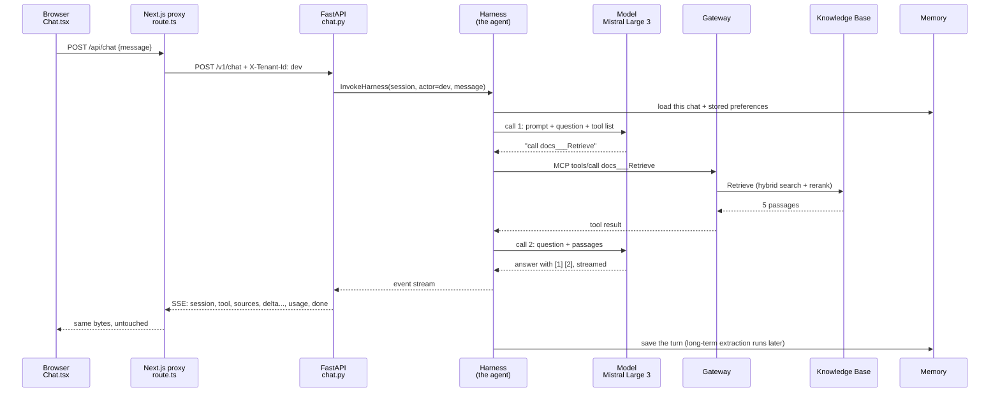

# Follow one question

The whole system, followed hop by hop: what runs, in which file or AWS
service, who it acts as, and what the data looks like at that moment.
Read this after the big picture on the "Start here" page, and before the
topic sections: it gives every later section a place to hang.

Line numbers are from commit `c7cb2c0` (2026-09-11). If they drift, search
for the function name.

---

## The question

You type **"Why was Neptune Analytics dropped from the plan?"** and press
Enter in a new chat.



---

## Hop by hop

### 1. The browser sends only the new message

**Where:** `frontend/components/Chat.tsx:60`, inside `send()`.

```json
POST /api/chat
{ "message": "Why was Neptune Analytics dropped from the plan?", "session_id": null }
```

`session_id` is `null` because this is a new chat. The browser never sends
the history: the agent keeps it in Memory (hop 5).

**Learn more:** `web.md`, the Next.js and fetch sections.

### 2. The Next.js proxy forwards it

**Where:** `frontend/app/api/[...path]/route.ts:19`, `forward()`.

- `[...path]` catches every `/api/...` URL. `path` here is `["chat"]`.
- Line 17: only `chat`, `documents` and `sessions` pass. Anything else is 404, so this cannot be used to reach other backend URLs.
- It adds `X-Tenant-Id: dev` (the fixed tenant stub; there is no login) and calls `http://localhost:8001/v1/chat` at line 45.
- The answer's bytes are passed back untouched, with `Cache-Control: no-transform` so nothing buffers the stream.

**Why a proxy at all:** the page and the API look like one site to the
browser (no CORS), and the backend address stays on the server.

### 3. FastAPI checks the request before spending anything

**Where:** `backend/app/chat.py:176`, `chat()`, reached through `main.py:21`.

FastAPI runs the endpoint's dependencies first, in order:

| Check | Where | If it fails |
|---|---|---|
| tenant header is a safe id | `tenancy.py:19` | 400 |
| body has a message of 1 to 20,000 characters, and a valid session id if one is given | `chat.py:51` (`ChatRequest`) | 422 |
| make a session id for a new chat | `chat.py:57` (`session_id_for`): a UUID, 36 characters | |

Nothing has cost money yet. Bad requests stop here.

### 4. FastAPI opens the agent's stream

**Where:** `chat.py:63` (`harness_stream`), the call itself at `chat.py:74`.

```python
client.invoke_harness(
    harnessArn=...,                       # from .env via settings.py
    runtimeSessionId="af0e0ec4-...",      # this conversation
    actorId="dev",                        # whose memory
    messages=[{"role": "user", "content": [{"text": "Why was Neptune..."}]}],
)
```

The client comes from `aws.py:54`. It signs the request with your laptop's
AWS profile (`docs-copilot-dev`), so **AWS sees your IAM user** making this
call.

Opening the stream happens *before* the response starts. If AWS refuses
(busy, no permission), `aws.py:61` turns that into a real 503 or 502.

### 5. The Harness gets ready (AWS)

The Harness is the agent: a loop AWS runs for us. For this call it:

1. reads its configuration: model Mistral Large 3, the system prompt (`backend/prompts/assistant.md`), tools (the Gateway and the browser), memory settings;
2. starts or resumes a small isolated machine for this session;
3. loads **short-term memory** for (actor `dev`, this session): empty, since the chat is new;
4. searches **long-term memory** for actor `dev` and adds relevant records to the prompt, for example "prefers answers as short bullet points".

**Acts as:** the Harness execution role (`AmazonBedrockAgentCoreHarnessDefaultServiceRole-…`).

**Learn more:** `ai.md` 6 (agents), `aws.md` 10.2 (Harness), `D3.md` (memory).

### 6. Model call 1: decide what to do

The Harness sends the model: the system prompt, the question, and the list
of tools with their descriptions. The model streams back its private
reasoning ("need to retrieve...") and then a **tool call**:

```json
{ "name": "docs___Retrieve", "input": { "retrievalQuery": { "text": "Neptune Analytics dropped reason" } } }
```

It chose the document search because prompt rule 2 says factual questions
go there. A URL would have picked the browser (rule 1); a "how does X relate
to Y" question would have picked `graph___search_graph`.

### 7. The Gateway runs the tool

The Harness calls the Gateway over **MCP** (`tools/call`), signed as the
Harness role, which has `InvokeGateway` on this one gateway.

The tool name says where it goes: `docs___Retrieve` = target `docs`, tool
`Retrieve`. The Gateway calls the managed Knowledge Base as **its own**
service role.

**Learn more:** `aws.md` 10.3 (Gateway), 10.3b (the MCP call done by hand).

### 8. The Knowledge Base searches

Inside the managed Knowledge Base (`aws.md` 7, `ai.md` 4):

1. the question is turned into a vector (embedding);
2. **hybrid search**: closest vectors plus keyword matches (BM25), merged;
3. **reranking**: a second model rereads the top candidates next to the question and re-sorts them;
4. the best 5 chunks come back, each with its source file and metadata (`tenant_id: dev`).

### 9. Model call 2: write the answer

The Gateway hands the 5 passages back to the Harness as the tool result.
The Harness calls the model again: question plus passages. The model writes
the answer, citing passages by position: `[1]`, `[2]`.

**That is why one answer with one search costs two model calls.**

### 10. FastAPI translates the stream

The Harness streams every step as small events. `relay()` at `chat.py:115`
turns them into our own short list:

| Harness sends | We send the browser | Where |
|---|---|---|
| (before anything) | `session` with the new id | `chat.py:184` |
| tool call, in pieces | `tool` (name and query) | `relay`, on `contentBlockStop` |
| tool result, one JSON string cut in pieces | `sources` (numbered cards) | `to_sources`, `chat.py:95` |
| reasoning text | nothing (not shown) | |
| answer text pieces | `delta`, one per piece | |
| token counts, once per model call | `usage`, summed | |
| an error event | `error`, then stop | `_ERROR_EVENTS`, `chat.py:47` |
| (the end) | `done` | `chat.py:200` |

The wire format is Server-Sent Events: plain text lines, one blank line
between events (`web.md`, streaming sections).

```
event: sources
data: [{"n": 1, "title": "README.md", "score": 0.612, "excerpt": "..."}]

event: delta
data: "Neptune Analytics was dropped because"
```

### 11. The browser draws it as it arrives

**Where:** `Chat.tsx:72` onward.

1. `createSseParser()` (`lib/sse.ts:11`) turns text chunks into events, even when a chunk cuts an event in half.
2. Lines 80 to 93 route each event: `session` remembers the id (the next message reuses it), `tool` adds "Searched your documents for ...", `sources` attaches the cards, `delta` appends text.
3. `Answer` (`Chat.tsx:230`) renders. `splitCitations` (`lib/citations.ts:10`) turns `[1]` into a small link to source card 1.

### 12. After the answer

- The Harness saves this turn to **Memory**: about ten events (question, tool call, tool result, answer, plus internal state).
- A few minutes later, long-term strategies extract facts, preferences and a summary from it.
- The sidebar reloads its list; `sessions.py:43` asks Memory for this actor's sessions. Opening an old chat reads its events (`sessions.py:64`) and keeps only question and answer text (`sessions.py:100`).

---

## Who acts at each hop

The single most useful mental model for AWS: **every call is made by some
identity, and that identity needs permission for exactly that call.**

| Hop | Caller | Identity AWS sees | Permission that makes it work |
|---|---|---|---|
| 4 | FastAPI | your IAM user (`docs-copilot-dev` profile) | AdministratorAccess (dev shortcut) |
| 6, 9 | Harness to model | Harness execution role | `bedrock:InvokeModel` |
| 7 | Harness to Gateway | Harness execution role | `bedrock-agentcore:InvokeGateway` on our gateway |
| 7 to 8 | Gateway to Knowledge Base | Gateway service role | Retrieve on the managed Knowledge Base |
| graph path | Gateway to Lambda | Gateway service role | `lambda:InvokeFunction` (added in D4) |
| graph path | Lambda to graph Knowledge Base | Lambda role | `bedrock:Retrieve` (added in D4) |
| sync | Knowledge Base to S3, models, Neptune | Knowledge Base service role | made by the console at creation |

---

## The two other paths

**A URL question** ("what does https://... say?"): hop 6 picks the
**browser** tool. It does not go through the Gateway; the Harness drives
AWS's managed Chrome directly: open a session, navigate, read the text,
close. The page text (often 30k to 150k tokens) goes into model call 2. The
UI shows "Opened <url>" (`Chat.tsx:288`, `describeTool`).

**A relationship question** ("how does the Gateway relate to Memory?"):
hop 6 picks `graph___search_graph`. The Gateway invokes our Lambda
(`infra/lambda/graph_search/handler.py:31`), which calls Retrieve on the
GraphRAG Knowledge Base: a vector search, then a walk through the Neptune
graph to chunks that share the same things. Only works while the graph is
started (`D4.md`).

---

## And one upload

1. `Sidebar.tsx:58` sends the file as a multipart form to `/api/documents`.
2. The proxy forwards it. `documents.py:107` (`upload`) cleans the name (`safe_filename`, line 74), checks type and size.
3. Two S3 writes: the tenant label `x.md.metadata.json` first (line 130), then the file (line 138).
4. `start_sync` (line 87) asks the managed Knowledge Base to re-read the bucket (`start_ingestion_job`, line 91). If a sync is already running, AWS says `ConflictException` and the file waits for the next one.
5. The sidebar asks `/api/documents/sync/<job>` every 5 seconds (`documents.py:175`) until COMPLETE.

**Known limit:** the upload syncs only the managed Knowledge Base
(`KB_ID`). The graph Knowledge Base sees new files only after its own sync
is started (console: Knowledge Bases, `docs-copilot-graph-kb`, Sync).

---

## Check yourself

1. At which hop could a bad request be rejected without spending anything?
2. Why does the browser send only one message, not the whole chat?
3. Name the identity making the call at hop 4, at hop 7, and at hop 8.
4. What does `relay()` wait for before sending a `tool` event, and why?
5. Which path skips the Gateway entirely?
6. You upload a file and ask a relationship question about it at once. Why might the graph not know it yet?
