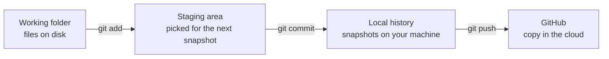
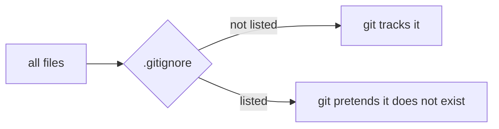
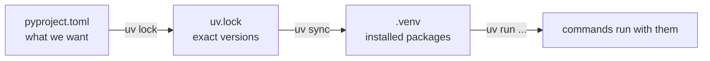
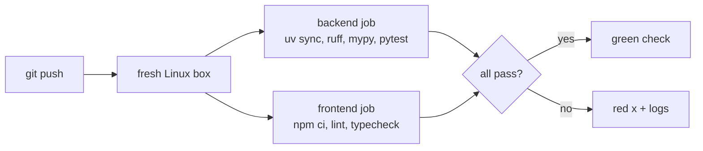

# Tooling track

One section per tool. Added as the project meets them.

```
1. git                        D1
2. uv                         D1
3. ruff and mypy              D1
4. Env files                  D1
5. CI                         D1
6. The backend layout         D1
7. pytest                     D1
8. Type stubs and plugins     D1
9. npm and package.json       D1
10. Node's test runner        D1
(next: Docker, compose, Terraform, kind, k6)
```

---

## 1. git

A repo is a folder git watches. Git remembers every version of every file
you tell it about.

### 1.1 The three places



- `git add` = include this in the next snapshot
- `git commit` = take the snapshot
- `git push` = upload snapshots to GitHub

Nothing reaches GitHub without a commit.

### 1.2 Flags you have used

```
git add -A          stage everything: new, edited, deleted, whole repo
git reset <path>    unstage just that path
git push -u origin main
                    -u = remember that local main pairs with origin/main,
                         so later it is just "git push"
```

### 1.3 Remotes

A remote is a named URL git pushes to. `origin` is the conventional name.

```
https://github.com/...    asks username + token every push
git@github.com:...        uses your SSH key, no prompt
```

`git remote set-url origin <url>` swaps the address, same repo.

### 1.4 .gitignore

A filter between the folder and git:



Ours ignores `.venv/`, `node_modules/` (rebuildable, huge), `.env` (real
values), `__pycache__/`. A pattern with no leading `/` matches in every
folder, so `.env` covers `backend/.env` too. One trick: `.env.*` ignores
every env file, `!.env.example` un-ignores that one.

Also: `~/.config/git/ignore` on this machine hides `CLAUDE.md` from every
repo, and a commit hook rejects it. Project rules live in `README.md`.

---

## 2. uv

The Python package manager. Downloads and installs packages, keeps them in
a private folder (`.venv`), records exact versions.

### 2.1 One project, one lockfile

```
backend/
  pyproject.toml     what we need + settings for ruff, mypy, pytest
  uv.lock            the exact versions uv picked
  .python-version    3.12
  .venv/             the installed packages (gitignored)
```



`pyproject.toml` has no `[build-system]` table on purpose. That table is
for code you package and publish. Ours is an app we run, so uv installs its
dependencies and never tries to build the app itself.
Docs: https://docs.astral.sh/uv/concepts/projects/config/#build-systems

**The tradeoff:** uv's default for new projects is a build system plus a
`src/` folder, because it avoids import surprises. We skip both to keep
paths short. The cost is one pytest setting (section 7.4).

**Why not a workspace:** a uv workspace is several packages sharing one
lockfile. It was tried first here, then removed: with a single package it
was only extra folders and a second `pyproject.toml`. It comes back when a
part needs its own dependencies or its own container, likely the research
agent in D6.
Docs: https://docs.astral.sh/uv/concepts/projects/workspaces/

### 2.2 pyproject.toml vs uv.lock

```
pyproject.toml   = shopping list     "ruff >= 0.12"
uv.lock          = the receipt       "ruff == 0.16.6, sha256=..."
```

The lock freezes today's answer, so you, CI, and Docker install the same
thing. Never edit it by hand. Always commit it.

### 2.3 .python-version

One line: `3.12`. This machine has 3.11 to 3.14. Without the file uv picks
the newest, and some AWS libraries lag behind it. Pinned to 3.12.

### 2.4 Dependency groups

`[dependency-groups] dev = [...]` holds tools only developers need (ruff,
mypy, pytest). Installed by default. Skipped in the Docker image with
`--no-dev`.
Docs: https://docs.astral.sh/uv/concepts/projects/dependencies/#dependency-groups

### 2.5 Commands

All from `backend/`:

```
uv sync          install everything in pyproject.toml into .venv
uv run <cmd>     run a command using the .venv
uv lock          refresh uv.lock after editing pyproject.toml
```

---

## 3. ruff and mypy

Both configured in `backend/pyproject.toml`.

- **ruff** = lint: style mistakes and common bugs. Rule families are listed with a comment each. It sees `app/` at the project root and treats it as our own code when sorting imports.
- **mypy** = typecheck: types line up, no string where an int goes. `strict = true` turns on every check. Cost: every function needs annotations, and every library needs type information (section 8).

---

## 4. Env files

Each app owns its own env file:

```
backend/.env            real values for the API, gitignored
backend/.env.example    placeholders + a comment per line, committed
frontend/.env.local     Next.js's own file (step 3)
```

New machine: `cp .env.example .env` inside `backend/`, fill it in.

How the API reads it (`app/settings.py`):

```
real environment variables   ->  always win
backend/.env                 ->  used for anything not set above
unknown key in the file      ->  startup error (a typo fails loudly)
no file at all               ->  fine, env vars only (Docker and ECS work this way)
```

The last two rows were checked by hand on 2026-09-10.
Docs: https://pydantic.dev/docs/validation/latest/concepts/pydantic_settings/

---

## 5. CI

`.github/workflows/ci.yml`: a robot on GitHub runs the checks on every
push.



`uv sync --locked` fails if `uv.lock` is out of date with
`pyproject.toml`. Plain `uv sync` would silently fix it and hide the
mistake.

`astral-sh/setup-uv` stopped publishing moving tags like `@v8`, so it is
pinned to an exact version.

Not pushed yet: the frontend job would fail until `frontend/` exists.
Committed with D1 step 3.

---

## 6. The backend layout

```
backend/
  app/                 the code
    __init__.py        marks the folder as a package, so `import app.chat` works
    main.py            creates the app, /healthz
    chat.py            the /v1/chat endpoint
    llm.py             talking to Bedrock
    settings.py        config from env vars and .env
    tenancy.py         reads X-Tenant-Id
  tests/
    test_chat.py
```

Same shape as FastAPI's own "Bigger Applications" tutorial.
Docs: https://fastapi.tiangolo.com/tutorial/bigger-applications/

**Runtime vs dev dependencies**, two lists in the one `pyproject.toml`:

```
[project] dependencies   fastapi, uvicorn, boto3, pydantic-settings
                         needed to RUN the server, shipped in Docker
[dependency-groups] dev  ruff, mypy, pytest, httpx2, boto3-stubs
                         needed to CHECK the code, never shipped
```

**How it grows:** the D2 worker starts as `app/worker.py` in the same
project, run from the same Docker image with a different command. A part
only moves out when it needs different dependencies or its own container.

---

## 7. pytest

A test is a function whose name starts with `test_` and that uses
`assert`. pytest finds them and runs them.

```
uv run pytest -q      from backend/.  -q = quiet: one dot per passing test
```

### 7.1 Three tools used in `test_chat.py`

- **Fake:** `FakeBedrock` pretends to be the boto3 client. It returns a
  list of made-up events or raises a made-up error, and it records every
  call. No network, no AWS, no cost.
- **Fixture:** a setup function pytest runs around each test.
  `autouse=True` means every test gets it. Ours installs test settings
  (with `_env_file=None`, so your `.env` is ignored) before each test and
  clears overrides after, so tests cannot leak into each other.
- **Parametrize:** one test, many inputs. The bad-conversation test runs
  five times, once per bad input, and each shows up separately.

### 7.2 Why a fake instead of botocore Stubber

Stubber is botocore's official tool for faking AWS responses. It works for
errors, but it rejects a fake event stream: it wants a real stream object,
not a list. Tried and confirmed on 2026-09-10. So tests swap the whole
client through FastAPI's dependency overrides.

### 7.3 What the 13 tests cover

| Test | Checks |
|---|---|
| streams text, then usage, then done | the happy path, exact event order |
| sends Bedrock the Converse request shape | model id, message format, max tokens |
| bad tenant header (x3) | 400, and Bedrock is never called |
| invalid conversation (x5) | 422, and Bedrock is never called |
| throttling is 503 with Retry-After | pre-stream error becomes a real status |
| other Bedrock error is 502 | and AWS's error name does not leak |
| error mid-stream becomes error event | status stays 200, `error` replaces `done` |

"Bedrock is never called" is checked on every rejection: a bug there
would cost money on every bad request.

### 7.4 pythonpath

Tests start with `from app.main import app`. Python only finds `app` if
`backend/` is on its search path (`sys.path`). uv does not install our app
(no build system, section 2.1), and pytest does not add the folder on its
own. One line in `pyproject.toml` fixes it:

```toml
[tool.pytest.ini_options]
pythonpath = ["."]      # "." = backend/, the folder pyproject.toml is in
```

Docs: https://docs.pytest.org/en/stable/reference/reference.html#confval-pythonpath

### 7.5 httpx2

FastAPI's test client needs an HTTP library. `httpx` stopped being
maintained and Starlette now warns when it is used. `httpx2` is the
maintained fork. It is a dev dependency, so it is never shipped.
Docs: https://starlette.dev/testclient/

### 7.6 Checking a new dependency before trusting it

Adding `httpx2` pulled in two packages nobody asked for. Every package you
install can run code on your machine, so unknown names get checked. Three
questions, all answerable in two minutes:

1. **Who publishes it?** `https://pypi.org/pypi/<name>/json` lists the
   author and source repo. `httpx2` lives at `github.com/pydantic/httpx2`,
   by the original httpx author.
2. **Why is it here?** `uv tree --invert --package <name>` shows which
   package pulled it in.
3. **Is it even installed?** `uv.lock` records every platform. Look for a
   `marker`. `httpx2-jsfetch` has `sys_platform == 'emscripten'`: it only
   installs for Python running inside a browser, so it never landed here.

---

## 8. Type stubs and plugins

mypy checks types, but some libraries hide their types.

- **boto3-stubs:** boto3 builds its methods at runtime from JSON files, so
  mypy cannot see them. `boto3-stubs[bedrock-runtime]` is a separate
  package that describes them. It is imported only inside
  `if TYPE_CHECKING:`, a block that runs for mypy and never at runtime.
  So production does not need it.
- **pydantic mypy plugin:** teaches mypy how Pydantic builds `__init__`
  from class fields. Enabled with `plugins = ["pydantic.mypy"]`.
  Docs: https://pydantic.dev/docs/validation/latest/integrations/dev-tools/mypy/

---

## 9. npm and package.json

npm is to the frontend what uv is to the backend. Same ideas, other names:

| Idea | Backend (Python) | Frontend (Node) |
|---|---|---|
| package manager | uv | npm |
| shopping list | `pyproject.toml` | `package.json` |
| exact versions (commit it) | `uv.lock` | `package-lock.json` |
| installed packages (never commit) | `.venv/` | `node_modules/` |
| install everything | `uv sync` | `npm install` |
| install exactly the lock (CI) | `uv sync --locked` | `npm ci` |
| run a tool | `uv run pytest` | `npm run lint`, `npm test` |

`package.json` has two lists: `dependencies` (shipped: next, react) and
`devDependencies` (checking only: typescript, eslint, tailwind). Same split
as the backend's runtime vs dev groups.

It also has `scripts`, short names for commands:

```
npm run dev         next dev          dev server with hot reload
npm run build       next build        production build
npm run lint        eslint            lint
npm run typecheck   tsc --noEmit      typecheck only, write no files
npm test            node --test ...   parser tests (section 10)
```

### 9.1 How the frontend was created

```
npx create-next-app@latest frontend --ts --eslint --tailwind --app \
  --no-src-dir --import-alias "@/*" --use-npm --disable-git --no-agents-md --yes
```

| Flag | Why |
|---|---|
| `--ts --eslint --app` | TypeScript, linting, the App Router |
| `--tailwind` | style with class names (below) |
| `--disable-git` | we already have a repo; don't create a second one inside it |
| `--no-agents-md` | no AI tooling files in the repo (same rule as `CLAUDE.md`) |

Then the unused boilerplate (sample SVGs, the template README) was deleted.
Docs: https://nextjs.org/docs/app/api-reference/cli/create-next-app

**Gotcha:** `--no-agents-md` only covers creating the project. From Next.js
16.3, `next dev` writes `AGENTS.md` and `CLAUDE.md` itself whenever it
detects an AI coding agent, and puts them back if you delete them. The real
off switch is one line in `next.config.ts`:

```ts
agentRules: false,
```

Found by checking three places, which is the habit worth copying: the
docs ("Opting out" section), the installed code
(`node_modules/next/dist/server/lib/start-server.js`, which only writes
the files when `agentRules !== false`), and the config schema (a boolean).
Docs: https://nextjs.org/docs/app/guides/ai-agents#opting-out

### 9.2 Tailwind

Styling by class names written right in the JSX, instead of a separate CSS
file:

```tsx
<button className="rounded-xl bg-indigo-600 px-5 text-white disabled:opacity-40">
```

reads as: rounded corners, indigo background, horizontal padding, white
text, faded when disabled. `dark:` classes apply when the computer is in
dark mode.

---

## 10. Node's test runner

The SSE parser is plain TypeScript with fiddly edge cases, so it gets
tests. Node ships a test runner, so no test library is installed:

```ts
import assert from "node:assert/strict";
import { test } from "node:test";

test("holds a half-received event until the rest arrives", () => { ... });
```

Two details that make it work:

- **Node 24 runs `.ts` files directly.** It strips the type annotations and runs what is left. On since Node 23.6.
- **The import needs the extension:** `import { createSseParser } from "./sse.ts"`. Node requires it; TypeScript normally forbids it, so `tsconfig.json` sets `allowImportingTsExtensions` (allowed because the project never emits `.js` files).

The five tests: complete events, an event split across chunks, keep-alive
comments skipped, CRLF line endings split across chunks, an event with no
name.

Docs: https://nodejs.org/api/test.html and https://nodejs.org/api/typescript.html

---

## Check yourself

1. What are the three places a file passes through on the way to GitHub?
2. Why does `backend/pyproject.toml` have no `[build-system]` table?
3. `pyproject.toml` vs `uv.lock`, in one sentence each?
4. Why is `backend/.env` ignored but `backend/.env.example` is not?
5. What does `uv sync --locked` catch that `uv sync` hides?
6. Why do the tests need `pythonpath = ["."]`?
7. What does a fake give you that a real AWS call in a test would not?
8. Why is `boto3-stubs` imported only inside `if TYPE_CHECKING:`?
9. When would the backend become a workspace again?
10. What is the npm equivalent of `uv.lock`, and of `uv sync --locked`?
11. Why does `sse.test.ts` import `./sse.ts` with the extension?
