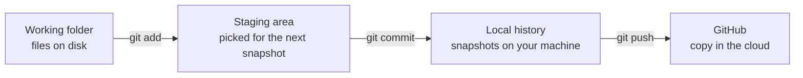
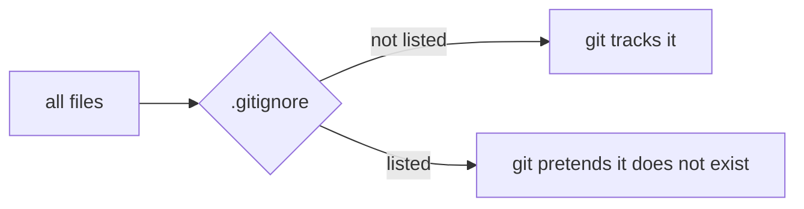
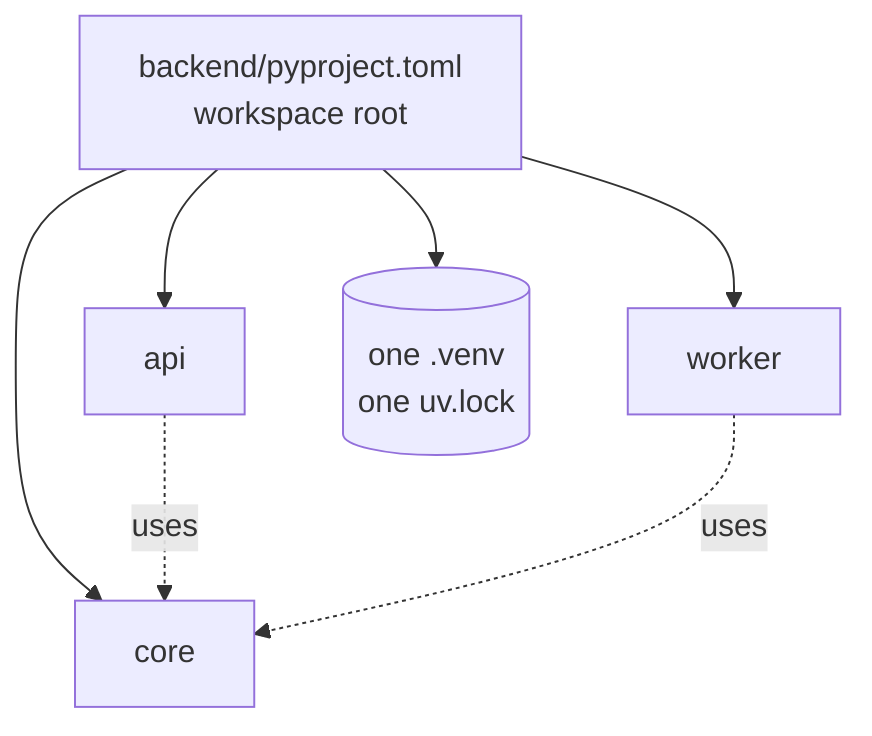
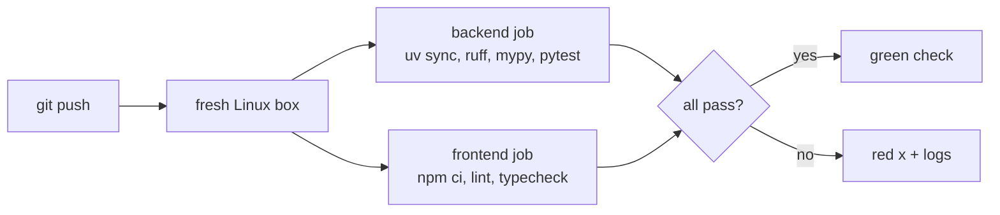

# Tooling track

One section per tool. Added as the project meets them.

```
1. git                D1
2. uv                 D1
3. ruff and mypy      D1
4. Env files          D1
5. CI                 D1
(next: Docker, compose, pytest, Terraform, kind, k6)
```

---

## 1. git

A repo is a folder git watches. Git remembers every version of every file
you tell it about.

### 1.1 The three places



- `git add` = include this in the next snapshot
- `git commit` = take the snapshot
- `git push` = upload snapshots to GitHub

Nothing reaches GitHub without a commit.

### 1.2 Flags you have used

```
git add -A          stage everything: new, edited, deleted, whole repo
git reset <path>    unstage just that path
git push -u origin main
                    -u = remember that local main pairs with origin/main,
                         so later it is just "git push"
```

### 1.3 Remotes

A remote is a named URL git pushes to. `origin` is the conventional name.

```
https://github.com/...    asks username + token every push
git@github.com:...        uses your SSH key, no prompt
```

`git remote set-url origin <url>` swaps the address, same repo.

### 1.4 .gitignore

A filter between the folder and git:



Ours ignores `.venv/`, `node_modules/` (rebuildable, huge), `.env` (real
secrets), `__pycache__/`. One trick: `.env.*` ignores every env file,
`!.env.example` un-ignores that one.

Also: `~/.config/git/ignore` on this machine hides `CLAUDE.md` from every
repo, and a commit hook rejects it. Project rules live in `README.md`.

---

## 2. uv

The Python package manager. Downloads and installs packages, keeps them in
a private folder (`.venv`), records exact versions.

### 2.1 Workspace

Several Python packages sharing one install:



Without a workspace, `api` and `worker` each install their own copies and
can drift to different versions. With one: one install, one lockfile.

The root has no `[project]` table on purpose. It holds packages, it is not
one. uv calls this a "virtual root". Members are listed by name, not glob,
so a stray folder cannot break it.

The workspace root is `backend/`, not the repo root: Python in `backend/`,
Node in `frontend/`, strict split. Every uv command runs from `backend/`.

### 2.2 pyproject.toml vs uv.lock

```
pyproject.toml   = shopping list     "ruff >= 0.12"
uv.lock          = the receipt       "ruff == 0.16.6, sha256=..."
```

The lock freezes today's resolution so you, CI, and Docker install the
same thing. Never edit by hand. Always commit.

### 2.3 .python-version

One line: `3.12`. This machine has 3.11 to 3.14. Without the file uv picks
the newest, and some AWS libraries lag it. Pinned to 3.12.

### 2.4 Dependency groups

`[dependency-groups] dev = [...]` holds tools only developers need (ruff,
mypy, pytest). Installed by default. Skipped in the Docker image with
`--no-dev`.

### 2.5 Commands

```
uv sync --all-packages   install every member plus dev tools
uv run <cmd>             run a command inside the .venv
uv lock                  refresh uv.lock after editing pyproject.toml
```

---

## 3. ruff and mypy

Both configured in `backend/pyproject.toml` so every member inherits.

- **ruff** = lint: style mistakes and common bugs. Rule families are listed with a comment each.
- **mypy** = typecheck: types line up, no string where an int goes. `strict = true` turns on every check. Cost: every function needs annotations and every library needs type stubs.

---

## 4. Env files

```
.env           real values, gitignored
.env.example   placeholders + a comment per line, committed
```

New machine: `cp .env.example .env`, fill it in. Config that changes per
machine or per person (AWS profile, model ID) lives here, not in code.

---

## 5. CI

`.github/workflows/ci.yml`: a robot on GitHub runs the checks on every
push.



`uv sync --locked` fails if `uv.lock` is out of date with
`pyproject.toml`. Plain `uv sync` would silently fix it and hide the
mistake.

Pins: `astral-sh/setup-uv` stopped publishing moving tags like `@v8`, so
it is pinned to an exact version.

Not pushed yet: it would fail until `backend/api` and `frontend` exist.
Committed with D1 step 3.

---

## Check yourself

1. What are the three places a file passes through on the way to GitHub?
2. Why does `backend/pyproject.toml` have no `[project]` table?
3. `pyproject.toml` vs `uv.lock`, in one sentence each?
4. Why is `.env` ignored but `.env.example` is not?
5. What does `uv sync --locked` catch that `uv sync` hides?
