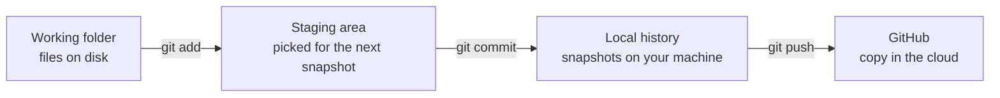
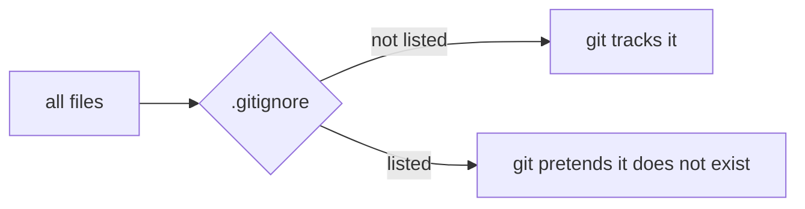
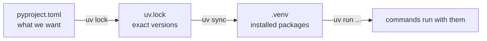
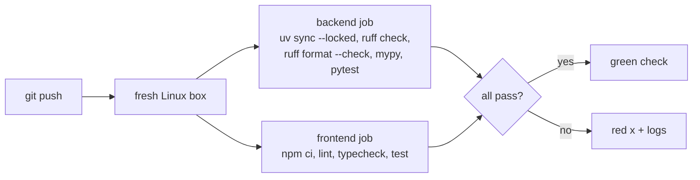

# Tooling track

One section per tool. Added as the project meets them.

```
1. git                        D1
2. uv                         D1
3. ruff and mypy              D1
4. Env files                  D1, D2
5. CI                         D1
6. The project layout         D1, D2, D4
7. pytest                     D1, D2
8. Type stubs and plugins     D1, D2
9. npm and package.json       D1
10. Node's test runner        D1, D2
(later, maybe: Terraform, k6, kind. Docker and docker compose were dropped.)
```

---

## 1. git

A repo is a folder git watches. Git remembers every version of every file
you tell it about.

### 1.1 The three places



- `git add` = include this in the next snapshot
- `git commit` = take the snapshot
- `git push` = upload snapshots to GitHub

Nothing reaches GitHub without a commit.

### 1.2 Flags you have used

```
git add -A          stage everything: new, edited, deleted, whole repo
git reset <path>    unstage just that path
git push -u origin main
                    -u = remember that local main pairs with origin/main,
                         so later it is just "git push"
```

### 1.3 Remotes

A remote is a named URL git pushes to. `origin` is the conventional name.

```
https://github.com/...    asks username + token every push
git@github.com:...        uses your SSH key, no prompt
```

`git remote set-url origin <url>` swaps the address, same repo.

### 1.4 .gitignore

A filter between the folder and git:



Ours ignores `.venv/`, `node_modules/` (rebuildable, huge), `.env` (real
values), `__pycache__/`. A pattern with no leading `/` matches in every
folder, so `.env` covers `backend/.env` too. One trick: `.env.*` ignores
every env file, `!.env.example` un-ignores that one.

Also: `~/.config/git/ignore` on this machine hides `CLAUDE.md` from every
repo, and a commit hook rejects it. Project rules live in `README.md`.

---

## 2. uv

The Python package manager. Downloads and installs packages, keeps them in
a private folder (`.venv`), records exact versions.

### 2.1 One project, one lockfile

```
backend/
  pyproject.toml     what we need + settings for ruff, mypy, pytest
  uv.lock            the exact versions uv picked
  .python-version    3.12
  .venv/             the installed packages (gitignored)
```



`pyproject.toml` has no `[build-system]` table on purpose. That table is
for code you package and publish. Ours is an app we run, so uv installs its
dependencies and never tries to build the app itself.
Docs: https://docs.astral.sh/uv/concepts/projects/config/#build-systems

**The tradeoff:** uv's default for new projects is a build system plus a
`src/` folder, because it avoids import surprises. We skip both to keep
paths short. The cost is one pytest setting (section 7.4).

**Why not a workspace:** a uv workspace is several packages sharing one
lockfile. It was tried first here, then removed: with a single package it
was only extra folders and a second `pyproject.toml`. It comes back only if
a part of the backend ever needs its own dependencies. The one piece that
runs elsewhere, the graph search Lambda, needs nothing but boto3 (which
Lambda already has), so it is a plain file in `infra/` instead (section 6).
Docs: https://docs.astral.sh/uv/concepts/projects/workspaces/

### 2.2 pyproject.toml vs uv.lock

```
pyproject.toml   = shopping list     "ruff >= 0.12"
uv.lock          = the receipt       "ruff == 0.16.6, sha256=..."
```

The lock freezes today's answer, so you and CI install the same thing.
Never edit it by hand. Always commit it.

### 2.3 .python-version

One line: `3.12`. This machine has 3.11 to 3.14. Without the file uv picks
the newest, and some AWS libraries lag behind it. Pinned to 3.12.

### 2.4 Dependency groups

`[dependency-groups] dev = [...]` holds tools only developers need (ruff,
mypy, pytest, type stubs, moto). Installed by default. `uv sync --no-dev`
skips them, which is what a production install would use (nothing is
deployed yet).
Docs: https://docs.astral.sh/uv/concepts/projects/dependencies/#dependency-groups

### 2.5 Commands

All from `backend/`:

```
uv sync          install everything in pyproject.toml into .venv
uv run <cmd>     run a command using the .venv
uv lock          refresh uv.lock after editing pyproject.toml
uv add <pkg>     add a package to pyproject.toml, lock, and install
uv remove <pkg>  the reverse (D2 removed psycopg when Postgres was dropped)
```

---

## 3. ruff and mypy

Both configured in `backend/pyproject.toml`.

- **ruff** = lint: style mistakes and common bugs. Rule families are listed with a comment each. It sees `app/` at the project root and treats it as our own code when sorting imports. `ruff format` also rewrites layout (line breaks, quotes); CI runs `ruff format --check`, which fails if anything would change.
- **mypy** = typecheck: types line up, no string where an int goes. `strict = true` turns on every check. Cost: every function needs annotations, and every library needs type information (section 8).

---

## 4. Env files

Each app owns its own env file:

```
backend/.env            real values for the API, gitignored
backend/.env.example    the same keys, committed, a comment per line
frontend/.env.local     Next.js's own file: API_URL=http://localhost:8001
frontend/.env.example   its committed template
```

New machine: `cp .env.example .env` inside `backend/` (and
`cp .env.example .env.local` inside `frontend/`), fill them in.

What the backend needs (`app/settings.py`): the AWS profile and region,
plus five IDs from the AWS console: `S3_BUCKET`, `KB_ID`,
`KB_DATA_SOURCE_ID`, `HARNESS_ARN`, `MEMORY_ID`. None are secrets. The
five are required: the app refuses to start without them.

How the API reads it:

```
real environment variables   ->  always win
backend/.env                 ->  used for anything not set above
unknown key in the file      ->  startup error (a typo fails loudly)
no file at all               ->  fine, env vars only (how a server on AWS would run it)
```

The "unknown key" rule bit once, on purpose: in D2 the gateway's URL was
kept in `.env` as a note, the app would not start, and the line was
removed. The app does not need it; the Harness knows its gateway.
Docs: https://pydantic.dev/docs/validation/latest/concepts/pydantic_settings/

---

## 5. CI

`.github/workflows/ci.yml`: a robot on GitHub runs the checks on every
push to `main` and every pull request.



`uv sync --locked` fails if `uv.lock` is out of date with
`pyproject.toml`. Plain `uv sync` would silently fix it and hide the
mistake.

`astral-sh/setup-uv` stopped publishing moving tags like `@v8`, so it is
pinned to an exact version.

CI has been green on every push since D1. The only red run was the very
first frontend job, which taught the `next typegen` lesson (section 9).
Check it any time with `gh run list --limit 3`.

---

## 6. The project layout

```
backend/                      one Python project (section 2)
  app/                        the API server
    __init__.py               marks the folder as a package, so `import app.chat` works
    main.py                   creates the app, plugs in the routers, /healthz
    settings.py               config from env vars and .env
    tenancy.py                reads the X-Tenant-Id stub
    aws.py                    one boto3 client per AWS service + one error mapper
    chat.py                   POST /v1/chat: relays the agent's stream
    documents.py              upload, list, sync status
    sessions.py               past conversations from Memory
  prompts/
    assistant.md              the agent's system prompt (pasted into the Harness console)
  tests/
    __init__.py               makes tests a package (mypy needs it, section 7.1)
    conftest.py               settings every test gets
    helpers.py                TENANT, aws_error, parse_sse, FakeAgentCore
    test_chat.py              15 tests
    test_documents.py         14 tests
    test_sessions.py          9 tests
frontend/                     the Next.js app (web.md section 8)
  app/api/[...path]/route.ts  the proxy
  components/                 Chat.tsx, Sidebar.tsx
  lib/                        sse.ts, citations.ts, markdown.ts + their tests
infra/
  iam/                        the least-privilege policies, kept as documentation
  lambda/graph_search/        handler.py + tool-schema.json (D4)
docs/learning/                these files
```

Same backend shape as FastAPI's own "Bigger Applications" tutorial: one
file per group of routes.
Docs: https://fastapi.tiangolo.com/tutorial/bigger-applications/

`app/llm.py` (direct calls to Bedrock) existed in D1 and was deleted in
D2: the Harness calls the model now, not our code.

**Runtime vs dev dependencies**, two lists in the one `pyproject.toml`:

```
[project] dependencies   fastapi, uvicorn, boto3, pydantic-settings, python-multipart
                         needed to RUN the server
[dependency-groups] dev  ruff, mypy, pytest, httpx2, boto3-stubs, moto
                         needed to CHECK the code, never shipped
```

`python-multipart` is what lets FastAPI read file uploads (`web.md`
section 13).

**How it grows:** new backend features start as a file in `app/`. A part
only moves out when it runs somewhere else. The graph search is the
example: it runs on AWS Lambda, not in our server, so it lives in
`infra/lambda/` with its own self-check instead of the pytest suite.

---

## 7. pytest

A test is a function whose name starts with `test_` and that uses
`assert`. pytest finds them and runs them.

```
uv run pytest -q      from backend/.  -q = quiet: one dot per passing test
```

### 7.1 The tools the tests use

- **Fakes:** stand-ins for AWS clients that return made-up answers and record every call. No network, no AWS, no cost.
  - `FakeAgentCore` (`tests/helpers.py`) stands in for the `bedrock-agentcore` client: `invoke_harness` returns a list of made-up stream events, `list_sessions` and `list_events` return made-up Memory records (with page support, to test `nextToken`).
  - `FakeKb` (`test_documents.py`) stands in for the `bedrock-agent` client: `start_ingestion_job` and `get_ingestion_job`.
- **moto:** a library that fakes S3 in memory. Real boto3 calls, real bucket behavior, no network. `with mock_aws():` turns it on; the test creates a bucket, uploads through our API, and reads back what landed. Used for S3 because moto models it fully; moto does not model ingestion jobs or AgentCore, hence the fakes.
  Docs: https://docs.getmoto.org/en/latest/docs/getting_started.html
- **Fixture:** a setup function pytest runs around each test. `tests/conftest.py` has one with `autouse=True`, so every test gets it: it installs test settings (`_env_file=None`, so your `.env` is ignored) and clears the dependency overrides after, so tests cannot leak into each other. pytest loads `conftest.py` by itself.
- **helpers.py:** small shared pieces: the `TENANT` header, `aws_error(code)` (the exception boto3 raises when AWS answers with an error), and `parse_sse` (turns a response body into `(event, data)` pairs).
- **Parametrize:** one test, many inputs. The bad-request test runs four times, once per bad body, and each shows up separately.

**Gotcha:** once test files imported `tests.conftest`, mypy found the same
file under two names ("conftest" and "tests.conftest") and stopped. An
empty `tests/__init__.py` makes `tests` a package, so there is one name.

### 7.2 Why a fake instead of botocore Stubber

Stubber is botocore's official tool for faking AWS responses. It works for
errors, but it rejects a fake event stream: it wants a real stream object,
not a list. Tried and confirmed on 2026-09-10. So tests swap the whole
client through FastAPI's dependency overrides
(`app.dependency_overrides[get_agentcore] = lambda: fake`).

The event shapes in the fakes are copied from real captures (a real
InvokeHarness stream and real Memory records, 2026-09-11), so the fakes
match what AWS actually sends.

### 7.3 What the 38 tests cover

`test_chat.py`, 15 tests:

| Test | Checks |
|---|---|
| streams session, tool, sources, answer, usage, done | the happy path, exact event order and content |
| sends the harness the session, tenant and message | the exact InvokeHarness request |
| new conversation gets a fresh session id | a 36-character id, the same one sent to AWS and to the page |
| a tool result that is not a search gives no sources | no fake source cards from other tools |
| bad tenant header (x3) | 400, and the agent is never called |
| invalid request (x4) | 422, and the agent is never called |
| throttling is 503 with Retry-After | pre-stream error becomes a real status |
| other error is 502 without leaking details | AWS's error name does not reach the page |
| error event in the stream | `error` replaces `done`, AWS's text does not leak |
| broken connection mid-stream | same `error` event |

`test_documents.py`, 14 tests: upload writes the label and the file then
starts both syncs (managed and graph); a busy graph sync leaves the main
sync running; a refused graph sync does not fail the upload; upload during a running sync keeps the file with no job;
file names can never leave the tenant folder (x3); wrong type is 415 and
writes nothing; too large is 413; bad tenant is 400 and writes nothing; a
refused sync is 502; the list shows only this tenant's files without
labels; sync status adds new and modified files; a malformed job id is 422.

`test_sessions.py`, 9 tests: conversations newest first; conversations with
no events are hidden (AgentCore cannot delete a conversation); the title is
the first question; a long title is shortened to 60 characters; only question and
answer text, in order (tool calls, tool results and internal state
dropped); every page of events is read; malformed Memory text is skipped;
a malformed session id is 422; a Memory error is 502.

"Never called" and "writes nothing" are checked on every rejection: a bug
there would cost money or leave junk on every bad request.

### 7.4 pythonpath

Tests start with `from app.main import app`. Python only finds `app` if
`backend/` is on its search path (`sys.path`). uv does not install our app
(no build system, section 2.1), and pytest does not add the folder on its
own. One line in `pyproject.toml` fixes it:

```toml
[tool.pytest.ini_options]
pythonpath = ["."]      # "." = backend/, the folder pyproject.toml is in
```

Docs: https://docs.pytest.org/en/stable/reference/reference.html#confval-pythonpath

### 7.5 httpx2

FastAPI's test client needs an HTTP library. `httpx` stopped being
maintained and Starlette now warns when it is used. `httpx2` is the
maintained fork. It is a dev dependency, so it is never shipped.
Docs: https://starlette.dev/testclient/

### 7.6 Checking a new dependency before trusting it

Adding `httpx2` pulled in two packages nobody asked for. Every package you
install can run code on your machine, so unknown names get checked. Three
questions, all answerable in two minutes:

1. **Who publishes it?** `https://pypi.org/pypi/<name>/json` lists the
   author and source repo. `httpx2` lives at `github.com/pydantic/httpx2`,
   by the original httpx author.
2. **Why is it here?** `uv tree --invert --package <name>` shows which
   package pulled it in.
3. **Is it even installed?** `uv.lock` records every platform. Look for a
   `marker`. `httpx2-jsfetch` has `sys_platform == 'emscripten'`: it only
   installs for Python running inside a browser, so it never landed here.

---

## 8. Type stubs and plugins

mypy checks types, but some libraries hide their types.

- **boto3-stubs:** boto3 builds its methods at runtime from JSON files, so
  mypy cannot see them. `boto3-stubs` is a separate package that describes
  them, one "extra" per AWS service we use:

  ```
  boto3-stubs[bedrock-agent, bedrock-agent-runtime, bedrock-agentcore, bedrock-runtime, s3]
  ```

  `bedrock-agentcore` gives the types for `invoke_harness` and Memory
  (`BedrockAgentCoreClient`), `bedrock-agent` for ingestion jobs
  (`AgentsforBedrockClient`), `s3` for the bucket (`S3Client`). The stubs
  are imported only inside `if TYPE_CHECKING:`, a block that runs for mypy
  and never at runtime. So production does not need them.
- **pydantic mypy plugin:** teaches mypy how Pydantic builds `__init__`
  from class fields. Enabled with `plugins = ["pydantic.mypy"]`.
  Docs: https://pydantic.dev/docs/validation/latest/integrations/dev-tools/mypy/

---

## 9. npm and package.json

npm is to the frontend what uv is to the backend. Same ideas, other names:

| Idea | Backend (Python) | Frontend (Node) |
|---|---|---|
| package manager | uv | npm |
| shopping list | `pyproject.toml` | `package.json` |
| exact versions (commit it) | `uv.lock` | `package-lock.json` |
| installed packages (never commit) | `.venv/` | `node_modules/` |
| install everything | `uv sync` | `npm install` |
| install exactly the lock (CI) | `uv sync --locked` | `npm ci` |
| run a tool | `uv run pytest` | `npm run lint`, `npm test` |

`package.json` has two lists: `dependencies` (shipped: next, react) and
`devDependencies` (checking only: typescript, eslint, tailwind). Same split
as the backend's runtime vs dev groups.

It also has `scripts`, short names for commands:

```
npm run dev         next dev                       dev server with hot reload
npm run build       next build                     production build
npm run lint        eslint                         lint
npm run typecheck   next typegen && tsc --noEmit   generate Next's types, then typecheck
npm test            node --test ...                parser and citation tests (section 10)
```

**Gotcha, caught by the first CI run:** some types used in our code, like
`LayoutProps` in `app/layout.tsx`, are not written by us. Next.js generates
them into `.next/` whenever `next dev` or `next build` runs. On the laptop
they already existed, so `tsc` passed. CI starts from a fresh checkout
with no `.next/`, so it failed:

```
app/layout.tsx(20,50): error TS2304: Cannot find name 'LayoutProps'.
```

The fix, straight from the Next.js CLI docs: generate the types first,
with `next typegen && tsc --noEmit`. Reproduced in a fresh clone before
fixing, then passed there. D2's proxy uses another generated type,
`RouteContext<"/api/[...path]">`, covered by the same step.

The lesson is bigger than Next.js: "works on my machine" usually means
"depends on a file my machine happened to have". A clean CI checkout is
exactly what catches that. The reverse happened in D2 too: a stale file in
`.next/dev` still pointed at the deleted `api/chat/route.ts` and failed the
laptop's typecheck. Deleting `.next/dev` fixed it; CI never saw it.
Docs: https://nextjs.org/docs/app/api-reference/cli/next#next-typegen-options

### 9.1 How the frontend was created

```
npx create-next-app@latest frontend --ts --eslint --tailwind --app \
  --no-src-dir --import-alias "@/*" --use-npm --disable-git --no-agents-md --yes
```

| Flag | Why |
|---|---|
| `--ts --eslint --app` | TypeScript, linting, the App Router |
| `--tailwind` | style with class names (below) |
| `--disable-git` | we already have a repo; don't create a second one inside it |
| `--no-agents-md` | no AI tooling files in the repo (same rule as `CLAUDE.md`) |

Then the unused boilerplate (sample SVGs, the template README) was deleted.
Docs: https://nextjs.org/docs/app/api-reference/cli/create-next-app

**Gotcha:** `--no-agents-md` only covers creating the project. From Next.js
16.3, `next dev` writes `AGENTS.md` and `CLAUDE.md` itself whenever it
detects an AI coding agent, and puts them back if you delete them. The real
off switch is one line in `next.config.ts`:

```ts
agentRules: false,
```

Found by checking three places, which is the habit worth copying: the
docs ("Opting out" section), the installed code
(`node_modules/next/dist/server/lib/start-server.js`, which only writes
the files when `agentRules !== false`), and the config schema (a boolean).
Docs: https://nextjs.org/docs/app/guides/ai-agents#opting-out

**Two React lint rules met in D2** (from `eslint-config-next`), both about
effects (`useEffect`, code that runs after the screen updates):

- `react-hooks/immutability`: a function used inside an effect must be declared before it.
- `react-hooks/set-state-in-effect`: do not call a state setter directly in the effect body. Setting state inside `.then(...)`, after a fetch, is fine. That is how `Sidebar.tsx` loads its lists.

### 9.2 Tailwind

Styling by class names written right in the JSX, instead of a separate CSS
file:

```tsx
<button className="rounded-xl bg-indigo-600 px-5 text-white disabled:opacity-40">
```

reads as: rounded corners, indigo background, horizontal padding, white
text, faded when disabled. `dark:` classes apply when the computer is in
dark mode.

---

## 10. Node's test runner

The SSE parser and the citation splitter are plain TypeScript with fiddly
edge cases, so they get tests. Node ships a test runner, so no test library
is installed:

```ts
import assert from "node:assert/strict";
import { test } from "node:test";

test("holds a half-received event until the rest arrives", () => { ... });
```

Two details that make it work:

- **Node 24 runs `.ts` files directly.** It strips the type annotations and runs what is left. On since Node 23.6.
- **The import needs the extension:** `import { createSseParser } from "./sse.ts"`. Node requires it; TypeScript normally forbids it, so `tsconfig.json` sets `allowImportingTsExtensions` (allowed because the project never emits `.js` files).

The thirteen tests:

- `lib/sse.test.ts` (5): complete events, an event split across chunks, keep-alive comments skipped, CRLF line endings split across chunks, an event with no name.
- `lib/citations.test.ts` (4): text and markers separated, text with no markers stays one piece, gpt-oss's `【1】` style accepted, brackets that are not small numbers ignored.
- `lib/markdown.test.ts` (4): a real answer (intro, numbered items with bold, a nested bullet, citations), wrapped lines and blank lines, headings and inline code, a lone `*` staying plain text.

Docs: https://nodejs.org/api/test.html and https://nodejs.org/api/typescript.html

---

## Check yourself

1. What are the three places a file passes through on the way to GitHub?
2. Why does `backend/pyproject.toml` have no `[build-system]` table?
3. `pyproject.toml` vs `uv.lock`, in one sentence each?
4. Why is `backend/.env` ignored but `backend/.env.example` is not?
5. What does `uv sync --locked` catch that `uv sync` hides?
6. Why do the tests need `pythonpath = ["."]`?
7. What does a fake give you that a real AWS call in a test would not?
8. Why do the tests use moto for S3 but hand-written fakes for AgentCore?
9. Why is `boto3-stubs` imported only inside `if TYPE_CHECKING:`?
10. Why does the graph search Lambda live in `infra/` and not in `backend/app/`?
11. What is the npm equivalent of `uv.lock`, and of `uv sync --locked`?
12. Why does `sse.test.ts` import `./sse.ts` with the extension?
