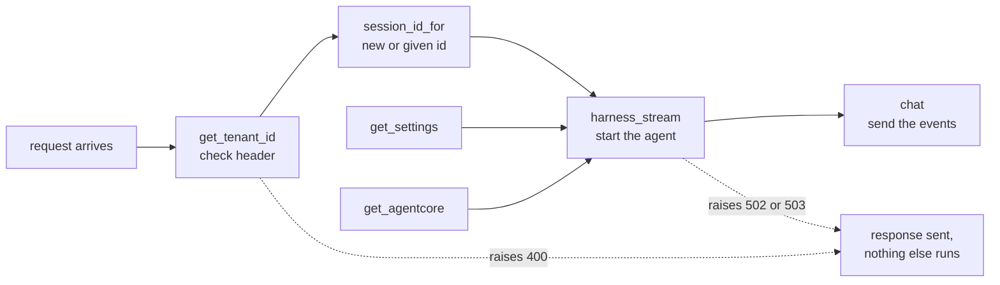
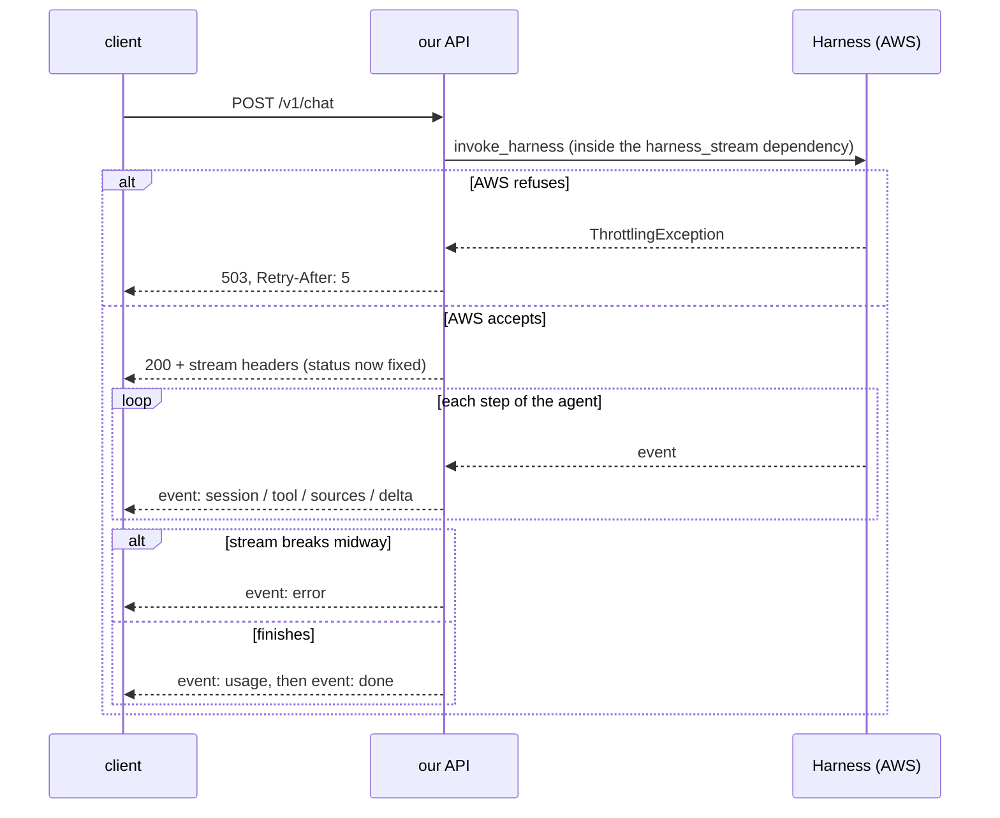
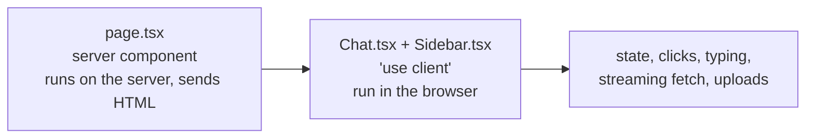
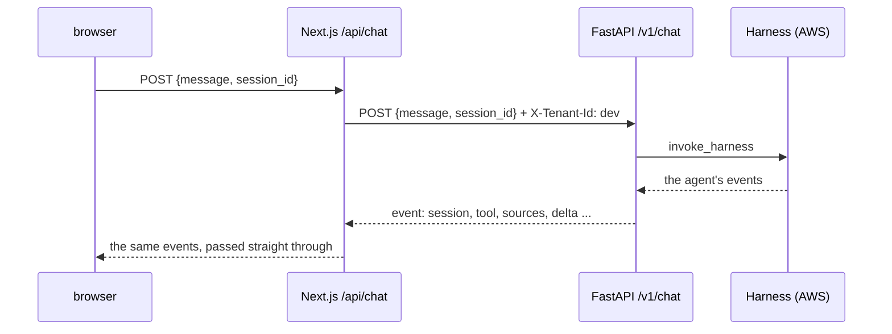
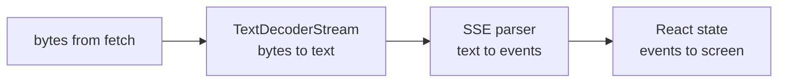

# Web track

One section per topic. Added as the project meets them.

```
1. HTTP: request and response                      D1
2. FastAPI: routes and request bodies               D1, D2
3. Dependencies                                      D1, D2
4. Streaming with Server-Sent Events                 D1, D2
5. Errors before vs during a stream                  D1
6. def vs async def                                  D1
7. uvicorn: the thing that runs the app              D1
8. Next.js App Router: folders are URLs              D1, D2
9. Server components vs client components            D1
10. The proxy route                                  D1, D2
    10.3 One catch-all proxy                         D2
11. Reading a stream in the browser                  D1, D2
12. From the agent's stream to the page              D2
13. Uploads, sync polling and citations              D2
```

Where these pieces sit in the whole system: `journey.md` follows one
question through every hop.

---

## 1. HTTP: request and response

Every conversation between a browser (or `curl`) and a server is one
request and one response.

```
client (browser, curl)                              server (our API)

  POST /v1/chat                 ---- request ---->
  headers: X-Tenant-Id: dev
           Content-Type: application/json
  body:    {"message": "Why was Neptune dropped?", "session_id": null}
                                <--- response ----   status:  200
                                                     headers: content-type: text/event-stream
                                                     body:    the answer, piece by piece
```

Five parts to know:

- **Method:** what kind of action. `GET` reads, `POST` sends data.
- **Path:** which thing. `/v1/chat`. The `v1` leaves room for a `v2` later without breaking old clients.
- **Headers:** labels on the envelope. `X-Tenant-Id` says which tenant this is (always `dev`: the project has no login).
- **Body:** the letter inside. JSON for us, or a file upload (section 13).
- **Status code:** the server's one-number verdict.

Status codes this project uses:

| Code | Name | Meaning here |
|---|---|---|
| 200 | OK | worked, answer follows |
| 201 | Created | a file was uploaded |
| 400 | Bad Request | the tenant header is missing or malformed |
| 404 | Not Found | the proxy refused a path outside its allowlist (section 10.3) |
| 413 | Content Too Large | an upload over 50 MB |
| 415 | Unsupported Media Type | an upload that is not pdf, md, txt, html, docx or csv |
| 422 | Unprocessable Content | the JSON parsed, but broke a rule (empty message, malformed session id) |
| 502 | Bad Gateway | we are fine, but an AWS service failed |
| 503 | Service Unavailable | AWS is busy. Try again (the `Retry-After` header says when) |

Rule of thumb: **4xx = the caller's fault, 5xx = our side's fault.**

---

## 2. FastAPI: routes and request bodies

FastAPI is a Python library for building API servers. You write a function,
put a decorator on it, and FastAPI calls it when a matching request arrives.

```python
@router.post("/v1/chat")      # "when a POST arrives at /v1/chat..."
def chat(...):                # "...run this"
```

Our three groups of routes, one file each: `backend/app/chat.py`
(`/v1/chat`), `documents.py` (`/v1/documents`), `sessions.py`
(`/v1/sessions`). `main.py` plugs them into the app.

### 2.1 Request bodies are checked automatically

The body is described as a Pydantic model (a class with typed fields).
From `chat.py:51`:

```python
class ChatRequest(BaseModel):
    message: str = Field(min_length=1, max_length=20_000)
    session_id: str | None = Field(default=None, pattern=SESSION_ID_PATTERN)
```

FastAPI parses the JSON, checks every field, and if anything is wrong it
answers **422** with a list of what failed. Your function never runs.

Our rules, and where each came from:

| Rule | Why |
|---|---|
| `message` is 1 to 20,000 characters | an empty message is pointless, a huge one costs money |
| `session_id` is left out for a new chat | the server makes one (a UUID) and sends it back first thing |
| `session_id`, when given, is 33 to 100 letters, digits, `-` or `_`, starting with a letter or digit | InvokeHarness's own rule, read from the API model in boto3 on 2026-09-11. Checking it here gives a clear 422 instead of an AWS error |

Why check here instead of letting AWS complain: it costs nothing, the error
is clearer, and AWS never sees junk.

**D1 history:** in D1 the body was the whole conversation,
`{"messages": [...]}`, with a rule that the first and last message must be
from the user (tested live against Bedrock). Since D2 the agent keeps the
history in AgentCore Memory, so the browser sends one message (section 11.2).

Docs: https://fastapi.tiangolo.com/tutorial/body/

---

## 3. Dependencies

A dependency is a function FastAPI runs **before** your endpoint, and hands
the result to it. You ask for one with `Depends(...)`.



Three reasons we use them:

1. **Order.** Dependencies run top to bottom. The tenant check is first, so a bad header is rejected before a paid AWS call.
2. **Early errors.** A dependency can raise `HTTPException`, and the response goes out immediately with that status.
3. **Swappable in tests.** `app.dependency_overrides[get_agentcore] = lambda: fake` makes every route use a fake instead of real AWS (`tooling.md` section 7).

`get_settings` and the client functions in `aws.py` (`get_agentcore`,
`get_s3`, `get_kb_admin`) have `@lru_cache`: built on the first request,
reused after. One settings object, one client per AWS service, per
process.

FastAPI also runs each dependency **once per request**, even when two
others ask for it. That is why `session_id_for` (`chat.py:57`) can make a
new UUID and both `harness_stream` and `chat` see the same id.

Docs: https://fastapi.tiangolo.com/tutorial/dependencies/ and
https://fastapi.tiangolo.com/advanced/testing-dependencies/

---

## 4. Streaming with Server-Sent Events

### 4.1 Why stream at all

A model writes its answer one piece at a time. Without streaming, the user
stares at nothing until the last word. With streaming, words appear as
they are written.

```
not streaming   [.............. wait ..............] "Mars, Jupiter, Saturn."
streaming       "Mars" ", Jupiter" ", Saturn."   <- first word almost instantly
```

### 4.2 The wire format

Server-Sent Events (SSE) is a plain-text format over one long HTTP
response. Each event is a few `name: value` lines, and a **blank line**
ends the event:

```
event: session
data: {"session_id": "af0e0ec4-0bc1-43db-b609-1ce280f994e3"}

event: tool
data: {"name": "docs___Retrieve", "input": {"retrievalQuery": {"text": "Neptune Analytics dropped"}}}

event: sources
data: [{"n": 1, "title": "README.md", "score": 0.612, "excerpt": "..."}]

event: delta
data: "Neptune Analytics was removed"

event: usage
data: {"input_tokens": 3535, "output_tokens": 317, "model_calls": 2}

event: done
data: [DONE]
```

That is real output from our server on 2026-09-11, with the Harness
answering (shortened: there were six `delta` events).

Our seven event types, all made in `chat.py` (section 12 shows how):

| event | data | when |
|---|---|---|
| `session` | `{"session_id": ...}` | always first |
| `tool` | the tool's name and input | each time the agent calls a tool |
| `sources` | numbered passages from a search | after a document or graph search |
| `delta` | one text piece, as a JSON string | many times |
| `usage` | token counts, summed over every model call | once, near the end |
| `done` | `[DONE]` | last event on success |
| `error` | `{"message": ...}` | instead of `done`, if the agent fails midway |

### 4.3 Why the text is JSON-encoded

`"Mars"` goes out with quotes. If a piece contained a newline and was sent
raw, the blank-line rule would cut the event in half. JSON turns a newline
into `\n`, so the framing is safe. The frontend runs `JSON.parse` on each
`data` line (except `done`, whose data is plain `[DONE]`).

### 4.4 What FastAPI adds for free

`EventSourceResponse` (FastAPI 0.135 and newer) handles the details:

- a keep-alive comment every 15 seconds, so proxies do not close a quiet connection (the agent can be quiet for a while during a search)
- `Cache-Control: no-cache`, so nothing caches a live stream
- `X-Accel-Buffering: no`, so proxies like Nginx do not hold pieces back

Docs: https://fastapi.tiangolo.com/tutorial/server-sent-events/

---

## 5. Errors before vs during a stream

The status code is the **first** thing sent. Once the first event has gone
out, the status (200) is on the wire and cannot change. So there are two
kinds of failure, handled differently:



That is why the stream is opened in a **dependency**: dependencies finish
before the response starts. The FastAPI docs do not state this for
streaming routes, so a test proves it (`test_throttling_is_503_with_retry_after`).

The caller never sees AWS's own error text. It can include internal
details. The log gets the error code and AWS request id instead
(`upstream_error` in `aws.py:61`, shared by every route).

---

## 6. def vs async def

A server handles many requests at once. How depends on how you write the
function.

```
async def   "I will tell you when I am waiting." The server serves others meanwhile.
            Only works if everything inside is async too.

def         "I might block." FastAPI runs it in a separate worker thread,
            so blocking only ties up that thread, not the whole server.
```

boto3 (the AWS library) blocks while it waits for the next event from the
Harness. So `chat` is a plain `def`, and FastAPI runs it in a thread pool.

Writing it as `async def` would be a real bug: every other request would
freeze while one user's answer streamed.

### 6.1 Same process, different thread

The FastAPI docs say `def` functions run in an "external threadpool".
External means outside the event loop, **not** outside the process:

```
one process: uvicorn  (one app, one boto3 client per service, one settings object)
├── main thread: the event loop     takes requests, sends responses, never waits on AWS
└── thread pool: up to 40 threads   each runs one blocking `def chat()` until its answer ends
```

Why threads and not separate processes:

- **Shared memory.** Every chat uses the same cached boto3 clients and settings.
- **Cheap.** Starting a thread costs far less than starting a process.
- **Waiting is the job.** Python runs one thread's Python code at a time (a
  lock called the GIL), but a thread waiting on the network steps aside.
  So threads suit waiting-heavy work like ours. Number crunching needs
  processes instead.

### 6.2 Does the GIL mean one chat at a time?

No. The GIL allows one thread to **run Python code** at a time. A chat
request barely runs Python code: it spends almost all its time **waiting**
for the agent's next event, and a waiting thread lets go of the GIL.

```
one chat, over time:
  [py] .......waiting on AWS....... [py] .......waiting....... [py]
   ^ tiny moment of real Python work (parse an event, send a piece)

five chats: the waits overlap, only the tiny [py] moments take turns
```

Measured in D1 (2026-09-10), 5 real requests to Bedrock:

| How | Total time |
|---|---|
| one after another | 3.09 s (each ~0.6 s, added up) |
| all 5 at once | 0.77 s (about the time of ONE request) |

Two words for this:

- **Concurrency:** many tasks in progress at once, taking turns. What threads give us here.
- **Parallelism:** many tasks executing at the same instant on different CPU cores. The GIL blocks this for Python code, which only matters for number-crunching work.

When the GIL *would* hurt: heavy CPU work in Python, like parsing large
PDFs or chunking thousands of pages. We never do that in our server: the
Knowledge Base parses and chunks documents on AWS's side.

### 6.3 The thread limit

**The limit:** 40 threads by default (set by anyio, the library Starlette
uses for this). Each streaming chat holds its thread until the answer
ends, so one process streams about 40 answers at once and the 41st waits.
A load test (k6, on the "later, maybe" list) would show it.

**Scaling out, if ever needed:** several copies of the server
(`uvicorn --workers N`, or several machines). Each copy is a separate
process with its own 40 threads and its own boto3 clients.

Docs: https://fastapi.tiangolo.com/async/ and
https://anyio.readthedocs.io/en/stable/threads.html

### 6.4 Why not async all the way?

`async def` is the better tool for waiting on I/O, **if the library is
async too**. boto3 is not. The options, checked on PyPI on 2026-09-10 (for
Bedrock; the same picture holds for AgentCore):

| Option | What it really does | Status |
|---|---|---|
| `def` + boto3 (ours) | one worker thread per stream | official, stable |
| `async def` + aiobotocore | truly async | Beta. Requires botocore below 1.43.76; we run 1.43.91, so it would force an older AWS SDK |
| `async def` + aioboto3 | wrapper on aiobotocore | last release Oct 2025, stale |
| `async def` + AWS's own async SDK (`aws-sdk-bedrock-runtime`) | truly async, official | Pre-Alpha (0.11). The long-term answer |
| `async def` + `asyncio.to_thread(boto3 ...)` | still a thread underneath | no gain, more code |

Async wins when one process holds hundreds or thousands of open streams:
each thread costs memory and a pool slot, an async task costs almost
nothing. At our scale threads are fine.

**Revisit when:** AWS's async SDK leaves preview, or a load test shows the
thread pool is the bottleneck.

Sources: https://pypi.org/project/aiobotocore/ ,
https://pypi.org/project/aioboto3/ ,
https://pypi.org/project/aws_sdk_bedrock_runtime/ ,
https://github.com/aws/aws-sdk-python

---

## 7. uvicorn: the thing that runs the app

```
FastAPI  = the recipes (what to do for each request)
uvicorn  = the kitchen (listens on a port, takes orders, calls the recipes)
```

The command, run from `backend/`:

```
uv run uvicorn app.main:app --reload --port 8001
               ^^^^^^^^ ^^^ ^^^^^^^^ ^^^^^^^^^^^
               module   the restart   which port to listen on
               app/main.py  when code changes (dev only)
                        app object inside it
```

Why 8001 and not uvicorn's default 8000: another project on this laptop
already holds port 8000. `frontend/.env.local` sets `API_URL` to match.

Then open http://localhost:8001/docs for an auto-generated page where you
can try every endpoint.

Settings come from `backend/.env`, read by `app/settings.py` (see
`tooling.md` section 4). Run the command from `backend/` so the file is
found.

Docs: https://github.com/kludex/uvicorn/blob/main/docs/settings.md

---

## 8. Next.js App Router: folders are URLs

Next.js is a framework for building web pages with React. Its App Router
turns folders into URLs: you never write a routing table.

```
frontend/
  app/
    layout.tsx                wraps every page: <html>, <body>, fonts, the tab title
    page.tsx                  the page at  /
    api/[...path]/route.ts    not a page: the proxy, answers every /api/... URL
  components/
    Chat.tsx                  the conversation, tool trace, source cards
    Sidebar.tsx               past conversations, uploads, sync status
  lib/
    sse.ts                    plain TypeScript: turns stream text into events
    citations.ts              plain TypeScript: finds [1] markers in an answer
```

Two file names are special:

- `page.tsx` = "this folder is a page you can visit"
- `route.ts` = "this folder is an API endpoint"

A folder name in square brackets is a **dynamic segment**: it matches any
value. `[...path]` with three dots is a **catch-all**: it matches any
number of parts (section 10.3).

`npm run build` prints what it made of them:

```
○ /                static: built once, served as a ready file
ƒ /api/[...path]   dynamic: runs on every request
```

The page can be prebuilt because it looks the same for everyone. The proxy
cannot: every request is different.

Docs: https://nextjs.org/docs/app

---

## 9. Server components vs client components

In the App Router, every component runs **on the server** unless the file
starts with `"use client"`.



| | Server component | Client component |
|---|---|---|
| Runs | on the server | in the browser (after a first render on the server) |
| Can use | secrets, env vars, databases | state (`useState`), events (`onClick`), browser APIs |
| Cannot use | state, events | server-only secrets |

`Chat.tsx` needs state (the messages, the current session id), events
(typing, Send) and the browser's streaming `fetch`, so it is a client
component. It draws `Sidebar.tsx` inside itself. `page.tsx` needs none of
that, so it stays a server component and just renders `<Chat />`.

Docs: https://nextjs.org/docs/app/getting-started/server-and-client-components

---

## 10. The proxy route

The browser never talks to FastAPI. It talks to Next.js, which forwards
the request:



This pattern has a name: **BFF, backend for frontend**. Why bother:

1. **Same origin.** The page and `/api/...` share an address, so the browser's cross-origin rules (CORS) never come up.
2. **Secrets stay on the server.** The FastAPI address never reaches the browser.
3. **One place to add headers.** The tenant stub `X-Tenant-Id: dev` is added here. The project has no login, so this header is fixed.

### 10.1 What the route does, line by line in spirit

| Step | Why |
|---|---|
| read `API_URL` from the environment | where FastAPI lives. No `NEXT_PUBLIC_` prefix, so it is server-only |
| check the first path part against the allowlist | only `chat`, `documents`, `sessions` pass (section 10.3) |
| forward the body as it came | FastAPI validates it. One set of rules, in one place |
| keep the incoming `Content-Type` | an upload's `multipart/form-data; boundary=...` must survive (section 13) |
| add `X-Tenant-Id: dev` | the tenant stub (marked `ponytail:` in the code) |
| pass `request.signal` along | if the browser tab closes, the backend call is cancelled too, so no tokens are wasted |
| return FastAPI's body, status, `Content-Type`, `Retry-After` | a 422 or 503 reaches the browser unchanged |
| set `Cache-Control: no-cache, no-transform` | `no-transform` stops compression from holding pieces until the end |
| FastAPI unreachable: return 502 and log it | the page gets a clear message, the log gets the cause |

### 10.2 Env vars on the frontend

```
frontend/.env.local      your real values, gitignored (Next.js's convention)
frontend/.env.example    the committed template
```

Next.js loads `.env.local` automatically. A variable **without**
`NEXT_PUBLIC_` exists only on the server. A variable **with** it is copied
into the JavaScript sent to every browser, so it must never hold a secret.

Gotcha found while building: Next's own `frontend/.gitignore` ignores every
`.env*` file, and a `.gitignore` in a subfolder beats the one at the root.
So `!.env.example` had to be added there too.

Docs: https://nextjs.org/docs/app/guides/environment-variables

Verified 2026-09-10 (D1): a real answer streamed through the proxy piece by
piece; a 422 passed through; with FastAPI stopped the proxy answered 502
"The backend is not reachable." Verified 2026-09-11 (D2): `/api/healthz`
got 404 from the allowlist; a real upload went through the proxy (201).

### 10.3 One catch-all proxy

In D1 there was one proxy file, `app/api/chat/route.ts`, for one URL. D2
needed five backend URLs (chat, upload, list documents, sync status,
conversations). Instead of five nearly identical files there is one:
`frontend/app/api/[...path]/route.ts`.

**How the folder name works.** `[...path]` catches every URL below
`/api/`, and Next.js hands the route the parts as a list:

```
/api/chat                          params.path = ["chat"]
/api/documents/sync/8H0CHX3NGL     params.path = ["documents", "sync", "8H0CHX3NGL"]
/api/sessions/af0e0ec4-.../messages  params.path = ["sessions", "af0e0ec4-...", "messages"]
```

In Next.js 15 and later, `params` is a **Promise**, so the code writes
`const { path } = await ctx.params`. The type `RouteContext<"/api/[...path]">`
is generated by `next typegen` (`tooling.md` section 9).

**The allowlist** (`route.ts:17`). A proxy that forwards anything to
anything is a hole: it would let a browser reach every URL on the backend.
So the first part must be `chat`, `documents` or `sessions`; anything else
gets 404 before any call. The target URL is rebuilt from those parts, each
one URL-encoded, plus the original query string:

```
/api/documents/sync/8H0CHX3NGL  ->  http://localhost:8001/v1/documents/sync/8H0CHX3NGL
```

**The body.** For anything but GET, the route reads the whole body
(`request.arrayBuffer()`) and sends it on unchanged, with the original
`Content-Type`. That one rule covers both JSON (chat) and multipart (file
upload). The ceiling, marked `ponytail:` in the code: an upload is held in
memory while it passes, fine for 50 MB, and the upgrade is streaming it or
uploading straight to S3 with a presigned URL.

**The answer.** `upstream.body` is handed back as the response body
without reading it, so a stream stays a stream. `Cache-Control:
no-cache, no-transform` keeps anything in between from buffering it.

`export const GET = forward; export const POST = forward;` makes the one
function answer both methods.

Docs: https://nextjs.org/docs/app/api-reference/file-conventions/route

---

## 11. Reading a stream in the browser

The browser has a built-in SSE client, `EventSource`, but it can only send
GET requests with no body. A chat needs POST with a JSON body, so we read
the stream by hand:



### 11.1 Why each stage exists

- **TextDecoderStream:** text travels as bytes. Characters like `é` or an emoji take several bytes, and a chunk can end in the middle of one. The streaming decoder holds the half character until the rest arrives.
- **SSE parser (`lib/sse.ts`):** chunks are cut wherever the network felt like it, not at event boundaries. The parser keeps the unfinished part in a buffer and only returns complete events.

```
chunk 1:  event: delta\ndata: "Hel
chunk 2:  lo"\n\n
parser:   nothing yet ... then { event: "delta", data: "\"Hello\"" }
```

- **React state:** each event updates the last message (the answer being written) with a *functional update*, `setMessages(prev => ...)`. Pieces can arrive faster than React re-renders; building on `prev` guarantees none is lost. In `Chat.tsx` this is `updateAnswer`, used for `tool`, `sources` and `delta` alike.

### 11.2 The model has no memory, the agent does

The browser sends **one message and a session id**, never the whole
conversation:

```json
{ "message": "and how much did it cost?", "session_id": "af0e0ec4-0bc1-43db-b609-1ce280f994e3" }
```

- On a new chat, `session_id` is `null`. The server makes one and sends it back in the first event (`session`). `Chat.tsx` keeps it and sends it with every later message.
- The history lives in **AgentCore Memory**, keyed by actor (`dev`) and session. The Harness loads it before calling the model, so "it" in a follow-up still makes sense.
- "New chat" in the sidebar just forgets the id. Clicking an old conversation loads its messages from `/api/sessions/<id>/messages` and reuses its id.

The model itself still remembers nothing between calls: the Harness
replays the history to it on every turn. So a long chat still costs more
per turn than a short one. The harness keeps only the last 30 messages
(its sliding window setting), which caps that growth.

**D1 history:** in D1 the browser posted the whole conversation on every
Send, and the cost growth was visible:

```
turn 1   "what is RAG?"                    48 tokens in
turn 2   "say it so a child understands"  126 tokens in   <- turn 1 + its answer + turn 2
```

Moving the history into Memory (D2) took that job away from the browser.
See `aws.md` section 10.4 for Memory itself.

### 11.3 How failures look on the page

| What happened | What the user sees |
|---|---|
| 503, AWS busy | "The assistant is busy. Try again in a few seconds." |
| any other error before streaming | the API's message, or "Request failed (HTTP n)" |
| `error` event mid-answer | red banner, the partial answer stays on screen |
| opening an old conversation fails | red banner with the API's message |

### 11.4 Small things that make it usable

- Enter sends, Shift+Enter adds a line; no sending while an input method (Chinese, Japanese) is composing.
- `aria-live="polite"`: screen readers read new text as it arrives. `role="alert"` on errors.
- The list scrolls to the newest words automatically (`useEffect` on `messages`).
- While the answer is empty, "Thinking..." shows in its place.

Docs: https://developer.mozilla.org/en-US/docs/Web/API/TextDecoderStream
and https://react.dev/reference/react/useState#updating-state-based-on-the-previous-state

---

## 12. From the agent's stream to the page

The Harness streams **every step of its loop**, not just the answer. Our
server turns that into the seven small events of section 4.2. The code is
`relay()` in `backend/app/chat.py:115`.

### 12.1 What the Harness sends

Captured live on 2026-09-11 for one question with one search:

```
messageStart assistant
  contentBlockDelta   reasoningContent "Need to retrieve... use docs___Retrieve"
  contentBlockStart   toolUse {name: docs___Retrieve}
  contentBlockDelta   toolUse input '{"retrievalQuery": '
  contentBlockDelta   toolUse input '{"text": "neptune"}}'
  contentBlockStop
messageStop tool_use
metadata              usage for model call 1
messageStart user
  contentBlockStart   toolResult
  contentBlockDelta   toolResult text: one JSON string, cut into 8 pieces
  contentBlockStop
messageStop tool_result
messageStart assistant
  contentBlockDelta   text "Neptune Analytics was removed..."   (many of these)
  contentBlockStop
messageStop end_turn
metadata              usage for model call 2
```

Words to know:

- A **content block** is one piece of a message: text, reasoning, a tool call, or a tool result.
- Every block arrives as **start, several deltas, stop**. A delta is a slice.
- **reasoningContent** is the model thinking out loud. We never show it.
- **metadata** comes once per model call. One question with one search is two model calls.

### 12.2 What relay() does with it

Text can be sent on as it arrives. A tool call cannot: its JSON input
arrives in slices (`'{"retrievalQuery": '` then `'{"text": ...}}'`), and
half a JSON object cannot be parsed. So `relay()` keeps two small buffers:

```
contentBlockStart toolUse     -> start collecting the tool's input
contentBlockDelta toolUse     -> add the slice
contentBlockStart toolResult  -> start collecting the result's text
contentBlockDelta toolResult  -> add the slice
contentBlockStop              -> the block is complete: parse it once, send one event
```

| The Harness sends | relay() sends | Detail |
|---|---|---|
| (before anything) | `session` | sent by `chat()` at `chat.py:184`, so the page knows the id at once |
| a complete tool call | `tool` | name plus the parsed input |
| a complete tool result | `sources` | only if it is a search result (below) |
| a text delta | `delta` | straight through, one per slice |
| a reasoning delta | nothing | |
| `metadata` | nothing yet | the token counts are added up |
| the end of the stream | `usage`, then `done` | summed tokens and the number of model calls |
| `internalServerException`, `validationException` or `runtimeClientError` | `error`, then stop | `_ERROR_EVENTS`, `chat.py:47` |

### 12.3 to_sources: a search result becomes source cards

`to_sources()` (`chat.py:95`) tries to read the result as
`{"retrievalResults": [...]}`, the shape both our search tools return. Each
passage becomes a card:

```json
{ "n": 1, "title": "README.md", "score": 0.612, "excerpt": "first 300 characters..." }
```

`n` is the passage's position, 1, 2, 3, which is exactly what the model's
`[1]` means. Any other tool's result (the browser, for example) does not
parse as that shape, so it simply gives no `sources` event.

### 12.4 Why a failure midway becomes an event

Two ways the agent can fail after the 200 is sent:

1. **The Harness says so:** one of the three error events arrives in the stream. `relay()` logs which one and sends `error` with a fixed message. AWS's own text is never passed on.
2. **The connection breaks:** boto3 raises while reading the next event. `chat()` catches it and sends the same `error` event.

Either way the page gets `error` instead of `done`, keeps the partial
answer, and shows the red banner (section 11.3). Tests cover both:
`test_error_event_in_the_stream_becomes_error_without_details` and
`test_broken_connection_mid_stream_becomes_error_event`.

---

## 13. Uploads, sync polling and citations

### 13.1 Sending a file: multipart form

JSON cannot carry a file well. The web's format for files is
**multipart/form-data**: the body is split into parts, separated by a
random boundary string that the `Content-Type` header announces.

```
Content-Type: multipart/form-data; boundary=----abc123

------abc123
Content-Disposition: form-data; name="file"; filename="notes.md"
Content-Type: text/markdown

# My notes ...
------abc123--
```

The browser builds this for us (`Sidebar.tsx:58`):

```ts
const form = new FormData();
form.append("file", file);
await fetch("/api/documents", { method: "POST", body: form });
```

No `Content-Type` is set by hand: the browser writes it, boundary included.
The proxy passes that header on untouched (section 10.3); change it and
the server could not find the parts.

### 13.2 Receiving it: UploadFile

In `documents.py:107`, the parameter `file: UploadFile` tells FastAPI to
read the multipart part named `file`. (FastAPI needs the
`python-multipart` package for this.) `UploadFile` keeps the body in a
temporary file, not in memory, and gives its name, type and size.

Before any AWS call, the upload is checked:

| Check | Where | If it fails |
|---|---|---|
| keep only the file's own name, in safe characters | `safe_filename`, `documents.py:74` | `../../x.md` becomes `x.md`, so nothing escapes the tenant folder |
| type is pdf, md, txt, html, docx or csv | `ALLOWED_SUFFIXES` | 415 |
| size is at most 50 MB (the Knowledge Base's own limit) | `MAX_UPLOAD_BYTES` | 413 |

### 13.3 Two S3 writes, label first

```
1. tenants/dev/notes.md.metadata.json   {"metadataAttributes": {"tenant_id": "dev"}}
2. tenants/dev/notes.md                  the file itself
```

The label is written **first**. If the second write fails, what is left is
a label with no file (harmless). The other order could leave a file with no
tenant label. The file goes up with `upload_fileobj`, which sends it in
parts, so size does not matter to our code.

### 13.4 Starting a sync, and the busy case

Then `start_sync` (`documents.py:87`) asks the managed Knowledge Base to
re-read the bucket (`StartIngestionJob`). A data source runs **one sync at
a time**. Starting a second one fails with `ConflictException` ("There is
an ongoing ingestion job", checked live). That is not an error for us: the
file is already stored, so the answer is 201 with
`"ingestion_job_id": null`, and the next sync picks it up.

Known limit: this syncs only the managed Knowledge Base (`KB_ID`). The
graph Knowledge Base is synced by hand (`D4.md`).

### 13.5 Polling: asking again every 5 seconds

A sync takes one to three minutes, far too long to hold one request open.
So the sidebar **polls**: it asks `/api/documents/sync/<job>` every 5
seconds (`documents.py:175` answers) until the status is `COMPLETE`,
`FAILED` or `STOPPED`, showing "Indexing... N files scanned so far" in
between.

Polling is the simplest way to watch slow work: no extra connection type,
no server state. Its ceiling (marked `ponytail:` in `Sidebar.tsx`): many
users polling at once make many small requests. The upgrade is a push
channel, for example a stream like the chat's.

### 13.6 Citations: [1] becomes a link

The answer text says things like `It costs $0.48 an hour [1].`
`splitCitations()` (`lib/citations.ts:10`) cuts it into plain text pieces
and citation pieces:

```
"It costs $0.48 an hour [1]."
  -> text "It costs $0.48 an hour "
  -> cite 1
  -> text "."
```

`Chat.tsx` draws each `cite` as a small link to `#source-1`, the source
card with that number. The cards are `<details>` elements: click to open,
no JavaScript needed.

**Both marker styles are accepted.** The prompt asks for `[1]`. gpt-oss,
our model for a while, often wrote its own habit instead: `【1】` or
`【1†L13-L17】` (the part after `†` points at lines). The pattern accepts
both, so a model's habit does not break the links:

```ts
/\[(\d{1,2})\]|【(\d{1,2})(?:†[^】]*)?】/g
```

`[a]` or `[123]` are not treated as citations. Four tests in
`lib/citations.test.ts` pin this down.

---

## Check yourself

1. A request with no `X-Tenant-Id` header gets which status, and is the agent called?
2. Why can't an agent failure halfway through an answer turn into a 502?
3. What separates one SSE event from the next?
4. Why is `chat` a `def` and not an `async def`?
5. What is the difference between FastAPI and uvicorn?
6. Which file answers `/api/chat`, and why is its folder named `[...path]`?
7. Why does `Chat.tsx` start with `"use client"` and `page.tsx` does not?
8. Why does the browser not call FastAPI directly?
9. Why does the SSE parser keep a buffer between chunks?
10. The browser sends one message. Where does the rest of the conversation come from?
11. Why does `relay()` wait for `contentBlockStop` before sending a `tool` event?
12. What stops the proxy from forwarding `/api/healthz`?
13. Why is the tenant label written to S3 before the file?
14. Why does the sidebar ask about a sync every 5 seconds instead of waiting on one request?
