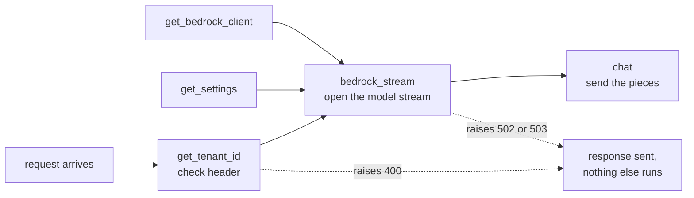
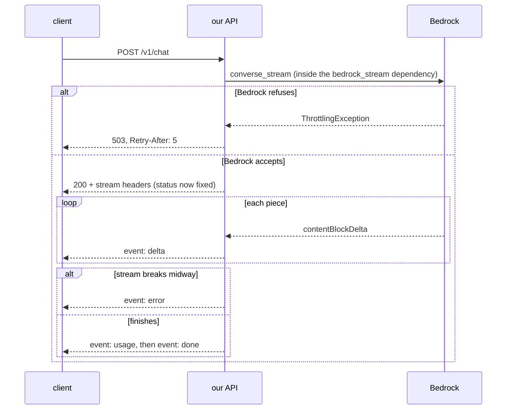
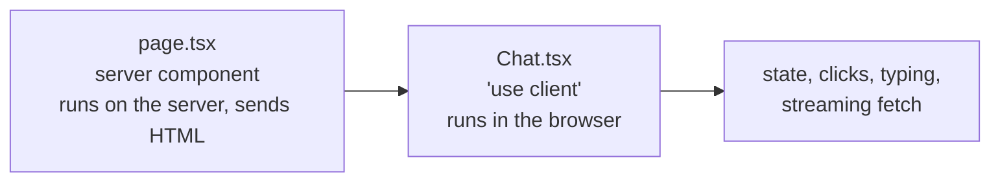
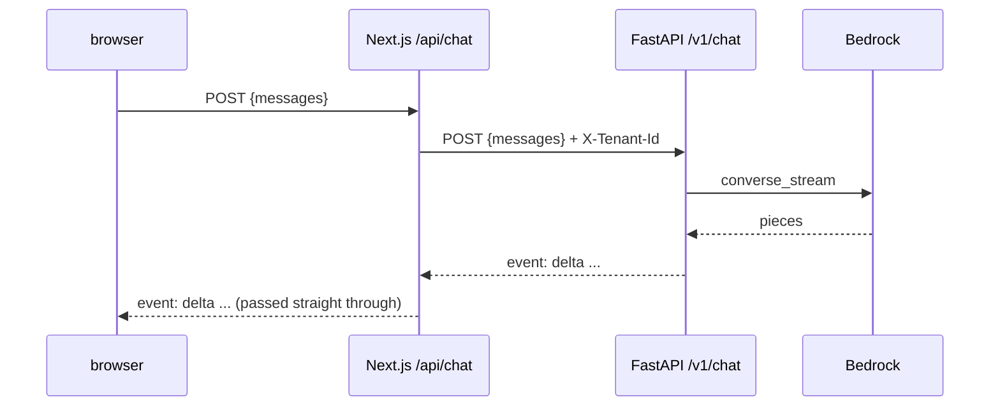
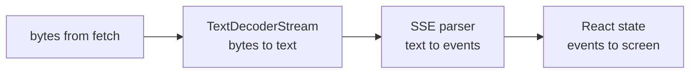

# Web track

One section per topic. Added as the project meets them.

```
1. HTTP: request and response              D1
2. FastAPI: routes and request bodies       D1
3. Dependencies                              D1
4. Streaming with Server-Sent Events         D1
5. Errors before vs during a stream          D1
6. def vs async def                          D1
7. uvicorn: the thing that runs the app      D1
8. Next.js App Router: folders are URLs      D1
9. Server components vs client components    D1
10. The proxy route                          D1
11. Reading a stream in the browser          D1
(next: login with Cognito, file uploads, citation panel)
```

---

## 1. HTTP: request and response

Every conversation between a browser (or `curl`) and a server is one
request and one response.

```
client (browser, curl)                              server (our API)

  POST /v1/chat                 ---- request ---->
  headers: X-Tenant-Id: dev
           Content-Type: application/json
  body:    {"messages": [...]}
                                <--- response ----   status:  200
                                                     headers: content-type: text/event-stream
                                                     body:    the answer, piece by piece
```

Five parts to know:

- **Method:** what kind of action. `GET` reads, `POST` sends data.
- **Path:** which thing. `/v1/chat`. The `v1` leaves room for a `v2` later without breaking old clients.
- **Headers:** labels on the envelope. `X-Tenant-Id` says which customer this is.
- **Body:** the letter inside. JSON for us.
- **Status code:** the server's one-number verdict.

Status codes this project uses:

| Code | Name | Meaning here |
|---|---|---|
| 200 | OK | worked, answer follows |
| 400 | Bad Request | the tenant header is missing or malformed |
| 422 | Unprocessable Entity | the JSON parsed, but broke a rule (empty message, wrong order) |
| 502 | Bad Gateway | we are fine, but the model service failed |
| 503 | Service Unavailable | the model is busy. Try again (the `Retry-After` header says when) |

Rule of thumb: **4xx = the caller's fault, 5xx = our side's fault.**

---

## 2. FastAPI: routes and request bodies

FastAPI is a Python library for building API servers. You write a function,
put a decorator on it, and FastAPI calls it when a matching request arrives.

```python
@router.post("/v1/chat")      # "when a POST arrives at /v1/chat..."
def chat(...):                # "...run this"
```

### 2.1 Request bodies are checked automatically

The body is described as a Pydantic model (a class with typed fields):

```python
class Message(BaseModel):
    role: Literal["user", "assistant"]
    content: str = Field(min_length=1, max_length=20_000)
```

FastAPI parses the JSON, checks every field, and if anything is wrong it
answers **422** with a list of what failed. Your function never runs.

Our rules, and where each came from:

| Rule | Why |
|---|---|
| role is `user` or `assistant` | the only roles Converse accepts in `messages` |
| content 1 to 20,000 characters | empty turns are rejected by Bedrock, huge ones cost money |
| 1 to 50 messages | caps the cost of one request |
| first and last message are `user` | **tested live against Bedrock** on 2026-09-10: other orders fail with a ValidationException. Two user turns in a row are allowed, so we allow them too |

Why check here instead of letting Bedrock complain: it costs nothing, the
error is clearer, and Bedrock never sees junk.

Docs: https://fastapi.tiangolo.com/tutorial/body/

---

## 3. Dependencies

A dependency is a function FastAPI runs **before** your endpoint, and hands
the result to it. You ask for one with `Depends(...)`.



Three reasons we use them:

1. **Order.** Dependencies run top to bottom. The tenant check is first, so a bad header is rejected before a paid Bedrock call.
2. **Early errors.** A dependency can raise `HTTPException`, and the response goes out immediately with that status.
3. **Swappable in tests.** `app.dependency_overrides[get_bedrock_client] = lambda: fake` makes every route use a fake instead of real AWS.

`get_settings` and `get_bedrock_client` have `@lru_cache`: built on the
first request, reused after. One settings object, one AWS client per
process.

Docs: https://fastapi.tiangolo.com/tutorial/dependencies/ and
https://fastapi.tiangolo.com/advanced/testing-dependencies/

---

## 4. Streaming with Server-Sent Events

### 4.1 Why stream at all

A model writes its answer one piece at a time. Without streaming, the user
stares at nothing until the last word. With streaming, words appear as
they are written.

```
not streaming   [.............. wait ..............] "Mars, Jupiter, Saturn."
streaming       "Mars" ", Jupiter" ", Saturn."   <- first word almost instantly
```

### 4.2 The wire format

Server-Sent Events (SSE) is a plain-text format over one long HTTP
response. Each event is a few `name: value` lines, and a **blank line**
ends the event:

```
event: delta
data: "Mars"

event: delta
data: ", Jupiter"

event: usage
data: {"input_tokens": 46, "output_tokens": 7, "latency_ms": 208}

event: done
data: [DONE]
```

That is real output from our server, calling Llama 4 Maverick.

Our four event types:

| event | data | when |
|---|---|---|
| `delta` | one text piece, as a JSON string | many times |
| `usage` | token counts and time | once, near the end |
| `done` | `[DONE]` | last event on success |
| `error` | `{"message": ...}` | instead of `done`, if the model fails midway |

### 4.3 Why the text is JSON-encoded

`"Mars"` goes out with quotes. If a piece contained a newline and was sent
raw, the blank-line rule would cut the event in half. JSON turns a newline
into `\n`, so the framing is safe. The frontend runs `JSON.parse` on each
`data` line.

### 4.4 What FastAPI adds for free

`EventSourceResponse` (FastAPI 0.135 and newer) handles the details:

- a keep-alive comment every 15 seconds, so proxies do not close a quiet connection
- `Cache-Control: no-cache`, so nothing caches a live stream
- `X-Accel-Buffering: no`, so proxies like Nginx do not hold pieces back

Docs: https://fastapi.tiangolo.com/tutorial/server-sent-events/

---

## 5. Errors before vs during a stream

The status code is the **first** thing sent. Once the first event has gone
out, the status (200) is on the wire and cannot change. So there are two
kinds of failure, handled differently:



That is why the stream is opened in a **dependency**: dependencies finish
before the response starts. The FastAPI docs do not state this for
streaming routes, so a test proves it (`test_throttling_is_503_with_retry_after`).

The caller never sees AWS's own error text. It can include internal
details. The log gets the error code and AWS request id instead.

---

## 6. def vs async def

A server handles many requests at once. How depends on how you write the
function.

```
async def   "I will tell you when I am waiting." The server serves others meanwhile.
            Only works if everything inside is async too.

def         "I might block." FastAPI runs it in a separate worker thread,
            so blocking only ties up that thread, not the whole server.
```

boto3 (the AWS library) blocks while it waits for the next piece from
Bedrock. So `chat` is a plain `def`, and FastAPI runs it in a thread pool.

Writing it as `async def` would be a real bug: every other request would
freeze while one user's answer streamed.

### 6.1 Same process, different thread

The FastAPI docs say `def` functions run in an "external threadpool".
External means outside the event loop, **not** outside the process:

```
one process: uvicorn  (one app, one boto3 client, one settings object)
├── main thread: the event loop     takes requests, sends responses, never waits on AWS
└── thread pool: up to 40 threads   each runs one blocking `def chat()` until its answer ends
```

Why threads and not separate processes:

- **Shared memory.** Every chat uses the same cached boto3 client and settings.
- **Cheap.** Starting a thread costs far less than starting a process.
- **Waiting is the job.** Python runs one thread's Python code at a time (a
  lock called the GIL), but a thread waiting on the network steps aside.
  So threads suit waiting-heavy work like ours. Number crunching needs
  processes instead.

### 6.2 Does the GIL mean one chat at a time?

No. The GIL allows one thread to **run Python code** at a time. A chat
request barely runs Python code: it spends almost all its time **waiting**
for Bedrock's next words, and a waiting thread lets go of the GIL.

```
one chat, over time:
  [py] .......waiting on Bedrock....... [py] .......waiting....... [py]
   ^ tiny moment of real Python work (parse an event, send a piece)

five chats: the waits overlap, only the tiny [py] moments take turns
```

Measured on this project, 2026-09-10, 5 real requests to Bedrock:

| How | Total time |
|---|---|
| one after another | 3.09 s (each ~0.6 s, added up) |
| all 5 at once | 0.77 s (about the time of ONE request) |

Two words for this:

- **Concurrency:** many tasks in progress at once, taking turns. What threads give us here.
- **Parallelism:** many tasks executing at the same instant on different CPU cores. The GIL blocks this for Python code, which only matters for number-crunching work.

When the GIL *would* hurt: heavy CPU work in Python, like parsing large
PDFs or chunking thousands of pages. That arrives with the D2 worker, and
the answer there is more processes, not more threads.

### 6.3 The thread limit

**The limit:** 40 threads by default (set by anyio, the library Starlette
uses for this). Each streaming chat holds its thread until the answer
ends, so one process streams about 40 answers at once and the 41st waits.
The k6 load test in D8 will show it.

**Processes appear in D8:** several copies of the server (`uvicorn
--workers N`, or several containers). Each copy is a separate process
with its own 40 threads and its own boto3 client.

Docs: https://fastapi.tiangolo.com/async/ and
https://anyio.readthedocs.io/en/stable/threads.html

### 6.4 Why not async all the way?

`async def` is the better tool for waiting on I/O, **if the library is
async too**. boto3 is not. The options, checked on PyPI on 2026-09-10:

| Option | What it really does | Status |
|---|---|---|
| `def` + boto3 (ours) | one worker thread per stream | official, stable |
| `async def` + aiobotocore | truly async | Beta. Requires botocore below 1.43.76; we run 1.43.91, so it would force an older AWS SDK |
| `async def` + aioboto3 | wrapper on aiobotocore | last release Oct 2025, stale |
| `async def` + AWS's own async SDK (`aws-sdk-bedrock-runtime`) | truly async, official | Pre-Alpha (0.11). The long-term answer |
| `async def` + `asyncio.to_thread(boto3 ...)` | still a thread underneath | no gain, more code |

Async wins when one process holds hundreds or thousands of open streams:
each thread costs memory and a pool slot, an async task costs almost
nothing. At our scale threads are fine.

**Revisit when:** AWS's async SDK leaves preview, or the D8 k6 load test
shows the thread pool is the bottleneck.

Sources: https://pypi.org/project/aiobotocore/ ,
https://pypi.org/project/aioboto3/ ,
https://pypi.org/project/aws_sdk_bedrock_runtime/ ,
https://github.com/aws/aws-sdk-python

---

## 7. uvicorn: the thing that runs the app

```
FastAPI  = the recipes (what to do for each request)
uvicorn  = the kitchen (listens on a port, takes orders, calls the recipes)
```

The command, run from `backend/`:

```
uv run uvicorn app.main:app --reload
               ^^^^^^^^ ^^^ ^^^^^^^^
               module   the restart when code changes
               app/main.py  (dev only)
                        app object inside it
```

Then open http://localhost:8000/docs for an auto-generated page where you
can try every endpoint.

Settings come from `backend/.env`, read by `app/settings.py` (see
`tooling.md` section 4). Run the command from `backend/` so the file is
found.

Docs: https://github.com/kludex/uvicorn/blob/main/docs/settings.md

---

## 8. Next.js App Router: folders are URLs

Next.js is a framework for building web pages with React. Its App Router
turns folders into URLs: you never write a routing table.

```
frontend/
  app/
    layout.tsx           wraps every page: <html>, <body>, fonts, the tab title
    page.tsx             the page at  /
    api/chat/route.ts    not a page: an API endpoint at  POST /api/chat
  components/Chat.tsx    the chat window. Not a route, just a piece of UI
  lib/sse.ts             plain TypeScript helper, no React
```

Two file names are special:

- `page.tsx` = "this folder is a page you can visit"
- `route.ts` = "this folder is an API endpoint"

`npm run build` prints what it made of them:

```
○ /            static: built once, served as a ready file
ƒ /api/chat    dynamic: runs on every request
```

The page can be prebuilt because it looks the same for everyone. The chat
endpoint cannot: every request is different.

Docs: https://nextjs.org/docs/app

---

## 9. Server components vs client components

In the App Router, every component runs **on the server** unless the file
starts with `"use client"`.



| | Server component | Client component |
|---|---|---|
| Runs | on the server | in the browser (after a first render on the server) |
| Can use | secrets, env vars, databases | state (`useState`), events (`onClick`), browser APIs |
| Cannot use | state, events | server-only secrets |

`Chat.tsx` needs state (the messages), events (typing, Send) and the
browser's streaming `fetch`, so it is a client component. `page.tsx` needs
none of that, so it stays a server component and just renders `<Chat />`.

Docs: https://nextjs.org/docs/app/getting-started/server-and-client-components

---

## 10. The proxy route

The browser never talks to FastAPI. It talks to Next.js, which forwards
the request:



This pattern has a name: **BFF, backend for frontend**. Why bother:

1. **Same origin.** The page and `/api/chat` share an address, so the browser's cross-origin rules (CORS) never come up.
2. **Secrets stay on the server.** The FastAPI address, and from D2 the login token, never reach the browser.
3. **One place to add headers.** The tenant header is added here. In D2 it will come from the Cognito login.

### 10.1 What the route does, line by line in spirit

| Step | Why |
|---|---|
| read `API_URL` from the environment | where FastAPI lives. No `NEXT_PUBLIC_` prefix, so it is server-only |
| forward the body untouched | FastAPI validates it. One set of rules, in one place |
| add `X-Tenant-Id: dev` | stub until Cognito in D2 (marked `ponytail:` in the code) |
| pass `request.signal` along | if the browser tab closes, the backend call is cancelled too |
| return FastAPI's body, status, `Retry-After` | a 422 or 503 reaches the browser unchanged |
| set `Cache-Control: no-cache, no-transform` | `no-transform` stops compression from holding pieces until the end |
| FastAPI unreachable: return 502 and log it | the page gets a clear message, the log gets the cause |

### 10.2 Env vars on the frontend

```
frontend/.env.local      your real values, gitignored (Next.js's convention)
frontend/.env.example    the committed template
```

Next.js loads `.env.local` automatically. A variable **without**
`NEXT_PUBLIC_` exists only on the server. A variable **with** it is copied
into the JavaScript sent to every browser, so it must never hold a secret.

Gotcha found while building: Next's own `frontend/.gitignore` ignores every
`.env*` file, and a `.gitignore` in a subfolder beats the one at the root.
So `!.env.example` had to be added there too.

Docs: https://nextjs.org/docs/app/guides/environment-variables

Verified 2026-09-10: a real answer streamed through the proxy piece by
piece; a 422 passed through; with FastAPI stopped the proxy answered 502
"The backend is not reachable."

---

## 11. Reading a stream in the browser

The browser has a built-in SSE client, `EventSource`, but it can only send
GET requests with no body. A chat needs POST with the conversation in the
body, so we read the stream by hand:



### 11.1 Why each stage exists

- **TextDecoderStream:** text travels as bytes. Characters like `é` or an emoji take several bytes, and a chunk can end in the middle of one. The streaming decoder holds the half character until the rest arrives.
- **SSE parser (`lib/sse.ts`):** chunks are cut wherever the network felt like it, not at event boundaries. The parser keeps the unfinished part in a buffer and only returns complete events.

```
chunk 1:  event: delta\ndata: "Hel
chunk 2:  lo"\n\n
parser:   nothing yet ... then { event: "delta", data: "\"Hello\"" }
```

- **React state:** each `delta` is appended to the last message with a *functional update*, `setMessages(prev => ...)`. Pieces can arrive faster than React re-renders; building on `prev` guarantees none is lost.

### 11.2 The model has no memory

Every Send posts the **whole conversation**, not just the new message. The
model remembers nothing between calls, so the history has to travel with
each request. In D2 the history moves into Postgres.

Seen in the browser test on 2026-09-10:

```
turn 1   "what is RAG?"                    48 tokens in
turn 2   "say it so a child understands"  126 tokens in   <- turn 1 + its answer + turn 2
```

The model understood "it" only because turn 1 was sent again. It also
means **every turn costs more than the last**: long chats get expensive.
That is one reason chat history gets trimmed or summarized in later
deliverables.

### 11.3 How failures look on the page

| What happened | What the user sees |
|---|---|
| 503, model busy | "The model is busy. Try again in a few seconds." |
| any other error before streaming | the API's message, or "Request failed (HTTP n)" |
| error event mid-answer | red banner, the partial answer stays on screen |
| a turn that failed with no text | dropped from the history, so the next Send is not rejected |

### 11.4 Small things that make it usable

- Enter sends, Shift+Enter adds a line; no sending while an input method (Chinese, Japanese) is composing.
- `aria-live="polite"`: screen readers read new text as it arrives. `role="alert"` on errors.
- The list scrolls to the newest words automatically (`useEffect` on `messages`).

Docs: https://developer.mozilla.org/en-US/docs/Web/API/TextDecoderStream
and https://react.dev/reference/react/useState#updating-state-based-on-the-previous-state

---

## Check yourself

1. A request with no `X-Tenant-Id` header gets which status, and does Bedrock get called?
2. Why can't a model failure halfway through an answer turn into a 502?
3. What separates one SSE event from the next?
4. Why is `chat` a `def` and not an `async def`?
5. What is the difference between FastAPI and uvicorn?
6. Which file makes the URL `/api/chat` exist?
7. Why does `Chat.tsx` start with `"use client"` and `page.tsx` does not?
8. Why does the browser not call FastAPI directly?
9. Why does the SSE parser keep a buffer between chunks?
10. Why is the whole conversation sent on every message?
